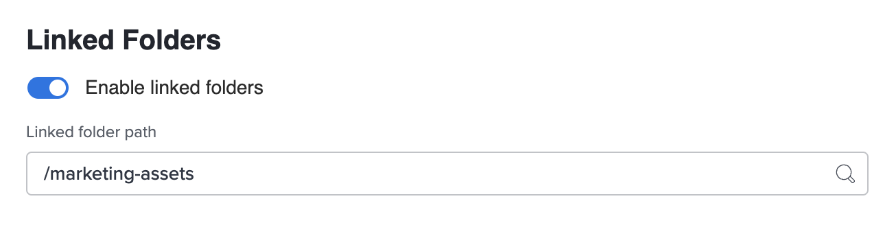

# Snippets

<!-- Add snippets within the section that the snippet is used. Snippets that are used throughout the Workfront documentation set should be added to the "General" section. -->

<!-- General -->

## Hervorgehobene Vorschau {#highlighted-preview}

Die hervorgehobenen Informationen auf dieser Seite beziehen sich auf Funktionen, die noch nicht allgemein verfügbar sind. Sie ist nur in der Vorschau-Sandbox-Umgebung verfügbar.

## Hervorgehobene Vorschau für vollständigen Artikel {#highlighted-preview-article-level}

Die Informationen auf dieser Seite beziehen sich auf Funktionen, die noch nicht allgemein verfügbar sind. Sie ist nur in der Vorschau-Sandbox-Umgebung verfügbar.

## Wichtiger Hinweis für Navigationsfunktionen, die nicht für AEC/Shell gelten {#important-not-on-aec}

>[!IMPORTANT]
>
>Das auf dieser Seite beschriebene Verfahren gilt nur für Organisationen, die noch nicht integriert sind in [!DNL Adobe Experience Cloud].
>
> Wenn Ihr Unternehmen bei [!DNL Adobe Experience Cloud], siehe [[!DNL Adobe Unified Experience] für [!DNL Workfront]](/help/quicksilver/workfront-basics/navigate-workfront/workfront-navigation/adobe-unified-experience.md).

## Schritt 1: Nur auf Hauptmenü klicken {#step1-click-main-menu}

1. Klicken Sie auf **[!UICONTROL Hauptmenü]** icon  in der oberen rechten Ecke von Adobe Workfront oder (falls verfügbar) klicken Sie auf das **[!UICONTROL Hauptmenü]** icon  in der oberen linken Ecke.

## Schritt 1: Klicken Sie auf Hauptmenü und dann auf - {#step1-click-mm-then-click}

1. Klicken Sie auf **[!UICONTROL Hauptmenü]** icon  in der oberen rechten Ecke von Adobe Workfront oder (falls verfügbar) klicken Sie auf das **[!UICONTROL Hauptmenü]** icon  in der oberen linken Ecke auf

## Schritt 1: Klicken Sie auf Ihr Profilbild - {#step1-click-profile-pic}

1. Klicken Sie auf **[!UICONTROL Hauptmenü]** icon  Klicken Sie oben rechts in Adobe Workfront auf Ihren Benutzernamen neben Ihrem Profilbild. Oder (falls verfügbar) klicken Sie auf Ihr Profilbild im oberen Navigationsbereich und dann auf **[!UICONTROL Workfront-Profil]**.

<!-- Admin and Setup -->

## Schritt 1: Erste Schritte mit dem Setup {#step-1-to-setup}

1. Klicken Sie auf **[!UICONTROL Hauptmenü]** icon  in der oberen rechten Ecke von Adobe Workfront oder (falls verfügbar) klicken Sie auf das **[!UICONTROL Hauptmenü]** icon  in der oberen linken Ecke auf **[!UICONTROL Einrichtung]** .

## Verknüpfen der rechten Gruppe mit dem Team {#right-group-team}

Sie können sicherstellen, dass Sie die richtige Gruppe mit dem Team verknüpfen, indem Sie den Mauszeiger darüber halten und auf das Informationssymbol klicken  neben dem angezeigt wird. Dadurch wird eine QuickInfo mit Informationen zur Gruppe angezeigt, z. B. die Hierarchie der Gruppen darüber und die Namen der Administratoren.

## Wichtiger Hinweis für das Onboarding von Admin Consolen {#important-admin-console-onboard}

>[!IMPORTANT]
>
>Das auf dieser Seite beschriebene Verfahren gilt nur für Organisationen, die noch nicht in der Adobe Admin Console integriert sind.
>
>Wenn Ihr Unternehmen in der Adobe Admin Console integriert wurde, lesen Sie [Plattformbasierte Verwaltungsunterschiede (Adobe Workfront/Adobe Business Platform)](/help/quicksilver/administration-and-setup/get-started-wf-administration/actions-in-admin-console.md).

## Schritt 1: Aufrufen von Benutzern {#step-1-to-users}

1. Klicken Sie auf **[!UICONTROL Hauptmenü]** icon  in der oberen rechten Ecke von Adobe Workfront oder (falls verfügbar) klicken Sie auf das **[!UICONTROL Hauptmenü]** icon  in der oberen linken Ecke auf **[!UICONTROL Benutzer]** .

<!-- Agile -->

## Schritt 1: Wechseln zu Pinnwänden - {#step1-to-boards}

1. Klicken Sie auf **[!UICONTROL Hauptmenü]** icon  in der oberen rechten Ecke von Adobe Workfront oder (falls verfügbar) klicken Sie auf das **[!UICONTROL Hauptmenü]** icon  in der oberen linken Ecke auf **[!UICONTROL Pinnwände]**.

<!-- Calendars -->

<!-- Documents -->

## Einrichten verknüpfter Ordner {#setup-linked-folder}

Sie können Benutzern erlauben, mit Experience Manager verknüpfte Ordner zu erstellen, während sie sich in einem Workfront-Projekt befinden. Wenn ein Ordner verknüpft ist, werden alle dem Ordner hinzugefügten Assets automatisch sowohl in Workfront als auch in Experience Manager angezeigt. Wenn zum ersten Mal ein Asset zum verknüpften Ordner in Workfront hinzugefügt wird, werden die Metadaten des Assets an Experience Manager Assets gesendet.

Geben Sie in den folgenden Schritten an, wo die verknüpften Ordner erstellt werden sollen. Jede Integration kann nur einen Speicherort für alle verknüpften Ordner haben.

So richten Sie verknüpfte Ordner ein:

1. Umschalten **Aktivierter verknüpfter Ordner** auf.
1. Wählen Sie einen Ordnerpfad aus, um anzugeben, wo alle mit dieser Integration verknüpften Ordner live sein sollen.
   

   >[!NOTE]
   >
   >Benutzer benötigen Schreibzugriff in Adobe Experience Manager Assets in den Ordner, der zum Erstellen eines verknüpften Ordners angegeben ist.

1. Klicken Sie auf **Speichern**.

<!-- Home -->

## Schritt 1: Aufrufen der Startseite - {#step1-to-home}

1. Klicken Sie auf **[!UICONTROL Hauptmenü]** icon  in der oberen rechten Ecke von Adobe Workfront oder (falls verfügbar) klicken Sie auf das **[!UICONTROL Hauptmenü]** icon  in der oberen linken Ecke auf **[!UICONTROL Startseite]**.

## Symbol &quot;Startseite&quot; {#click-home}

1. Klicken Sie auf [!UICONTROL Startseite] icon  in der linken oberen Ecke von Adobe Workfront.

>[!NOTE]
>Ihr Workfront-Administrator kann die folgenden Änderungen an der [!UICONTROL Startseite] -Symbol in Ihrer Umgebung:
>
>* Ersetzen Sie sie durch ein Bild, das zur Veranschaulichung Ihrer Organisation angepasst wurde. In diesem Fall sieht das Symbol anders aus als in diesem Artikel gezeigt.
>* Ersetzen Sie die verknüpfte Seite durch eine andere Seite. Klicken Sie in diesem Fall auf die **[!UICONTROL Hauptmenü]**  in der oberen rechten Ecke der Seite oder (falls verfügbar) klicken Sie auf die **[!UICONTROL Hauptmenü]** icon  in der oberen linken Ecke auf **[!UICONTROL Startseite]**.
>

<!-- Integrations -->

## Voraussetzungen {#cc-install-prereq}

Sie müssen das richtige Plug-in für die Adobe Creative Cloud-Anwendung installieren, die Sie verwenden:
* Informationen zu Photoshop finden Sie unter [Installieren von Adobe Workfront für Photoshop](/help/quicksilver/workfront-integrations-and-apps/adobe-workfront-for-creative-cloud/wf-cc-install-ps.md)
* XD finden Sie unter [Installieren von Adobe Workfront für XD](/help/quicksilver/workfront-integrations-and-apps/adobe-workfront-for-creative-cloud/wf-adobe-xd-install.md)
* InDesign, Illustrator, Premiere Pro und After Effects finden Sie unter [Installieren von Adobe Workfront für Design und Video](/help/quicksilver/workfront-integrations-and-apps/adobe-workfront-for-creative-cloud/wf-install-cc.md)

## CC-Anwendungsliste {#cc-app-list}

* Photoshop
* XD
* InDesign
* Illustrator
* Premiere Pro
* After Effects

## WF für CC-Anwendungsliste {#cc-plugin-app-list}

* InDesign
* Illustrator
* Premiere Pro
* After Effects

## Automatisierte Testversandeinstellungen anpassen {#adjust-proof-settings}

1. (Optional) Anpassen der Workflow-Einstellungen für automatisierte Testsendungen

   <table>
      <tr>
         <td colspan="2" ><strong>Testsendungen</strong>
         </td>
      </tr>
      <tr>
         <td>Phasen deaktivieren
         </td>
         <td>
      <ol>

   <li>Umschalten Wählen Sie Alle auswählen , um alle Bühnen zu deaktivieren. 
      
Oder
</li>
      <li>Umschalten einzelner Bühnen.</li>

   </ol>
         </td>
      </tr>
      <tr>
         <td>Empfänger hinzufügen
         </td>
         <td>
      <ol>

   <li>Geben Sie im Feld Neuen Empfänger hinzufügen den Namen des Benutzers ein.

   <li>Geben Sie die Rolle "Testversand"an.

   <li>Wählen Sie den Typ der E-Mail-Warnungen für den Empfänger aus. 
      </li>
      </ol>
         </td>
      </tr>
      <tr>
         <td>Festlegen eines Termins
         </td>
         <td>
      <ol>

   <li>Wählen Sie einen Termin aus.
      </li>
      </ol>
         </td>
      </tr>
      <tr>
         <td colspan="2" ><strong>E-Mail-Benachrichtigungen</strong>
         </td>
      </tr>
      <tr>
         <td>Empfänger über den Testversand informieren
         </td>
         <td>
      <ol>

   <li>Aktivieren Sie das Kontrollkästchen, um Benutzer darüber zu informieren, wann der Testversand erstellt wird.
      </li>
      </ol>
         </td>
      </tr>
      <tr>
         <td>Benutzerdefinierte Nachricht hinzufügen
         </td>
         <td>
      <ol>

   <li>Geben Sie einen Betreff ein.

   <li>Geben Sie die benutzerdefinierte Nachricht ein.
      </li>
      </ol>
         </td>
      </tr>
      </table>

<!-- Log Time -->

<!-- Manage Work -->

<!-- Mobile -->

## Mobilgerät - Testversand - Mehr Menü {#mobile-proof-more-menu}

1. Öffnen Sie den Dokumentversand und wählen Sie die **[!UICONTROL Mehr]** Menü  rechts oben im Dokument. Wählen Sie anschließend **[!UICONTROL Mehr]**.

<!-- Notifications -->

<!-- Teams and Groups -->

<!-- Proofing -->

## Schritt 1: Erste Schritte mit dem Testversand - {#step1-to-proofing}

1. Klicken Sie in Workfront auf die **[!UICONTROL Hauptmenü]** icon oder (falls verfügbar) auf **[!UICONTROL Hauptmenü]** Symbol oben links Klicken Sie auf **[!UICONTROL Testversand]** , um auf Workfront Testversand zuzugreifen.

## Neueste DPV-Version {#latest-version}

**Neueste Version**: 2.1.23 ab 23.03.2023

<!-- Release -->

<!-- Reports -->

<!-- Resource Management -->

<!-- Review and approve work -->

<!-- Scenario Planner -->

## Schritt 1: Wechseln zum Szenario-Planer - {#step1-to-scenario-planner}

1. Klicken Sie auf **[!UICONTROL Hauptmenü]** icon , oder  (sofern verfügbar) klicken Sie auf **[!UICONTROL Szenarien]**.

<!-- Teams -->

## Schritt 1: Einstieg in ein Team - {#step1-to-team}

1. Klicken Sie auf **[!UICONTROL Hauptmenü]** icon  in der oberen rechten Ecke von Adobe Workfront oder (falls verfügbar) klicken Sie auf das **[!UICONTROL Hauptmenü]** icon  in der oberen linken Ecke auf **[!UICONTROL Teams]**.

## Schaltfläche &quot;Fertig&quot;für einen oder mehrere Status {#configure-done-button}

Mit der Schaltfläche Fertig können Sie ändern, welcher Status auf das Arbeitselement angewendet wird. Sie können auch mehrere Status festlegen und dem Benutzer die Auswahl des entsprechenden Status ermöglichen.

1. Klicken Sie auf **[!UICONTROL Hauptmenü]** icon  in der oberen rechten Ecke von Adobe Workfront oder (falls verfügbar) klicken Sie auf das **[!UICONTROL Hauptmenü]** icon  in der oberen linken Ecke auf **[!UICONTROL Teams]**.

1. Klicken Sie auf **[!UICONTROL Switch Team]** und wählen Sie entweder aus dem Dropdown-Menü ein neues Team aus oder suchen Sie in der Suchleiste nach einem Team.
1. Klicken Sie auf **[!UICONTROL Mehr]** Menü und klicken Sie auf **[!UICONTROL Bearbeiten]**.
1. Suchen Sie die **[!UICONTROL Schaltfläche &quot;Fertig&quot;]** -Abschnitt unten im **[!UICONTROL Team-Einstellungen]** Seite.

1. Wählen Sie für jeden Arbeitselementtyp einen oder mehrere Status aus.

   >[!NOTE]
   >
   >Beachten Sie bei der Auswahl von Status für Aufgaben oder Probleme Folgendes:
   >
   >* Wenn Sie für jeden Arbeitselement-Typ einen Status auswählen, wird der Status der Aufgabe oder des Problems auf diesen Status gesetzt, wenn ein Benutzer auf Fertig für sein Element klickt. Wenn Sie für jeden Arbeitselement-Typ mehrere Status festlegen, wird der Schaltfläche Fertig ein Dropdown-Menü hinzugefügt und der Benutzer muss einen Status auswählen, um den Status des Arbeitselements zu ändern.
   >* Sie können nur Status auf Systemebene mit der Schaltfläche Fertig verknüpfen. Sie können keine gruppenspezifischen Status mit den Status der Arbeitselemente verknüpfen.
   >* Wenn ein dem Element zugewiesener Benutzer das Element in den Status setzt, der mit der Schaltfläche Fertig verknüpft ist, wird das Element für diesen Benutzer als Fertig angezeigt, unabhängig davon, ob der von Ihnen ausgewählte Status ein Status &quot;Abgeschlossen&quot;oder &quot;Geschlossen&quot;oder ein Arbeitsstatus ist.

   >   
   >   
   >  Wenn Sie beispielsweise die Schaltfläche Fertig mit In Bearbeitung verknüpfen, wird das Arbeitselement für den Benutzer, der den Status von Neu in Gestartet ändert, als Fertig angezeigt.
   >   
   >* Problemtypen können angepasst werden und können andere Namen haben als die unten in Ihrer Umgebung aufgelisteten.\
      >  Im Folgenden finden Sie die Standardaufgaben und Problemtypen:
      >     
      >   * Aufgaben
      >   * Problem
      >   * Anfrage
      >   * Änderungsanforderung
      >   * Bug-Bericht

   Wenn die Aufgabe oder das Problem mehreren Benutzern zugewiesen ist, wird im Dropdown-Menü neben den für Ihr Team ausgewählten verschiedenen Status die Option &quot;Fertig mit meinem Teil&quot;angezeigt.

1. Klicken **[!UICONTROL Änderungen speichern]**.

## Benutzer einem Startseiten-Team zuordnen {#associate-users-with-home-team}

Um die Änderungen an der Funktion der Schaltfläche Fertig für Benutzer sichtbar zu machen, können Sie das Team, dessen Einstellungen Sie geändert haben, zum Startseiten-Team der Benutzer machen.

So verknüpfen Sie Benutzer mit einem Home-Team:

1. Klicken Sie auf **[!UICONTROL Hauptmenü]** icon  in der oberen rechten Ecke von Adobe Workfront oder (falls verfügbar) klicken Sie auf das **[!UICONTROL Hauptmenü]** icon  in der oberen linken Ecke.

1. Klicken **[!UICONTROL Benutzer]** und wählen Sie dann den oder die Benutzer aus, die Sie mit einem Home Team verbinden möchten.
1. Klicken Sie auf **[!UICONTROL Mehr]** Menü und wählen Sie **[!UICONTROL Bearbeiten]**.\
   

1. Im **[!UICONTROL Einrichtung]** auswählen, wählen Sie die **[!UICONTROL Startseite]** -Feld. Beginnen Sie mit der Eingabe des Namens des Teams, dessen Einstellungen Sie mit den Benutzern verknüpfen möchten. Klicken Sie auf den Namen des Teams, sobald es in der Liste angezeigt wird.

1. Klicken **[!UICONTROL Änderungen speichern]**.
Die von Ihnen ausgewählten Benutzer sind jetzt mit einem Home-Team verknüpft.
Alle Teameinstellungen, einschließlich der mit der Schaltfläche Fertig verknüpften Status, sind nun für diese Benutzer sichtbar.

<!-- Timesheets -->

<!-- Workfront Goals -->

## Schritt 1: Erste Schritte - Ziele - {#step1-to-goals}

1. Klicken Sie auf **[!UICONTROL Hauptmenü]** icon  in der oberen rechten Ecke des Bildschirms oder (falls verfügbar) klicken Sie auf das **[!UICONTROL Hauptmenü]** icon  in der oberen linken Ecke auf **[!UICONTROL Ziele]**.

   Dadurch wird der Workfront-Zielbereich geöffnet.

<!-- Workfront Fusion -->

<!-- Wokfront Library -->

<!-- Workfront Basics -->

<!-- Workfront Proof -->

<!-- TEST -->

## Snippet-Zahlentest {#snippet-number-test}

1. Dies ist ein Codefragment-Schritt, der erste von zwei.
1. Dies ist ein Codefragment-Schritt, der zweite von zwei.

<!--

For each snippets, create a head 2 section and add an anchor, such as

## Classic note {#classic-note}

In any .md file, add {{classic-note}} where you want that shared snippet content to appear.

-->