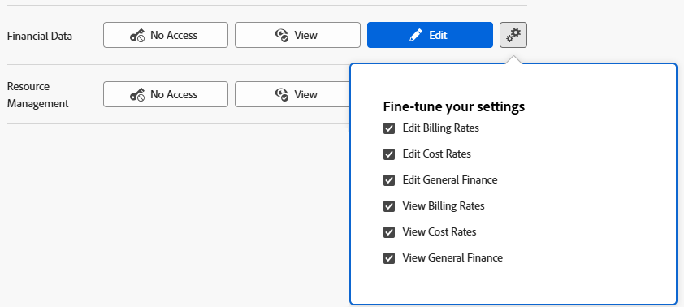

# Gewähren von Zugriff auf Finanzdaten

Als Adobe Workfront-Administrator können Sie den Zugriff eines Benutzers auf Folgendes über die Zugriffsebene des Benutzers definieren, wie in [Übersicht über Zugriffsebenen](../../../administration-and-setup/add-users/access-levels-and-object-permissions/access-levels-overview.md):

* Finanzielle Informationen zu Projekten in Workfront
* Informationen zur Ressourcenbudgetierung in den Ressourcenplanungs-Tools

## Zugriffsanforderungen

+++ Erweitern, um die Zugriffsanforderungen für die in diesem Artikel beschriebene Funktionalität anzuzeigen.

<table style="table-layout:auto"> 
 <col> 
 <col> 
 <tbody> 
  <tr> 
   <td role="rowheader">Adobe Workfront-Paket</td> 
   <td>Beliebig</td> 
  </tr> 
  <tr> 
   <td role="rowheader">Adobe Workfront-Lizenz</td> 
   <td>
    
Standard

   
Abo

   </td> 
  </tr> 
  <tr> 
   <td role="rowheader">Konfigurationen der Zugriffsebene</td> 
   <td> 
Sie müssen ein Workfront-Administrator sein.
 </td> 
  </tr> 
 </tbody> 
</table>

Weitere Details zu den Informationen in dieser Tabelle finden Sie unter [Zugriffsanforderungen in der Dokumentation zu Workfront](/help/quicksilver/administration-and-setup/add-users/access-levels-and-object-permissions/access-level-requirements-in-documentation.md).

+++

## Überlegungen zur Gewährung des Zugriffs auf Finanzdaten

Beachten Sie Folgendes, wenn Sie Benutzern Zugriff auf Finanzdaten in Workfront gewähren:

* Ein Benutzer, dessen Zugriffsebene keinen Zugriff auf Finanzdaten zulässt, kann keinen Zugriff gewähren, der es anderen ermöglicht, Finanzdaten anzuzeigen. Dazu gehört der Zugriff auf Projekte, die Finanzdaten anzeigen, oder die Änderung einer Zugriffsebene, um die Anzeige von Finanzdaten zu ermöglichen.
* Ein Benutzer, dessen Zugriffsebene keinen Zugriff auf Finanzdaten zulässt, kann kein Risiko für ein Projekt verursachen. Weitere Informationen finden Sie unter [Erstellen und Bearbeiten von Risiken in Projekten](../../../manage-work/projects/define-a-business-case/create-edit-risks-on-projects.md).
* Sie können auch eine Zugriffsebene verwenden, um zu bestimmen, welche Ressourcenverwaltungsaktivitäten ein Benutzer verwenden kann, um Ressourcenzuordnungen zu budgetieren oder anzuzeigen. Weitere Informationen finden Sie unter [Zugriff auf Ressourcenverwaltung gewähren](../../../administration-and-setup/add-users/configure-and-grant-access/grant-access-resource-management.md).
* Der Zugriff auf Abrechnungssätze, Kostensätze und allgemeine Finanzen ist separat, was eine präzisere Kontrolle für verschiedene Benutzerrollen ermöglicht, die mit komplexen Finanzdetails umgehen. Allgemeine Finanzen sind zusätzliche Finanzdaten, die keine Abrechnungs- und Kostensätze enthalten.

## Konfigurieren des Benutzerzugriffs auf Finanzdaten mithilfe einer benutzerdefinierten Zugriffsebene

1. Erstellen oder bearbeiten Sie die Zugriffsebene, wie unter [Erstellen oder Ändern benutzerdefinierter Zugriffsebenen“ &#x200B;](../../../administration-and-setup/add-users/configure-and-grant-access/create-modify-access-levels.md).
1. Klicken Sie auf das Zahnradsymbol  der Schaltfläche **Anzeigen** oder **Bearbeiten** rechts neben Finanzdaten und wählen Sie dann die Funktionen aus, die Sie unter **Einstellungen optimieren** gewähren möchten.

   

1. (Optional) Wählen Sie im Bereich **Administratorzugriff zulassen für** die folgenden Optionen aus:

   <table style="table-layout:auto"> 
    <col> 
    <col> 
    <tbody> 
     <tr> 
      <td role="rowheader">Wechselkurse</td> 
      <td> 
Neue Währung in Workfront hinzufügen.
 
Ohne diesen Zugriff kann der Benutzer nur eine vorhandene Währung zu einem von ihm erstellten Projekt hinzufügen.
 </td> 
     </tr> 
     <tr> 
      <td role="rowheader">Ausgaben</td> 
      <td> 
Alle Ausgaben für Objekte in Workfront anzeigen.
 
Dadurch kann der Benutzer keine neuen Ausgabentypen erstellen.
 
Ohne diesen Zugriff kann der Benutzer nur Folgendes anzeigen:
 
       <ul> 
        <li>Ausgaben für von ihnen verwaltete Projekte, Aufgaben oder Probleme</li> 
        <li>Ihre eigenen Kosten</li> 
        <li>Die Ausgaben ihrer Untergebenen</li> 
       </ul> </td> 
     </tr> 
    </tbody> 
   </table>

1. (Optional) Um Zugriffseinstellungen für andere Objekte und Bereiche in der Zugriffsebene, an der Sie arbeiten, zu konfigurieren, fahren Sie mit einem der Artikel fort, die unter [Zugriff auf Adobe Workfront konfigurieren“ aufgeführt sind](../../../administration-and-setup/add-users/configure-and-grant-access/configure-access.md) z. B. [Zugriff auf Aufgaben gewähren](../../../administration-and-setup/add-users/configure-and-grant-access/grant-access-tasks.md).
1. Wenn Sie fertig sind, klicken Sie auf **Speichern**.

   Nachdem die Zugriffsebene erstellt wurde, können Sie sie einem Benutzer zuweisen. Weitere Informationen finden Sie [Bearbeiten des Benutzerprofils](../../../administration-and-setup/add-users/create-and-manage-users/edit-a-users-profile.md).

## Zugriff auf freigegebene Finanzinformationen

Sie können Finanzinformationen zu einem Projekt, einer Aufgabe oder einem Problem für andere Benutzer freigeben, indem Sie ihnen die entsprechenden Berechtigungen erteilen, wie unter [Freigeben von Finanzberechtigungen für ein Objekt](../../../workfront-basics/grant-and-request-access-to-objects/share-financial-permissions-object.md) beschrieben.

<!--
If you make changes here, make them also in the "Grant access to" articles where this snippet had to be converted to text:
* reports, dashboards, and calendars
* financial data
* issue
-->

Wenn Sie ein Objekt für einen anderen Benutzer freigeben, werden die Rechte des Empfängers durch eine Kombination zweier Dinge bestimmt:

* Die Berechtigungen, die Sie Ihrem Empfänger für das Objekt erteilen
* Die Zugriffsebenen-Einstellungen des Empfängers für den Objekttyp

## Zugriff auf Finanzinformationen nach Lizenztyp

Informationen dazu, was Benutzer in den einzelnen Zugriffsebenen mit Finanzinformationen tun können, finden Sie im Abschnitt [Finanzdaten](../../../administration-and-setup/add-users/access-levels-and-object-permissions/functionality-available-for-each-object-type.md#financia) im Artikel [Für jeden Objekttyp verfügbare Funktionen](../../../administration-and-setup/add-users/access-levels-and-object-permissions/functionality-available-for-each-object-type.md).

## Zugang zu Finanzinformationen durch Festlegung

Die folgenden Informationen helfen Ihnen zu verstehen, wie Sie die Einstellungen der Zugriffsebene verwenden können, um den Zugriff der Benutzer auf Finanzdaten zu steuern.

### Kein Zugriff

Ein Benutzer ohne Zugriff auf Finanzdaten hat keinen Zugriff auf:

* Abschnitt „Finanzen“ unter „Projekt- und Aufgabenobjekte“
* Business Case
* Rechnungsnachweise für Projekte
* Abrechnungssätze und Kostensätze für Projekte

<!--  

* Cost per hour and billing per hour on user profiles
* Cost per hour and billing per hour on Job Roles

-->

### Zugriffsrecht „Anzeigen“

Ein Benutzer mit Ansichtszugriff auf Finanzdaten kann Folgendes anzeigen (nicht bearbeiten):

* Abschnitt „Finanzen“ unter „Projekt- und Aufgabenobjekte“

  Sie können dies mithilfe des Zahnradsymbols konfigurieren, das auf der Schaltfläche Ansicht in Schritt 4 oben  ist.

* Business Case
* Rechnungsnachweise für Projekte
* Abrechnungssätze und Kostensätze für Projekte

  Sie können dies mithilfe des Zahnradsymbols konfigurieren, das auf der Schaltfläche Ansicht in Schritt 4 oben  ist.

<!--  

* Cost per hour and billing per hour on user profiles

  You can configure this using the gear icon  on the View button in step 4 above.

* Cost per hour and billing per hour on Job Roles

  You can configure this using the gear icon  on the View button in step 4 above.

-->

### Zugriffsrecht „Bearbeiten“

Ein Benutzer mit Bearbeitungszugriff auf Finanzdaten kann Folgendes anzeigen und bearbeiten:

* Abschnitt „Finanzen“ unter „Projekt- und Aufgabenobjekte“

  Sie können dies mithilfe des Zahnradsymbols konfigurieren, das auf der Schaltfläche Bearbeiten in Schritt 4 oben  ist.

* Business Case
* Rechnungsnachweise für Projekte
* Abrechnungssätze und Kostensätze für Projekte

  Sie können dies mithilfe des Zahnradsymbols konfigurieren, das auf der Schaltfläche Bearbeiten in Schritt 4 oben  ist.

<!--  

* Cost per hour and billing per hour on user profiles

  You can configure this using the gear icon  on the Edit button in step 4 above.

* Cost per hour and billing per hour on Job Roles

  You can configure this using the gear icon  on the Edit button in step 4 above.

-->

