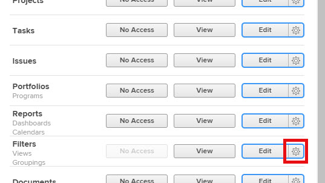

# Zugriff auf Filter, Ansichten und Gruppierungen gewähren

Als Adobe Workfront-Administrator können Sie eine Zugriffsebene verwenden, um den Zugriff eines Benutzers auf die Filter-, Anzeige- und Gruppierungssteuerelemente für Listen und Berichte zu definieren, wie unter [Übersicht über Zugriffsebenen](../../../administration-and-setup/add-users/access-levels-and-object-permissions/access-levels-overview.md) beschrieben.

Informationen zu den Steuerelementen für Filter, Ansicht und Gruppierung finden Sie unter [Berichterstellungselemente: Filter, Ansichten und Gruppierungen](../../../reports-and-dashboards/reports/reporting-elements/reporting-elements-filters-views-groupings.md).

## Zugriffsanforderungen

Sie müssen über folgenden Zugriff verfügen, um die Schritte in diesem Artikel ausführen zu können:

<table style="table-layout:auto"> 
 <col> 
 <col> 
 <tbody> 
  <tr> 
   <td role="rowheader">Adobe Workfront-Abo</td> 
   <td>Alle</td> 
  </tr> 
  <tr> 
   <td role="rowheader">Adobe Workfront-Lizenz</td> 
   <td>Plan</td> 
  </tr> 
  <tr> 
   <td role="rowheader">Konfigurationen auf Zugriffsebene</td> 
   <td> 
Sie müssen Workfront-Administrator sein.
 
<b>HINWEIS</b>: Wenn Sie immer noch keinen Zugriff haben, fragen Sie Ihren Workfront-Administrator, ob er zusätzliche Zugriffsbeschränkungen für Ihre Zugriffsebene festlegt. Informationen dazu, wie ein Workfront-Administrator Ihre Zugriffsebene ändern kann, finden Sie unter <a href="../../../administration-and-setup/add-users/configure-and-grant-access/create-modify-access-levels.md" class="MCXref xref" data-mc-variable-override="">Benutzerdefinierte Zugriffsebenen erstellen oder ändern</a>.
 </td> 
  </tr> 
 </tbody> 
</table>

## Benutzerzugriff auf Filter, Ansichten und Gruppierungen mithilfe einer benutzerdefinierten Zugriffsebene konfigurieren

1. Beginnen Sie mit der Erstellung oder Bearbeitung der Zugriffsebene, wie unter [Benutzerdefinierte Zugriffsebenen erstellen oder ändern](../../../administration-and-setup/add-users/configure-and-grant-access/create-modify-access-levels.md) beschrieben.
1. Klicken Sie auf das Zahnradsymbol  auf der Schaltfläche **Ansicht** oder **Bearbeiten** rechts neben Filter und wählen Sie dann die Fähigkeiten aus, die Sie unter **Feinabstimmung Ihrer Einstellungen** gewähren möchten.

   

   Standardmäßig verfügen Benutzer mit einer Lizenz für Plan, Arbeit, Überprüfer oder Anforderung über vollständige Ansicht- und Bearbeitungsfunktionen. Benutzer mit der Lizenz für einen externen Benutzer haben keinen Zugriff auf Filter, Ansichten und Gruppierungen.

   <!--If this changes, undraft section with table below
   -->

1. (Optional) Um die Zugriffseinstellungen für andere Objekte und Bereiche in der Zugriffsebene zu konfigurieren, an der Sie arbeiten, fahren Sie mit einem der unter [Zugriff auf Adobe Workfront konfigurieren](../../../administration-and-setup/add-users/configure-and-grant-access/configure-access.md) aufgelisteten Artikel fort, z. B. [Zugriff auf Aufgaben gewähren](../../../administration-and-setup/add-users/configure-and-grant-access/grant-access-tasks.md) und [Zugriff auf Finanzdaten gewähren](../../../administration-and-setup/add-users/configure-and-grant-access/grant-access-financial.md).
1. Wenn Sie fertig sind, klicken Sie auf **Speichern**.

   Nachdem die Zugriffsebene erstellt wurde, können Sie sie einem Benutzer zuweisen. Weitere Informationen finden Sie unter [Profil eines Benutzers bearbeiten](../../../administration-and-setup/add-users/create-and-manage-users/edit-a-users-profile.md).

<!--## Access to filters, views, and groupings by license type

Drafting out this section for now because the table is redundant since all four license types can do everything.-->

In dieser Tabelle wird aufgeführt, was ein Workfront-Administrator Benutzern mit jedem Lizenztyp erlauben kann, Filter, Ansichten und Gruppierungen zu verwenden. Informationen zu den Workfront-Lizenztypen finden Sie unter [Übersicht über Adobe Workfront-Lizenzen](../../../administration-and-setup/add-users/access-levels-and-object-permissions/wf-licenses.md).

<table style="table-layout:auto">
<col>
<col>
<col>
<col>
<col>
<thead>
<tr>
<th> Aktion </th>
<th> Planer </th>
<th> Arbeitskraft </th>
<th> Prüfende Person </th>
<th> Anfragende Person </th>
</tr>
</thead>
<tbody>
<tr>
<td>Filter, Ansichten und Gruppierungen bearbeiten</td>
<td>✓</td>
<td>✓</td>
<td>✓</td>
<td>✓</td>
</tr>
<tr>
<td>Filter, Ansichten und Gruppierungen erstellen</td>
<td>✓</td>
<td>✓</td>
<td>✓</td>
<td>✓</td>
</tr>
<tr>
<td>Filter, Ansichten und Gruppierungen anzeigen</td>
<td>✓</td>
<td>✓</td>
<td>✓</td>
<td>✓</td>
</tr>
<tr>
<td>Filter, Ansichten und Gruppierungen löschen</td>
<td>✓</td>
<td>✓</td>
<td>✓</td>
<td>✓</td>
</tr>
<tr>
<td>Filter, Ansichten und Gruppierungen freigeben</td>
<td>✓</td>
<td>✓</td>
<td>✓</td>
<td>✓</td>
</tr>
<tr>
<td>Filter, Ansichten und Gruppierungen systemweit freigeben</td>
<td>✓</td>
<td>✓</td>
<td>✓</td>
<td>✓</td>
</tr>
</tbody>
</table>
