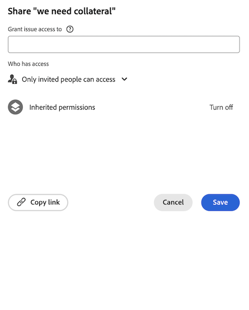

# Zugriff auf Probleme gewähren

Als Adobe Workfront-Administrator können Sie eine Zugriffsebene verwenden, um den Zugriff eines Benutzers auf Probleme zu definieren, wie unter [Überblick über Zugriffsebene](../../../administration-and-setup/add-users/access-levels-and-object-permissions/access-levels-overview.md) beschrieben.

Informationen zur Verwendung benutzerdefinierter Zugriffsebenen zur Verwaltung des Benutzerzugriffs auf andere Objekttypen in Workfront finden Sie unter [Erstellen oder Ändern benutzerdefinierter Zugriffsebenen](../../../administration-and-setup/add-users/configure-and-grant-access/create-modify-access-levels.md).

## Zugriffsanforderungen

+++ Erweitern Sie , um die Zugriffsanforderungen für die Funktionalität in diesem Artikel anzuzeigen.

Sie müssen über folgenden Zugriff verfügen, um die Schritte in diesem Artikel ausführen zu können:

<table style="table-layout:auto"> 
 <col> 
 <col> 
 <tbody> 
  <tr> 
   <td role="rowheader">Adobe Workfront-Abo</td> 
   <td>Alle</td> 
  </tr> 
  <tr> 
   <td role="rowheader">Adobe Workfront-Lizenz</td> 
   <td>Plan</td> 
  </tr> 
  <tr> 
   <td role="rowheader">Konfigurationen auf Zugriffsebene</td> 
   <td> 
Sie müssen Workfront-Administrator sein.
 
<b>HINWEIS</b>: Wenn Sie immer noch keinen Zugriff haben, fragen Sie Ihren Workfront-Administrator, ob er zusätzliche Zugriffsbeschränkungen für Ihre Zugriffsebene festlegt. Informationen dazu, wie ein Workfront-Administrator Ihre Zugriffsebene ändern kann, finden Sie unter <a href="../../../administration-and-setup/add-users/configure-and-grant-access/create-modify-access-levels.md" class="MCXref xref" data-mc-variable-override="">Benutzerdefinierte Zugriffsebenen erstellen oder ändern</a>.
 </td> 
  </tr> 
 </tbody> 
</table>

+++

## Gewähren des Benutzerzugriffs auf Probleme mithilfe einer benutzerdefinierten Zugriffsebene

1. Beginnen Sie mit der Erstellung oder Bearbeitung der Zugriffsebene, wie unter [Benutzerdefinierte Zugriffsebenen erstellen oder ändern](../../../administration-and-setup/add-users/configure-and-grant-access/create-modify-access-levels.md) beschrieben.
1. Klicken Sie auf das Zahnradsymbol  auf der Schaltfläche **Ansicht** oder **Bearbeiten** rechts neben Probleme und wählen Sie dann die Fähigkeiten aus, die Sie unter **Feinabstimmung Ihrer Einstellungen** gewähren möchten.

1. (Optional) Um die geerbten Berechtigungen für Probleme aus höher eingestuften Objekten einzuschränken, klicken Sie auf **Zusätzliche Einschränkungen festlegen** und wählen Sie dann **Erben Sie den Dokumentzugriff nie von Projekten, Aufgaben, Problemen usw.**.

1. (Optional) Um die Zugriffseinstellungen für andere Objekte und Bereiche in der Zugriffsebene zu konfigurieren, an der Sie arbeiten, fahren Sie mit einem der unter [Zugriff auf Adobe Workfront konfigurieren](../../../administration-and-setup/add-users/configure-and-grant-access/configure-access.md) aufgelisteten Artikel fort, z. B. [Zugriff auf Aufgaben gewähren](../../../administration-and-setup/add-users/configure-and-grant-access/grant-access-tasks.md) und [Zugriff auf Finanzdaten gewähren](../../../administration-and-setup/add-users/configure-and-grant-access/grant-access-financial.md).
1. Wenn Sie fertig sind, klicken Sie auf **Speichern**.

   Nachdem die Zugriffsebene erstellt wurde, können Sie sie einem Benutzer zuweisen. Weitere Informationen finden Sie unter [Profil eines Benutzers bearbeiten](../../../administration-and-setup/add-users/create-and-manage-users/edit-a-users-profile.md).

## Zugriff auf Probleme nach Lizenztyp

Informationen dazu, was Benutzer in den einzelnen Zugriffsebenen mit Problemen tun können, finden Sie im Abschnitt [Probleme](../../../administration-and-setup/add-users/access-levels-and-object-permissions/functionality-available-for-each-object-type.md#issues) im Artikel [Für jeden Objekttyp verfügbare Funktionen](../../../administration-and-setup/add-users/access-levels-and-object-permissions/functionality-available-for-each-object-type.md).

## Zugriff auf freigegebene Probleme

Als Eigentümer oder Ersteller eines Problems können Sie es mit anderen Benutzern teilen, indem Sie ihnen Berechtigungen erteilen, wie unter [Problem freigeben](../../../workfront-basics/grant-and-request-access-to-objects/share-an-issue.md) beschrieben.

<!--

If you make changes here, make them also in the "Grant access to" articles where this snippet had to be converted to text:

* reports, dashboards, and calendars

* financial data

* issue

-->

Wenn Sie ein Objekt für einen anderen Benutzer freigeben, werden die Rechte des Empfängers für dieses Objekt durch eine Kombination aus zwei Faktoren bestimmt:

* Die Berechtigungen, die Sie Ihrem Empfänger für das Objekt gewähren
* Einstellungen der Zugriffsebene des Empfängers für den Objekttyp

Wenn dies von der Zugriffsebene erlaubt wird, können Benutzer auch über die Objekthierarchie auf ein Problem zugreifen: Wenn ein Benutzer bereits über Berechtigungen für das übergeordnete Projekt oder die übergeordnete Aufgabe eines Problems verfügt, hat er auch Zugriff auf das Problem (siehe Schritt 3 oben). Wenn Sie ein Problem freigeben, können Sie eine Liste der Benutzer sehen, die die Berechtigung für dieses Problem übernommen haben.

