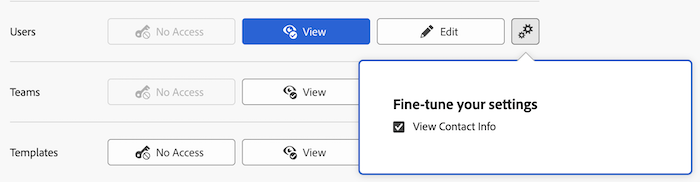

# Benutzern Zugriff gewähren

Als Adobe Workfront-Administrator können Sie eine Zugriffsebene verwenden, um den Zugriff eines Benutzers auf andere Benutzer in Workfront zu definieren, wie in [Übersicht über Zugriffsebenen](../../../administration-and-setup/add-users/access-levels-and-object-permissions/access-levels-overview.md) beschrieben.

## Zugriffsanforderungen

+++ Erweitern Sie , um die Zugriffsanforderungen für die -Funktion in diesem Artikel anzuzeigen.

<table style="table-layout:auto"> 
 <col> 
 <col> 
 <tbody> 
  <tr> 
   <td role="rowheader">Adobe Workfront-Paket</td> 
   <td>Beliebig</td> 
  </tr> 
  <tr> 
   <td role="rowheader">Adobe Workfront-Lizenz</td> 
   <td>
Standard

   
Plan
</td> 
  </tr> 
  <tr> 
   <td role="rowheader">Konfigurationen der Zugriffsebene</td> 
   <td> 
Sie müssen ein Workfront-Administrator sein.
 </td> 
  </tr> 
 </tbody> 
</table>

Weitere Informationen zu den Informationen in dieser Tabelle finden Sie unter [Zugriffsanforderungen in der Dokumentation zu Workfront](/help/quicksilver/administration-and-setup/add-users/access-levels-and-object-permissions/access-level-requirements-in-documentation.md).

+++

## Konfigurieren des Benutzerzugriffs

Sie können mithilfe einer standardmäßigen Zugriffsebene oder einer benutzerdefinierten Zugriffsebene, die Sie erstellen, verwalten, welche Informationen Benutzerinnen und Benutzer anzeigen und für andere Benutzende bearbeiten können. Benutzer mit der standardmäßigen Plan- und Arbeitslizenz können die Kontaktinformationen anderer Benutzer anzeigen. Jeder der folgenden Benutzer kann andere Benutzer erstellen und bearbeiten:

* Einen Workfront-Administrator.

  Weitere Informationen finden Sie unter [Gewähren des vollständigen Administratorzugriffs für einen Benutzer](../../../administration-and-setup/add-users/configure-and-grant-access/grant-a-user-full-administrative-access.md).

* Ein Benutzer mit einer standardmäßigen Plan -Lizenz, der auch Zugriff auf Benutzer hat, wie in diesem Artikel erläutert.

  Benutzer, die nur Benutzer aus ihrer Firma oder der primären Firma sehen dürfen, haben Zugriff darauf, nur die Benutzer zu bearbeiten, die sie sehen können. Weitere Informationen finden Sie unter [Erstellen oder Ändern benutzerdefinierter Zugriffsebenen](../../../administration-and-setup/add-users/configure-and-grant-access/create-modify-access-levels.md).

* Ein Benutzer mit einer standardmäßigen Planlizenz, der auch als Manager eines anderen Benutzers angegeben ist.

  Benutzende, denen Bearbeitungszugriff auf Benutzende in ihrer Zugriffsebene gewährt wurde, können Benutzende verwalten, die ihnen Bericht erstatten. Informationen zum Verwalten eines Benutzers finden Sie unter [Anzeigen des Organigramms](../../../people-teams-and-groups/work-directly-with-others/view-the-org-chart.md).

* Ein Benutzer mit einer Standardplanlizenz, der einen Benutzer erstellt hat, kann den von ihm erstellten Benutzer deaktivieren, löschen oder bearbeiten. Informationen zum Erstellen neuer Benutzer finden Sie unter [Benutzer hinzufügen](../../../administration-and-setup/add-users/create-and-manage-users/add-users.md).

## Benutzerzugriff konfigurieren, um Benutzer mithilfe einer benutzerdefinierten Zugriffsebene zu bearbeiten

1. Erstellen oder bearbeiten Sie die Zugriffsebene, wie unter [Erstellen oder Ändern benutzerdefinierter Zugriffsebenen“ &#x200B;](../../../administration-and-setup/add-users/configure-and-grant-access/create-modify-access-levels.md).
1. So ändern Sie die Möglichkeit von Benutzern mit einer Plan- oder Arbeitslizenz, die Profile anderer Benutzer anzuzeigen:

   1. Klicken Sie auf das Zahnradsymbol  der Schaltfläche **Anzeigen** rechts neben **Benutzer**.

   1. Deaktivieren Sie **Kontaktinformationen anzeigen** und klicken Sie dann auf das X, um das Feld **Feinabstimmung der Einstellungen** zu schließen.

      

1. Um die Möglichkeit von Benutzern mit einer Planlizenz zu ändern, andere Benutzer zu bearbeiten, klicken Sie auf das Zahnradsymbol  auf der Schaltfläche **Bearbeiten** rechts neben **Benutzer** und wählen Sie die Funktionen aus, die Sie gewähren möchten:

   <table style="table-layout:auto"> 
    <col> 
    <col> 
    <tbody> 
     <tr> 
      <td role="rowheader"><strong>Erstellen</strong> </td> 
      <td> 
Ermöglicht Benutzern das Erstellen von Benutzern. Diese Option ist standardmäßig aktiviert.
 
     
<b>HINWEIS</b>: Dies ist nicht verfügbar, wenn Ihre Organisation in die Adobe Admin Console integriert wurde. Wenden Sie sich an Ihren Netzwerk- oder IT-Administrator, wenn Sie weitere Informationen benötigen.

        </td>  
     </tr> 
     <tr> 
      <td role="rowheader"><strong>Löschen</strong> </td> 
      <td> 
 Ermöglicht Benutzern das Löschen der von ihnen selbst erstellten Benutzer. Diese Option ist standardmäßig aktiviert.
 
<b>HINWEIS</b>: Dies ist nicht verfügbar, wenn Ihre Organisation in die Adobe Admin Console integriert wurde. Wenden Sie sich an Ihren Netzwerk- oder IT-Administrator, wenn Sie weitere Informationen benötigen.
 </td> 
     </tr> 
     <tr> 
      <td role="rowheader"><strong>Benutzeradmin. (Alle Benutzer)</strong> </td> 
      <td> 
Ermöglicht es Benutzenden, für jeden Benutzer in Workfront Folgendes auszuführen:
 
       <ul> 
        <li>Benutzer bearbeiten, löschen oder deaktivieren</li> 
        <li>Melden Sie sich als Benutzer an
<b>HINWEIS</b>: Sie können sich nicht als ein beliebiger Benutzer anmelden, der Systemadministrator ist.
</li> 
        <li>Zurücksetzen des Benutzerkennworts</li> 
       </ul> 
Standardmäßig ist diese Option deaktiviert.
 </td> 
     </tr> 
     <tr> 
      <td role="rowheader"><strong>Benutzeradmin. (Gruppenbenutzer)</strong> </td> 
      <td> 
Ermöglicht Benutzern die Durchführung folgender Aktionen für alle Benutzer in der Gruppe, die sie verwalten: 
        <ul>
         <li>
Benutzer bearbeiten, löschen oder deaktivieren
</li>
         <li>Melden Sie sich als Benutzer an</li>
         <li>
Zurücksetzen des Benutzerkennworts

<b>HINWEIS</b>: Ein Gruppenadministrator kann sich nicht als Administrator anmelden oder das Kennwort eines Workfront-Administrators zurücksetzen.
</li>
        </ul>
Standardmäßig ist diese Option deaktiviert.

 </td> 
     </tr> 
    </tbody> 
   </table>

   >[!TIP]
   >
   >Wenn Sie Gruppenadministratoren keinen Zugriff auf alle Mitglieder der Gruppen gewähren möchten, die sie verwalten, deaktivieren Sie beide oben genannten Optionen für Benutzeradministratoren. Gruppenadministratoren können weiterhin auf Gruppenmitglieder zugreifen, die sie zu Workfront hinzufügen oder die ihnen in Workfront Bericht erstatten.

1. (Optional) Um Zugriffseinstellungen für andere Objekte und Bereiche in der Zugriffsebene, an der Sie arbeiten, zu konfigurieren, fahren Sie mit einem der in [Zugriff auf Adobe Workfront konfigurieren](../../../administration-and-setup/add-users/configure-and-grant-access/configure-access.md) aufgelisteten Artikel fort, z. B. [Zugriff auf Aufgaben gewähren](../../../administration-and-setup/add-users/configure-and-grant-access/grant-access-tasks.md) und [Zugriff auf Finanzdaten gewähren](../../../administration-and-setup/add-users/configure-and-grant-access/grant-access-financial.md).
1. Wenn Sie fertig sind, klicken Sie auf **Speichern**.

## Zugriff auf Benutzer nach Lizenztyp

Informationen dazu, was Benutzer in den einzelnen Zugriffsebenen mit Benutzern tun können, finden Sie im Abschnitt [Benutzer](../../../administration-and-setup/add-users/access-levels-and-object-permissions/functionality-available-for-each-object-type.md#users) im Artikel [Für jeden Objekttyp verfügbare Funktionen](../../../administration-and-setup/add-users/access-levels-and-object-permissions/functionality-available-for-each-object-type.md).
