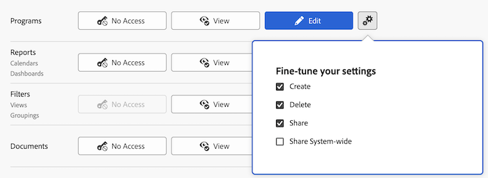

# Zugriff auf Programme gewähren

Als Adobe Workfront-Administrator können Sie eine Zugriffsebene verwenden, um den Zugriff eines Benutzers auf Programme zu definieren, wie in [Übersicht über Zugriffsebenen](../../../administration-and-setup/add-users/access-levels-and-object-permissions/access-levels-overview.md) beschrieben.

Informationen zur Verwendung benutzerdefinierter Zugriffsebenen zur Verwaltung des Benutzerzugriffs auf andere Objekttypen in Workfront finden Sie unter [Erstellen oder Ändern benutzerdefinierter Zugriffsebenen](../../../administration-and-setup/add-users/configure-and-grant-access/create-modify-access-levels.md).

## Zugriffsanforderungen

+++ Erweitern Sie , um die Zugriffsanforderungen für die -Funktion in diesem Artikel anzuzeigen.

<table style="table-layout:auto"> 
 <col> 
 <col> 
 <tbody> 
  <tr> 
   <td role="rowheader">Adobe Workfront-Paket</td> 
   <td>Beliebig</td> 
  </tr> 
  <tr> 
   <td role="rowheader">Adobe Workfront-Lizenz</td> 
   <td>
Standard

   
Plan
</td> 
  </tr> 
  <tr> 
   <td role="rowheader">Konfigurationen der Zugriffsebene</td> 
   <td> 
Sie müssen ein Workfront-Administrator sein.
 </td> 
  </tr> 
 </tbody> 
</table>

Weitere Informationen zu den Informationen in dieser Tabelle finden Sie unter [Zugriffsanforderungen in der Dokumentation zu Workfront](/help/quicksilver/administration-and-setup/add-users/access-levels-and-object-permissions/access-level-requirements-in-documentation.md).

+++

## Konfigurieren des Benutzerzugriffs auf Programme mithilfe einer benutzerdefinierten Zugriffsebene

1. Erstellen oder bearbeiten Sie die Zugriffsebene, wie unter [Erstellen oder Ändern benutzerdefinierter Zugriffsebenen“ &#x200B;](../../../administration-and-setup/add-users/configure-and-grant-access/create-modify-access-levels.md).
1. Klicken Sie auf das Zahnradsymbol  der Schaltfläche **Anzeigen** oder **Bearbeiten** rechts neben Programme und wählen Sie dann unter **Einstellungen optimieren** die Funktionen aus, die Sie gewähren möchten.

   

   Informationen dazu, was Benutzer in den einzelnen Zugriffsebenen mit Programmen tun können, finden Sie im Abschnitt [Programme](../../../administration-and-setup/add-users/access-levels-and-object-permissions/functionality-available-for-each-object-type.md#programs) im Artikel [Für jeden Objekttyp verfügbare Funktionen](../../../administration-and-setup/add-users/access-levels-and-object-permissions/functionality-available-for-each-object-type.md).

   >[!NOTE]
   >
   >Wenn Sie eine Zugriffsebenen-Einstellung für einen bestimmten Objekttyp konfigurieren, hat diese Konfiguration keine Auswirkungen auf den Zugriff der Benutzer auf Objekte mit einem niedrigeren Rang. Sie können beispielsweise Benutzerinnen und Benutzer daran hindern, Programme in ihrer Zugriffsebene zu löschen, was sie jedoch nicht daran hindert, Projekte zu löschen, die schlechter rangieren als Programme. Weitere Informationen zur Hierarchie von Objekten finden Sie im Abschnitt [Interdependenz und Hierarchie von Objekten](../../../workfront-basics/navigate-workfront/workfront-navigation/understand-objects.md#understanding-interdependency-and-hierarchy-of-objects) im Artikel [Grundlegendes zu Objekten in Adobe Workfront](../../../workfront-basics/navigate-workfront/workfront-navigation/understand-objects.md).

1. (Optional) Um Zugriffseinstellungen für andere Objekte und Bereiche in der Zugriffsebene, an der Sie arbeiten, zu konfigurieren, fahren Sie mit einem der in [Zugriff auf Adobe Workfront konfigurieren](../../../administration-and-setup/add-users/configure-and-grant-access/configure-access.md) aufgelisteten Artikel fort, z. B. [Zugriff auf Aufgaben gewähren](../../../administration-and-setup/add-users/configure-and-grant-access/grant-access-tasks.md) und [Zugriff auf Finanzdaten gewähren](../../../administration-and-setup/add-users/configure-and-grant-access/grant-access-financial.md).
1. Wenn Sie fertig sind, klicken Sie auf **Speichern**.

   Nachdem die Zugriffsebene erstellt wurde, können Sie sie einem Benutzer zuweisen. Weitere Informationen finden Sie [Bearbeiten des Benutzerprofils](../../../administration-and-setup/add-users/create-and-manage-users/edit-a-users-profile.md).

## Zugriff auf Programme nach Lizenztyp

Informationen dazu, was Benutzer in den einzelnen Zugriffsebenen mit Programmen tun können, finden Sie im Abschnitt [Programme](../../../administration-and-setup/add-users/access-levels-and-object-permissions/functionality-available-for-each-object-type.md#programs) im Artikel [Für jeden Objekttyp verfügbare Funktionen](../../../administration-and-setup/add-users/access-levels-and-object-permissions/functionality-available-for-each-object-type.md).

## Zugriff auf freigegebene Programme

Als Eigentümer oder Ersteller eines Programms können Sie es für andere Benutzer freigeben, indem Sie ihnen die entsprechenden Berechtigungen erteilen, wie unter [Freigeben eines Programms](../../../workfront-basics/grant-and-request-access-to-objects/share-a-program.md) beschrieben.

<!--

If you make changes here, make them also in the "Grant access to" articles where this snippet had to be converted to text:

* reports, dashboards, and calendars

* financial data

* issue

-->

Wenn Sie ein Objekt für einen anderen Benutzer freigeben, werden die Rechte des Empfängers durch eine Kombination zweier Dinge bestimmt:

* Die Berechtigungen, die Sie Ihrem Empfänger für das Objekt erteilen
* Die Zugriffsebenen-Einstellungen des Empfängers für den Objekttyp
