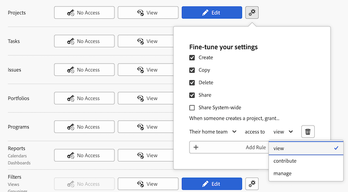

# Zugriff auf Projekte gewähren

<!-- Audited: 12/2023 -->

Als Adobe Workfront-Administrator können Sie eine Zugriffsebene verwenden, um den Zugriff eines Benutzers auf Projekte zu definieren, wie in den folgenden Artikeln erläutert:

* [Übersicht über Zugriffsebenen](../../../administration-and-setup/add-users/access-levels-and-object-permissions/access-levels-overview.md)
* [Übersicht über neue Zugriffsebenen](/help/quicksilver/administration-and-setup/add-users/how-access-levels-work/access-level-overview.md)

Informationen zur Verwendung benutzerdefinierter Zugriffsebenen zur Verwaltung des Benutzerzugriffs auf andere Objekttypen in Workfront finden Sie unter [Erstellen oder Ändern benutzerdefinierter Zugriffsebenen](../../../administration-and-setup/add-users/configure-and-grant-access/create-modify-access-levels.md).

## Zugriffsanforderungen

+++ Erweitern, um die Zugriffsanforderungen für die in diesem Artikel beschriebene Funktionalität anzuzeigen.

<table style="table-layout:auto"> 
 <col> 
 <col> 
 <tbody> 
  <tr> 
   <td role="rowheader">Adobe Workfront-Paket</td> 
   <td>Beliebig</td> 
  </tr> 
    <tr> 
   <td role="rowheader">Adobe Workfront-Lizenz</td> 
   <td> 
Standard

   
Plan

</td> 
  </tr> 
  <tr> 
   <td role="rowheader">Konfigurationen der Zugriffsebene</td> 
   <td> 
Sie müssen ein Workfront-Administrator sein.
 </td> 
  </tr> 
 </tbody> 
</table>

Weitere Informationen zu den Informationen in dieser Tabelle finden Sie unter [Zugriffsanforderungen in der Dokumentation zu Workfront](/help/quicksilver/administration-and-setup/add-users/access-levels-and-object-permissions/access-level-requirements-in-documentation.md).

+++

## Konfigurieren des Benutzerzugriffs auf Projekte mithilfe einer benutzerdefinierten Zugriffsebene

1. Erstellen oder bearbeiten Sie die Zugriffsebene, wie unter [Erstellen oder Ändern benutzerdefinierter Zugriffsebenen“ &#x200B;](../../../administration-and-setup/add-users/configure-and-grant-access/create-modify-access-levels.md).
1. Klicken Sie auf das Zahnradsymbol  auf der Schaltfläche **Anzeigen** oder **Bearbeiten** rechts von „Projekte“ und wählen Sie dann die Funktionen aus, die Sie unter **Einstellungen optimieren**.

   

   >[!NOTE]
   >
   >* Benutzende mit einer Arbeitslizenz haben eingeschränkte Projektrechte. Sie können zu einem Projekt beitragen, es jedoch nicht verwalten.
   >* Benutzer mit einer Revisionslizenz haben Ansichtsrechte für Projekte aus konvertierten Problemen, ihre Ansichtsrechte sind jedoch eingeschränkt.
   >* Informationen zu den Berechtigungen, die Benutzende beim Freigeben von Projekten für andere erteilen können, finden Sie unter [Freigeben eines Projekts in Adobe Workfront](../../../workfront-basics/grant-and-request-access-to-objects/share-a-project.md).
   >* Wenn Sie eine Zugriffsebenen-Einstellung für einen bestimmten Objekttyp konfigurieren, hat diese Konfiguration keine Auswirkungen auf den Zugriff der Benutzer auf Objekte mit einem niedrigeren Rang. Sie können beispielsweise Benutzerinnen und Benutzer daran hindern, Projekte in ihrer Zugriffsebene zu löschen, was sie jedoch nicht daran hindert, Aufgaben zu löschen, die schlechter rangieren als Projekte. Weitere Informationen zur Hierarchie von Objekten finden Sie im Abschnitt [Interdependenz und Hierarchie von Objekten](../../../workfront-basics/navigate-workfront/workfront-navigation/understand-objects.md#understanding-interdependency-and-hierarchy-of-objects) im Artikel [Grundlegendes zu Objekten in Adobe Workfront](../../../workfront-basics/navigate-workfront/workfront-navigation/understand-objects.md).
   >* Ein Benutzer, dessen Zugriffsebene keinen Zugriff auf Finanzdaten zulässt, kann keinen Zugriff gewähren, der es anderen ermöglicht, Finanzdaten anzuzeigen. Dazu gehört der Zugriff auf Projekte, die Finanzdaten anzeigen, oder die Änderung einer Zugriffsebene, um die Anzeige von Finanzdaten zu ermöglichen.

1. (Optional) Klicken Sie **rechts neben der Option Erstellen auf** Freigabestandardwerte festlegen **und dann auf „Regel hinzufügen**, um eine Freigabereregel für neue Projekte hinzuzufügen.

   Wenn der/die Benutzende mit dieser Zugriffsebene ein Projekt erstellt, wird das Projekt automatisch für die Benutzenden freigegeben, die Sie im Menü links auswählen.

   

   Im Menü rechts geben Sie an, wie das Projekt für diese Benutzer freigegeben werden soll:

   

   >[!NOTE]
   >
   >Wenn ein(e) Benutzende(r) mit dieser Zugriffsebene eine Projektzugriffsvorlage verwendet, überschreibt die Vorlage die Freigabeeinstellungen in der Zugriffsebene. Informationen zu Projektzugriffsvorlagen finden Sie unter [Freigeben eines Projekts in Adobe Workfront](../../../workfront-basics/grant-and-request-access-to-objects/share-a-project.md).

   Sie können diesen Schritt wiederholen, um so viele Projektfreigaberegeln hinzuzufügen, wie Sie für die Zugriffsebene benötigen.

1. Klicken Sie auf das X, um das **Optimieren der Einstellungen** zu schließen.
1. (Optional) Um Zugriffseinstellungen für andere Objekte und Bereiche in der Zugriffsebene, an der Sie arbeiten, zu konfigurieren, fahren Sie mit einem der in [Zugriff auf Adobe Workfront konfigurieren](../../../administration-and-setup/add-users/configure-and-grant-access/configure-access.md) aufgelisteten Artikel fort, z. B. [Zugriff auf Aufgaben gewähren](../../../administration-and-setup/add-users/configure-and-grant-access/grant-access-tasks.md) und [Zugriff auf Finanzdaten gewähren](../../../administration-and-setup/add-users/configure-and-grant-access/grant-access-financial.md).
1. Wenn Sie fertig sind, klicken Sie auf **Speichern**.

   Nachdem die Zugriffsebene erstellt wurde, können Sie sie einem Benutzer zuweisen. Weitere Informationen finden Sie [Bearbeiten des Benutzerprofils](../../../administration-and-setup/add-users/create-and-manage-users/edit-a-users-profile.md).

## Zugriff auf Berichte, Dashboards und Kalender nach Lizenztyp

Informationen dazu, was Benutzer in den einzelnen Zugriffsebenen mit Problemen tun können, finden Sie im Abschnitt [Projekte](../../../administration-and-setup/add-users/access-levels-and-object-permissions/functionality-available-for-each-object-type.md#projects) im Artikel [Funktionalität für jeden Objekttyp verfügbar](../../../administration-and-setup/add-users/access-levels-and-object-permissions/functionality-available-for-each-object-type.md).

## Zugriff auf freigegebene Projekte

Als Verantwortlicher oder Ersteller eines Problems können Sie es für andere Benutzende freigeben, indem Sie ihnen die entsprechenden Berechtigungen erteilen, wie unter [Freigeben eines Projekts in Adobe Workfront](../../../workfront-basics/grant-and-request-access-to-objects/share-a-project.md) beschrieben.

<!--
If you make changes here, make them also in the "Grant access to" articles where this snippet had to be converted to text:
* reports, dashboards, and calendars
* financial data
* issue
-->

Wenn Sie ein Objekt für einen anderen Benutzer freigeben, werden die Rechte des Empfängers durch eine Kombination zweier Dinge bestimmt:

* Die Berechtigungen, die Sie Ihrem Empfänger für das Objekt erteilen
* Die Zugriffsebenen-Einstellungen des Empfängers für den Objekttyp
