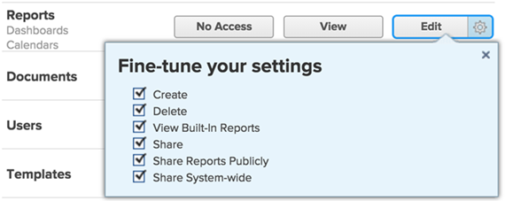

# Zugriff auf Berichte, Dashboards und Kalender gewähren

Als Adobe Workfront-Administrator können Sie mithilfe einer Zugriffsebene den Zugriff eines Benutzers auf Berichte, Dashboards und Kalender definieren, wie hier beschrieben: [Übersicht über Zugriffsebenen](../../../administration-and-setup/add-users/access-levels-and-object-permissions/access-levels-overview.md).

Dieser Zugriff umfasst auch den Zugriff auf externe Seiten. Weitere Informationen zu externen Seiten finden Sie unter [Zugriff auf Finanzdaten gewähren](../../../administration-and-setup/add-users/configure-and-grant-access/grant-access-financial.md).

>[!NOTE]
>
>* Wenn Sie Benutzern Zugriff auf Berichte, Dashboards und Kalender gewähren möchten, müssen Sie diesen Benutzern auch Zugriff auf Filter, Ansichten und Gruppierungen gewähren. Anweisungen finden Sie unter [Zugriff auf Filter, Ansichten und Gruppierungen gewähren](../../../administration-and-setup/add-users/configure-and-grant-access/grant-access-fvg.md).
>* Wenn jemand einen Bericht, ein Dashboard oder einen Kalender mit einem anderen Benutzer teilt, werden die Rechte des Empfängers für diesen Bericht durch eine Kombination aus zwei Faktoren bestimmt: Die Zugriffsebene des Empfängers für Berichte, Dashboards und Kalender _und_ alle Berechtigungen, die der freigebende Benutzer für den Bericht, das Dashboard oder den Kalender erteilt hat
>
>Informationen zu den Berechtigungen, die Benutzer bei der Freigabe für einen Bericht, ein Dashboard oder einen Kalender gewähren können, finden Sie unter [Berichte, Dashboards und Kalender freigeben](../../../workfront-basics/grant-and-request-access-to-objects/permissions-reports-dashboards-calendars.md).

## Zugriffsanforderungen

Sie müssen über folgenden Zugriff verfügen, um die Schritte in diesem Artikel ausführen zu können:

<table style="table-layout:auto"> 
 <col> 
 <col> 
 <tbody> 
  <tr> 
   <td role="rowheader">Adobe Workfront-Abo</td> 
   <td>Beliebig</td> 
  </tr> 
  <tr> 
   <td role="rowheader">Adobe Workfront-Lizenz</td> 
   <td>Plan</td> 
  </tr> 
  <tr> 
   <td role="rowheader">Konfigurationen auf Zugriffsebene</td> 
   <td> 
Sie müssen Workfront-Administrator sein.
 
<b>NOTE</b>: Wenn Sie immer noch keinen Zugriff haben, fragen Sie Ihren Workfront-Administrator, ob er zusätzliche Zugriffsbeschränkungen für Ihre Zugriffsebene festlegt. Informationen dazu, wie ein Workfront-Administrator Ihre Zugriffsebene ändern kann, finden Sie unter <a href="../../../administration-and-setup/add-users/configure-and-grant-access/create-modify-access-levels.md" class="MCXref xref" data-mc-variable-override="">Benutzerdefinierte Zugriffsebenen erstellen oder ändern</a>.
 </td> 
  </tr> 
 </tbody> 
</table>

## Benutzerzugriff auf Berichte, Dashboards und Kalender mithilfe einer benutzerdefinierten Zugriffsebene konfigurieren

1. Erstellen oder bearbeiten Sie die Zugriffsebene, wie hier beschrieben: [Benutzerdefinierte Zugriffsebenen erstellen oder ändern](../../../administration-and-setup/add-users/configure-and-grant-access/create-modify-access-levels.md).
1. Klicken Sie auf das Zahnradsymbol  auf **Ansicht** oder **Bearbeiten** auf der rechten Seite von &quot;Berichte&quot;und wählen Sie dann die Fähigkeiten aus, die Sie unter **Einstellungen anpassen**.

   

   Die folgenden Optionen sind standardmäßig aktiviert:

   * **Erstellen**
   * **Löschen**
   * **Integrierte Berichte anzeigen**: Diese Option muss ausgewählt werden, um von Workfront erstellte Berichte anzuzeigen.
   * **Freigeben**
   * **Berichte öffentlich freigeben**: Berichte können öffentlich freigegeben werden, indem ein öffentlicher Link zum Bericht für alle Benutzer freigegeben wird, die kein Workfront-Konto haben. Diese Option muss ausgewählt werden, um diese Freigabestufe zu ermöglichen.
   * **Systemweit freigeben**: Berichte können für alle Benutzer im System freigegeben werden, die über eine Workfront-Lizenz verfügen. Diese Option muss ausgewählt werden, um diese Freigabestufe zu ermöglichen.

      Informationen zum Freigeben von Berichten, Dashboards und Kalendern finden Sie unter [Berichte, Dashboards und Kalender freigeben](../../../workfront-basics/grant-and-request-access-to-objects/permissions-reports-dashboards-calendars.md).

1. (Optional) Um die Zugriffseinstellungen für andere Objekte und Bereiche in der Zugriffsebene zu konfigurieren, an der Sie arbeiten, fahren Sie mit einem der Artikel fort, die unter [Zugriff auf Adobe Workfront konfigurieren](../../../administration-and-setup/add-users/configure-and-grant-access/configure-access.md), z. B. [Zugriff auf Aufgaben gewähren](../../../administration-and-setup/add-users/configure-and-grant-access/grant-access-tasks.md) und [Zugriff auf Finanzdaten gewähren](../../../administration-and-setup/add-users/configure-and-grant-access/grant-access-financial.md).
1. Wenn Sie fertig sind, klicken Sie auf **Speichern**.

   Nachdem die Zugriffsebene erstellt wurde, können Sie sie einem Benutzer zuweisen. Weitere Informationen finden Sie unter [Benutzerprofil bearbeiten](../../../administration-and-setup/add-users/create-and-manage-users/edit-a-users-profile.md).

## Zugriff auf Berichte, Dashboards und Kalender nach Lizenztyp

Informationen dazu, was Benutzer in den einzelnen Zugriffsebenen mit Problemen tun können, finden Sie im Abschnitt [Berichte](../../../administration-and-setup/add-users/access-levels-and-object-permissions/functionality-available-for-each-object-type.md#reports) im Artikel [Für jeden Objekttyp verfügbare Funktionen](../../../administration-and-setup/add-users/access-levels-and-object-permissions/functionality-available-for-each-object-type.md).

## Zugriff auf freigegebene Berichte, Dashboards und Kalender

Als Inhaber oder Ersteller eines Berichts, Dashboards oder Kalenders können Sie ihn mit anderen Benutzern teilen, indem Sie ihnen Berechtigungen erteilen, wie hier beschrieben: [Berichte, Dashboards und Kalender freigeben](../../../workfront-basics/grant-and-request-access-to-objects/permissions-reports-dashboards-calendars.md).

<!--

If you make changes here, make them also in the "Grant access to" articles where this snippet had to be converted to text:

* reports, dashboards, and calendars

* financial data

* issue

-->

Wenn Sie ein Objekt für einen anderen Benutzer freigeben, werden die Rechte des Empfängers für dieses Objekt durch eine Kombination aus zwei Faktoren bestimmt:

* Die Berechtigungen, die Sie Ihrem Empfänger für das Objekt gewähren
* Einstellungen der Zugriffsebene des Empfängers für den Objekttyp
