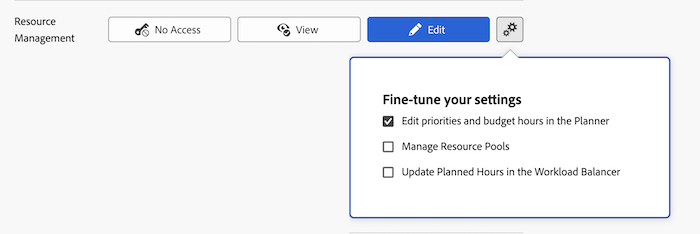

# Gewähren von Zugriff auf das Ressourcen-Management

Als Adobe Workfront-Administrator können Sie eine Zugriffsebene verwenden, um den Zugriff eines Benutzers auf die Ressourcenverwaltung zu definieren, wie in [Übersicht über Zugriffsebenen](../../../administration-and-setup/add-users/access-levels-and-object-permissions/access-levels-overview.md) beschrieben.

## Zugriffsanforderungen

+++ Erweitern, um die Zugriffsanforderungen für die in diesem Artikel beschriebene Funktionalität anzuzeigen.

<table style="table-layout:auto"> 
 <col> 
 <col> 
 <tbody> 
  <tr> 
   <td role="rowheader">Adobe Workfront-Paket</td> 
   <td>Beliebig</td> 
  </tr> 
  <tr> 
   <td role="rowheader">Adobe Workfront-Lizenz</td> 
   <td>
Standard

   
Abo
</td> 
  </tr> 
  <tr> 
   <td role="rowheader">Konfigurationen der Zugriffsebene</td> 
   <td> 
Sie müssen ein Workfront-Administrator sein.
 </td> 
  </tr> 
 </tbody> 
</table>

Weitere Details zu den Informationen in dieser Tabelle finden Sie unter [Zugriffsanforderungen in der Dokumentation zu Workfront](/help/quicksilver/administration-and-setup/add-users/access-levels-and-object-permissions/access-level-requirements-in-documentation.md).

+++

## Konfigurieren des Benutzerzugriffs auf Ressourcen-Management-Tools mithilfe einer benutzerdefinierten Zugriffsebene

1. Erstellen oder bearbeiten Sie die Zugriffsebene, wie unter [Erstellen oder Ändern benutzerdefinierter Zugriffsebenen“ &#x200B;](../../../administration-and-setup/add-users/configure-and-grant-access/create-modify-access-levels.md).
1. Klicken Sie auf das Zahnradsymbol  der Schaltfläche **Anzeigen** oder **Bearbeiten** rechts neben Resource Management und wählen Sie dann die Funktionen aus, die Sie unter **Einstellungen optimieren** gewähren möchten.

   

   <table style="table-layout:auto"> 
    <col> 
    <col> 
    <tbody> 
     <tr> 
      <td role="rowheader">Prioritäten und Budgetstunden im Planer bearbeiten</td> 
      <td> 
Ermöglicht Benutzern mit dieser Lizenz, Folgendes auszuführen:
 
Priorisieren Sie Projekte im Ressourcenplaner.
 
Budgetzuweisung für Ressourcen in den Ressourcenplanungs-Tools (Ressourcenplaner und Ressourcenbudgetierung im Business Case eines Projekts).
 
Standardmäßig ist diese Option aktiviert.
 </td> 
     </tr> 
     <tr> 
      <td role="rowheader">Ressourcenpools verwalten</td> 
      <td> 
Ermöglicht Benutzern mit dieser Lizenz das Erstellen, Bearbeiten und Löschen von Ressourcenpools. Standardmäßig ist diese Option deaktiviert.
 </td> 
     </tr> 
     <tr data-mc-conditions=""> 
      <td role="rowheader">Geplante Stunden im Workload Balancer aktualisieren </td> 
      <td> 
Ermöglicht es Benutzenden mit dieser Lizenz, die geplanten Stunden von Arbeitselementen zu aktualisieren, wenn sie die Benutzerzuweisungen im Workload Balancer aktualisieren. Die Gesamtzahl der zugewiesenen Stunden wird zu den geplanten Stunden der Arbeitselemente.
 
Standardmäßig ist diese Option deaktiviert.
 
 Weitere Informationen finden Sie unter <a href="../../../resource-mgmt/workload-balancer/manage-user-allocations-workload-balancer.md" class="MCXref xref">Verwalten von Benutzerzuweisungen im Workload-Balancer</a>.
 </td> 
     </tr> 
    </tbody> 
   </table>

1. (Optional) Um Zugriffseinstellungen für andere Objekte und Bereiche in der Zugriffsebene, an der Sie arbeiten, zu konfigurieren, fahren Sie mit einem der in [Zugriff auf Adobe Workfront konfigurieren](../../../administration-and-setup/add-users/configure-and-grant-access/configure-access.md) aufgelisteten Artikel fort, z. B. [Zugriff auf Aufgaben gewähren](../../../administration-and-setup/add-users/configure-and-grant-access/grant-access-tasks.md) und [Zugriff auf Finanzdaten gewähren](../../../administration-and-setup/add-users/configure-and-grant-access/grant-access-financial.md).
1. Wenn Sie fertig sind, klicken Sie auf **Speichern**.

   Nachdem die Zugriffsebene erstellt wurde, können Sie sie einem Benutzer zuweisen. Weitere Informationen finden Sie [Bearbeiten des Benutzerprofils](../../../administration-and-setup/add-users/create-and-manage-users/edit-a-users-profile.md).

## Zugriff auf die Ressourcenverwaltung nach Lizenztyp

Informationen dazu, was Benutzer in den einzelnen Zugriffsebenen mit der Ressourcenverwaltung tun können, finden Sie im Abschnitt [Ressourcenverwaltung](../../../administration-and-setup/add-users/access-levels-and-object-permissions/functionality-available-for-each-object-type.md#resource) im Artikel [Für jeden Objekttyp verfügbare Funktionen](../../../administration-and-setup/add-users/access-levels-and-object-permissions/functionality-available-for-each-object-type.md).

## Zugriff auf freigegebene Anfragen

<!--
If you make changes here, make them also in the "Grant access to" articles where this snippet had to be converted to text:
* reports, dashboards, and calendars
* financial data
* issue
-->

Wenn Sie ein Objekt für einen anderen Benutzer freigeben, werden die Rechte des Empfängers, die Ressourcenzuteilung darauf anzuzeigen oder zu budgetieren, durch eine Kombination aus drei Elementen bestimmt:

* Zugriffsebenen-Einstellung des Empfängers für das Ressourcen-Management
* den Zugriff des Benutzers auf Finanzdaten, wie unter [Zugriff auf Finanzdaten gewähren](../../../administration-and-setup/add-users/configure-and-grant-access/grant-access-financial.md)
* Alle Berechtigungen für Finanzdaten, die der Teilhaber für das Objekt gewährt hat

Informationen zu den Berechtigungen, die Benutzer bei der Freigabe eines Objekts für Finanzdaten erteilen können, finden Sie unter [Freigeben von Finanzberechtigungen für ein Objekt](../../../workfront-basics/grant-and-request-access-to-objects/share-financial-permissions-object.md).
