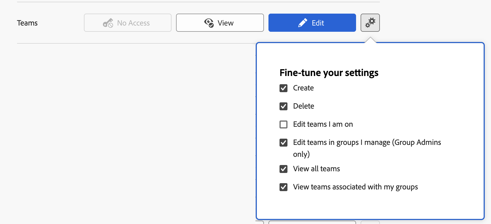

# Zugriff auf Teams gewähren

Als Adobe Workfront-Administrator können Sie eine Zugriffsebene verwenden, um den Zugriff eines Benutzers auf Teams in Workfront zu definieren, wie in [Übersicht über Zugriffsebenen](../../../administration-and-setup/add-users/access-levels-and-object-permissions/access-levels-overview.md) beschrieben.

## Zugriffsanforderungen

+++ Erweitern Sie , um die Zugriffsanforderungen für die -Funktion in diesem Artikel anzuzeigen.

Sie müssen über folgenden Zugriff verfügen, um die Schritte in diesem Artikel ausführen zu können:

<table style="table-layout:auto"> 
 <col> 
 <col> 
 <tbody> 
  <tr> 
   <td role="rowheader">Adobe Workfront-Plan</td> 
   <td>Beliebig</td> 
  </tr> 
  <tr> 
   <td role="rowheader">Adobe Workfront-Lizenz</td> 
   <td>Plan</td> 
  </tr> 
  <tr> 
   <td role="rowheader">Konfigurationen der Zugriffsebene</td> 
   <td> 
Sie müssen ein Workfront-Administrator sein.
 
<b>HINWEIS</b>: Wenn Sie immer noch keinen Zugriff haben, fragen Sie Ihren Workfront-Administrator, ob er zusätzliche Einschränkungen in Ihrer Zugriffsebene festgelegt hat. Informationen dazu, wie Workfront-Admins Ihre Zugriffsebene ändern können, finden Sie unter <a href="../../../administration-and-setup/add-users/configure-and-grant-access/create-modify-access-levels.md" class="MCXref xref" data-mc-variable-override="">Erstellen oder Ändern benutzerdefinierter Zugriffsebenen</a>.
 </td> 
  </tr> 
 </tbody> 
</table>

+++

## Benutzerzugriff konfigurieren, um Benutzer mithilfe einer benutzerdefinierten Zugriffsebene zu bearbeiten

1. Erstellen oder bearbeiten Sie die Zugriffsebene, wie unter [Erstellen oder Ändern benutzerdefinierter Zugriffsebenen“ &#x200B;](../../../administration-and-setup/add-users/configure-and-grant-access/create-modify-access-levels.md).
1. Klicken Sie auf das Zahnradsymbol  der Schaltfläche **Anzeigen** oder **Bearbeiten** rechts von Teams und wählen Sie dann die Funktionen aus, die Sie unter **Einstellungen optimieren** gewähren möchten.

   

   * **Anzeigen**: Wenn Sie konfigurieren, wie Benutzer mit einer beliebigen Lizenz Teams anzeigen können, ändern Sie eine der folgenden Optionen:

     <table style="table-layout:auto">
       <col>
       <col>
       <tbody>
        <tr>
         <td role="rowheader">Meinen Gruppen zugeordnete Teams anzeigen</td>
         <td>
          
<b>Aktiviert</b>: Wenn Benutzer in einem Feld für automatische Textvervollständigung im Team nach Teams suchen, können sie die mit ihren Gruppen verknüpften Teams sehen, unabhängig davon, ob sie Team-Mitglieder sind oder nicht. 

          
<b>Deaktiviert</b>: Wenn Benutzer in einem Feld für automatische Textvervollständigung für Teams nach Teams suchen, können die Benutzer die mit ihren Gruppen verknüpften Teams nur sehen, wenn sie Team-Mitglieder sind

Diese Option ist standardmäßig aktiviert.

          </td>
        </tr>
        <tr>
         <td role="rowheader">Alle Teams anzeigen</td>
         <td>
Wenn diese Option aktiviert ist und Benutzer in einem Feld für automatische Textvervollständigung im Team nach Teams suchen, können die Benutzer ein beliebiges Team anzeigen und auswählen.

Diese Option ist standardmäßig aktiviert. 
</td>
        </tr>
       </tbody>
      </table>

   * **Bearbeiten**: Wenn Sie konfigurieren, wie Benutzer mit Plan- und Arbeitslizenz Teams verwalten können, ändern Sie eine der folgenden Optionen:

     <table style="table-layout:auto">
       <col>
       <col>
       <tbody>
        <tr>
         <td role="rowheader">Erstellen</td>
         <td>
Ermöglicht Benutzenden mit Plan- oder Arbeitslizenz, Teams zu erstellen.

Diese Option ist standardmäßig aktiviert.
</td>
        </tr>
        <tr>
         <td role="rowheader">Löschen</td>
         <td>
 Ermöglicht Benutzenden mit einer Planlizenz, die Teams zu löschen, auf die sie Zugriff haben, um sie zu bearbeiten (für Benutzende mit einer Arbeitslizenz nicht verfügbar).

Diese Option ist standardmäßig aktiviert.
</td>
        </tr>
        <tr>
         <td role="rowheader">Teams in von mir verwalteten Gruppen bearbeiten (nur Gruppenadmins)</td>
         <td>
Ermöglicht Benutzenden von Planlizenzen, die als Gruppenadministratoren festgelegt sind, Teams zu bearbeiten, die mit den von ihnen verwalteten Gruppen verknüpft sind.

Diese Option ist standardmäßig aktiviert.
</td>
        </tr>
        <tr>
         <td role="rowheader">Teams bearbeiten, denen ich angehöre</td>
         <td>
Ermöglicht Benutzenden, eine Plan- oder Arbeitslizenz zu vergeben, um Teams zu bearbeiten, deren Mitglied sie sind.

Diese Option ist standardmäßig deaktiviert.
</td>
        </tr>
        <tr>
         <td role="rowheader">Meinen Gruppen zugeordnete Teams anzeigen</td>
         <td>
         
<b>Aktiviert</b> Wenn Benutzer in einem Feld für automatische Textvervollständigung im Team nach Teams suchen, können sie die mit ihren Gruppen verknüpften Teams sehen, unabhängig davon, ob sie Team-Mitglieder sind oder nicht. 

         
<b>Deaktiviert</b>: Wenn Benutzer in einem Feld für automatische Textvervollständigung für Teams nach Teams suchen, können die Benutzer die mit ihren Gruppen verknüpften Teams nur sehen, wenn sie Team-Mitglieder sind

Diese Option ist standardmäßig aktiviert.

         </td>
        </tr>
        <tr>
         <td role="rowheader">Alle Teams anzeigen</td>
         <td>
Wenn diese Option aktiviert ist und Benutzer in einem Feld für automatische Textvervollständigung im Team nach Teams suchen, können die Benutzer ein beliebiges Team anzeigen und auswählen.

Diese Option ist standardmäßig aktiviert. 
</td>
        </tr>
       </tbody>
      </table>

1. Klicken Sie auf das X, um das **Optimieren der Einstellungen** zu schließen.
1. (Optional) Um Zugriffseinstellungen für andere Objekte und Bereiche in der Zugriffsebene, an der Sie arbeiten, zu konfigurieren, fahren Sie mit einem der in [Zugriff auf Adobe Workfront konfigurieren](../../../administration-and-setup/add-users/configure-and-grant-access/configure-access.md) aufgelisteten Artikel fort, z. B. [Zugriff auf Aufgaben gewähren](../../../administration-and-setup/add-users/configure-and-grant-access/grant-access-tasks.md) und [Zugriff auf Finanzdaten gewähren](../../../administration-and-setup/add-users/configure-and-grant-access/grant-access-financial.md).
1. Wenn Sie fertig sind, klicken Sie auf **Speichern**.

>[!NOTE]
>
>* Folgendes gilt unabhängig von den Einstellungen der Zugriffsebene:
>
>   * Teambesitzer können ihre Teams jederzeit anzeigen und bearbeiten
>   * Benutzer haben immer Zugriff auf die Teams, in denen sie sich befinden
>
>* Die Konfiguration jeder Option, die sowohl für die Ansicht als auch für die Bearbeitung verfügbar ist (z. B. „Teams anzeigen, die meinen Gruppen zugeordnet sind„), wird beibehalten, wenn Sie in einer Zugriffsebene Ansicht anstelle von Bearbeiten oder Bearbeiten anstelle von Ansicht auswählen.
>

## Zugriff auf Teams nach Lizenztyp

Informationen dazu, was Benutzer in den einzelnen Zugriffsebenen mit Problemen tun können, finden Sie im Abschnitt [Teams](../../../administration-and-setup/add-users/access-levels-and-object-permissions/functionality-available-for-each-object-type.md#teams) im Artikel [Funktionalität verfügbar für jeden Objekttyp](../../../administration-and-setup/add-users/access-levels-and-object-permissions/functionality-available-for-each-object-type.md).
