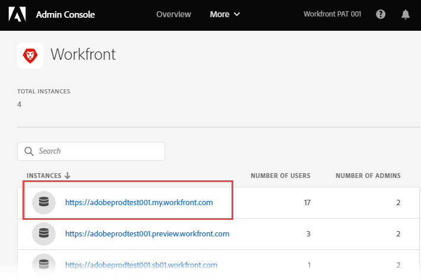

# Verwalten von Benutzenden in der Adobe Admin Console

Die hervorgehobenen Informationen auf dieser Seite beziehen sich auf Funktionen, die noch nicht allgemein verfügbar sind. Sie ist nur in der Vorschau -Umgebung für alle Kunden verfügbar. Nach den monatlichen Releases in der Produktion stehen dieselben Funktionen auch in der Produktionsumgebung für Kunden zur Verfügung, die schnelle Releases aktiviert haben. 

Informationen zu Schnellversionen finden Sie unter [Aktivieren oder Deaktivieren von Schnellversionen für Ihre Organisation](/help/quicksilver/administration-and-setup/set-up-workfront/configure-system-defaults/enable-fast-release-process.md). 

>[!IMPORTANT]
>
>Die Funktion in diesem Artikel ist nur verfügbar, wenn die Workfront-Instanz Ihres Unternehmens in die Adobe Business Platform integriert wurde.
>
>Eine Liste der Verfahren, die sich je nachdem, ob Ihr Unternehmen die Adobe Business Platform verwendet, unterscheiden, finden Sie unter [Plattformbasierte Administrationsunterschiede (Adobe Workfront/Adobe Business Platform)](../../../administration-and-setup/get-started-wf-administration/actions-in-admin-console.md).

Als Adobe-Administrator können Sie Adobe Workfront-Systemadministratoren mithilfe der Adobe Admin Console erstellen. Die -Konsole ist ein zentraler Speicherort für die Verwaltung der Adobe-Berechtigungen in Ihrem gesamten Unternehmen. Weitere Informationen finden Sie unter [Übersicht über Admin Console](https://helpx.adobe.com/de/enterprise/using/admin-console.html).

>[!NOTE]
>
>Es wird empfohlen, Benutzer, die keine Systemadministratoren sind, direkt in Workfront hinzuzufügen. Es ist möglich, Benutzende in der Adobe Admin Console hinzuzufügen. Durch das Hinzufügen in der Workfront können Sie jedoch deren Zugriffsebene beim Erstellen festlegen, was Ihnen Zeit sparen kann.

Wenn Sie über die Admin Console Änderungen an Benutzerprofilen vornehmen, wird die Registerkarte Systemaktivität der Benutzerin bzw. des Benutzers in Workfront aktualisiert. Die Aktualisierung wird wie vom „System“ vorgenommen angezeigt. Dies bezieht sich auf den Adobe Admin Console-Administrator und nicht auf den Workfront-Hauptadministrator.

## Zugriffsanforderungen

+++ Erweitern Sie , um die Zugriffsanforderungen für die -Funktion in diesem Artikel anzuzeigen.

Sie müssen über folgenden Zugriff verfügen, um die Schritte in diesem Artikel ausführen zu können:

<table style="table-layout:auto"> 
 <col> 
 </col> 
 <col> 
 </col> 
 <tbody> 
  <tr> 
   <td role="rowheader">Adobe Workfront-Plan</td> 
   <td>Beliebig</td> 
  </tr> 
  <tr> 
   <td role="rowheader">Adobe-Administratorrechte</td> 
   <td> 
Sie müssen Produktkonfigurations-Administrator von Adobe-Produkten für Ihr Unternehmen sein
 </td> 
  </tr> 
 </tbody> 
</table>

Weitere Informationen zu den Informationen in dieser Tabelle finden Sie unter [Zugriffsanforderungen in der Dokumentation zu Workfront](/help/quicksilver/administration-and-setup/add-users/access-levels-and-object-permissions/access-level-requirements-in-documentation.md).

+++

## Voraussetzungen

Bevor Sie Admin Console für Workfront verwenden, sollten Sie eine E-Mail erhalten, in der Sie zur -Konsole eingeladen werden.

1. Wenn Sie neu bei Adobe sind und eine E-Mail erhalten haben, in der Sie darauf hingewiesen werden, dass Sie jetzt über Administratorrechte für die Verwaltung von Adobe-Software und -Services für Ihr Unternehmen verfügen, klicken Sie auf die Schaltfläche in der E-Mail, um ein Adobe-Konto zu erstellen, und öffnen Sie Admin Console.

   Oder

   Wenn Sie bereits über ein Adobe-Konto verfügen, gehen Sie zur Seite [Adobe Admin Console](https://adminconsole.adobe.com/).

## Weitere Informationen zur Adobe Admin Console

* Workfront-Systemadministratoren können einen Workfront-Benutzer in Workfront deaktivieren. Dies deaktiviert den Benutzer jedoch nicht in der Admin Console.

  <!--
  
For information about deactivating a user in Workfront, see 

  -->

* Der Benutzer **Hauptgruppe** wird anhand des Benutzers bestimmt, der ihn erstellt hat. Dies kann nicht über die Admin Console angepasst werden.
* Die Zugriffsebene des Workfront-Systemadministrators kann nur innerhalb der Adobe Admin Console bearbeitet werden.

  <!--
  DRAFTED IN FLARE:
  How is this done?
  
  -->

* Das Ändern des Benutzerzugriffs vom Systemadministrator auf eine beliebige andere Zugriffsebene muss zuerst über die Admin Console erfolgen.

  <!--
   This is not clear
  -->

* Um den Systemadministratorzugriff für eine Benutzerin oder einen Benutzer in Workfront zu entfernen, müssen Sie die Adobe Admin Console verwenden, um die Benutzerin oder den Benutzer als Produktprofiladministrator zu entfernen. Dadurch wird die Workfront-Zugriffsebene des Benutzers von „Systemadministrator“ in „Anfragender“ geändert.

  >[!IMPORTANT]
  >
  >Nehmen Sie keine Änderungen am Produktprofil selbst vor.

* Adobe Admin Console-Administratoren können automatische Zuweisungsregeln einrichten, um den Prozess der Zuweisung von Adobe-Produkten zu Benutzenden in ihrer Organisation zu automatisieren. Weitere Informationen und Anweisungen finden Sie unter [Verwalten automatischer Zuweisungsregeln](https://helpx.adobe.com/enterprise/using/automatic-assignment-rules.html) in der Dokumentation zu Adobe.

## Zugriff auf den Benutzer- und Administratorbereich Ihrer Produktionsinstanz von Workfront {#access-the-user-and-admin-area-for-your-production-instance-of-workfront}

1. Wählen Sie auf der ](https://adminconsole.adobe.com/) [Adobe Admin Console die Registerkarte **Produkte** in der oberen Navigationsleiste aus und wählen Sie dann **Workfront**.

   <!---->

1. Klicken Sie in der angezeigten Liste oben auf den Link.

   Dies ist die Produktionsinstanz, in der die Benutzer arbeiten.

   <!---->

   >[!TIP]
   >
   >Der zweite Link in der Liste, Ihre Vorschauinstanz, ist eine Testumgebung, die Ihre Live-Produktionsumgebung repliziert. Weitere Informationen finden Sie unter [Die Adobe Workfront-Vorschau-Sandbox-Umgebung](../../../administration-and-setup/set-up-workfront/workfront-testing-environments/wf-preview-sandbox-environment.md).
   >
   >
   >Möglicherweise werden in der Liste auch Links zu Sandbox-Umgebungen angezeigt. Weitere Informationen finden Sie unter [Die Adobe Workfront-Vorschau-Sandbox-Umgebung](../../../administration-and-setup/set-up-workfront/workfront-testing-environments/wf-preview-sandbox-environment.md).

1. Klicken Sie in der angezeigten Liste bei **ausgewählten Registerkarte** Produktprofile“ auf den Namen des Workfront-Produktprofils.

   

   Diese Liste enthält alle Benutzenden, die bereits Ihrer Produktionsinstanz von Workfront zugewiesen sind.

   >[!IMPORTANT]
   >
   >Nehmen Sie keine Änderungen am Produktprofil selbst vor.

1. Fahren Sie mit einem der folgenden Abschnitte in diesem Artikel fort:

   * [Erstellen von Benutzenden in Workfront mit der Adobe Admin Console](#create-users-in-workfront-with-the-adobe-admin-console)
   * [Erstellen von Systemadministratoren in Workfront mit der Adobe Admin Console](#create-system-administrators-in-workfront-with-the-adobe-admin-console)

## Erstellen von Systemadministratoren in Workfront mit der Adobe Admin Console {#create-system-administrators-in-workfront-with-the-adobe-admin-console}

<!--Audited: 12/2023-->

Die Zugriffsebene des Systemadministrators wird nur auf der Adobe Admin Console gewährt. Sie können in Workfront keinen Administratorzugriff gewähren oder entfernen.

Sie müssen einen Benutzer zu Ihrer Produktionsinstanz von Workfront hinzufügen, bevor Sie ihn zum Workfront-Systemadministrator machen können.

1. Gehen Sie zum Bereich für Benutzer und Administratoren in der Admin Console, wie im Abschnitt [Zugriff auf den Bereich für Benutzer und Administratoren für Ihre Produktionsinstanz von Workfront](#access-the-user-and-admin-area-for-your-production-instance-of-workfront) in diesem Artikel beschrieben.
1. Wählen Sie die **Administratoren** oberhalb der Benutzerliste aus.
1. Wählen Sie **Admin hinzufügen** aus.
1. Geben **im Feld „Produktprofil-** hinzufügen“ die E-Mail-Adressen oder Namen der Administratoren ein, die Sie hinzufügen möchten, und klicken Sie dann auf **Speichern**.

   

   Die Systemadministratoren werden in Workfront erstellt.

   >[!IMPORTANT]
   >
   >Nehmen Sie keine Änderungen am Produktprofil selbst vor.

## Erstellen von Benutzenden in Workfront mit der Adobe Admin Console {#create-users-in-workfront-with-the-adobe-admin-console}

>[!NOTE]
>
>Es wird empfohlen, Benutzer, die keine Systemadministratoren sind, direkt in Workfront hinzuzufügen. Es ist möglich, Benutzende in der Adobe Admin Console hinzuzufügen. Durch das Hinzufügen in der Workfront können Sie jedoch deren Zugriffsebene beim Erstellen festlegen, was Ihnen Zeit sparen kann.

* [Erstellen von Benutzenden in Workfront direkt in der Adobe Admin Console](#create-users-in-workfront-directly-in-the-adobe-admin-console)
* [Erstellen Sie Benutzende in Workfront und genehmigen Sie sie für die Adobe Admin Console](#create-users-in-workfront-and-approve-them-for-the-adobe-admin-console)

### Erstellen von Benutzenden in Workfront direkt in der Adobe Admin Console

1. Gehen Sie zum Bereich für Benutzer und Administratoren in der Admin Console, wie im Abschnitt [Zugriff auf den Bereich für Benutzer und Administratoren für Ihre Produktionsinstanz von Workfront](#access-the-user-and-admin-area-for-your-production-instance-of-workfront) in diesem Artikel beschrieben.
1. Wählen Sie bei **ausgewählten** „Benutzer“ über der Liste **Benutzer hinzufügen**.
1. Geben **im Feld „Benutzer zu diesem Produktprofil hinzufügen** die E-Mail-Adresse oder den Namen eines Benutzers ein, den Sie hinzufügen möchten, und klicken Sie dann auf **Speichern**.

   Der Benutzer wird in Workfront mit der Zugriffsebene des Anforderers erstellt.

   >[!IMPORTANT]
   >
   >Nehmen Sie keine Änderungen am Produktprofil selbst vor.

1. Ändern Sie in Workfront die Zugriffsebene der Benutzenden.

   Anweisungen, wie Workfront-Admins die Zugriffsebene von Benutzenden ändern können, finden Sie unter [Bearbeiten des Benutzerprofils](../../../administration-and-setup/add-users/create-and-manage-users/edit-a-users-profile.md).

1. Wiederholen Sie die Schritte 3 und 4, um weitere Benutzer hinzuzufügen.

   >[!NOTE]
   >
   >Für neue Adobe-Benutzende stellt die Admin Console eine E-Mail bereit, in der sie zum Abschluss des Registrierungsprozesses eingeladen werden. Alle Benutzer müssen den Registrierungsprozess abschließen, um auf eine Adobe-Anwendung zugreifen zu können.
   >
   >Bestehende Adobe-Benutzende erhalten möglicherweise eine E-Mail, in der sie darauf hingewiesen werden, dass Workfront verfügbar ist. Dies ist eine Voreinstellung, die vom Adobe-Administrator für das Produkt gesteuert wird. Ihr Adobe-Administrator ist möglicherweise eine andere Person als Ihr Workfront-Administrator.

### Erstellen Sie Benutzende in Workfront und genehmigen Sie sie für die Adobe Admin Console

Dieser Workflow ermöglicht es Gruppenadministratoren, die keinen Zugriff auf die Adobe Admin Console haben, Benutzende zu erstellen.

Zunächst erstellt der Gruppenadministrator die Benutzerin bzw. den Benutzer in Workfront. Dadurch wird der Benutzer im Status Deaktiviert und Ausstehende Genehmigung erstellt.

Anschließend genehmigt ein Workfront-Administrator den Benutzer. Dadurch wird der Benutzer in Workfront aktiviert und zur Adobe Admin Console hinzugefügt.

#### Erstellen des Benutzers in Workfront (Gruppenadministrator)

Anweisungen zum Erstellen eines Benutzers in Workfront finden Sie unter [Benutzer hinzufügen](/help/quicksilver/administration-and-setup/add-users/create-and-manage-users/add-users.md).

#### Genehmigen des Benutzers (Workfront-Administrator)

So validieren Sie einen Benutzer:

{{step-1-to-users}}

1. Wählen Sie den Benutzer aus und klicken Sie dann auf das Symbol **Mehr** (.

1. Um den Benutzer zu genehmigen, klicken Sie auf **Genehmigen** und dann auf **Senden**.

   Oder

   Um den Benutzer abzulehnen und aus Workfront zu löschen, klicken Sie auf **Ablehnen** und dann auf **Senden**.

   Genehmigte Benutzende werden automatisch zur Adobe Admin Console hinzugefügt.

   Abgelehnte Benutzende werden automatisch aus Workfront gelöscht.

<!--

&nbsp;

&nbsp;

&nbsp;

You can create Adobe Workfront users and system administrators with the <a href="https://adminconsole.adobe.com/" alt="Admin Console link">Adobe Admin Console</a>. The console is a central location for managing the Adobe entitlements across your organization. For more information, see the <a href="https://helpx.adobe.com/enterprise/using/admin-console.html" alt="Admin Console Overview">Admin Console Overview</a>.

Before using the Admin Console for Workfront, you should receive a receive an email inviting you to the console. Click in the invitation to accept it and create an account. You can also use an existing account, if already available.

<h2>Create users</h2>

Create users in WF with the Adobe admin console

-->

<!--

May need to add something about oging throug WF -- check with Jonah

To create users in Workfront with the Admin Console:

<ol>
<li value="1"> 
From the <a href="https://adminconsole.adobe.com/">Admin Console page</a>, select the <b>Products</b> tab and then select the <b>Workfront</b> product tile.
 </li>
<li value="2"> 
Select the link to the Workfront instance you want to change.
 </li>
<li value="3"> 
Select the Product profile link. This shows a list of the currently-assigned users. If the list is very long, you can also search for users in the search field above the list.
 </li>
<li value="4"> 
Select the <b>Add User</b> button.
 </li>
<li value="5"> 
In the <b>Add users</b> box, enter the email address or name of the user you want to add. Select <b>Save</b>. The administrator is created in Workfront with <b>Requestor</b> access level.
 </li>
</ol>
<h2>Create system administrators</h2>

To create system administrators:

<ol>
<li value="1"> 
Make product profile assignments first. To be a Workfront System Administrator, the user must be assigned the Workfront product profile and be an admin for that product profile.
 </li>
<li value="2"> 
From the console, select the <b>Products</b> tab and then select the <b>Admins</b> tab. 
 </li>
<li value="3"> 
Select <b>Add Admin</b>.
 </li>
<li value="4"> 
In the <b>Add product profile administrators</b> box, enter the email address or name of the administrator you want to add. Select <b>Save</b>. The user is created in Workfront with <b>Requestor</b> access level.
 </li>
</ol>
<h2>Additional details for the Admin Console</h2>
<ul>
<li> 
System Administrator access level is granted only on the Admin Console. You cannot grant or remove admin access from within Workfront.
 </li>
</ul>
<ul>
<li> 
Creating and deleting users inside Workfront is only possible through the Admin Console.
 </li>
<li> 
Workfront System Administrators can deactivate Workfront users from within Workfront, but this does not deactivate the user in the Admin Console.
 </li>
<li> 
All new users are are assigned <b>Requestor</b> access level upon creation. Also, the user <b>Home Group</b> is determined based on the user who created them. This is currently not customizable from within the Admin Console.
 </li>
<li> 
The Workfront System Administrator access level can only be edited from within the Adobe Admin Console.
 </li>
<li> 
Editing a user who is a system admin to any other access level must be done through the Admin Console first.
 </li>
<li> 
To remove Workfront system admin access, remove users as Product Profile Administrators. This action changes the user access level in Workfront from a system admin to a <b>Requestor</b>.
 </li>
</ul>

-->
