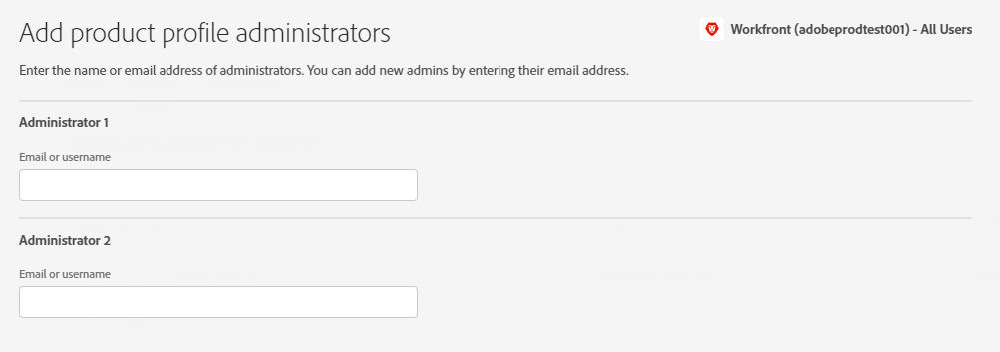

# Verwalten von Benutzenden in der Adobe Admin Console

<!--
The highlighted information on this page refers to functionality not yet generally available. It is available only in the Preview environment for all customers. After the monthly releases to Production, the same features are also available in the Production environment for customers who enabled fast releases.    

For information about fast releases, see [Enable or disable fast releases for your organization](/help/quicksilver/administration-and-setup/set-up-workfront/configure-system-defaults/enable-fast-release-process.md). 
-->

Als Adobe-Admin können Sie Adobe Workfront-Systemadmins in der Adobe Admin Console erstellen. Die Konsole ist ein zentraler Ort für die Verwaltung der Adobe-Berechtigungen in Ihrer gesamten Organisation. Weitere Informationen finden Sie unter [Überblick über die Admin Console](https://helpx.adobe.com/de/enterprise/using/admin-console.html).

>[!NOTE]
>
>* **Workfront-Administratoren müssen in der Adobe Admin Console konfiguriert werden.** Informationen und Anweisungen finden Sie unter [Erstellen von Systemadministratoren in Workfront mit der Adobe Admin Console](#create-system-administrators-in-workfront-with-the-adobe-admin-console) in diesem Artikel.
>* **Wenn Ihr Unternehmen Single Sign-on (SSO) verwendet** empfehlen wir, Benutzer zu erstellen und sie Workfront in Adobe Admin Console zuzuweisen. Das Erstellen dieser Benutzenden in Workfront ist möglich. Abhängig von der Konfiguration der Admin Console Ihres Unternehmens kann es jedoch zu Problemen bei der Übertragung dieser Informationen an die Adobe Admin Console kommen.
>   Nachdem Sie den Benutzer in der Adobe Admin Console erstellt haben, können Sie die Benutzerinformationen in der Workfront konfigurieren, z. B. das Zuweisen von Rollen, Gruppen, Teams und Zugriffsebenen.
>* **Wenn Ihre Organisation kein Single Sign-on (SSO) verwendet** können Sie Benutzende, die keine Systemadmins sind, direkt in Workfront hinzufügen. Es ist möglich, Benutzende in der Adobe Admin Console hinzuzufügen. Durch das Hinzufügen in Workfront können Sie jedoch deren Zugriffsebene beim Erstellen festlegen, was Ihnen Zeit sparen kann.

Wenn Sie von der Admin Console aus Änderungen an Benutzerprofilen vornehmen, wird der Registerkarte „Systemaktivität“ der Benutzerin bzw. des Benutzers in Workfront ein Update hinzugefügt. Das Update wird als vom „System“ durchgeführt angezeigt. Dies bezieht sich auf den bzw. Adobe Admin Console-Admin und nicht auf den bzw. die Hauptadmin von Workfront.

## Zugriffsanforderungen

+++ Erweitern, um die Zugriffsanforderungen für die in diesem Artikel beschriebene Funktionalität anzuzeigen.

<table style="table-layout:auto"> 
 <col> 
 </col> 
 <col> 
 </col> 
 <tbody> 
  <tr> 
   <td role="rowheader">Adobe Workfront-Paket</td> 
   <td>
Beliebig
</td> 
  </tr> 
  <tr> 
   <td role="rowheader">Adobe-Administratorrechte</td> 
   <td> 
Sie müssen Produktprofil-Admin der Adobe-Produkte für Ihre Organisation sein
 </td> 
  </tr> 
 </tbody> 
</table>

Weitere Informationen finden Sie unter [Zugriffsanforderungen in der Dokumentation zu Workfront](/help/quicksilver/administration-and-setup/add-users/access-levels-and-object-permissions/access-level-requirements-in-documentation.md).

+++

## Voraussetzungen

Bevor Sie die Admin Console für Workfront verwenden können, sollten Sie eine E-Mail erhalten, in der Sie zur Konsole eingeladen werden.

1. Wenn Sie neu bei Adobe sind und eine E-Mail erhalten haben, in der Sie darauf hingewiesen werden, dass Sie jetzt über Administratorrechte für die Verwaltung von Adobe-Software und Adobe-Services für Ihre Organisation verfügen, klicken Sie auf die Schaltfläche in der E-Mail, um ein Adobe-Konto zu erstellen, und öffnen Sie die Admin Console.

   Oder

   Wenn Sie bereits über ein Adobe-Konto verfügen, gehen Sie zur Seite [Adobe Admin Console](https://adminconsole.adobe.com/).

## Weitere Informationen zur Adobe Admin Console

* Workfront-Systemadmins können Workfront-Benutzende in Workfront deaktivieren. Damit wird die Person jedoch nicht in der Admin Console deaktiviert.

  <!--
  
For information about deactivating a user in Workfront, see 

  -->

* Der Benutzer **Hauptgruppe** wird anhand der Person bestimmt, die ihn erstellt hat. Dies kann nicht über die Admin Console angepasst werden.
* Die Zugriffsebene des bzw. der Workfront-Systemadmin kann nur innerhalb der Adobe Admin Console bearbeitet werden.

  <!--
  DRAFTED IN FLARE:
  How is this done?
  
  -->

* Das Ändern des Benutzerzugriffs vom Systemadmin zu einer beliebigen anderen Zugriffsebene muss zuerst über die Admin Console erfolgen.

  <!--
   This is not clear
  -->

* Um das Zugriffsrecht „Systemadmin“ für eine Benutzerin oder einen Benutzer in Workfront zu entfernen, müssen Sie die Person als Produktprofil-Admin über die Adobe Admin Console entfernen. Dadurch wird die Workfront-Zugriffsebene des Benutzers bzw. der Benutzerin von „Systemadmin“ in „Anfragende“ geändert.

  >[!IMPORTANT]
  >
  >Nehmen Sie keine Änderungen am Produktprofil selbst vor.

* Admins der Adobe Admin Console können automatische Zuweisungsregeln einrichten, um den Prozess der Zuweisung von Adobe-Produkten zu Benutzenden in ihrer Organisation zu automatisieren. Weitere Informationen und Anweisungen finden Sie unter [Verwalten automatischer Zuweisungsregeln](https://helpx.adobe.com/de/enterprise/using/automatic-assignment-rules.html) in der Adobe-Dokumentation.

  >[!NOTE]
  >
  >Wenn Sie bei der Konfiguration automatischer Zuweisungen eine vertrauenswürdige Organisation auswählen, befindet sich die Organisation im Bereich „Benutzende in ausgewählten Verzeichnissen oder Domains“. Klicken Sie auf den Dropdown-Pfeil neben dem Feld **Verzeichnis auswählen** und wählen Sie die Organisationen aus. Vertrauenswürdige Organisationen sind mit dem Badge „Vertrauenswürdig“ gekennzeichnet.

## Zugriff auf den Benutzer- und Admin-Bereich Ihrer Produktionsinstanz von Workfront {#access-the-user-and-admin-area-for-your-production-instance-of-workfront}

1. Wählen Sie auf der Seite [Adobe Admin Console](https://adminconsole.adobe.com/) in der oberen Navigationsleiste die Registerkarte **Produkte** aus und wählen Sie dann **Workfront** aus.

   <!---->

1. Klicken Sie in der angezeigten Liste oben auf den Link.

   Dies ist die Produktionsinstanz, in der die Benutzenden arbeiten.

   <!---->

   >[!TIP]
   >
   >Der zweite Link in der Liste, Ihre Vorschauinstanz, ist eine Testumgebung, die Ihre Live-Produktionsumgebung repliziert. Weitere Informationen finden Sie unter [Die Adobe Workfront-Sandbox-Umgebung in der Vorschau](../../../administration-and-setup/set-up-workfront/workfront-testing-environments/wf-preview-sandbox-environment.md).
   >
   >
   >Möglicherweise werden in der Liste auch Links zu Sandbox-Umgebungen angezeigt. Weitere Informationen finden Sie unter [Die Adobe Workfront-Sandbox-Umgebung in der Vorschau](../../../administration-and-setup/set-up-workfront/workfront-testing-environments/wf-preview-sandbox-environment.md).

1. Klicken Sie in der angezeigten Liste bei ausgewählter Registerkarte **Produktprofile** auf den Namen des Links zum Workfront-Produktprofil.

   

   Diese Liste enthält alle Benutzenden, die bereits Ihrer Produktionsinstanz von Workfront zugewiesen sind.

   >[!IMPORTANT]
   >
   >Nehmen Sie keine Änderungen am Produktprofil selbst vor.

1. Fahren Sie mit einem der folgenden Abschnitte in diesem Artikel fort:

   * [Erstellen von Benutzenden in Workfront mit der Adobe Admin Console](#create-users-in-workfront-with-the-adobe-admin-console)
   * [Erstellen von Systemadmins in Workfront mit der Adobe Admin Console](#create-system-administrators-in-workfront-with-the-adobe-admin-console)

## Erstellen von Systemadmins in Workfront mit der Adobe Admin Console {#create-system-administrators-in-workfront-with-the-adobe-admin-console}

<!--Audited: 12/2023-->

Die Zugriffsebene „Systemadmin“ wird nur in der Adobe Admin Console gewährt. Sie können in Workfront keinen Admin-Zugriff gewähren oder entfernen.

Sie müssen einen Benutzer bzw. eine Benutzerin zu Ihrer Produktionsinstanz von Workfront hinzufügen, bevor Sie ihn bzw. sie zum Workfront-Systemadmin machen können.

1. Gehen Sie zum Bereich für Benutzende und Admins in der Admin Console, wie im Abschnitt [Zugriff auf den Benutzer- und Admin-Bereich Ihrer Produktionsinstanz von Workfront](#access-the-user-and-admin-area-for-your-production-instance-of-workfront) in diesem Artikel beschrieben.
1. Wählen Sie die Registerkarte **Admins** über der Benutzerliste aus.
1. Wählen Sie **Admin hinzufügen** aus.
1. Geben Sie im Feld **Produktprofil-Administratoren hinzufügen** die E-Mail-Adressen oder die Namen der Admins ein, die Sie hinzufügen möchten, und wählen Sie dann **Speichern** aus.

   

   Die Systemadmins werden in Workfront erstellt.

   >[!IMPORTANT]
   >
   >* Nehmen Sie keine Änderungen am Produktprofil selbst vor.
   >* Stellen Sie sicher, dass Sie sich auf der Seite mit der Kopfzeile „Produktprofil-Administratoren hinzufügen“ befinden. Produktadmins erfüllen in der Adobe Admin Console eine andere Funktion als Produktprofil-Admins und werden in diesem Artikel nicht behandelt.

## Erstellen von Benutzenden in Workfront mit der Adobe Admin Console {#create-users-in-workfront-with-the-adobe-admin-console}

>[!NOTE]
>
>Es wird empfohlen, Benutzende, die keine Systemadmins sind, direkt in Workfront hinzuzufügen. Es ist möglich, Benutzende in der Adobe Admin Console hinzuzufügen. Durch das Hinzufügen in Workfront können Sie jedoch deren Zugriffsebene beim Erstellen festlegen, was Ihnen Zeit sparen kann.

* [Erstellen von Benutzenden in Workfront direkt in der Adobe Admin Console](#create-users-in-workfront-directly-in-the-adobe-admin-console)
* [Erstellen von Benutzenden in Workfront und Genehmigen der Benutzenden für die Adobe Admin Console](#create-users-in-workfront-and-approve-them-for-the-adobe-admin-console)

### Erstellen von Benutzenden in Workfront direkt in der Adobe Admin Console

1. Gehen Sie zum Bereich für Benutzende und Admins in der Admin Console, wie im Abschnitt [Zugriff auf den Benutzer- und Admin-Bereich Ihrer Produktionsinstanz von Workfront](#access-the-user-and-admin-area-for-your-production-instance-of-workfront) in diesem Artikel beschrieben.
1. Wählen Sie bei ausgewählter Registerkarte **Benutzende** über die Liste die Option **Benutzerin oder Benutzer hinzufügen** aus.
1. Geben Sie im Feld **Benutzer zu diesem Produktprofil hinzufügen** die E-Mail-Adresse oder den Namen einer Person ein, die Sie hinzufügen möchten, und klicken Sie dann auf **Speichern**.

   Die Person wird in Workfront mit der Zugriffsebene „Anfragende“ oder „Mitwirkende“ erstellt, je nach Workfront-Paket Ihres Unternehmens.

   >[!IMPORTANT]
   >
   >Nehmen Sie keine Änderungen am Produktprofil selbst vor.

1. Ändern Sie in Workfront die Zugriffsebene der Benutzenden.

   Anweisungen, wie Workfront-Admins die Zugriffsebene von Benutzenden ändern können, finden Sie unter [Bearbeiten eines Benutzerprofils](../../../administration-and-setup/add-users/create-and-manage-users/edit-a-users-profile.md).

1. Wiederholen Sie die Schritte 3 und 4, um weitere Benutzende hinzuzufügen.

   >[!NOTE]
   >
   >Die Admin Console sendet eine E-Mail an neue Adobe-Benutzende, in der sie aufgefordert werden, den Registrierungsvorgang abzuschließen. Alle Benutzenden müssen den Registrierungsvorgang abschließen, um auf eine Adobe-Anwendung zugreifen zu können.
   >
   >Bestehende Adobe-Benutzende erhalten möglicherweise eine E-Mail, in der sie darauf hingewiesen werden, dass Workfront verfügbar ist. Dies ist eine Voreinstellung, die von dem oder der Adobe-Admin für das Produkt gesteuert wird. Der oder die Adobe-Admin ist möglicherweise eine andere Person als der oder die Workfront-Admin.

### Erstellen von Benutzenden in Workfront und Genehmigen der Benutzenden für die Adobe Admin Console

Dieser Workflow ermöglicht es Gruppenadmins, die keinen Zugriff auf die Adobe Admin Console haben, Benutzende zu erstellen.

Zunächst erstellt der bzw. die Gruppenadmin die Person in Workfront. Dadurch wird die Person im Status „Deaktiviert“ und „Ausstehende Genehmigung“ erstellt.

Anschließend genehmigt ein bzw. eine Workfront-Admin die Person. Dadurch wird die Person in Workfront aktiviert und zur Adobe Admin Console hinzugefügt.

#### Erstellen des Benutzers bzw. der Benutzerin in Workfront (Gruppenadmin)

Anweisungen zum Erstellen von Benutzenden in Workfront finden Sie unter [Hinzufügen von Benutzenden](/help/quicksilver/administration-and-setup/add-users/create-and-manage-users/add-users.md).

#### Genehmigen des Benutzers bzw. der Benutzerin (Workfront-Admin)

So genehmigen Sie einen Benutzer bzw. eine Benutzerin:

{{step-1-to-users}}

1. Wählen Sie die Person aus und klicken Sie dann auf das Symbol **Mehr** ().

1. Um die Person zu genehmigen, klicken Sie auf **Genehmigen** und dann auf **Senden**.

   Oder

   Um die Person abzulehnen und aus Workfront zu löschen, klicken Sie auf **Ablehnen** und dann auf **Senden**.

   Genehmigte Benutzende werden automatisch zur Adobe Admin Console hinzugefügt.

   Abgelehnte Benutzende werden automatisch aus Workfront gelöscht.

## Bearbeiten von vorhandenen Benutzenden in der Adobe Admin Console

Sie können die folgenden Benutzerdetails in der Adobe Admin Console bearbeiten:

* Benutzergruppen und Produkte, die mit dem Benutzer bzw. der Benutzerin verknüpft sind
* Administratorrechte
* Land

Informationen zum Bearbeiten einer einzelnen Person in der Adobe Admin Console finden Sie unter [Bearbeiten von Benutzerdetails](https://helpx.adobe.com/de/enterprise/using/manage-users-individually.html#edit-user-details) im Artikel „Verwalten von einzelnen Benutzenden“ in der Adobe-Dokumentation.

Informationen zur Massenbearbeitung von Benutzerinnen und Benutzern in der Adobe Admin Console finden Sie unter
[Bearbeiten von Benutzerdetails](https://helpx.adobe.com/de/enterprise/using/bulk-upload-users.html#edit-user-details) im Artikel Verwalten mehrerer Benutzer in der Dokumentation zu Adobe .

## Löschen von Benutzern

>[!NOTE]
>
>* Wenn sich ein(e) Benutzende(r) in einer oder mehreren Admin Console-Benutzergruppen befindet und das Produktprofil zu einer oder mehreren dieser Benutzergruppen hinzugefügt wurde, werden diese Benutzenden nicht tatsächlich aus dem Produkt entfernt, wenn Sie sie aus Workfront deaktivieren. Der/die Benutzende muss/müssen aus den Benutzergruppen in Admin Console entfernt werden.
>* Wenn Sie einen Benutzer aus der Adobe Admin Console löschen, wird der Benutzer in Workfront deaktiviert, aber nicht aus Workfront gelöscht.

Anweisungen zum Löschen von Benutzern in der Adobe Admin Console finden Sie unter [Verwalten von Verzeichnisbenutzern](https://helpx.adobe.com/de/enterprise/using/manage-directory-users.html) in der Adobe-Dokumentation.

<!--

&nbsp;

&nbsp;

&nbsp;

You can create Adobe Workfront users and system administrators with the <a href="https://adminconsole.adobe.com/" alt="Admin Console link">Adobe Admin Console</a>. The console is a central location for managing the Adobe entitlements across your organization. For more information, see the <a href="https://helpx.adobe.com/de/enterprise/using/admin-console.html" alt="Admin Console Overview">Admin Console Overview</a>.

Before using the Admin Console for Workfront, you should receive a receive an email inviting you to the console. Click in the invitation to accept it and create an account. You can also use an existing account, if already available.

<h2>Create users</h2>

Create users in WF with the Adobe admin console

-->

<!--

May need to add something about oging throug WF -- check with Jonah

To create users in Workfront with the Admin Console:

<ol>
<li value="1"> 
From the <a href="https://adminconsole.adobe.com/">Admin Console page</a>, select the <b>Products</b> tab and then select the <b>Workfront</b> product tile.
 </li>
<li value="2"> 
Select the link to the Workfront instance you want to change.
 </li>
<li value="3"> 
Select the Product profile link. This shows a list of the currently-assigned users. If the list is very long, you can also search for users in the search field above the list.
 </li>
<li value="4"> 
Select the <b>Add User</b> button.
 </li>
<li value="5"> 
In the <b>Add users</b> box, enter the email address or name of the user you want to add. Select <b>Save</b>. The administrator is created in Workfront with <b>Requestor</b> access level.
 </li>
</ol>
<h2>Create system administrators</h2>

To create system administrators:

<ol>
<li value="1"> 
Make product profile assignments first. To be a Workfront System Administrator, the user must be assigned the Workfront product profile and be an admin for that product profile.
 </li>
<li value="2"> 
From the console, select the <b>Products</b> tab and then select the <b>Admins</b> tab. 
 </li>
<li value="3"> 
Select <b>Add Admin</b>.
 </li>
<li value="4"> 
In the <b>Add product profile administrators</b> box, enter the email address or name of the administrator you want to add. Select <b>Save</b>. The user is created in Workfront with <b>Requestor</b> access level.
 </li>
</ol>
<h2>Additional details for the Admin Console</h2>
<ul>
<li> 
System Administrator access level is granted only on the Admin Console. You cannot grant or remove admin access from within Workfront.
 </li>
</ul>
<ul>
<li> 
Creating and deleting users inside Workfront is only possible through the Admin Console.
 </li>
<li> 
Workfront System Administrators can deactivate Workfront users from within Workfront, but this does not deactivate the user in the Admin Console.
 </li>
<li> 
All new users are are assigned <b>Requestor</b> access level upon creation. Also, the user <b>Home Group</b> is determined based on the user who created them. This is currently not customizable from within the Admin Console.
 </li>
<li> 
The Workfront System Administrator access level can only be edited from within the Adobe Admin Console.
 </li>
<li> 
Editing a user who is a system admin to any other access level must be done through the Admin Console first.
 </li>
<li> 
To remove Workfront system admin access, remove users as Product Profile Administrators. This action changes the user access level in Workfront from a system admin to a <b>Requestor</b>.
 </li>
</ul>

-->
