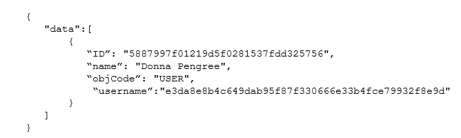
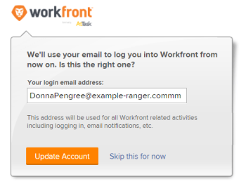

# Ändern des Passworts für automatisch bereitgestellte Benutzende

Wenn Sie Benutzende durch automatische Bereitstellung erstellen, weist Adobe Workfront ihnen eine GUID (Globally Unique Identifier) für einen Benutzernamen zu. Eine GUID ist eine eindeutige Zeichenfolge aus zufälligen Zahlen und Buchstaben, z. B. *5489cb430012526e1ea635e8c29f377f*.

Wenn ein(e) neue(r) Benutzende(r) versucht, sein/ihr temporäres Kennwort zu ändern, gibt er/sie häufig seine/ihre E-Mail-Adresse als Benutzernamen ein und erhält eine Fehlermeldung wegen eines falschen Benutzernamens. Damit der Benutzer sein Kennwort ändern kann, muss er seinen vom System zugewiesenen Benutzernamen eingeben, bei dem es sich um eine GUID handelt.

Da GUID-Benutzernamen schwierig zu verwenden sein können, empfehlen wir, den Benutzernamen zunächst in die Workfront-E-Mail-Adresse zu ändern und dann zuzulassen, dass das Kennwort geändert wird.

>[!TIP]
>
>Sie können die GUID eines Benutzers wie folgt finden:
>
>* Wechseln Sie zum Profil des Benutzers und kopieren Sie die GUID aus der URL in Ihrem Browser.
>
>  Im URL-`https://acme.workfront.com/user/61941ab1000af22d7104628efa1c738b/details` würden Sie beispielsweise die Zeichenfolge aus Zahlen und Buchstaben zwischen den letzten beiden Schrägstrichen kopieren: `61941ab1000af22d7104628efa1c738b`.
>
>  Weitere Informationen finden Sie [Bearbeiten des Benutzerprofils](../../../administration-and-setup/add-users/create-and-manage-users/edit-a-users-profile.md).
>
>* Erstellen Sie einen Benutzerbericht mit einer Spalte „Benutzer > GUID“. Weitere Informationen finden Sie unter [Erstellen eines Berichts](../../../reports-and-dashboards/reports/creating-and-managing-reports/create-report.md).
>
>* Abfragen der Workfront-API.
>

## Zugriffsanforderungen

+++ Erweitern, um die Zugriffsanforderungen für die in diesem Artikel beschriebene Funktionalität anzuzeigen.

<table style="table-layout:auto"> 
 <col> 
 <col> 
 <tbody> 
  <tr> 
   <td>Adobe Workfront-Paket</td> 
   <td><p>Beliebig</p></td> 
  </tr> 
  <tr> 
   <td>Adobe Workfront-Lizenz</td> 
   <td><p>Standard</p>
       <p>Abo</p></td>
  </tr> 
  <tr> 
   <td>Konfigurationen der Zugriffsebene</td> 
   <td>Systemadmin</td> 
  </tr> 
 </tbody> 
</table>

Weitere Informationen finden Sie unter [Zugriffsanforderungen in der Dokumentation zu Workfront](/help/quicksilver/administration-and-setup/add-users/access-levels-and-object-permissions/access-level-requirements-in-documentation.md).

+++

## Ändern des Passworts für automatisch bereitgestellte Benutzende

1. Ermitteln Sie den GUID-Benutzernamen eines Benutzers, indem Sie eine API-Anfrage übergeben, wie im folgenden Beispiel gezeigt:

   https://`<domain>`.my.workfront.com/attask/api/v14.0/USER/search?fields=username&ID=`<ID of User>` Wobei *`<domain>`* die Domain Ihres Unternehmens und *`<ID of User>`* die Workfront-ID des Benutzers ist.

   Sie erhalten eine Antwort ähnlich der folgenden:

   

   Die Rückgabe für „username“ ist die GUID des Benutzers.

1. Ändern Sie mithilfe der GUID des Benutzers als Benutzernamen das Kennwort des Benutzers.

   Weitere Informationen zum Ändern des Kennworts finden Sie unter [Kennwort zurücksetzen](../../../workfront-basics/manage-your-account-and-profile/managing-your-workfront-account/reset-your-password.md).

   Wenn Ihr Unternehmen ein SSO-System verwendet, kann nur ein Workfront-Systemadministrator das Kennwort eines Benutzers ändern. Weitere Informationen finden Sie unter [Übersicht über Single Sign-on in Adobe Workfront](../../../administration-and-setup/add-users/single-sign-on/sso-in-workfront.md)

1. Nachdem der Benutzer bei Workfront angemeldet ist, navigieren Sie zu:

```
   https://<your domain>.my.workfront.com/login/convertUsername
```

1. Überprüfen Sie **Feld „Ihre**-Adresse“, ob die E-Mail-Adresse des Benutzers korrekt ist, und klicken Sie dann auf **Konto aktualisieren**.

   

   Der Benutzername des Benutzers wird in seine Workfront-E-Mail-Adresse geändert.

>[!TIP]
>
>So suchen Sie die ID eines Benutzers:
>
>1. Klicken Sie auf **Hauptmenü**-Symbol  in der rechten oberen Ecke von Adobe Workfront und dann auf **Benutzer** .
>
>1. Wählen Sie den Benutzer aus.
>
>   Die Profilseite des Benutzers wird geöffnet und seine Benutzer-ID wird in der URL angezeigt.
>
