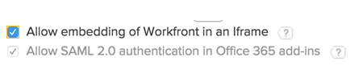

# Aktivieren von Outlook für die Verwendung mit Workfront und SAML 2.0

>[!IMPORTANT]
>
>[Microsoft deaktiviert die Unterstützung für veraltete Exchange Online-Token](https://learn.microsoft.com/en-us/office/dev/add-ins/outlook/faq-nested-app-auth-outlook-legacy-tokens), die derzeit vom Workfront Outlook-Add-in zur Authentifizierung verwendet werden. Diese Änderung durch Microsoft hat bereits Auswirkungen auf Kunden und wird bis Oktober 2025 schrittweise eingeführt.
>
>* **Nachdem Microsoft diese Token vollständig deaktiviert hat, funktioniert die Integration von Workfront für Microsoft Outlook nicht mehr.**
>
>Im Rahmen dieser Änderung hat Microsoft die Entscheidung getroffen, die Art und Weise zu ändern, wie Token wieder aktiviert werden. Nach dem **30. Juni** können Administratoren Token nicht mehr selbst erneut aktivieren - nur der Microsoft-Support kann Ausnahmen gewähren. **Am 1. Oktober 2025 werden alte Token für alle Mandanten deaktiviert. Ausnahmen werden nicht gewährt.**

<!--DELETE ME MARCH 2026-->

Wenn Sie die SAML 2.0-Authentifizierung aktivieren und möchten, dass sich Ihre Benutzerinnen und Benutzer von Microsoft Outlook aus mit ihren SAML 2.0-Anmeldeinformationen bei Workfront anmelden können, müssen Sie SAML 2.0 aktivieren, um sich in Office-Add-Ins zu authentifizieren.

>[!NOTE]
>
>Dies ist nicht verfügbar, wenn die Workfront-Instanz Ihres Unternehmens ein benutzerdefiniertes SSO-Portal verwendet.
>>Wenden Sie sich an Ihren Netzwerk- oder IT-Administrator, wenn Sie weitere Informationen benötigen.
<!--
or is enabled with Adobe IMS-->

## Zugriffsanforderungen

+++ Erweitern Sie , um die Zugriffsanforderungen für die -Funktion in diesem Artikel anzuzeigen.

Sie müssen über folgenden Zugriff verfügen, um die Schritte in diesem Artikel ausführen zu können:

<table style="table-layout:auto"> 
 <col> 
 <col> 
 <tbody> 
  <tr> 
   <td role="rowheader">Adobe Workfront-Plan</td> 
   <td>Beliebig</td> 
  </tr> 
  <tr> 
   <td role="rowheader">Adobe Workfront-Lizenz</td> 
   <td>Plan</td> 
  </tr> 
  <tr> 
   <td role="rowheader">Konfigurationen der Zugriffsebene</td> 
   <td> 
Sie müssen ein Workfront-Administrator sein.
 
<b>HINWEIS</b>: Wenn Sie immer noch keinen Zugriff haben, fragen Sie Ihren Workfront-Administrator, ob er zusätzliche Einschränkungen in Ihrer Zugriffsebene festgelegt hat. Informationen dazu, wie Workfront-Admins Ihre Zugriffsebene ändern können, finden Sie unter <a href="../../../administration-and-setup/add-users/configure-and-grant-access/create-modify-access-levels.md" class="MCXref xref">Erstellen oder Ändern benutzerdefinierter Zugriffsebenen</a>.
 </td> 
  </tr> 
 </tbody> 
</table>

+++

## Aktivieren von Outlook für die Verwendung mit Workfront und SAML 2.0

{{step-1-to-setup}}

1. Klicken Sie auf **System** > **Voreinstellungen**.

1. Stellen Sie im Abschnitt **Sicherheit** sicher, dass **SAML 2.0-Authentifizierung in Office 365-Add-Ins zulassen** aktiviert ist.

   Diese Option ermöglicht das Einbetten von Workfront in einen Iframe nur für Office 365-Add-Ins. Dadurch wird kein Clickjacking-Verstoß geöffnet, da kein klickbarer Inhalt beteiligt ist.

   Standardmäßig ist diese Option aktiviert.

   >[!NOTE]
   >
   >Wenn Sie die Option **Einbetten von Workfront in einen iframe zulassen** aktivieren, ist die Option **SAML 2.0-Authentifizierung in Office 365-Add-Ins** und aktiviert.
   >
   >
   >

1. Klicken Sie auf **Speichern**.

   Die hier gespeicherten Änderungen wirken sich auf das Erlebnis aller Benutzenden in Workfront aus.
