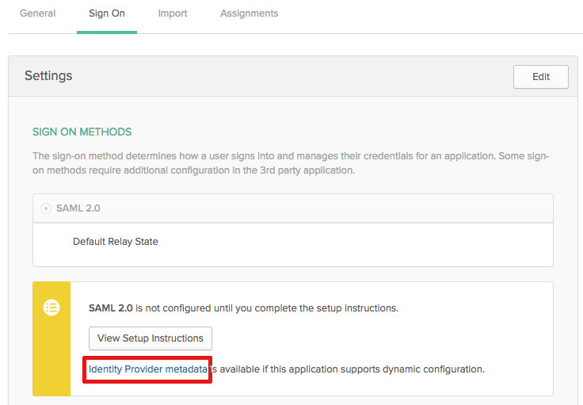

# SAML 2.0-Metadaten in Ihrem IDP bei Verwendung der erweiterten Authentifizierung aktualisieren

<!-- enhanced authentication is no longer available for workfront customers -->

{{important-admin-console-onboard}}

Als Adobe Workfront-Administrator können Sie Workfront Single Sign-On (SSO) mit jedem Identitäts-Provider integrieren, der das SAML 2.0-Protokoll (Security Assertion Markup Language) unterstützt.

In den folgenden Abschnitten wird der Integrationsprozess beschrieben, wenn Ihr Workfront-Konto auf die erweiterte Authentifizierungsfunktion aktualisiert wurde (noch nicht für alle Organisationen verfügbar). Weitere Informationen zur erweiterten Authentifizierung finden Sie unter [Verbesserte Authentifizierung - Übersicht](../../../administration-and-setup/manage-workfront/security/get-started-enhanced-authentication.md).

Informationen zum Konfigurieren von SAML vor der Migration zum erweiterten Authentifizierungs-Erlebnis finden Sie unter [SAML 2.0-Metadaten in Ihrem Identitäts-Provider aktualisieren](../../../administration-and-setup/add-users/single-sign-on/update-saml-2-metadata-ip.md).

## Zugriffsanforderungen

Sie müssen über folgenden Zugriff verfügen, um die Schritte in diesem Artikel ausführen zu können:

<table style="table-layout:auto"> 
 <col> 
 <col> 
 <tbody> 
  <tr> 
   <td role="rowheader">Adobe Workfront-Abo</td> 
   <td>Beliebig</td> 
  </tr> 
  <tr> 
   <td role="rowheader">Adobe Workfront-Lizenz</td> 
   <td>Plan</td> 
  </tr> 
  <tr> 
   <td role="rowheader">Konfigurationen auf Zugriffsebene</td> 
   <td> 
Sie müssen Workfront-Administrator sein.
 
<b>NOTE</b>: Wenn Sie immer noch keinen Zugriff haben, fragen Sie Ihren Workfront-Administrator, ob er zusätzliche Zugriffsbeschränkungen für Ihre Zugriffsebene festlegt. Informationen dazu, wie ein Workfront-Administrator Ihre Zugriffsebene ändern kann, finden Sie unter <a href="../../../administration-and-setup/add-users/configure-and-grant-access/create-modify-access-levels.md" class="MCXref xref">Benutzerdefinierte Zugriffsebenen erstellen oder ändern</a>.
 </td> 
  </tr> 
 </tbody> 
</table>

## Verwenden Sie Okta als Identitätsanbieter

Okta ist ein Beispiel für einen Identitäts-Provider, der SAML 2.0 unterstützt. In diesem Abschnitt wird die Verwendung von Okta als Identitäts-Provider beschrieben. Ähnliche Schritte wären beim Konfigurieren eines anderen Identitäts-Providers erforderlich, der SAML 2.0 unterstützt.

>[!NOTE]
>
>Benutzer werden anhand ihrer E-Mail-Adresse zugeordnet. Damit Sie sich mit Okta bei Workfront anmelden können, müssen Sie über einen Benutzer verfügen, der dieselbe E-Mail-Adresse (nicht zwischen Groß- und Kleinschreibung) hat, die in Ihrem Workfront-Kunden erstellt wurde.

Füllen Sie die folgenden Abschnitte aus, um Okta als Ihren Identitätsanbieter in Workfront zu konfigurieren.

* [Erstellen einer Workfront-App in Okta](#create-a-workfront-app-in-okta)
* [Hinzufügen Ihrer Okta-Instanz als Identitätsanbieter in Workfront](#add-your-okta-instance-as-an-identity-provider-in-workfront)

### Erstellen einer Workfront-App in Okta {#create-a-workfront-app-in-okta}

1. Melden Sie sich bei Ihrer Okta-Umgebung an.
1. Stellen Sie sicher, dass **Klassische Benutzeroberfläche** wird in der oberen linken Ecke der Okta-Oberfläche ausgewählt.
1. Klicken Sie im Menü auf **Anwendungen** > **Anwendungen**.

1. Klicken **Anwendung hinzufügen** Klicken Sie auf **Neue App erstellen**.

1. Im **Erstellen eines neuen Dialogfelds für die Anwendungsintegration** auswählen **SAML 2.0** Klicken Sie auf **Erstellen**.

1. Geben Sie einen Namen für Ihre Workfront-App an und klicken Sie auf **Nächste**.
1. Suchen Sie auf der angezeigten Seite &quot;SAML-Einstellungen&quot;die für die Seite &quot;SAML-Einstellungen&quot;erforderlichen Informationen:

   1. Öffnen Sie, ohne die Browser-Registerkarte zu verlassen, auf der die Okta-Benutzeroberfläche angezeigt wird, eine separate Browser-Registerkarte oder ein separates Fenster.
   1. Geben Sie die folgende URL im Browser an:

      `https://[your_customer_subdomain].my.workfront.com/auth/saml2/metadata`

   1. Identifizieren Sie in der resultierenden XML-Datei die Werte für **entityID** und **Standort**.

      

   1. Kopieren Sie den Wert aus der **entityID** in die Zwischenablage Ihres Systems. Schließen Sie diese Browser-Registerkarte nicht.

1. Gehen Sie zurück zur Seite &quot;SAML-Einstellungen&quot;, die Sie in Schritt 6 geöffnet haben.
1. Fügen Sie den Wert aus dem **entityID** in das Feld **Zielgruppen-URI (SP Entity ID)** -Feld.

1. Kopieren Sie in der XML-Datei auf der anderen Browser-Registerkarte den Wert aus der **Standort** -Feld.
1. Fügen Sie den Wert aus dem **Standort** in das Feld **Single Sign-on** **URL** -Feld.

1. Scrollen Sie zum **Attributanweisungen (optional)** Abschnitt.
1. Im **Name** Feld, geben Sie **email**.

1. Im **Wert** Feld, geben Sie **user.email**.

1. (Optional) Fügen Sie erweiterte Werte hinzu.
1. Klicken **Nächste**.
1. Select, **Ich bin Okta-Kunde und füge eine interne App hinzu** Klicken Sie auf **Beenden**.

### Hinzufügen Ihrer Okta-Instanz als Identitätsanbieter in Workfront {#add-your-okta-instance-as-an-identity-provider-in-workfront}

Dieses Verfahren liefert wichtige Informationen für die Konfiguration von Okta als Identitätsanbieter in Workfront. Weitere Informationen zu anderen Zuordnungsoptionen oder Konfigurationsoptionen finden Sie unter [Konfigurieren von Adobe Workfront mit SAML 2.0](../../../administration-and-setup/add-users/single-sign-on/configure-workfront-saml-2.md).

1. Laden Sie die Metadaten des Identitätsanbieters für Ihre Okta-Instanz herunter:

   1. Melden Sie sich bei Ihrer Okta-Umgebung an.
   1. Stellen Sie sicher, dass **Klassische Benutzeroberfläche** wird in der oberen linken Ecke der Okta-Oberfläche ausgewählt.
   1. Klicken Sie im Menü auf **Anwendungen** > **Anwendungen**.

   1. Klicken Sie auf die von Ihnen erstellte Workfront-App, wie im Abschnitt beschrieben. [Erstellen einer Workfront-App in Okta](#create-a-workfront-app-in-okta)
   1. Im **Anmelden** Registerkarte, klicken Sie auf **Identity Provider-Metadaten**.

      

      Die Metadaten werden in einer neuen Browser-Registerkarte als XML geöffnet.

   1. Kopieren Sie die URL, die im Feld der Browser-URL angezeigt wird.

1. Melden Sie sich bei Workfront als Workfront-Administrator an.
1. Klicken Sie auf **Hauptmenü** icon  Klicken Sie oben rechts in Adobe Workfront auf **Einrichtung** .

1. Klicken Sie im linken Bereich auf **System** > **Single Sign-On (SSO)**.

1. (Bedingt) Wenn zwei Registerkarten angezeigt werden, klicken Sie auf die **Neue SSO-Anbieter** Registerkarte.

   

   >[!IMPORTANT]
   >
   >Löschen Sie Ihre vorhandenen SSO-Konfigurationseinstellungen nicht im **Aktueller SSO-Anbieter** -Registerkarte, bis Ihr Konto auf die erweiterte Authentifizierungserfahrung aktualisiert wurde und die neue SSO-Konfiguration vollständig funktioniert.

1. Klicken **Neuer SSO-Anbieter**.
1. Geben Sie einen Namen an, z. B. Okta-IDP, und geben Sie dann eine Beschreibung an.
1. Im **Füllen von Feldern aus Identity Provider-Metadaten** Fügen Sie die URL, die Sie in Schritt 1 kopiert haben, in die **Metadaten-URL** -Feld.\
   Alternativ können Sie auf **Datei auswählen** , um eine XML-Datei hochzuladen. Es wird jedoch empfohlen, die URL einzufügen.

1. Im **Benutzerattribute zuordnen** im Abschnitt **Verzeichnisattribut** Feld, Typ **email**. (**Email-Adresse** bereits in der **Workfront-Benutzerattribut** -Feld.)

1. (Optional) Aktivieren Sie **Standard-SSO-Anbieter** , um nicht authentifizierte Benutzer zum Anmeldebildschirm des Identitätsanbieters zu senden, anstatt zum Workfront-Anmeldebildschirm für die Authentifizierung zu wechseln. Es wird empfohlen, diese Option nur zu aktivieren, wenn alle Benutzer in Ihrem System über den Identitäts-Provider auf Workfront zugreifen.
1. Wählen Sie die **Aktivieren** aktivieren. Stellen Sie zunächst sicher, dass Benutzer in Ihrem System über die neue Anmeldeerfahrung informiert sind, um sicherzustellen, dass sie den Zugriff auf das Workfront-System nicht verlieren.
1. Klicken **Verbindung testen**.\
   Es sollte eine Meldung angezeigt werden, die Sie darüber informiert, dass die Verbindung erfolgreich hergestellt wurde.

1. Klicken Sie auf **Speichern**.

## Andere Identitätsanbieter verwenden

Bei Verwendung anderer Identitätsanbieter als Okta (z. B. Ping oder Centrify) müssen Sie die Workfront-Metadaten erneut in Ihren Identitätsanbieter hochladen.
