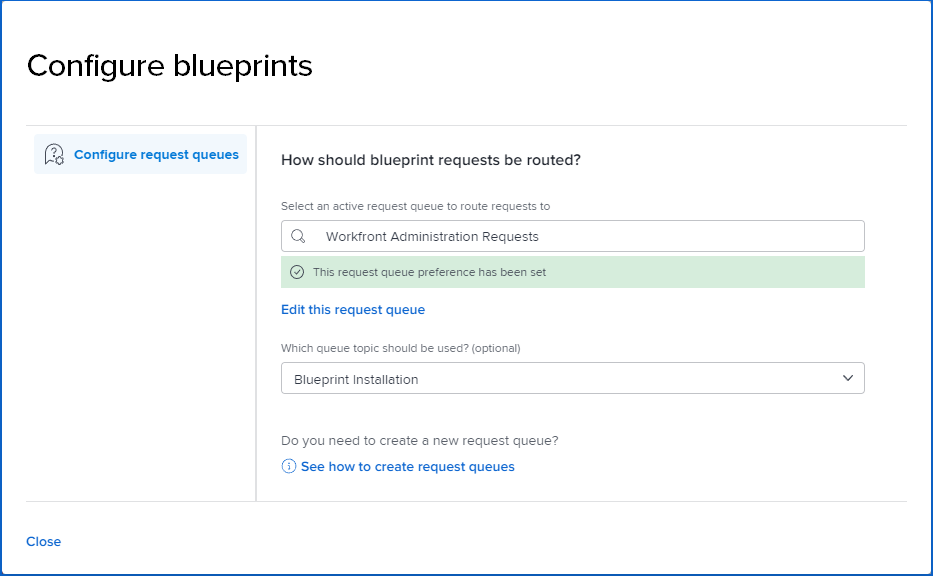

# Konfigurieren des Zugriffs auf Blueprints

Alle [!DNL Adobe Workfront] können den Blueprint-Katalog durchsuchen.

Als Systemadministrator haben Sie folgende Möglichkeiten:

* Fügen Sie [!UICONTROL Blueprints] zum Hauptmenü in Layout-Vorlagen hinzu und weisen Sie die Layout-Vorlage Benutzern oder Gruppen zu. Weitere Informationen finden Sie unter [Anpassen des [!UICONTROL Hauptmenüs] Verwenden einer Layout-](/help/quicksilver/administration-and-setup/customize-workfront/use-layout-templates/customize-main-menu.md) und [Zuweisen von Benutzern zu einer Layout-Vorlage](/help/quicksilver/administration-and-setup/customize-workfront/use-layout-templates/assign-users-to-layout-template.md).

  >[!NOTE]
  >
  >* Benutzern, denen keine Layoutvorlage zugewiesen ist, wird das [!UICONTROL Blueprints] im [!UICONTROL Hauptmenü] angezeigt.
  >* Wenn Sie eine neue Layout-Vorlage erstellen[!UICONTROL &#x200B; wird das Symbol &#x200B;]Blueprints“ standardmäßig in die Liste [!UICONTROL Aktive Elemente] für das [!UICONTROL Hauptmenü] aufgenommen.

* Aktivieren Sie den Zugriff für Benutzer, um die Installation von Blueprints anzufordern, indem Sie eine Anfrage-Warteschlange zum Speichern der Anfragen einrichten. Dort haben Sie einen einzigen Ort, um Anfragen zu verfolgen und zu aktualisieren. Weitere Informationen finden Sie im folgenden Verfahren.
* Blueprints installieren. Weitere Informationen finden Sie unter [Blueprint installieren](../../administration-and-setup/blueprints/blueprints-install.md).

## Zugriffsanforderungen

+++ Erweitern, um die Zugriffsanforderungen für die in diesem Artikel beschriebene Funktionalität anzuzeigen.

<table style="table-layout:auto"> 
 <col> 
 <col> 
 <tbody> 
  <tr> 
   <td role="rowheader">Adobe Workfront-Paket</td> 
   <td>Beliebig</td> 
  </tr> 
  <tr> 
   <td role="rowheader">Adobe Workfront-Lizenz</td> 
   <td>
   
Standard

   
Abo
</td> 
  </tr> 
  <tr> 
   <td role="rowheader">Konfigurationen der Zugriffsebene</td> 
   <td>Workfront-Administrator </td> 
  </tr> 
 </tbody> 
</table>

Weitere Details zu den Informationen in dieser Tabelle finden Sie unter [Zugriffsanforderungen in der Dokumentation zu Workfront](/help/quicksilver/administration-and-setup/add-users/access-levels-and-object-permissions/access-level-requirements-in-documentation.md).

+++

## Voraussetzungen {#prerequisites}

* Zum Speichern von Blueprint-Anfragen muss eine vorhandene Anfrage-Warteschlange verwendet werden. Das Projekt muss als Anfrage-Warteschlange gespeichert werden und den Status [!UICONTROL aktuell] aufweisen.
* Die Anfrage-Warteschlange muss öffentlich sein. In den Details der Anfrage-Warteschlange [!UICONTROL Wer kann dieser Warteschlange Anforderungen hinzufügen?]&quot; muss auf &quot;**[!UICONTROL &quot;]** sein.

>[!TIP]
>
>Wenn Sie eine neue Anfragewarteschlange für Blueprint-Anfragen erstellen möchten, sollten Sie sie vor dem Konfigurieren des Blueprint-Zugriffs erstellen. Informationen zum Erstellen einer Anfrage-Warteschlange finden Sie [Erstellen einer Anfrage-Warteschlange](../../manage-work/requests/create-and-manage-request-queues/create-request-queue.md).

## Wählen Sie die Anfrage-Warteschlange aus, um Blueprint-Anfragen zu speichern

Bevor Benutzer die Installation von Blueprints für sie anfordern können, müssen Sie eine Anfrage-Warteschlange für diese Anfragen auswählen. Bis die Anfrage-Warteschlange definiert ist, können Benutzer nur den Blueprint-Katalog durchsuchen.

{{step1-to-blueprints}}

1. Klicken **[!UICONTROL oben rechts]** Katalogbildschirm auf „Blueprint-Anfragen konfigurieren“.

   <!--
   <li value="3" data-mc-conditions="QuicksilverOrClassic.Draft mode"> 
In the <strong>Configure blueprints</strong> dialog, ensure that the <strong>Configure request queues</strong> tab is selected.
 </li>
   -->

1. Geben **[!UICONTROL im Dialogfeld „Blueprints konfigurieren]** den Namen einer aktiven Anfrage-Warteschlange ein und wählen Sie diese aus, wenn sie in den Suchergebnissen angezeigt wird.

   >[!IMPORTANT]
   >
   >In dieser Liste werden nur öffentliche Anfrage-Warteschlangen angezeigt. Um Ihre Anfrage-Warteschlange öffentlich zu machen, lesen Sie [&#x200B; Abschnitt „Voraussetzungen](#prerequisites) weiter oben.

   Die Einstellung für die Anfrage-Warteschlange ist festgelegt, und Benutzer können jetzt die Blueprint-Installation anfordern.

   

1. (Optional) Um Änderungen an der eigentlichen Anfrage-Warteschlange vorzunehmen, klicken Sie auf **[!UICONTROL Diese Anfrage-Warteschlange bearbeiten]**.

   Das Projekt „Anfrage-Warteschlange“ wird in einer neuen Browser-Registerkarte geöffnet und kann bei Bedarf aktualisiert werden.

1. (Optional) Wenn die Anfrage-Warteschlange Themengruppen oder Warteschlangenthemen enthält, können Sie diese aus der Liste auswählen.
1. Um zum Blueprint-Katalog zurückzukehren, klicken Sie auf **[!UICONTROL Schließen]**.

>[!NOTE]
>
>Wenn Sie eine angeforderte Blueprint installieren, sollten Sie in der Anfrage-Warteschlange den Problemstatus in **[!UICONTROL Geschlossen]** oder **[!UICONTROL Gelöst]** ändern, damit der Antragsteller benachrichtigt wird. Informationen zum Installieren eines Blueprints finden Sie unter [Installieren eines Blueprints](../../administration-and-setup/blueprints/blueprints-install.md).
