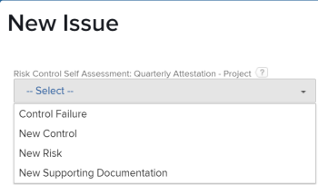

# Blueprint konfigurieren

Sie können Details eines Blueprints konfigurieren, bevor Sie ihn installieren. Für Blueprint-Typen für Projektvorlagen und Organisationsstrukturen müssen in der Regel einige Voreinstellungen festgelegt und einige Eigenschaften zugeordnet werden. Für andere Blueprint-Typen ist möglicherweise keine Konfiguration erforderlich, und Sie werden sie unverändert installieren. Weitere Informationen zur Installation finden Sie unter [Blueprint installieren](/help/quicksilver/administration-and-setup/blueprints/blueprints-install.md).

## Zugriffsanforderungen

+++ Erweitern Sie , um die Zugriffsanforderungen für die -Funktion in diesem Artikel anzuzeigen.

<table style="table-layout:auto"> 
 <col> 
 <col> 
 <tbody> 
  <tr> 
   <td role="rowheader">Adobe Workfront-Paket</td> 
   <td>Beliebig</td> 
  </tr> 
  <tr> 
   <td role="rowheader">Adobe Workfront-Lizenz</td> 
   <td>
   
Standard

   
Plan
</td> 
  </tr> 
  <tr> 
   <td role="rowheader">Konfigurationen der Zugriffsebene</td> 
   <td>Workfront-Administrator </td> 
  </tr> 
 </tbody> 
</table>

Weitere Informationen zu den Informationen in dieser Tabelle finden Sie unter [Zugriffsanforderungen in der Dokumentation zu Workfront](/help/quicksilver/administration-and-setup/add-users/access-levels-and-object-permissions/access-level-requirements-in-documentation.md).

+++

## Konfigurieren eines Blueprints für Projektvorlagen

1. Suchen Sie die Blueprint, die Sie verwenden möchten.
1. Klicken Sie **[!UICONTROL Installieren]** und wählen Sie dann eine Umgebung aus:

   <table style="table-layout:auto">
        <tr>
        <td><strong>Produktion</strong></td>
        <td>Die Produktion ist Ihre Live-Umgebung.</td>
    </tr>
    <tr>
        <td><strong>Sandbox-Vorschau</strong></td>
        <td>Die Sandbox-Vorschau ist eine Testumgebung, die als Replikation Ihrer Live-Umgebung dient und jedes Wochenende von Workfront aktualisiert wird.</td>
    </tr>
    <tr>
        <td><strong>Sandbox 1 und 2</strong></td>
        <td>Die benutzerdefinierte Aktualisierungs-Sandbox ist eine separate Testumgebung, die von Ihnen manuell aktualisiert wird. Es fallen zusätzliche Kosten an, um die benutzerdefinierte Aktualisierungs-Sandbox zu erhalten.</td>
    </tr>
   </table>

1. Fahren Sie mit den folgenden Abschnitten fort:

   * [[!UICONTROL Vorlageneinstellungen]](#template-preferences)
   * [[!UICONTROL Rollenzuordnung]](#role-mapping)
   * [[!UICONTROL Team-Zuordnung]](#team-mapping)
   * [[!UICONTROL Unternehmenszuordnung]g](#company-mapping)
   * [[!UICONTROL Gruppenzuordnung]](#group-mapping)

## [!UICONTROL Vorlageneinstellungen] {#template-preferences}

Wählen Sie aus, wie Sie die Vorlage installieren möchten.

Sie können auch den Vorlagenbesitzer bestimmen, bevor Sie die Blueprint installieren. Sie können Änderungen an diesen Feldern vornehmen, nachdem die Vorlage installiert wurde. Weitere Informationen finden Sie unter [Projektvorlagen bearbeiten](../../manage-work/projects/create-and-manage-templates/edit-templates.md).

![[!UICONTROL Vorlageneinstellungen] Abschnitt](assets/Blueprints_TemplatePreferences.png)

1. Geben [!UICONTROL &#x200B; im Abschnitt „Vorlageneinstellungen] einen neuen Vorlagennamen an.
1. Geben Sie Folgendes an:

   <table style="table-layout:auto">
    <tr>
        <td><strong>[!UICONTROL Vorlagenbesitzer]<strong></td>
        <td>Diese Person erhält [!UICONTROL Manage]-Berechtigungen für die Vorlage und wird zum Projektbesitzer, wenn die Vorlage zum Erstellen eines Projekts verwendet wird.</td>
    </tr>
    <tr>
        <td><strong>[!UICONTROL Vorlagensponsor]</strong></td>
        <td>Diese Person ist in der Regel ein Manager, eine Führungskraft oder ein Stakeholder, der wissen muss, was mit dem Projekt geschieht. Der Projektsponsor erhält keinen zusätzlichen Zugriff auf das Projekt, wird aber zu den E-Mail-Benachrichtigungen für das Projekt hinzugefügt.</td>
    </tr>
    <tr>
        <td><strong>[!UICONTROL Portfolio]</strong></td>
        <td>Dies ist das Portfolio, dem das Projekt bei seiner Erstellung angehören wird.</td>
    </tr>
    <tr>
        <td><strong>[!UICONTROL -Programm]</strong></td>
        <td>Dies ist das Programm, zu dem das Projekt gehören wird, wenn es erstellt wird.</td>
    </tr>
   </table>

1. Auswählen, ob die Vorlage als aktiv oder inaktiv installiert werden soll.
1. Wählen Sie aus, ob die Voreinstellungen für definierte neue Probleme verwendet werden sollen, sofern Voreinstellungen verfügbar sind.

   Klicken Sie **[!UICONTROL Siehe Problemeinstellungen]**, um die spezifischen Einstellungen zu überprüfen, die mit der Blueprint installiert werden. Projekte, die aus der importierten Vorlage erstellt wurden, verwenden diese Voreinstellungen für neue Probleme, die im Abschnitt [!UICONTROL Probleme] hinzugefügt wurden.

   <table style="table-layout:auto"> 
    <col> 
    <col> 
    <tbody> 
     <tr> 
      <td role="rowheader"><strong>Warteschlangen-Themen-Gruppen</strong></td> 
      <td> 
Warteschlangen-Themengruppen definieren die höchste Ebene von Kategorien für die Probleme oder Anfragen. Benutzende zeigen Themengruppen als Menüoptionen an, wenn sie auswählen, wohin sie Anfragen senden sollen. Eine Themengruppe kann mehrere Warteschlangenthemen enthalten. Weitere Informationen finden Sie unter <a href="../../manage-work/requests/create-and-manage-request-queues/create-topic-groups.md" class="MCXref xref">Themengruppen erstellen</a>. 
 </td> 
     </tr> 
     <tr> 
      <td role="rowheader"><strong>Warteschlangen-Themen</strong></td> 
      <td> 
Warteschlangenthemen arbeiten mit Routing-Regeln zusammen, um Probleme oder Anfragen zuzuweisen. Dies sind die Menüoptionen, die Benutzende bei der Eingabe eines Problems oder einer Anfrage auswählen, nachdem sie eine Themengruppe ausgewählt haben. Weitere Informationen finden Sie unter <a href="../../manage-work/requests/create-and-manage-request-queues/create-queue-topics.md" class="MCXref xref">Warteschlangenthemen erstellen</a>. 
 </td> 
     </tr> 
     <tr> 
      <td role="rowheader"><strong>Routing-Regeln</strong></td> 
      <td>Routing-Regeln senden Probleme oder Anfragen an bestimmte Aufgabengebiete , Benutzer oder Teams. Sie können die Anfragen auch an bestimmte Projekte senden, die nicht mit der Anfrage-Warteschlange verknüpft sind. Weitere Informationen finden Sie unter <a href="../../manage-work/requests/create-and-manage-request-queues/create-routing-rules.md" class="MCXref xref">Routing-Regeln erstellen</a>. </td> 
     </tr> 
    </tbody> 
   </table>

   >[!INFO]
   >
   >**Beispiel:** Die Voreinstellungen für neue Probleme in diesem Blueprint enthalten vier Warteschlangenthemen. Der/die Benutzende wählt beim Erstellen eines Problems eines dieser Themen aus. (Da nur eine Themengruppe vorhanden ist, wird sie automatisch angewendet und der/die Benutzende muss sie nicht auswählen.) Wenn der/die Benutzende das Problem abschließt und übermittelt, bestimmen Routing-Regeln, welchem Aufgabengebiet oder Team sie zugewiesen ist.
   >
   >
   >

   >[!TIP]
   >
   >* Die Verwendung der Problemvoreinstellungen hilft bei der Erstellung von Konsistenz bei der Erfassung neuer Probleme oder Anfragen in Ihren Projekten.
   >* Durch das Festlegen dieser Voreinstellungen werden die aus der Vorlage erstellten Projekte nicht automatisch in Anfragewarteschlangen umgewandelt. Weitere Informationen zum Einrichten einer Anfrage-Warteschlange finden Sie unter [Erstellen einer Anfrage-Warteschlange](../../manage-work/requests/create-and-manage-request-queues/create-request-queue.md).
   >* Nicht alle Blueprints enthalten Voreinstellungen für neue Probleme.

## [!UICONTROL Rollenzuordnung] {#role-mapping}

>[!NOTE]
>
>Dieser Abschnitt wird in einigen Blueprints möglicherweise nicht angezeigt.

Einige Vorlagen enthalten vorgeschriebene Aufgabengebiete. Mit Aufgabengebieten können Sie die richtigen Personen zuweisen, wenn die Vorlage in ein Projekt konvertiert wird. Sie können vor der Installation der Blueprint anpassen, wie die Rollen zugeordnet werden. Klicken Sie **[!UICONTROL Siehe Rollenbeschreibungen]**, um mehr über die in der Blueprint verfügbaren Rollen zu erfahren.

Der Blueprint sucht anhand des Rollennamens, um festzustellen, ob vorhandene Rollen übereinstimmen. Bei der Suche wird zwischen Groß- und Kleinschreibung unterschieden, sodass die Namen exakt übereinstimmen müssen. Wenn keine vorhandenen Rollen übereinstimmen, können Sie sie mit der Blueprint erstellen lassen.

![[!UICONTROL Rollenzuordnung] Abschnitt](assets/Blueprints_RoleMapping.png)

1. Wenn eine Rolle vorhanden ist, können Sie eine der folgenden Optionen auswählen:

   1. Erstellen Sie eine neue Rolle mit einem anderen Namen und geben Sie dann den Namen in das Textfeld ein.
   1. Vorhandene Rolle verwenden und im Auswahlfeld eine Rolle auswählen.
   1. Keine zugeordnete Rolle verwenden. Diese Option wird nicht empfohlen, da einigen Aufgaben keine Rollen zugewiesen sind.

1. Wenn keine Rolle vorhanden ist, können Sie eine der folgenden Optionen auswählen:

   1. Erstellen Sie eine neue Rolle. Mit dieser Option wird die Rolle erstellt, die der Blueprint empfiehlt.
   1. Erstellen Sie eine neue Rolle mit einem anderen Namen und geben Sie dann den Namen in das Textfeld ein.
   1. Vorhandene Rolle verwenden und im Auswahlfeld eine Rolle auswählen.
   1. Keine zugeordnete Rolle verwenden. Diese Option wird nicht empfohlen, da einigen Aufgaben keine Rollen zugewiesen sind.

>[!NOTE]
>
>Der Installationsprozess gilt nicht für Rollen für bestimmte Personen. Überprüfen Sie die Mitarbeiter in diesen Rollen nach der Installation der Blueprint-Lösung, und weisen Sie ggf. Mitarbeiter zu. Weitere Informationen finden Sie [Aktionen, die nach der Installation eines Blueprints durchgeführt werden sollen](../../administration-and-setup/blueprints/best-next-actions-after-install.md).

Weitere Informationen zu Aufgabengebieten in [!DNL Workfront] finden Sie unter [Erstellen und Verwalten von Aufgabengebieten](../../administration-and-setup/set-up-workfront/organizational-setup/create-manage-job-roles.md).

## [!UICONTROL Team-Zuordnung] {#team-mapping}

>[!NOTE]
>
>Dieser Abschnitt wird in einigen Blueprints möglicherweise nicht angezeigt.

Einige Vorlagen enthalten vorgeschriebene Teams. Einem Team zugewiesene Arbeiten können von jedem Teammitglied abgeschlossen werden. Sie können vor der Installation der Blueprint anpassen, wie Teams zugeordnet werden. Klicken Sie **[!UICONTROL Siehe Teambeschreibungen]**, um mehr über die in der Blueprint verfügbaren Teams zu erfahren.

Der Blueprint sucht nach dem Team-Namen, um festzustellen, ob vorhandene Teams übereinstimmen. Bei der Suche wird zwischen Groß- und Kleinschreibung unterschieden, sodass die Namen exakt übereinstimmen müssen. Wenn keine vorhandenen Teams übereinstimmen, können Sie sie mit der Blueprint erstellen lassen.

Abschnitt ![[!UICONTROL Team]Zuordnung](assets/Blueprints_TeamMapping.png)

1. Wenn ein Team vorhanden ist, können Sie eine der folgenden Optionen auswählen:

   1. Erstellen Sie ein neues Team mit einem anderen Namen und geben Sie dann den Namen in das Textfeld ein.
   1. Verwenden Sie [!UICONTROL Vorhandenes Team] und wählen Sie dann im Auswahlfeld ein Team aus.
   1. Keine zugeordneten Teams verwenden. Diese Option wird nicht empfohlen, da einigen Aufgaben keine Teams zugewiesen sind.

1. Wenn kein Team vorhanden ist, können Sie eine der folgenden Optionen auswählen:

   1. Erstellen Sie ein neues Team. Mit dieser Option wird das von der Blueprint empfohlene Team erstellt.
   1. Erstellen Sie ein neues Team mit einem anderen Namen und geben Sie dann den Namen in das Textfeld ein.
   1. Verwenden Sie [!UICONTROL Vorhandenes Team] und wählen Sie dann im Auswahlfeld ein Team aus.
   1. Keine zugeordneten Teams verwenden. Diese Option wird nicht empfohlen, da einigen Aufgaben keine Teams zugewiesen sind.

>[!NOTE]
>
>Beim Installationsprozess werden den Teams keine Personen hinzugefügt. Überprüfen Sie die Mitarbeiter in den Teams, nachdem Sie die Blueprint-Lösung installiert haben, und weisen Sie ggf. Personen zu. Weitere Informationen finden Sie [Aktionen, die nach der Installation eines Blueprints durchgeführt werden sollen](../../administration-and-setup/blueprints/best-next-actions-after-install.md).

Weitere Informationen zur Funktionsweise von Teams in [!DNL Workfront] finden Sie unter [Erstellen und Verwalten von Teams](../../people-teams-and-groups/create-and-manage-teams/create-and-mange-teams.md).

## Zuordnung von Firmen {#company-mapping}

>[!NOTE]
>
>Dieser Abschnitt wird in einigen Blueprints möglicherweise nicht angezeigt.

Einige Blueprints umfassen vorgeschriebene Unternehmen. Ein Unternehmen ist eine Organisationseinheit, die Ihre Organisation, eine Abteilung innerhalb der Organisation oder einen Kunden, mit dem Sie zusammenarbeiten, repräsentieren kann. Sie können vor der Installation der Blueprint anpassen, wie Unternehmen zugeordnet werden. Klicken Sie **[!UICONTROL Siehe Unternehmensbeschreibungen]**, um mehr über die in der Blueprint verfügbaren Unternehmen zu erfahren.

Der Blueprint sucht nach dem Firmennamen, um festzustellen, ob vorhandene Unternehmen übereinstimmen. Bei der Suche wird zwischen Groß- und Kleinschreibung unterschieden, sodass die Namen exakt übereinstimmen müssen. Wenn keine vorhandenen Unternehmen übereinstimmen, können Sie sie mit der Blueprint erstellen lassen. Die primäre Firma in der Blueprint wird der primären Firma in Ihrer Umgebung zugeordnet, auch wenn diese nicht denselben Namen haben.

Abschnitt ![[!UICONTROL Unternehmenszuordnung] &#x200B;](assets/Blueprints_CompanyMapping.png)

1. Wenn eine Firma vorhanden ist, können Sie eine der folgenden Optionen auswählen:

   1. Erstellen Sie ein neues Unternehmen mit einem anderen Namen und geben Sie dann den Namen in das Textfeld ein.
   1. Verwenden Sie ein vorhandenes Unternehmen und wählen Sie dann im Auswahlfeld ein Unternehmen aus.\

      Die primäre Firma in der Blueprint wird der primären Firma in Ihrer Umgebung zugeordnet, auch wenn diese nicht denselben Namen haben.
   1. Keine zugeordnete Firma verwenden. Diese Option wird nicht empfohlen, da die Unternehmensverweise in anderen Objekten leer sind.

1. Wenn keine Firma vorhanden ist, können Sie eine der folgenden Optionen auswählen:

   1. Erstellen Sie eine neue Firma. Mit dieser Option wird das Unternehmen erstellt, das der Blueprint empfiehlt.
   1. Erstellen Sie ein neues Unternehmen mit einem anderen Namen und geben Sie dann den Namen in das Textfeld ein.
   1. Verwenden Sie ein vorhandenes Unternehmen und wählen Sie dann im Auswahlfeld ein Unternehmen aus.
   1. Keine zugeordnete Firma verwenden. Diese Option wird nicht empfohlen, da die Unternehmensverweise in anderen Objekten leer sind.

>[!NOTE]
>
>Informationen zum Konfigurieren der Unternehmen nach der Installation der Blueprint finden Sie unter [Nach der Installation einer Blueprint auszuführende Aktionen](../../administration-and-setup/blueprints/best-next-actions-after-install.md).

Informationen zum Verknüpfen einer Vorlage mit einer Firma finden Sie unter [Projektvorlagen bearbeiten](../../manage-work/projects/create-and-manage-templates/edit-templates.md).

Informationen zur Funktionsweise von Unternehmen in [!DNL Workfront] finden Sie unter [Erstellen und Bearbeiten von Unternehmen](../../administration-and-setup/set-up-workfront/organizational-setup/create-and-edit-companies.md).

## [!UICONTROL Gruppenzuordnung] {#group-mapping}

>[!NOTE]
>
>Dieser Abschnitt wird in einigen Blueprints möglicherweise nicht angezeigt.

Einige Blueprints enthalten vorgeschriebene Gruppen. Eine Gruppe ist eine Benutzergruppe, die mit Ihrer Abteilungsstruktur übereinstimmt. Gruppen ähneln Teams und Unternehmen in Workfront, unterscheiden sich aber von ihnen. Sie können vor der Installation der Blueprint anpassen, wie Gruppen zugeordnet werden. Klicken Sie **[!UICONTROL Siehe Gruppenbeschreibungen]**, um mehr über die in der Blueprint verfügbaren Gruppen zu erfahren.

Der Blueprint sucht nach dem Gruppennamen, um festzustellen, ob eine vorhandene Gruppe übereinstimmt. Bei der Suche wird zwischen Groß- und Kleinschreibung unterschieden, sodass die Namen exakt übereinstimmen müssen. Wenn keine vorhandenen Gruppen übereinstimmen, können Sie diese mit der Blueprint erstellen lassen.

Abschnitt ![[!UICONTROL Gruppenzuordnung] &#x200B;](assets/Blueprints_GroupMapping.png)

1. Wenn eine Gruppe vorhanden ist, können Sie **[!UICONTROL Gruppe neu zuordnen]** und eine der folgenden Optionen auswählen:

   1. **[!UICONTROL Erstellen Sie eine neue Gruppe mit einem anderen Namen]** und geben Sie dann den Namen ein, der dieser Gruppe zugewiesen werden soll. Verweise auf die Gruppe in der Blueprint-Definition werden stattdessen dieser neuen Gruppe zugeordnet.
   1. **[!UICONTROL Ersetzen Sie durch eine vorhandene Gruppe]** suchen Sie dann im Auswahlfeld nach einer Gruppe und wählen Sie sie aus.

      >[!NOTE]
      >
      >Eine bestehende Gruppe kann nicht umbenannt werden.

1. Wenn keine Gruppe vorhanden ist, haben Sie folgende Möglichkeiten:

   1. Ändern Sie den vorgeschlagenen Gruppennamen, indem Sie ihn in das Textfeld eingeben.
   1. Wählen Sie **[!UICONTROL Gruppe neu zuordnen]** und wählen Sie [!UICONTROL Mit vorhandener Gruppe ersetzen] aus. Suchen Sie dann im Auswahlfeld nach einer Gruppe und wählen Sie sie aus.
   1. Wählen Sie **[!UICONTROL Gruppe neu zuordnen]** und wählen Sie **[!UICONTROL Einfügen unter einer vorhandenen Gruppe]** aus. Suchen Sie dann im Auswahlfeld nach einer Gruppe und wählen Sie sie aus. Diese Option erstellt eine neue Untergruppe unter der vorhandenen Gruppe.

>[!NOTE]
>
>Informationen zum Konfigurieren der Gruppen nach der Installation der Blueprint finden Sie unter [Nach der Installation einer Blueprint auszuführende Aktionen](../../administration-and-setup/blueprints/best-next-actions-after-install.md).

Informationen zur Verwendung von Gruppen in [!DNL Workfront] finden Sie unter [Gruppen - Übersicht](../../administration-and-setup/manage-groups/groups-overview/groups.md).
