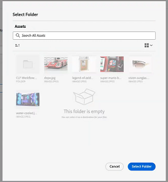

# Konfigurieren Sie die [!UICONTROL Experience Manager Assets as a Cloud Service] Integration

Sie können Ihre Arbeit mit Ihren Inhalten in [!DNL Experience Manager Assets]&#x200B;:

* Push-Assets und -Metadaten aus [!DNL Adobe Workfront] nach [!DNL Experience Manager Assets]&#x200B;
* Verknüpfen von Assets aus [!DNL Experience Manager Assets] für Ihre Projekte und Aufgaben in [!DNL Workfront&#x200B;]
* Anwendungsfälle für die Versionierung erleichtern
* Erstellen von Ordnern, die mit [!DNL Experience Manager Assets]
* Tracking von Metadaten für Assets und Ordner
* Synchronisieren von Projektmetadaten zwischen [!DNL Workfront] und [!DNL Experience Manager Assets]

>[!NOTE]
>
>Sie können auch mehrere Experience Manager Assets-Repositorys mit einer Workfront-Umgebung oder mehrere Workfront-Umgebungen mit einem Experience Manager Assets-Repository über Organisations-IDs hinweg verbinden. Befolgen Sie die Konfigurationsanweisungen in diesem Artikel für jede Integration, die Sie einrichten möchten.

## Zugriffsanforderungen

Sie müssen über Folgendes verfügen:

<table>
  <tr>
   <td><strong>[!DNL Adobe Workfront] Plan*</strong>
   </td>
   <td>Beliebig
   </td>
  </tr>
  <tr>
   <td><strong>[!DNL Adobe Workfront] Lizenzen*</strong>
   </td>
   <td>[!UICONTROL Plan]
   </td>
  </tr>
  <tr>
   <td><strong>[!DNL Experience Manager] Lizenz</strong>
   </td>
   <td>[!UICONTROL Standard]
   </td>
  </tr>
  <tr>
   <td><strong>Produkt</strong>
   </td>
   <td>Sie müssen [!DNL Experience Manager Assets as a Cloud Service]und Sie müssen dem Produkt als Benutzer hinzugefügt werden.
   </td>
  </tr>
  <tr>
   <td>Konfigurationen auf Zugriffsebene*
   </td>
   <td>Sie müssen [!DNL Workfront] Administrator. Informationen über [!DNL Workfront] Administratoren, siehe <strong>Gewähren eines vollen Administratorzugriffs</strong>.
   </td>
  </tr>
</table>

*Wenden Sie sich an Ihren Workfront-Administrator, um zu erfahren, welchen Plan, welchen Lizenztyp oder welchen Zugriff Sie haben.

## Voraussetzungen

Bevor Sie beginnen

* Sie müssen [!DNL Workfront] und [!DNL Adobe Experience Manager Assets] mit einer Organisations-ID in der [!DNL Adobe Admin Consol]e. Weitere Informationen finden Sie unter [Plattformbasierte Verwaltungsunterschiede ([!DNL Adobe Workfront]/[!DNL Adobe Business Platform])](/help/quicksilver/administration-and-setup/get-started-wf-administration/actions-in-admin-console.md).

## Integrationsinformationen einrichten

1. Klicken Sie auf **[!UICONTROL Hauptmenü]** rechts oben in Adobe Workfront auf und klicken Sie dann auf **[!UICONTROL Einrichtung]** .
1. Auswählen **[!UICONTROL Dokumente]** Wählen Sie im linken Bereich die Option **[!UICONTROL [!DNL Experience Manager]Integration]**.

   >[!NOTE]
   >
   >Dieser Konfigurationsbereich wird nur angezeigt, wenn Ihre [!DNL Workfront] -Umgebung ist in einer [!DNL Adobe Admin Console].

1. Auswählen **[!UICONTROL Hinzufügen [!DNL Experience Manager] Integration]**.
1. Im **[!UICONTROL Name]** Geben Sie den Namen ein, den die Benutzer bei der Interaktion mit dieser Integration in Workfront und Experience Manager Assets sehen sollen.
1. Im **[!UICONTROL NavigationsURL]** -Feld, füllt das System automatisch die Navigations-URL. Diese schreibgeschützte URL wird verwendet, um eine Verknüpfung mit der [!DNL Experience Manager] -Instanz aus der [!UICONTROL Hauptmenü] für schnellen Zugriff.
1. Wählen Sie ein Repository aus dem **[!UICONTROL [!DNL Experience Manager]Assets-Repository]** Dropdown-Menü. Das System füllt automatisch alle [!DNL Experience Manager] Repositorys, die mit der Organisations-ID verknüpft sind, der Ihr Benutzerprofil zugewiesen ist.
   

1. Klicks **[!UICONTROL Speichern]** oder zum [Einrichten von Metadaten (optional)](#set-up-metadata-optional) in diesem Artikel beschrieben.

   >[!NOTE]
   >
   >Aufgrund der Komplexität der Integration können Sie das Repository nach dem Speichern der ursprünglichen Konfiguration nicht ändern.

## Einrichten von Metadaten (optional)

Sie können [!DNL Workfront] Objektdaten in Asset-Medienfelder in [!DNL Experience Manager] Assets.

>[!IMPORTANT]
>
>Sie können Metadaten nur in eine Richtung zuordnen: von [!DNL Workfront] nach [!DNL Experience Manager]. Metadaten für Dokumente, die verknüpft sind mit [!DNL Workfront] von [!DNL Experience Manager] kann nicht übertragen werden an [!DNL Workfront].

### Konfigurieren von Metadatenfeldern

Bevor Sie mit der Zuordnung von Metadatenfeldern beginnen, müssen Sie Metadatenfelder sowohl in Workfront als auch in Experience Manager Assets konfigurieren.

So konfigurieren Sie Metadatenfelder:

1. Konfigurieren eines Metadatenschemas in [!DNL Experience Manager Assets] wie unter [Konfigurieren der Asset-Metadatenzuordnung zwischen Adobe [!DNL Workfront] und [!DNL Experience Manager Assets]](https://experienceleague.adobe.com/docs/experience-manager-cloud-service/content/assets/integrations/configure-asset-metadata-mapping.html?lang=en).

1. Konfigurieren Sie benutzerdefinierte Formularfelder in Workfront. [!DNL Workfront] verfügt über viele integrierte benutzerdefinierte Felder, die Sie verwenden können. Sie können jedoch auch eigene benutzerdefinierte Felder erstellen, wie hier beschrieben: [Benutzerdefiniertes Formular erstellen oder bearbeiten](/help/quicksilver/administration-and-setup/customize-workfront/create-manage-custom-forms/create-or-edit-a-custom-form.md).

+++ **Erweitern, um weitere Informationen zu unterstützten Workfront- und Experience Manager Assets-Feldern anzuzeigen**

**Experience Manager Assets Tags**

Sie können jedes von Workfront unterstützte Feld einem Tag in Experience Manager Assets zuordnen. Dazu müssen Sie sicherstellen, dass die Tag-Werte in Experience Manager Assets mit Workfront übereinstimmen.

* Die Feldwerte für Tags und Workfront müssen exakt mit der Schreibweise und dem Format übereinstimmen.
* Workfront-Feldwerte, die Experience Manager-Assets-Tags zugeordnet werden, müssen in Kleinbuchstaben geschrieben werden, selbst wenn das Tag in Experience Manager Assets Großbuchstaben zu haben scheint.
* Workfront-Feldwerte dürfen keine Leerzeichen enthalten.
* Der Feldwert in Workfront muss auch die Ordnerstruktur des Experience Manager Assets-Tags enthalten.
* Um mehrere einzeilige Textfelder Tags zuzuordnen, geben Sie eine kommagetrennte Liste der Tag-Werte auf der Workfront-Seite der Metadaten-Zuordnung ein und `xcm:keywords` auf der Experience Manager Assets-Seite. Jeder Feldwert wird einem separaten Tag zugeordnet. Sie können ein berechnetes Feld verwenden, um mehrere Workfront-Felder in einem einzigen, kommagetrennten Textfeld zu kombinieren.
* Sie können Werte aus Dropdown-, Optionsfeld- oder Kontrollkästchen-Feldern zuordnen, indem Sie eine kommagetrennte Liste der in diesem Feld verfügbaren Werte eingeben.

>[!INFO]
>
>**Beispiel**: Um mit dem hier in der Ordnerstruktur angezeigten Tag abzugleichen, würde der Feldwert in Workfront folgendermaßen aussehen: `landscapes:trees/spruce`. Beachten Sie die Kleinbuchstaben im Workfront-Feldwert.
>
>Wenn das Tag am weitesten links im Tag-Baum sein soll, muss es von einem Doppelpunkt gefolgt werden. In diesem Beispiel würde der Feldwert in Workfront zum Landschaftsschild zugeordnet werden: `landscapes:`.
>
>

Nachdem Sie die Tags in Experience Manager Assets erstellt haben, werden sie im Abschnitt Metadaten unter der Dropdown-Liste Tags angezeigt. Um ein Feld mit einem Tag zu verknüpfen, wählen Sie `xcm:keywords` im Dropdown-Menü Experience Manager Assets-Feld im Bereich Metadatenzuordnung.

Weitere Informationen zu Tags in Experience Manager Assets, einschließlich der Erstellung und Verwaltung von Tags, finden Sie unter [Verwalten von Tags](https://experienceleague.adobe.com/docs/experience-manager-64/administering/contentmanagement/tags.html).

**Benutzerdefinierte Metadatenschema-Felder von Experience Manager Assets**

Sie können sowohl integrierte als auch benutzerdefinierte Workfront-Felder benutzerdefinierten Metadatenschema-Feldern in Experience Manager Assets zuordnen.

Benutzerdefinierte Metadatenfelder, die in Experience Manager Assets erstellt wurden, sind in ihrem eigenen Abschnitt im Metadaten-Setup-Bereich organisiert.

<!-- 
link to documentation about creating schema - waiting on response from Anuj about best article to link to
-->

**Workfront-Felder**

Sie können sowohl integrierte als auch benutzerdefinierte Workfront-Felder Experience Manager Assets zuordnen. Die folgenden Feldwerte müssen sowohl Groß- als auch Kleinschreibung zwischen Workfront und Experience Manager Assets berücksichtigen:

* Dropdown-Felder
* Felder mit Mehrfachauswahl

>[!TIP]
>
> Um zu überprüfen, ob die Feldwerte exakt übereinstimmen, gehen Sie zu
>
> * Einrichtung > Benutzerdefinierter Forms in Workfront oder das -Feld im -Objekt
> * Assets > Metadatenschemata in Experience Manager Assets

+++

### Zuordnen von Metadaten für Assets

Metadaten-Maps beim Senden eines Assets aus [!DNL Workfront] zum ersten Mal. Dokumente mit den integrierten oder benutzerdefinierten Feldern werden automatisch den angegebenen Feldern zugeordnet, wenn ein Asset zum ersten Mal an [!DNL Experience Manager Assets].

Zuordnen von Metadaten für Assets:

1. Auswählen **[!UICONTROL Assets]** über der Metadatentabelle.
1. Im **[!UICONTROL [!DNL Workfront]field]** wählen Sie ein integriertes oder benutzerdefiniertes Workfront-Feld aus.

   >[!NOTE]
   >
   >Sie können eine einzelne [!DNL Workfront] Feld zu mehreren [!UICONTROL Experience Manager Assets] -Felder. Sie können nicht mehrere [!DNL Workfront] Felder zu einem einzelnen [!DNL Experience Manager Assets] -Feld.
   ><!--To map a Workfront field to an Experience Manager Assets tag, see -->

1. Im [!DNL Experience Manager Assets] , durchsuchen Sie die vorausgefüllten Kategorien oder geben Sie mindestens zwei Buchstaben in das Suchfeld ein, um auf weitere Kategorien zuzugreifen.
1. Wiederholen Sie die Schritte 2 und 3 nach Bedarf.
   
1. Klicks [!UICONTROL Speichern] oder zum [Ordner](#folders) in diesem Artikel beschrieben.

### Zuordnen von Metadaten für Ordner

Wenn Benutzer einen verknüpften Ordner in einem Projekt erstellen, werden die verknüpften Projekt-, Portfolio- und Programmdaten den Ordner-Metadatenfeldern in [!DNL Experience Manager Assets].

>[!NOTE]
>
>Diese Integration unterstützt keine benutzerdefinierten Metadaten von [!DNL Adobe Experience Manager].

Zuordnen von Metadaten für Ordner:

1. Auswählen **[!UICONTROL Ordner]** über der Metadatentabelle.
1. Im **[!UICONTROL [!DNL Workfront]field]** wählen Sie ein integriertes oder benutzerdefiniertes Workfront-Feld aus.

   >[!NOTE]
   >
   >Sie können ein einzelnes Workfront-Feld mehreren Experience Manager Assets-Feldern zuordnen. Sie können nicht mehrere [!DNL Workfront] Felder zu einem einzelnen [!DNL Experience Manager Assets] -Feld.

1. Im **[!DNL Experience Manager Assets]** , durchsuchen Sie die vorausgefüllten Kategorien oder geben Sie mindestens zwei Buchstaben in das Suchfeld ein, um auf weitere Kategorien zuzugreifen.
1. Wiederholen Sie die Schritte 2 und 3 nach Bedarf.
   
1. Klicks **[!UICONTROL Speichern]** oder zum [Synchronisierung von Projektmetadaten](#project-metadata-sync) in diesem Artikel beschrieben.

### Synchronisierung von Objektmetadaten

Ein [!DNL Experience Manager] Felder, die [!DNL Workfront] Die Felder &quot;Portfolio&quot;, &quot;Programm&quot;, &quot;Projekt&quot;, &quot;Aufgabe&quot;, &quot;Problem&quot;und &quot;Dokument&quot;werden automatisch aktualisiert, wenn das Feld in [!DNL Workfront].

Wenn diese Option aktiviert ist, enthält jedes Asset, das an Adobe Experience Manager gesendet wurde, eine Karte auf der Seite &quot;Dokumentdetails&quot;, die eine Echtzeitansicht der Adobe Experience Manager-Metadaten des Dokuments anzeigt.

>[!IMPORTANT]
>
>Benutzer müssen Schreibzugriff in [!DNL Experience Manager] für Assets, die im Objekt gespeichert sind, damit die Metadaten beim Aktualisieren synchronisiert werden können.

1. Aktivieren Sie die **[!UICONTROL Synchronisieren von Objektmetadaten]** -Feld.
1. Klicks **Speichern** oder zum [Einrichten von Workflows (optional)](#set-up-workflows-optional) in diesem Artikel beschrieben.

<!--Courtney start here-->

## Einrichten von Workflows (optional)

Ein Workflow besteht aus einer Reihe von Aktionen, die Workfront mit Adobe Experience Manager as a Cloud Service verbinden. Als Workfront-Administrator können Sie Workflows in Workfront konfigurieren und sie dann Projektvorlagen zuweisen. Wenn ein Projekt mit einer Projektvorlage erstellt wird, der ein Workflow zugewiesen ist, werden die im Workflow definierten Aktionen ausgelöst.

Die standardmäßigen Workflow-Werte, die Sie in der Integration festlegen, können auf den Ebenen &quot;Projektvorlage&quot;und &quot;Projekt&quot;überschrieben werden.

### Einrichten eines Workflows für die Erstellung von mit Adobe Experience Manager verknüpften Ordnern

1. Umschalten zwischen **[!UICONTROL Verknüpften Ordner erstellen]** auf.
1. Wählen Sie einen Ordnerpfad aus, um anzugeben, wo alle mit dieser Integration verknüpften Ordner gespeichert werden sollen.
   
1. Aktivieren Sie die **Portfolio- und Programmnamen anhängen** -Option, um automatisch Portfolio- und Programmnamen am Ende des Ordnernamens einzuschließen.
1. Klicks **Speichern** oder zum [Verknüpfte Ordner einrichten (optional)](#set-up-linked-folders-optional) in diesem Artikel beschrieben.

<!--Courtney end here-->

## Verknüpfte Ordner einrichten (optional)

Sie können Benutzern erlauben, Ordner zu erstellen, die mit [!DNL Experience Manager] while in [!DNL Workfront] Projekt. Wenn ein Ordner verknüpft ist, werden alle dem Ordner hinzugefügten Assets automatisch in [!DNL Workfront] und [!DNL Experience Manager]. Wenn ein Asset zum verknüpften Ordner in [!DNL Workfront] zum ersten Mal werden die Metadaten des Assets an [!DNL Experience Manager Assets].

Geben Sie in den folgenden Schritten an, wo die verknüpften Ordner erstellt werden sollen. Jede Integration kann nur einen Speicherort für alle verknüpften Ordner haben.

Einrichten verknüpfter Ordner:

1. Umschalten zwischen **[!UICONTROL Verknüpften Ordner aktivieren]** auf.
1. Wählen Sie einen Ordnerpfad aus, um anzugeben, wo alle mit dieser Integration verknüpften Ordner gespeichert werden sollen.

   >[!NOTE]
   >
   >Benutzer benötigen Schreibzugriff in [!DNL Adobe Experience Manager Assets] in den Ordner, der zum Erstellen eines verknüpften Ordners angegeben wurde.

1. Klicken Sie auf **[!UICONTROL Speichern]**.
