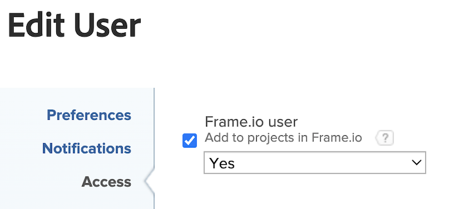

# Integration von [!DNL Workfront] und [!DNL Frame.io] konfigurieren

Der Workfront-Administrator aktiviert die Integration zwischen Workfront und Frame.io, indem er das standardmäßige Frame.io-Konto im Setup-Bereich konfiguriert und dann Frame.io-Benutzer in Workfront benennt. Dadurch kann der Projektkoordinator die Arbeit mit Workfront-Projekten planen und initiieren sowie die Prüfungs- und Genehmigungs-Workflows überprüfen.

## Zugriffsanforderungen

>[!IMPORTANT]
>
>Diese Funktion ist nur für Unternehmen verfügbar, die in den [!DNL Adobe Admin Console] integriert wurden.

+++ Erweitern Sie , um die Zugriffsanforderungen für die Funktionalität in diesem Artikel anzuzeigen.

Sie müssen über folgenden Zugriff verfügen, um die Schritte in diesem Artikel ausführen zu können:

<table>
  <tr>
   <td>[!DNL Adobe Workfront] Plan</td>
   <td>Alle</td>
  </tr>
  <tr>
   <td>[!DNL Adobe Workfront] Lizenzen
   </td>
   <td>
Aktuell: [!UICONTROL Plan]

   
Neu: [!UICONTROL Standard]
</td>
  </tr>
  <tr>
   <td>Konfigurationen auf Zugriffsebene
   </td>
   <td>Sie müssen ein [!DNL Workfront] -Administrator sein.
   </td>
  </tr>

</table>

Weitere Informationen zu den Informationen in dieser Tabelle finden Sie unter [Zugriffsanforderungen in der Workfront-Dokumentation](/help/quicksilver/administration-and-setup/add-users/access-levels-and-object-permissions/access-level-requirements-in-documentation.md).

+++

## Konfigurieren eines standardmäßigen [!DNL Frame.io]-Kontos [!BADGE In Kürze verfügbar]{type=Informative}

Sobald ein standardmäßiges [!DNL Frame.io] -Konto eingerichtet ist, wird bei allen in [!DNL Workfront] erstellten Projekten ein Spiegelprojekt in Frame.io erstellt.

>[!IMPORTANT]
>
>Diese Funktion wird in Kürze verfügbar sein. Derzeit werden Frame.io-Konten manuell vom Workfront-Team hinzugefügt. Wenden Sie sich an Ihren Adobe-Kundenbetreuer, um Hilfe zu erhalten.

## Einzelnes Frame.io-Konto mit einer Workfront-Gruppe konfigurieren

Sie können eine einzelne Workfront-Gruppe mit einem einzelnen Frame.io-Konto verbinden, das sich vom Standardkonto unterscheidet.

So konfigurieren Sie ein einzelnes Frame.io-Konto mit einer Workfront-Gruppe:

{{step-1-to-setup}}

1. Klicken Sie im linken Bereich auf **Gruppen**.
1. Wählen Sie eine vorhandene Gruppe aus oder klicken Sie auf **Gruppe erstellen**.
1. Klicken Sie im linken Bereich auf **Mit Frame.io verbinden**.
1. Geben Sie das API-Entwicklungstoken ein.
1. Klicken Sie auf **Verbindung initiieren**.
1. (Bedingt) Wenn Sie Administrator von mehr als einem Frame.io-Konto sind, wählen Sie das Konto aus, das Sie verwenden möchten.

## Frame.io-Benutzer aktivieren

Workfront-Benutzer, die regelmäßig Frame.io verwenden, sollten als Frame.io-Benutzer markiert werden. Workfront-Administratoren können Frame.io-Benutzer im Workfront-Benutzerprofil bestimmen.

>[!TIP]
>
>Es wird empfohlen, Benutzern, die regelmäßig mit Kreativ-Tools arbeiten und Assets zur Überprüfung und Genehmigung hochladen, die Verwendung von Frame.io-Benutzern zu ermöglichen.

Wenn ein Benutzer in Workfront als Frame.io-Benutzer markiert und zu einem Projekt hinzugefügt wird:

* Sie werden als Mitwirkender in Frame.io hinzugefügt. <!--do we need to be more explicit about a frame license being provisioned for them?-->
* Sie können Assets von Frame.io zur formalen Überprüfung und Genehmigung an Workfront senden.
* Sie können Informationen im unidirektionalen Synchronisierungsordner von Workfront aus anzeigen. [!BADGE In Kürze verfügbar]{type=Informative}

So aktivieren Sie Frame.io-Benutzer:

{{step-1-to-users}}

1. Wählen Sie einen oder mehrere Benutzer aus und klicken Sie dann auf das Symbol **Bearbeiten** .
1. Aktivieren Sie im Bereich Zugriff das Kontrollkästchen Zu Projekten in Frame.io hinzufügen und wählen Sie dann im Dropdown-Menü **Ja** aus.
   

   >[!NOTE]
   >
   >Wenn dieses Kontrollkästchen deaktiviert ist, behält der Benutzer Zugriff auf vergangene Zuweisungen und wird in Zukunft zu Frame.io-Projekten hinzugefügt.<!-- If the user is deactivated, they lose all access to previous assignments and are removed from the Frame.io account.-->
