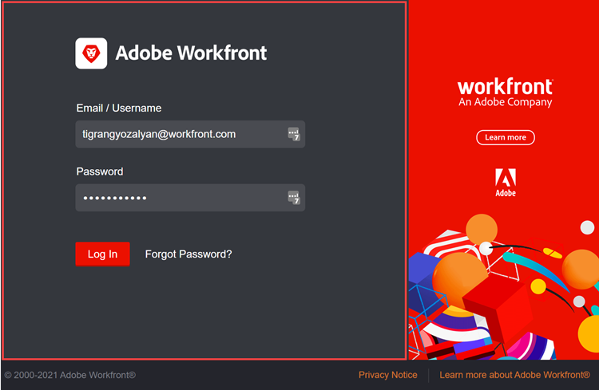

# Branding für Ihre Adobe Workfront-Instanz ausführen

<!--
**DON'T DELETE, DRAFT OR HIDE THIS ARTICLE. IT IS LINKED TO THE PRODUCT, THROUGH THE CONTEXT SENSITIVE HELP LINKS. **
-->

>[!IMPORTANT]
>
>Das auf dieser Seite beschriebene Verfahren gilt nur für Organisationen, die noch nicht in [!DNL Adobe Experience Cloud] integriert wurden.
>
> Wenn Ihre Organisation in [!DNL Adobe Experience Cloud] integriert wurde, ist kein Branding verfügbar.

Als Workfront-Administrator können Sie Workfront an den folgenden Stellen mit Logos versehen:

* Anmeldebildschirm

  

* Oberer Navigationsbereich

  

* Hauptmenü

  

Sie können auch das Hintergrundbild und die Hintergrundfarbe des Anmeldebildschirms ändern:

>[!NOTE]
>
>* Das Ändern des Anmeldehintergrundbilds und der Hintergrundfarbe ist nicht verfügbar, wenn die Workfront-Instanz Ihres Unternehmens ein benutzerdefiniertes SSO-Portal verwendet. Wenden Sie sich an Ihren Netzwerk- oder IT-Administrator, wenn Sie weitere Informationen benötigen.
><!--
>or is enabled with Adobe IMS  >
>  >
>-->
>
>* Ein Workfront-Administrator oder Gruppenadministrator kann Workfront mithilfe einer Layout-Vorlage auch für bestimmte Gruppen und Benutzende markieren. Das Branding in einer Layout-Vorlage überschreibt das in diesem Artikel beschriebene Branding auf Systemebene. Anweisungen zum Branding in einer Layout-Vorlage finden Sie unter [Adobe Workfront mithilfe einer Layout-Vorlage markieren](../../../administration-and-setup/customize-workfront/use-layout-templates/brand-wf-using-a-layout-template.md).

## Zugriffsanforderungen

+++ Erweitern Sie , um die Zugriffsanforderungen für die -Funktion in diesem Artikel anzuzeigen.

Sie müssen über folgenden Zugriff verfügen, um die Schritte in diesem Artikel ausführen zu können:

<table style="table-layout:auto"> 
 <col> 
 <col> 
 <tbody> 
  <tr> 
   <td role="rowheader">Adobe Workfront-Plan</td> 
   <td>Beliebig</td> 
  </tr> 
  <tr> 
  <tr> 
   <td role="rowheader">Adobe Workfront-Lizenz</td> 
   <td>
Neu: Standard

       
Oder

       
Aktuell: Plan
</td>
  </tr> 
  </tr> 
  <tr> 
   <td role="rowheader">Konfigurationen der Zugriffsebene</td> 
   <td>[!UICONTROL Systemadministrator]</td>
  </tr> 
 </tbody> 
</table>

Weitere Informationen zu den Informationen in dieser Tabelle finden Sie unter [Zugriffsanforderungen in der Dokumentation zu Workfront](/help/quicksilver/administration-and-setup/add-users/access-levels-and-object-permissions/access-level-requirements-in-documentation.md).

+++

## Branding des Anmeldebildschirms

{{step-1-to-setup}}

1. Klicken Sie **System** > **Branding**.

1. Nehmen Sie eine der folgenden Änderungen vor, um Workfront mit Ihren Branding-Bildern anzupassen.

   <table style="table-layout:auto"> 
    <col> 
    <col> 
    <tbody> 
     <tr> 
      <td role="rowheader"> 
Markieren Sie das Symbol Startseite (wird ganz links im oberen Navigationsbereich angezeigt)
 </td> 
      <td> 
Klicken Sie im <strong>oberen Navigationsbereich</strong> unter <strong>Startseitensymbol</strong> auf eine beliebige Stelle im Feld, suchen Sie dann nach Ihrem Logo und wählen Sie es aus. Oder ziehen Sie ein Bild in das Feld.
 
Um das Bild zu beschneiden, verwenden Sie die Steuerelemente zum Scrollen und ziehen Sie das Bild an die gewünschte Position innerhalb des vorgeschriebenen Bereichs.
 
Wir empfehlen ein 120 x 120 Bild. Es kann in einem der folgenden Formate vorliegen: GIF, JPG, PNG, SVG.
 
Dieses Symbol wird auch in Berichten, Listen, Dashboards und bereitgestellten Berichten angezeigt, die Benutzende als PDF-Dateien exportieren.
 </td> 
     </tr> 
     <tr> 
      <td role="rowheader"> 
Branding des Hauptmenüs  Logo- (wird in der oberen rechten Ecke des Hauptmenüs angezeigt)
 </td> 
      <td> 
Klicken Sie im <strong>oberen Navigationsbereich</strong> unter <strong>Hauptmenü-Logo</strong> auf eine beliebige Stelle im Feld, suchen Sie nach Ihrem Logo und wählen Sie es aus. Oder ziehen Sie ein Bild in das Feld.
 
Um das Bild zu beschneiden, verwenden Sie die Steuerelemente zum Scrollen und ziehen Sie das Bild an die gewünschte Position innerhalb des vorgeschriebenen Bereichs.
 
Wir empfehlen ein Bild in der Größe 300 x 120 Pixel. Es kann in einem der folgenden Formate vorliegen: GIF, JPG, PNG, SVG.
 </td> 
     </tr> 
     <tr> 
      <td role="rowheader">Das Logo des Anmeldebildschirms Marke) (wird oben links in dem Feld angezeigt, in das die Benutzer die Anmeldeinformationen eingeben)</td> 
      <td> 
Klicken <strong> unter „Anmeldebildschirm</strong> auf eine beliebige Stelle im Feld, suchen Sie nach Ihrem Logo und wählen Sie es aus. Um das Bild zu beschneiden, verwenden Sie die Steuerelemente zum Scrollen und ziehen Sie das Bild an die gewünschte Position innerhalb des vorgeschriebenen Bereichs.
 
Wir empfehlen ein Bild in der Größe 300 x 120 Pixel. Es kann in einem der folgenden Formate vorliegen: GIF, JPG, PNG, SVG.
 </td> 
     </tr> 
     <tr> 
      <td role="rowheader">Marke Die Hintergrundfarbe des Anmeldebildschirms (wird hinter dem Feld angezeigt, in dem Benutzer Anmeldeinformationen eingeben)</td> 
      <td> 
Legen <strong> unter „Anmeldebildschirm</strong> eine <strong>Hintergrundfarbe“ </strong>. 
 
Sie können RGB- oder HEX-Farbcodes verwenden.
 
Die Hintergrundfarbe ist nur sichtbar, wenn der Hintergrund des Anmeldebildschirms größer ist als das Hintergrundbild des Anmeldebildschirms (siehe nächste Zeile in dieser Tabelle) oder wenn das Bild transparent ist.
 </td> 
     </tr> 
     <tr> 
      <td role="rowheader">Branding Das Hintergrundbild des Anmeldebildschirms wird hinter dem Feld angezeigt, in das die Benutzer ihre Anmeldeinformationen eingeben)</td> 
      <td> 
       <ol style="list-style-type: lower-alpha;"> 
        <li value="1"> 
 Klicken Sie im Bereich <strong>Anmeldebildschirm</strong> unter <strong>Hintergrundbild</strong> auf das Kästchen, suchen Sie Ihr JPG- oder PNG-Bild oder Ihre Bilder (bis zu 20 ) und wählen Sie sie aus. 
 
Mehrere Hintergrundbilder werden in zufälliger Reihenfolge angezeigt und ändern sich jedes Mal, wenn Benutzer ihre Anmeldeseite aktualisieren. Wir empfehlen Bilder, die nicht größer als 2 MB sind.
 </li> 
        <li value="2"> 
Bewegen Sie den Mauszeiger über die einzelnen Hintergrundbilder, die Sie hochgeladen haben, klicken Sie auf das Symbol Einstellungen (Zahnradsymbol), und geben Sie mithilfe der folgenden Optionen an, wo und wie das Bild im Hintergrund des Anmeldebildschirms angezeigt werden soll:
 
         <ul> 
          <li> 
<strong>Vollbild</strong>: Passt das Bild an den Hintergrund des Anmeldebildschirms an, wodurch das Bild möglicherweise vergrößert wird. Verwenden Sie ein hochauflösendes Bild (bis zu 2 MB) für die besten Ergebnisse.
 
Wenn Sie diese Option verwenden, verdeckt das Workfront-Banner, das nicht anpassbar ist, einen Teil Ihres Bildes.
 </li> 
          <li> 
<strong>Kachel</strong>: Verknüpft Ihr Bild im Hintergrundbereich des Anmeldebildschirms in der Originalgröße. Dies ist zum Erstellen eines Musters nützlich. Wählen Sie eine Option für die blaue Ausrichtung aus, um die Kachel von der linken oberen Ecke, der oberen Mitte oder der rechten oberen Ecke des Hintergrundbereichs aus zu starten.
 </li> 
          <li> 
<strong>Position</strong>: Platziert das Bild in der Originalgröße an der Position, die Sie mit einer der blauen Ausrichtungsoptionen auswählen: oben links, oben zentriert oder oben rechts im Hintergrundbereich des Anmeldebildschirms.
 
Die Hintergrundfarbe füllt den Rest des Hintergrundbereichs des Anmeldebildschirms aus. Weitere Informationen zur Hintergrundfarbe finden Sie in der vorangehenden Zeile dieser Tabelle.
 </li> 
         </ul> </li> 
       </ol> </td> 
     </tr> 
     <tr> 
      <td role="rowheader">Auf Standard-Branding zurücksetzen</td> 
      <td> 
Durch das Zurücksetzen auf das Standard-Branding werden alle hochgeladenen Fotos und Bilder gelöscht.
 
Klicken Sie <strong>Alle Branding-Elemente auf die Workfront</strong>Standardeinstellungen zurücksetzen“ in der rechten unteren Bildschirmecke und klicken Sie dann auf <strong>Ja</strong>.
 </td> 
     </tr> 
    </tbody> 
   </table>

   >[!NOTE]
   >
   >Dies ist nicht verfügbar, wenn die Workfront-Instanz Ihres Unternehmens ein benutzerdefiniertes SSO-Portal verwendet.
   ><!--   >
   >or is enabled with Adobe IMS   >
   >   >
   >-->
   >
   >Wenden Sie sich an Ihren Netzwerk- oder IT-Administrator, wenn Sie weitere Informationen benötigen.

1. Klicken Sie auf **Speichern**.
