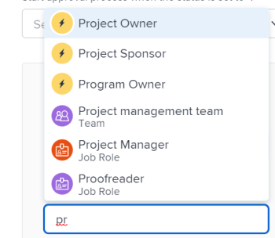

# Validierungsprozess bearbeiten

Wenn Sie Adobe Workfront-Administrator sind oder über Administratorzugriff auf Genehmigungsprozesse verfügen, können Sie alle Genehmigungsprozesse im System anzeigen und bearbeiten.

Wenn Sie Gruppenadministrator sind, können Sie die Genehmigungsprozesse sehen und bearbeiten, die mit der oder den von Ihnen verwalteten Gruppen verbunden sind.

Informationen zum Erstellen von Genehmigungsprozessen finden Sie unter [Erstellen eines Genehmigungsprozesses für Arbeitselemente](../../../administration-and-setup/customize-workfront/configure-approval-milestone-processes/create-approval-processes.md).

>[!NOTE]
>
>* Wenn Sie einen bereits verwendeten globalen Genehmigungsprozess bearbeiten, wirken sich Ihre Änderungen auf alle Objekte im gesamten System aus, die bereits damit verknüpft sind.
>* Wenn Sie einen neuen Genehmiger zur aktuellen Phase in einem Genehmigungsprozess hinzufügen, der bereits für ein Objekt gestartet wurde, wird der Prozess für dieses Objekt zurückgesetzt und die Genehmiger müssen neu beginnen.
>
>  Wenn Sie jedoch die folgenden Änderungen an einem Genehmigungsprozess vornehmen, der bereits für ein Objekt gestartet wurde, wird dieser Prozess ohne Unterbrechung fortgesetzt:
>
>* Eine Phase über die aktuelle Phase hinaus hinzufügen
>* Hinzufügen eines zusätzlichen Genehmigers vor der aktuellen Phase

## Zugriffsanforderungen

Sie müssen über Folgendes verfügen:

<table style="table-layout:auto"> 
 <col> 
 <col> 
 <tbody> 
  <tr> 
   <td role="rowheader">Adobe Workfront-Plan*</td> 
   <td>Beliebig</td> 
  </tr> 
  <tr> 
   <td role="rowheader">Adobe Workfront-Lizenz*</td> 
   <td>Plan</td> 
  </tr> 
  <tr> 
   <td role="rowheader">Konfigurationen auf Zugriffsebene*</td> 
   <td> 
Administratorzugriff auf Genehmigungsprozesse, wenn Sie kein Systemadministrator sind
 
<b>NOTE</b>: Wenn Sie immer noch keinen Zugriff haben, fragen Sie Ihren Workfront-Administrator, ob er zusätzliche Zugriffsbeschränkungen für Ihre Zugriffsebene festlegt. Informationen dazu, wie ein Workfront-Administrator Ihre Zugriffsebene ändern kann, finden Sie unter <a href="../../../administration-and-setup/add-users/configure-and-grant-access/create-modify-access-levels.md" class="MCXref xref">Benutzerdefinierte Zugriffsebenen erstellen oder ändern</a>.
 </td> 
  </tr> 
 </tbody> 
</table>

&#42;Wenden Sie sich an Ihren Workfront-Administrator, um zu erfahren, welchen Plan, welchen Lizenztyp oder welchen Zugriff Sie haben.

## Vorhandenen Genehmigungsprozess bearbeiten

1. Klicken Sie auf **Hauptmenü** icon  Klicken Sie oben rechts in Adobe Workfront auf **Einrichtung** .
1. (Bedingt) Wenn Sie einen Genehmigungsprozess auf Systemebene bearbeiten, klicken Sie auf **Prozesse** > **Genehmigungen** im linken Bereich.

   Oder

   Wenn Sie einen Validierungsprozess auf Gruppenebene bearbeiten, gehen Sie wie folgt vor:

   1. Klicken Sie im linken Bereich auf **Gruppen** .
   1. Klicken Sie auf den Namen der Gruppe, für die Sie Gruppengenehmigungsprozesse auflisten oder verwalten möchten.
   1. Klicken Sie im linken Bereich auf **Genehmigungen**. Möglicherweise müssen Sie auf **Mehr anzeigen** zuerst.

1. Klicken Sie auf **Projektgenehmigungen**, **Aufgabenvalidierungen** oder **Emissionsgenehmigungen** je nach Typ des zu bearbeitenden Validierungsprozesses.

1. Wählen Sie den zu bearbeitenden Validierungsprozess aus und klicken Sie auf **Bearbeiten** oben in der Liste. Das Feld Validierungsprozess bearbeiten wird angezeigt.

   

1. Geben Sie die folgenden Informationen in das angezeigte Feld ein:

   <table style="table-layout:auto"> 
    <col> 
    <col> 
    <tbody> 
     <tr> 
      <td role="rowheader">Name des Genehmigungsprozesses</td> 
      <td>Geben Sie einen beschreibenden Namen für den Genehmigungsprozess ein. Benutzer sehen diesen Namen, wenn sie den Genehmigungsprozess auf ein Objekt anwenden, wie unter <a href="../../../review-and-approve-work/manage-approvals/associate-approval-with-work.md" class="MCXref xref">Verknüpfen eines neuen oder vorhandenen Genehmigungsprozesses mit der Arbeit</a>.</td> 
     </tr> 
     <tr> 
      <td role="rowheader">Beschreibung</td> 
      <td>Geben Sie eine Beschreibung des Validierungsprozesses ein. Dies wird im <b>Genehmigungen</b> im Abschnitt <b>Einrichtung</b> neben dem Namen des Validierungsprozesses.</td> 
     </tr> 
     <tr> 
      <td role="rowheader">Ist aktiv</td> 
      <td> 
Lassen Sie diese Option aktiviert, wenn Sie möchten, dass andere Benutzer den Genehmigungsprozess an von ihnen erstellte Projekte, Aufgaben und Probleme anhängen können. 
 
Diese Option ist standardmäßig aktiviert.
 
Tipp: Die Kennzeichnung eines Validierungsprozesses als inaktiv ist nützlich, wenn Ihr Unternehmen ihn nicht mehr verwenden muss, Sie jedoch historische Informationen über seine Verwendung beibehalten möchten.
 </td> 
     </tr> 
     <tr data-mc-conditions=""> 
      <td role="rowheader">Dieser Genehmigungsprozess kann genutzt werden von </td> 
      <td> 
Wenn der Validierungsprozess für Projekte, Aufgaben, Probleme und Vorlagen verfügbar sein soll, die nur zu einer bestimmten Gruppe gehören, geben Sie zunächst den Namen der Gruppe ein und wählen Sie dann den Namen aus, wenn er angezeigt wird:
 
       <ul> 
        <li>Wenn Sie Systemadministrator sind oder über Administratorzugriff auf Genehmigungsprozesse verfügen, können Sie beim Eingeben des Namens jede Gruppe im System sehen. <b>Alle Gruppen</b> ist standardmäßig ausgewählt. </li> 
        <li>Wenn Sie Gruppenadministrator ohne Administratorzugriff auf Genehmigungsprozesse sind, können Sie den Genehmigungsprozess jeder von Ihnen verwalteten Gruppe zuweisen, wenn Sie deren Namen eingeben. Die <b>Alle Gruppen</b> ist nicht verfügbar.</li> 
       </ul> 
Diese Option steht nicht für Genehmigungsprozesse zur einmaligen Verwendung zur Verfügung.
 
<b>WARNUNG</b>: Wenn Sie Änderungen am gruppenspezifischen Validierungsprozess vornehmen, ändern sich möglicherweise die vorhandenen Genehmigungsprozesse, die bereits mit Arbeitselementen verknüpft sind. Weitere Informationen zu diesen Änderungen finden Sie unter <a href="../../../administration-and-setup/customize-workfront/configure-approval-milestone-processes/how-changes-affect-group-approvals.md" class="MCXref xref">Auswirkungen von Änderungen am Gruppen- und Genehmigungsprozess auf zugewiesene Genehmigungsprozesse</a>.
 
Informationen zur Auflistung und Verwaltung der Validierungsprozesse Ihrer Gruppe auf der Seite Ihrer Gruppe finden Sie unter <a href="../../../administration-and-setup/manage-groups/work-with-group-objects/create-and-modify-groups-approval-processes.md" class="MCXref xref">Validierungsprozesse auf Gruppenebene</a>. 
 
Informationen zum administrativen Zugriff auf Genehmigungsprozesse finden Sie unter <a href="../../../administration-and-setup/add-users/configure-and-grant-access/grant-users-admin-access-certain-areas.md" class="MCXref xref">Benutzern administrativen Zugriff auf bestimmte Bereiche gewähren</a>.
 </td> 
     </tr> 
    </tbody> 
   </table>

1. Konfigurieren Sie einen Pfad für den Genehmigungsprozess mit den folgenden Optionen.

   In einem Pfad geben Sie an, was im Genehmigungsprozess passieren soll. Sie erstellen Bühnen in einem Pfad, um anzugeben, wer die Validierungsarbeit durchführen muss und in welcher Reihenfolge.

   <table style="table-layout:auto"> 
    <col> 
    <col> 
    <tbody> 
     <tr> 
      <td role="rowheader"> 
Genehmigungsprozess starten, wenn der Status festgelegt ist auf
 </td> 
      <td> 
Wählen Sie den Status aus, der den Genehmigungsprozess für Arbeitselemente Trigger. Wenn ein Arbeitselement auf diesen Status aktualisiert wird, beginnt der Genehmigungsprozess. 
 
Derselbe Status kann nicht für mehrere Genehmigungsprozess-Pfade ausgewählt werden.
 
Die verfügbaren Status basieren auf dem, was unter der Option ausgewählt wurde. <b>Diese Genehmigung kann von</b> (Erläuterung in der obigen Tabelle):
 
      <ul> 
      <li> Wenn <b>Alle Gruppen</b> ausgewählt ist, sind nur systemweite gesperrte Status verfügbar. <!--Remove "locked" when story about using an unlocked status in approval processes goes to preview-->
      </li> 
      <li> 
Wenn eine bestimmte Gruppe ausgewählt ist, sind nur die für diese Gruppe verfügbaren Status verfügbar
 </li> 
      </ul> 
Informationen zur Funktionsweise des Genehmigungsprozesses mit Status finden Sie im Abschnitt . <a href="../../../review-and-approve-work/manage-approvals/approval-process-in-workfront.md#how2" class="MCXref xref">Wie Validierungsprozesse auf Status basieren</a> im Artikel <a href="../../../review-and-approve-work/manage-approvals/approval-process-in-workfront.md" class="MCXref xref">Übersicht über den Genehmigungsprozess</a>.
 </td> 
     </tr> 
     <tr> 
      <td role="rowheader">Name der Phase</td> 
      <td>(Optional) Geben Sie einen Namen ein, der den ersten Schritt des Pfads beschreibt. Wenn Sie keinen Staging-Namen angeben, lautet der Standardname <b>Stufe 1</b>.</td> 
     </tr> 
     <tr> 
      <td role="rowheader">Genehmigende Personen</td> 
      <td> 
Beginnen Sie mit der Eingabe des Namens des Benutzers, Teams oder der Rolle, die Sie als Genehmiger für diese Phase festlegen möchten, und klicken Sie dann auf den Namen, wenn er in der Dropdown-Liste angezeigt wird. Sie können nur aktive Benutzer, Jobrollen und Teams hinzufügen. 

   
<b>TIPP</b>:

   
Beachten Sie beim Hinzufügen eines Benutzers als Genehmiger den Avatar, die Primäre Rolle des Benutzers oder dessen E-Mail-Adresse, um zwischen Benutzern mit identischen Namen zu unterscheiden. Benutzer müssen mindestens einer Auftragsrolle zugeordnet sein, damit sie beim Hinzufügen angezeigt werden können.

      
Sie müssen die Einstellung Kontaktinformationen anzeigen auf Ihrer Zugriffsebene aktivieren, damit Benutzer E-Mails von Benutzern anzeigen können. Weitere Informationen finden Sie unter <a href="../../add-users/configure-and-grant-access/grant-access-other-users.md">Benutzern Zugriff gewähren</a>
.

   
<b>NOTIZ</b>:

   Wenn Benutzer, Teams oder Rollen als Genehmiger hinzugefügt werden, erhalten sie nicht automatisch Berechtigungen für das mit dieser Genehmigung verknüpfte Objekt. Sie erhalten Berechtigungen für das Objekt, wenn der Genehmigungsschritt ausgelöst wird. Andernfalls müssen die Objekte für sie freigegeben werden, bevor sie eine Genehmigungsentscheidung treffen können. 

   
Sie können eine Person auch als Genehmiger festlegen, indem Sie die Rolle der Person festlegen. Sie können beispielsweise einen Projekteigentümer, einen Projektsponsor, Portfolio-Inhaber, Programmeigentümer oder Manager als Genehmiger zuweisen. Diese Optionen werden automatisch angezeigt, wenn Sie mit der Eingabe beginnen.
 
      
<b>WICHTIG</b>:  
      <ul> 
      <li> Wenn Sie dem Projektsponsor eine Genehmigung zuweisen und niemand als Sponsor eines Projekts benannt ist, wird die Genehmigung dem Projekteigentümer neu zugewiesen. Wenn niemand als Eigentümer des Projekts benannt ist, wird die Genehmigung dem Workfront-Administrator zugewiesen. </li> 
      <li> Wenn Sie einer Rolle und der Option eine Genehmigung zuweisen <b>Genehmiger muss nicht im Projektteam sein</b> deaktiviert ist, aber keine Rollen im Projekt-Team stimmen mit der Rolle bei der Genehmigung überein. Die Genehmigung wird dem Projekteigentümer neu zugewiesen. Weitere Informationen zu den Validierungseinstellungen finden Sie unter <a href="../../../administration-and-setup/customize-workfront/configure-approval-milestone-processes/establish-approval-settings.md" class="MCXref xref">Globale Genehmigungseinstellungen konfigurieren</a>.
      </li> 
      <li>Wenn Sie dem Projekteigentümer eine Genehmigung zuweisen und niemand als Projekteigentümer bestimmt wird, wird die Genehmigung dem Workfront-Hauptadministrator neu zugewiesen, wie im Abschnitt Kundeninformationen im Bereich Einrichtung angegeben. Weitere Informationen finden Sie unter <a href="../../../administration-and-setup/get-started-wf-administration/configure-basic-info.md" class="MCXref xref">Grundlegende Informationen für Ihr System konfigurieren</a>.</li> 
      

 
      <li>
Wenn Sie Auftragsrollen als Genehmiger zuweisen, können alle Benutzer, die mit dieser Auftragsrolle verknüpft sind und sich ebenfalls im Projektteam befinden, eine Entscheidung über die Genehmigung treffen. 
 
      
Wenn Sie ein Team als Genehmiger zuweisen, kann jeder Benutzer in diesem Team eine Entscheidung über die Genehmigung treffen. 
 
      
Weitere Informationen zum Projektteam finden Sie unter <a href="../../../manage-work/projects/planning-a-project/project-team-overview.md" class="MCXref xref">Übersicht über das Projektteam</a>. Weitere Informationen zur Genehmigung der Arbeit finden Sie unter <a href="../../../review-and-approve-work/manage-approvals/approving-work.md" class="MCXref xref">Validierung der Arbeit </a>.

      </li>
      </ul>  
      </td> 
   </tr> 
     <tr> 
      <td role="rowheader">Es ist nur eine Entscheidung erforderlich</td> 
      <td>(Wird nur angezeigt, wenn Sie mehrere Genehmiger zur Bühne hinzufügen) Wählen Sie diese Option, wenn einer der Genehmiger auf der Bühne das Arbeitselement in dieser Phase genehmigen oder ablehnen kann. Diese Aktion ermöglicht es dem Arbeitselement, die Phase zu verlassen.  
      
Wenn diese Option nicht ausgewählt ist, müssen alle identifizierten Genehmiger die Phase (in beliebiger Reihenfolge) genehmigen oder ablehnen, bevor das Element die Bühne verlässt. Wenn einer der Genehmiger die Phase ablehnt, wird der Prozess unterbrochen und neu gestartet, damit die erforderlichen Änderungen vorgenommen werden können. Anschließend können die Genehmiger die Phase erneut genehmigen oder ablehnen.
 
      
Wenn ein Team als Genehmiger bestimmt wird, kann jedes Mitglied des Teams eine Phase gewähren oder ablehnen.
 
      </td> 
     </tr> 
     <tr> 
      <td role="rowheader"> 
Phase hinzufügen
 </td> 
      <td>(Optional) Fügen Sie dem Pfad eine weitere Phase hinzu, indem Sie die in den drei oben erläuterten Zeilen erläuterten Optionen verwenden. Sie können dem Pfad beliebig viele Bühnen hinzufügen.</td> 
     </tr>
     <tr> 
      <td role="rowheader"> Legen Sie fest, was geschehen soll, wenn die Genehmigung abgelehnt wird</td> 
      <td> 
Wählen Sie die Aktion aus, die ausgeführt werden soll, wenn das Arbeitselement in einer beliebigen Phase des Pfads abgelehnt wird:
 
      <ul> <li><strong>Erstellen eines Problems</strong>: (Nur für Projekt- und Aufgabengenehmigungsverfahren verfügbar) Ein Problem wird im Projekt oder in der Aufgabe erstellt, in dem der Genehmigungsprozess ausgeführt wird. Die standardmäßig zugewiesene Ressource für die Aufgabe oder der Eigentümer des Projekts wird dem Problem zugewiesen. Standardmäßig lautet der Name des erstellten Problems <strong>Genehmigung abgelehnt (Projekt- oder Aufgabenname)</strong>. Dies ist ein Zurückweisungsproblem, das je nach Validierungsprozess, in dem die Zurückweisung erfolgte, unter die Aufgabe oder das Projekt eingegeben wurde.</li> 
      <li> 
<strong>Status festlegen auf</strong>: Wählen Sie eine der folgenden Optionen aus:
 
      <ul> <li><strong>Vorheriger Status</strong>: Das zurückgewiesene Projekt, die Aufgabe oder das Problem kehrt zum Status zurück, der vor dem Status liegt, der den Genehmigungsprozess aktiviert.</li> 
      <li> 
<strong>Jeder andere Status in der Liste</strong>: Das zurückgewiesene Objekt wechselt in den von Ihnen gewählten Status, z. B. "Auf Halten". Sie können einen der Standardstatus oder einen benutzerdefinierten Status auswählen, den Sie Ihrem Workfront-System hinzugefügt haben.
 
Wenn Sie einen mit einem Genehmigungsprozess verknüpften Status als Ablehnungsstatus für einen Genehmigungspfad auswählen, wechselt das abgelehnte Objekt in den ausgewählten Status und erhält die Kennzeichnung „Genehmigung ausstehend“. 

      
Wenn Sie beispielsweise für den Ablehnungsstatus Halten auswählen und der Halten-Status mit einem Genehmigungsprozess verknüpft ist, wird das abgelehnte Objekt in den Status „Wird gehalten – Genehmigung ausstehend“ versetzt, was eine Genehmigung erfordert.
    
Für einen systemweiten Genehmigungsprozess sind nur systemweite Status verfügbar.
 
Für einen gruppenspezifischen Validierungsprozess sind alle Gruppenstatus verfügbar. Dazu gehören alle benutzerdefinierten Status, die der Gruppenadministrator speziell für die Gruppe erstellt hat, sowie alle systemweiten Status. 
 
Informationen zur Funktionsweise des Genehmigungsprozesses mit Status finden Sie im Abschnitt . <a href="../../../review-and-approve-work/manage-approvals/approval-process-in-workfront.md#how2" class="MCXref xref">Wie Validierungsprozesse auf Status basieren</a> im Artikel <a href="../../../review-and-approve-work/manage-approvals/approval-process-in-workfront.md" class="MCXref xref">Übersicht über den Genehmigungsprozess</a>.
 </li>
      </ul> 
     </tr> 
    </tbody> 
   </table>

1. (Optional) Klicken Sie auf **Pfad hinzufügen** , um einen weiteren Pfad zum Genehmigungsprozess hinzuzufügen, der auf die Liste der Optionen im vorherigen Schritt verweist.

   Der neue Pfad muss mit einem anderen Status verknüpft sein. Der Pfad wird beim Aktualisieren des Elements Trigger, um diesen Status anzuzeigen. Es können nicht zwei Pfade für denselben Status vorhanden sein.

1. Klicken Sie auf **Speichern**.
1. (Optional) Führen Sie einen der folgenden Schritte aus:

   * Verknüpfen Sie den Genehmigungsprozess mit bestimmten Projekten, Aufgaben oder Problemen im gesamten System, wie unter [Verknüpfen eines neuen oder vorhandenen Genehmigungsprozesses mit der Arbeit](../../../review-and-approve-work/manage-approvals/associate-approval-with-work.md).
   * Benachrichtigen Sie Benutzer außerhalb von Workfront darüber, dass der Genehmigungsprozess für sie verfügbar ist, um sie mit ihren Projekten, Aufgaben oder Problemen zu verknüpfen, wie hier beschrieben: [Verknüpfen eines neuen oder vorhandenen Genehmigungsprozesses mit der Arbeit](../../../review-and-approve-work/manage-approvals/associate-approval-with-work.md).
   * Erstellen Sie einen weiteren Validierungsprozess, der ausgelöst wird, wenn dieser Validierungsprozess abgelehnt wird und das Element einen anderen Status erhält. Auf diese Weise können Sie Genehmigungsprozesse miteinander verknüpfen.
