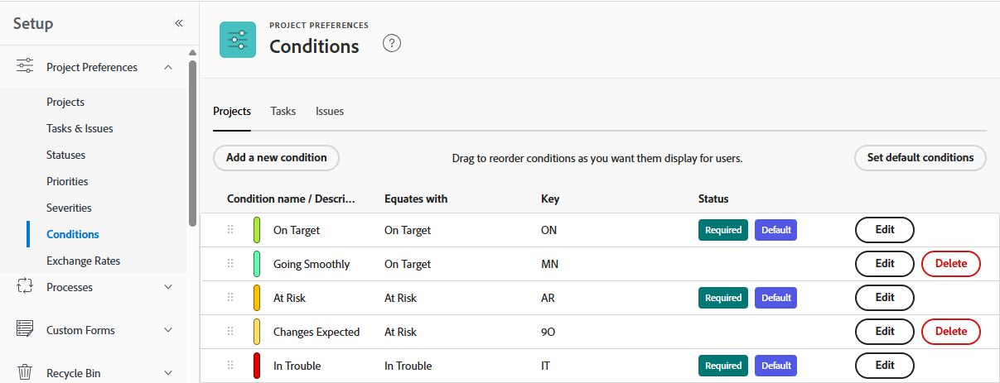
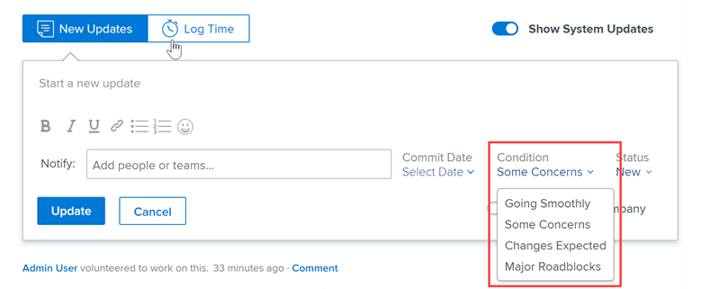

# Erstellen oder Bearbeiten einer benutzerdefinierten Bedingung

Als Adobe Workfront-Administrator können Sie eine benutzerdefinierte Bedingung für Projekte, Aufgaben und Probleme erstellen oder bearbeiten, um sie an die Anforderungen Ihres Unternehmens anzupassen.

## Zugriffsanforderungen

+++ Erweitern, um die Zugriffsanforderungen für die in diesem Artikel beschriebene Funktionalität anzuzeigen.

<table style="table-layout:auto"> 
 <col> 
 <col> 
 <tbody> 
  <tr> 
   <td>Adobe Workfront-Paket</td> 
   <td>
Beliebig
</td> 
  </tr> 
  <tr> 
   <td>Adobe Workfront-Lizenz</td> 
   <td>
Standard

       
Abo
</td>
  </tr> 
  <tr> 
   <td>Konfigurationen der Zugriffsebene</td> 
   <td>Systemadmin</td> 
  </tr> 
 </tbody> 
</table>

Weitere Informationen finden Sie unter [Zugriffsanforderungen in der Dokumentation zu Workfront](/help/quicksilver/administration-and-setup/add-users/access-levels-and-object-permissions/access-level-requirements-in-documentation.md).

+++

## Erstellen oder Bearbeiten einer benutzerdefinierten Bedingung

{{step-1-to-setup}}

1. Klicken Sie **Projektvoreinstellungen** > **Bedingungen**.

1. Klicken Sie auf die Registerkarte des Objekttyps (**Projekt**, **Aufgabe** oder **Problem**), den Sie mit der Bedingung verknüpfen möchten.

1. Um eine neue Bedingung zu erstellen, klicken Sie auf **Neue Bedingung hinzufügen**.

   ODER

   Um eine vorhandene Bedingung zu bearbeiten, klicken Sie **Bearbeiten** neben dem Namen der Bedingung.

   

1. Konfigurieren Sie Ihre benutzerdefinierte Bedingung mit den folgenden Optionen:

   <table style="table-layout:auto"> 
    <col> 
    <col> 
    <tbody> 
     <tr> 
      <td>Name der Bedingung</td> 
      <td>(Erforderlich) Geben Sie einen beschreibenden Namen für die Bedingung ein.</td> 
     </tr> 
     <tr> 
      <td>Beschreibung</td> 
      <td>(Optional) Geben Sie eine Beschreibung des Zwecks der Bedingung für die Benutzer ein, die sie verwenden werden.</td> 
     </tr> 
     <tr> 
      <td>Farbe</td> 
      <td>(Optional) Klicken Sie auf das Farbsymbol und wählen Sie dann die Farbe aus, die Sie für die Bedingung verwenden möchten, wenn sie in Projekten, Aufgaben oder Problemen angezeigt wird. Sie können auch eine Hexadezimalzahl eingeben.</td> 
     </tr> 
     <tr> 
      <td>Entspricht </td> 
      <td>
(Erforderlich, nur für Projekte) Klicken Sie auf die Option in der Dropdown-Liste, die die Funktion Ihrer neuen Bedingung am besten beschreibt. Beispiel: Für eine Bedingung mit dem Namen „Tracking Well“ würden Sie auf „Target“ klicken. Dadurch wird festgelegt, wie Ihre Standardbedingungen funktionieren. Jede von Ihnen erstellte Bedingung muss mit einer der Optionen im Dropdown-Menü übereinstimmen.

      
Weitere Informationen zu Standardbedingungen finden Sie unter <a href="../../../administration-and-setup/customize-workfront/create-manage-custom-conditions/set-custom-condition-default-projects.md" class="MCXref xref">Festlegen einer benutzerdefinierten Bedingung als Standard für Projekte</a> und <a href="../../../administration-and-setup/customize-workfront/create-manage-custom-conditions/set-custom-condition-default-tasks-issues.md" class="MCXref xref">Festlegen einer benutzerdefinierten Bedingung als Standard für Aufgaben und Probleme</a>.

      
Diese Option kann nach Abschluss der Erstellung der Bedingung nicht mehr geändert werden.
</td> 
     </tr> 
     <tr> 
      <td>Schlüssel</td> 
      <td>
(Erforderlich) Geben Sie für eine Projektbedingung eine alphanumerische Abkürzung ein, die Benutzende erkennen können. Geben Sie für eine Aufgaben- oder Problembedingung einen zweistelligen numerischen Code von 01 bis 99 ein. 

      
Dieser Schlüssel, der in der API verwendet wird und zu Berichtszwecken verwendet werden kann, muss für jedes Objekt eindeutig sein.

      
Sie können den Schlüssel für eine Bedingung nach dem Speichern der Bedingung nicht mehr ändern. 
</td> 
     </tr> 
     <tr> 
      <td>Bedingung ausblenden</td> 
      <td>
(Optional) Diese Option ist für benutzerdefinierte Bedingungen verfügbar, die Personen nicht mehr verwenden sollen, die sie jedoch aus historischen Gründen beibehalten möchten. 

      
Wenn Sie eine benutzerdefinierte Bedingung ausblenden, die für Arbeitselemente verwendet wurde, wird sie nach dem Ausblenden weiterhin in diesen Arbeitselementen angezeigt. 
</td> 
     </tr> 
    </tbody> 
   </table>

   >[!TIP]
   >
   >Sie können Bedingungsterminologie und Farben für alle drei Objekttypen standardisieren. Kopieren Sie dazu den Bedingungsnamen und den Hex-Farb-Code von einer Registerkarte (Projekt, Aufgabe, Problem) in die entsprechende Bedingung auf den anderen beiden Registerkarten.

1. (Optional) Ziehen Sie  eine beliebige Bedingung an eine neue Position, um die Liste neu anzuordnen.

   Dadurch wird die Reihenfolge geändert, in der Bedingungen in Projekten, Aufgaben und Problemen angezeigt werden:

   * Wenn ein Benutzer ein Projekt bearbeitet

     

   * Wenn ein(e) Benutzende(r) die Bedingung für eine Aufgabe oder ein Problem in einer Listenansicht ändert:

     

     >[!NOTE]
     >
     >In der Ansicht „Standardbedingung“ ist **Feld** Bedingung“ ein Feldtyp, der nicht inline bearbeitet werden kann. Wenn Sie das Feld **Bedingung** separat zu einer Ansicht hinzufügen, kann es bearbeitet werden. Weitere Informationen zur Inline-Bearbeitung finden Sie unter [Inline-Bearbeitung von Elementen in einer Liste in Adobe Workfront](/help/quicksilver/workfront-basics/navigate-workfront/use-lists/inline-edit-objects.md).

1. Klicken Sie auf **Speichern**.

Sie können Ihre benutzerdefinierte Bedingung als Standardbedingung für Projekte oder für Aufgaben und Probleme festlegen. Weitere Informationen finden Sie unter [Festlegen einer benutzerdefinierten Bedingung als Standard für Projekte](../../../administration-and-setup/customize-workfront/create-manage-custom-conditions/set-custom-condition-default-projects.md) und [Festlegen einer benutzerdefinierten Bedingung als Standard für Aufgaben und Probleme](../../../administration-and-setup/customize-workfront/create-manage-custom-conditions/set-custom-condition-default-tasks-issues.md).

Weitere Informationen zu benutzerdefinierten Bedingungen finden Sie unter [Benutzerdefinierte Bedingungen](../../../administration-and-setup/customize-workfront/create-manage-custom-conditions/custom-conditions.md).

<!-- 
   THIS WAS ORIGINALLY BETWEEN THE OTHER TWO BULLETS.
   * When a user is changing the condition for a task or issue on the Updates tab:

     
   -->
