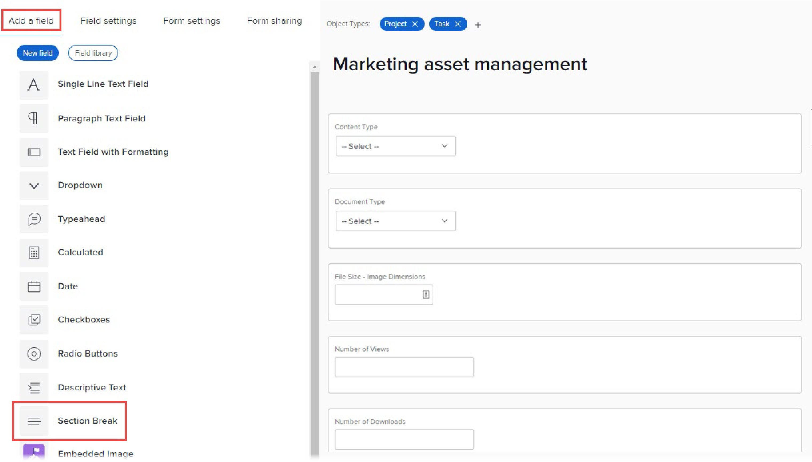

# Hinzufügen eines Abschnittsumbruchs zu einem benutzerdefinierten Formular

Sie können die benutzerdefinierten Felder und Widgets in einem benutzerdefinierten Formular in Abschnitte mit Überschriften gruppieren. Dies ist nützlich, um Benutzern, die das Formular ausfüllen, ein organisiertes Erlebnis zu präsentieren. Wenn Sie den Zugriff auf bestimmte benutzerdefinierte Felder und Widgets auf bestimmte Benutzer beschränken müssen, können Sie sie in einem Abschnitt platzieren und dann nur diesen Benutzern Zugriff auf den Abschnitt gewähren.

Wenn Sie beispielsweise sensible Informationen verfolgen müssen, die nur Systemadministratoren anzeigen oder bearbeiten können, können Sie einen Abschnittsumbruch mit Administratorberechtigungen erstellen und die sensiblen Felder in diesen Abschnitt einfügen.

Die Zugriffseinstellungen, die Sie für einen Abschnitt auswählen, sind direkt an die Berechtigungen gebunden, die Benutzer für das Workfront-Objekt haben, an das das benutzerdefinierte Formular angehängt ist. Sie können einen Abschnitt ein- oder ausblenden, je nachdem, ob der Benutzer Zugriff auf das Objekt hat, zu dem er beitragen oder es verwalten kann. Sie können auch einen Abschnitt auf &quot;Nur Administrator&quot;festlegen, damit nur Benutzer mit Systemadministrator-Zugriffsstufe darauf zugreifen können.

Weitere Informationen zu Berechtigungen für Objekte finden Sie unter [Übersicht über die Freigabe von Berechtigungen für Objekte](../../../workfront-basics/grant-and-request-access-to-objects/sharing-permissions-on-objects-overview.md).

Informationen zu benutzerdefinierten Feldern und Widgets in benutzerdefinierten Formularen finden Sie unter [Benutzerdefiniertes Feld zu einem benutzerdefinierten Formular hinzufügen](../../../administration-and-setup/customize-workfront/create-manage-custom-forms/add-a-custom-field-to-a-custom-form.md) und [Hinzufügen oder Bearbeiten eines Asset-Widgets in einem benutzerdefinierten Formular](../../../administration-and-setup/customize-workfront/create-manage-custom-forms/add-widget-or-edit-its-properties-in-a-custom-form.md).

<!--
>[!TIP]
>
>Section breaks that you add to custom forms are saved in your system for re-use. For information about listing them, see [List and edit custom forms and widgets added to custom forms](../../../administration-and-setup/customize-workfront/create-manage-custom-forms/list-edit-share-custom-forms-and-custom-fields.md).
-->

## Zugriffsanforderungen

Sie müssen über Folgendes verfügen, um die Schritte in diesem Artikel durchzuführen:

<table style="table-layout:auto"> 
 <col> 
 <col> 
 <tbody> 
  <tr data-mc-conditions=""> 
   <td role="rowheader"> 
Adobe Workfront-Plan*
 </td> 
   <td>Beliebig</td> 
  </tr> 
  <tr> 
   <td role="rowheader">Adobe Workfront-Lizenz*</td> 
   <td>Plan</td> 
  </tr> 
  <tr data-mc-conditions=""> 
   <td role="rowheader">Konfigurationen auf Zugriffsebene*</td> 
   <td> 
Administratorzugriff auf benutzerdefinierte Formulare
 
Informationen dazu, wie Workfront-Administratoren diesen Zugriff gewähren, finden Sie unter <a href="../../../administration-and-setup/add-users/configure-and-grant-access/grant-users-admin-access-certain-areas.md" class="MCXref xref">Benutzern administrativen Zugriff auf bestimmte Bereiche gewähren</a>.
 </td> 
  </tr>  
 </tbody> 
</table>

&#42;Wenden Sie sich an Ihren Workfront-Administrator, um zu erfahren, welche Konfigurationen für Plan, Lizenztyp oder Zugriffsstufe Sie verwenden.

## Erstellen und Konfigurieren des Zugriffs für einen Abschnitt in einem benutzerdefinierten Formular

1. Beginnen Sie mit der Erstellung oder Bearbeitung eines benutzerdefinierten Formulars, wie unter [Benutzerdefiniertes Formular erstellen oder bearbeiten](../../../administration-and-setup/customize-workfront/create-manage-custom-forms/create-or-edit-a-custom-form.md).
1. Fügen Sie benutzerdefinierte Felder und Widgets zum Formular hinzu, wie unter [Benutzerdefiniertes Feld zu einem benutzerdefinierten Formular hinzufügen](../../../administration-and-setup/customize-workfront/create-manage-custom-forms/add-a-custom-field-to-a-custom-form.md) und [Hinzufügen oder Bearbeiten eines Asset-Widgets in einem benutzerdefinierten Formular](../../../administration-and-setup/customize-workfront/create-manage-custom-forms/add-widget-or-edit-its-properties-in-a-custom-form.md).

1. Während Sie das benutzerdefinierte Formular noch erstellen oder bearbeiten, finden Sie im **Feld hinzufügen** Registerkarte, klicken Sie auf **Abschnittsumbruch**.

   

1. Im **Feldeinstellungen** die gewünschten Optionen für den Abschnitt konfigurieren:

   <table style="table-layout:auto"> 
    <col> 
    </col> 
    <col> 
    </col> 
    <tbody> 
     <tr> 
      <td role="rowheader">Bezeichnung</td> 
      <td> 
(Erforderlich) Geben Sie eine beschreibende Bezeichnung ein, die über dem Abschnitt angezeigt werden soll. Sie können den Titel jederzeit ändern.
 
<b>WICHTIG</b>: Vermeiden Sie die Verwendung von Sonderzeichen in dieser Bezeichnung. Sie werden in Berichten nicht korrekt angezeigt.
 </td> 
     </tr> 
     <tr> 
      <td role="rowheader">Beschreibung</td> 
      <td>Geben Sie Text ein, wenn Sie Benutzern erklären möchten, wofür der Abschnitt dient. Dies wird unter dem Titel des Abschnitts im benutzerdefinierten Formular angezeigt.</td> 
     </tr> 
     <tr> 
      <td role="rowheader">Logik hinzufügen</td> 
      <td>Verwenden Sie eine Anzeigelogik, um anzugeben, ob der Abschnitt basierend auf der Auswahl im Formular angezeigt werden soll, die Benutzer beim Ausfüllen des Formulars in benutzerdefinierten Feldern mit Mehrfachauswahl treffen. Weitere Informationen finden Sie unter <a href="../../../administration-and-setup/customize-workfront/create-manage-custom-forms/display-or-skip-logic-custom-form.md" class="MCXref xref">Anzeigenlogik hinzufügen und Logik zu einem benutzerdefinierten Formular überspringen</a>.</td> 
     </tr> 
     <tr> 
      <td role="rowheader"> 
Zugriff erteilen
 </td> 
      <td> 
 Wählen Sie die Berechtigungen aus, die Benutzer für ein Objekt benötigen, an das das benutzerdefinierte Formular angehängt ist, um diesen Abschnitt anzuzeigen und die Feldwerte zu bearbeiten. 
       
Die folgenden Berechtigungen sind unter <b>Benutzer mit diesem Zugriff auf das Objekt können Feldwerte anzeigen</b>:
 
         <ul>  
          <li>
<b>Eingeschränkte Bearbeitung</b>: (Nur verfügbar, wenn das Objekt ein Projekt, eine Aufgabe, ein Problem oder ein Benutzer ist):
 
          
Ermöglicht Benutzern, zum Objekt beizutragen, wenn es sich um ein Projekt, eine Aufgabe oder ein Problem handelt.

          
Ermöglicht Benutzern, das Profil zu bearbeiten oder Eigentümer der Profilberechtigung für das Objekt zu sein, wenn es ein Benutzer ist.
</li> 
          <li><b>Bearbeiten</b>: Berechtigungen für das Objekt verwalten </li> 
          <li><b>Nur Administrator</b>: Zugriffsstufe für Systemadministrator</li> 
         </ul> </li> 
        
Die folgenden Berechtigungen sind unter <b>Benutzer mit diesem Zugriff auf das Objekt können Feldwerte bearbeiten</b>: 
 
         <ul> 
          <li> 
<b>Eingeschränkte Bearbeitung</b>: (Nur verfügbar, wenn das Objekt ein Projekt, eine Aufgabe, ein Problem oder ein Benutzer ist):
 
           
Wenn das Objekt ein Projekt, eine Aufgabe oder ein Problem ist, ermöglicht diese Berechtigung Benutzern, zum Objekt beizutragen

          
Wenn das Objekt ein Benutzer ist, können Benutzer mit dieser Berechtigung das Profil bearbeiten oder Inhaber der Profilberechtigung für das Objekt sein.
 
          <li><b>Bearbeiten</b>: Berechtigungen für das Objekt verwalten </li> 
          <li><b>Nur Administrator</b>: Zugriffsstufe für Systemadministrator</li> 
         </ul> </li> 
       </ul> 
       
Weitere Informationen zu Berechtigungen für Objekte finden Sie unter <a href="../../../workfront-basics/grant-and-request-access-to-objects/sharing-permissions-on-objects-overview.md" class="MCXref xref">Übersicht über die Freigabe von Berechtigungen für Objekte</a>.
 
       
<b>NOTIZ</b>:  
       <ul> 
       <li> 
Benutzer ohne die hier angegebenen Berechtigungen können die benutzerdefinierten Felder und Widgets im Abschnitt nicht sehen. 
 
Dies gilt auch, wenn Sie die Feldwerte in Berichten anzeigen oder in berechneten Feldern in der Textmodusberichterstellung verwenden.
 </li> 
       <li> 
Wenn Sie mehrere Objekttypen mit Ihrem Formular verknüpfen, können sich die in diesen Schritten verfügbaren Anzeige- und Bearbeitungsberechtigungen ändern. Weitere Informationen finden Sie unter <a href="#how-multiple-object-types-can-affect-section-break-permissions-in-a-custom-form" class="MCXref xref">Wie sich mehrere Objekttypen auf die Berechtigung zum Umbruch von Abschnitten in einem benutzerdefinierten Formular auswirken können</a> in diesem Artikel.
 </li> 
        </ul> 
 </td> 
     </tr> 
    </tbody> 
   </table>

1. Ziehen Sie mindestens ein benutzerdefiniertes Feld oder Widget in den neuen Abschnitt oder fügen Sie es hinzu.

   Dies ist vor dem Speichern des Abschnitts erforderlich.

1. Klicken **Fertig**.

   >[!TIP]
   >
   >Sie können auf **Anwenden** Sie können jederzeit ein benutzerdefiniertes Formular erstellen, um Ihre Änderungen zu speichern und das Formular offen zu halten.

1. Wenn Sie Ihr benutzerdefiniertes Formular auf andere Weise weiter erstellen möchten, führen Sie einen der folgenden Artikel aus:

   * [Benutzerdefiniertes Feld zu einem benutzerdefinierten Formular hinzufügen](../../../administration-and-setup/customize-workfront/create-manage-custom-forms/add-a-custom-field-to-a-custom-form.md#add2)
   * [Hinzufügen oder Bearbeiten eines Asset-Widgets in einem benutzerdefinierten Formular](../../../administration-and-setup/customize-workfront/create-manage-custom-forms/add-widget-or-edit-its-properties-in-a-custom-form.md)
   * [Hinzufügen errechneter Daten zu einem benutzerdefinierten Formular](../../../administration-and-setup/customize-workfront/create-manage-custom-forms/add-calculated-data-to-custom-form.md)
   * [Positionieren von benutzerdefinierten Feldern und Widgets in einem benutzerdefinierten Formular](../../../administration-and-setup/customize-workfront/create-manage-custom-forms/position-fields-in-a-custom-form.md)
   * [Anzeigenlogik hinzufügen und Logik zu einem benutzerdefinierten Formular überspringen](../../../administration-and-setup/customize-workfront/create-manage-custom-forms/display-or-skip-logic-custom-form.md)
   * [Benutzerdefiniertes Formular in der Vorschau anzeigen und ausfüllen](../../../administration-and-setup/customize-workfront/create-manage-custom-forms/preview-and-complete-a-custom-form.md)

<!--
DRAFTED IN FLARE:
<h2>Configure access for fields without section breaks</h2>

************This section might get added later. Team decided not to implement.

In a custom form, you can also control users' access to custom fields
and image widgets that are not placed inside a defined section.

<ol>
<li value="1">Begin creating or editing a custom form, as described in <a href="../../../administration-and-setup/customize-workfront/create-manage-custom-forms/create-or-edit-a-custom-form.md" class="MCXref xref">Create or edit a custom form</a>.</li>
<li value="2">Add custom fields

and widgets

to the form, as described in <a href="../../../administration-and-setup/customize-workfront/create-manage-custom-forms/add-a-custom-field-to-a-custom-form.md" class="MCXref xref">Add a custom field to a custom form</a>.</li>
<li value="3"> 
While still creating or editing the custom form, open the <b>Form settings</b> tab.
 
SHOW THIS 
 </li>
<li value="4"> 
Under <b>Grant access</b>, configure the permissions that users need on an object where the custom form is attached, in order to view and edit values in fields not placed under a section break. 
 
If you need information about permissions on objects, see <a href="../../../workfront-basics/grant-and-request-access-to-objects/sharing-permissions-on-objects-overview.md" class="MCXref xref">Overview of sharing permissions on objects</a>.
 <note type="note">
<ul>
<li> 
Users without the permissions you specify here can't see the values of the fields
and image widgets that are not placed in a defined section in the custom form. This is also true if you display the values in reports or use them in calculated fields in text mode reporting.
 </li>
<li> 
Associating multiple object types with your form can change the viewing and editing permissions that are available in these steps. For more information, see <a href="#how-multiple-object-types-can-affect-section-break-permissions-in-a-custom-form" class="MCXref xref">How multiple object types can affect section break permissions in a custom form</a> in this article.
 </li>
</ul>
</note>
<table style="table-layout:auto">
<col>
<col>
<tbody>
<tr>
<td role="rowheader"><b>Users with this access to the object can view field values</b> </td>
<td>
<ul>  
<li> 
<b>Limited Edit</b>: (Available only if the object is a project, task, issue, or user):

<ul>
<li> 
Contribute permission to the object if it's a project, task, or issue
 </li>
<li> 
Edit the profile or own the profile permission to the object if it's a user (profile)
 </li>
</ul> </li>
<li><b>Edit</b>: Manage permissions to the object </li>
<li><b>Admin only</b>: System Administrator access level</li>
</ul> </td>
</tr>
<tr>
<td role="rowheader">Users with this access to the object can edit field values</td>
<td>
<ul>
<li> 
<b>Limited Edit</b>: (Available only if the object is a project, task, issue, or user):

<ul>
<li> 
Contribute permission to the object if it's a project, task, or issue
 </li>
<li> 
Edit the profile or own the profile permission to the object if it's a user (profile)
 </li>
</ul> </li>
<li><b>Edit</b>: Manage permissions to the object </li>
<li><b>Admin only</b>: System Administrator access level</li>
</ul> </td>
</tr>
</tbody>
</table> </li>
<li value="5"> 
Click Done.
 <note type="tip">
You can click
<strong>Apply</strong> at any point while you are creating a custom form to save your changes and keep the form open.
</note> </li>
<li value="6"> 
If you want to continue building your custom form in other ways, continue on to one of the following articles:

<ul>
<li><a href="../../../administration-and-setup/customize-workfront/create-manage-custom-forms/add-a-custom-field-to-a-custom-form.md#add2" class="MCXref xref">Add a custom field to a custom form</a> </li>
<li><a href="../../../administration-and-setup/customize-workfront/create-manage-custom-forms/add-widget-or-edit-its-properties-in-a-custom-form.md" class="MCXref xref">Add or edit an asset widget in a custom form</a> </li>
<li><a href="../../../administration-and-setup/customize-workfront/create-manage-custom-forms/add-calculated-data-to-custom-form.md" class="MCXref xref">Add calculated data to a custom form</a> </li>
<li><a href="../../../administration-and-setup/customize-workfront/create-manage-custom-forms/position-fields-in-a-custom-form.md" class="MCXref xref">Position custom fields and widgets in a custom form</a> </li>
<li><a href="../../../administration-and-setup/customize-workfront/create-manage-custom-forms/display-or-skip-logic-custom-form.md" class="MCXref xref">Add display logic and skip logic to a custom form</a> </li>
<li><a href="../../../administration-and-setup/customize-workfront/create-manage-custom-forms/preview-and-complete-a-custom-form.md" class="MCXref xref">Preview and complete a custom form</a> </li>
</ul> </li>
</ol>

-->

## Wie sich mehrere Objektarten auf die Genehmigungen von Abschnittsumbrüchen auswirken können {#how-multiple-object-types-can-affect-section-break-permissions-in-a-custom-form}

Die eingeschränkte Berechtigung zum Bearbeiten für benutzerdefinierte Formularabschnitte ist nur für die Objekttypen Projekt, Aufgabe, Problem und Benutzer verfügbar.

Wenn Sie in einem benutzerdefinierten Formular mit einer Abschnittspause, die mit der Berechtigung Eingeschränkte Bearbeitung konfiguriert wurde, einen der anderen Objekttypen zum Formular hinzufügen (Portfolio, Programm, Dokument, Firma, Rechnungsdatensatz, Iteration, Kosten oder Gruppe), werden Sie aufgefordert, zur Berechtigung &quot;Bearbeiten&quot;zu wechseln, die sowohl mit diesem Objekttyp als auch mit den vorhandenen Objekttypen im Formular kompatibel ist.

>[!INFO]
>
>**Beispiel:** In einem benutzerdefinierten Formular, das mit dem Projektobjekttyp verknüpft ist, wird ein Abschnittsumbruch mit der Berechtigung Eingeschränkte Bearbeitung konfiguriert.
>
>Sie fügen den Objekttyp Portfolio zum Formular hinzu. Das bedeutet, dass die Option Eingeschränkte Bearbeitungsberechtigung für den Abschnittsumbruch im Formular nicht mehr verfügbar ist.
>
>Eine On-Screen-Meldung fordert Sie auf, zur Berechtigung Bearbeiten zu wechseln. Diese Option ist mit der eingeschränkten Bearbeitung am ehesten vergleichbar und sowohl mit dem Projektobjekttyp als auch mit dem Portfolio-Objekttyp kompatibel.
