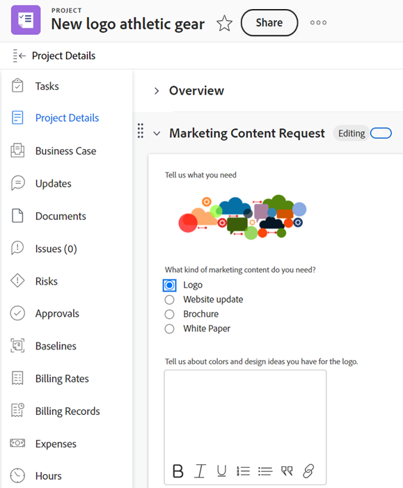

# Übersicht über benutzerdefinierte Formulare

<!--Audited: 12/2023-->

Sie können ein benutzerdefiniertes Formular erstellen, das Benutzerinnen und Benutzer an ein Adobe Workfront-Objekt anhängen können. Benutzende, die an dem Objekt arbeiten, können das benutzerdefinierte Formular ausfüllen, um Informationen über das Objekt bereitzustellen.

Sie können beispielsweise ein benutzerdefiniertes Formular namens „Marketing-Inhaltsforschung“ an ein Projekt anhängen, damit die Benutzer des Projekts Marketing-Inhalte für das Projekt anfordern können:

## Erstellen eines benutzerdefinierten Formulars

Der Formular-Designer verfügt über einen Arbeitsbereich im Arbeitsbereich-Stil, in dem Sie die Felder, Arbeitsfläche und Feldeinstellungen gleichzeitig anzeigen können. Außerdem können Sie beim Entwerfen des Formulars Felder per Drag-and-Drop in die Abschnitte ziehen. Sie können die Größe auf der rechten Seite des Bildschirms ändern, um mehr Platz für die Feldoptionen zu schaffen.

Weitere Informationen finden Sie unter [Erstellen eines benutzerdefinierten Formulars](/help/quicksilver/administration-and-setup/customize-workfront/create-manage-custom-forms/form-designer/design-a-form/design-a-form.md).

## Benutzerdefinierte Felder und Widgets

Workfront bietet viele integrierte Felder für jeden Objekttyp.

In einem benutzerdefinierten Formular können Sie zusätzliche Felder erstellen, die Benutzer nach Informationen fragen, die eindeutig für ihre Workflows sind. Diese benutzerdefinierten Felder sind die Bausteine eines benutzerdefinierten Formulars.

Sie können die folgenden Arten von benutzerdefinierten Feldern zu einem benutzerdefinierten Formular in Workfront hinzufügen:

* Einzeiliger Text
* Absatz
* Rich Text
* Einfachauswahl-Dropdown
* Mehrfachauswahl-Dropdown
* Externer Lookup
* Interne Suche
* Native Feldreferenz
* Planungs-Feldverbindung
* Berechnet
* Datum
* Kontrollkästchen-Gruppe
* Optionsfelder
* Beschreibender Text
* Abschnittsumbruch
* Adobe XD
* Bild
* PDF
* Video

>[!NOTE]
>
>Um Feldänderungen in Aktualisierungs-Feeds zu verfolgen, gehen Sie zu Einrichtung > Schnittstelle > Aktualisierungs-Feeds. Weitere Informationen finden Sie [Konfigurieren von Systemaktualisierungen](/help/quicksilver/administration-and-setup/set-up-workfront/system-tracked-update-feeds/configure-system-updates.md).

## Objekte, an die Benutzer ein benutzerdefiniertes Formular anhängen können

Beim Erstellen eines benutzerdefinierten Formulars können Sie es so konfigurieren, dass es mit mehr als einem Objekttyp funktioniert.

Benutzer können benutzerdefinierte Formulare an die folgenden Objekttypen anhängen:

* Projekt (einschließlich Business Cases)
* Aufgabe
* Problem (einschließlich Anfrage-Warteschlange)
* Firma
* Dokument
* Benutzerin oder Benutzer
* Programm
* Portfolio
* Ausgabe
* Gruppe
* Aufgabengebiet
* Team
* Wiederholung
* Abrechnungseintrag
* Tarifkarte
* Zuweisung

Weitere Informationen zum Anhängen benutzerdefinierter Formulare an Objekte finden Sie unter [Hinzufügen eines benutzerdefinierten Formulars zu einem Objekt](../../../workfront-basics/work-with-custom-forms/add-a-custom-form-to-an-object.md).

Informationen darüber, was bei der Konvertierung eines Objekts mit benutzerdefinierten Formularen geschieht, finden Sie unter [Übertragen von benutzerdefinierten Formulardaten beim Konvertieren eines Objekts](/help/quicksilver/administration-and-setup/customize-workfront/create-manage-custom-forms/transfer-custom-form-data-larger-item.md).

