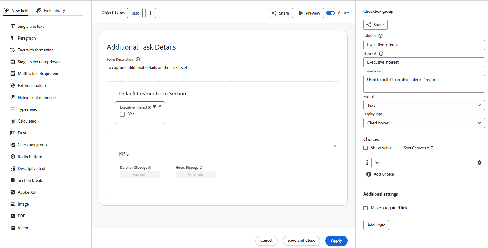

# Übersicht über benutzerdefinierte Formulare

<!--Audited: 12/2023-->

{{highlighted-preview}}

{{form-designer-default}}

Sie können ein benutzerdefiniertes Formular erstellen, das Benutzer an ein Adobe Workfront-Objekt anhängen können. Benutzer, die an dem Objekt arbeiten, können das benutzerdefinierte Formular ausfüllen, um Informationen über das Objekt bereitzustellen.

Sie können beispielsweise ein benutzerdefiniertes Formular mit dem Namen &quot;Marketing Content Research&quot;anhängen, das an ein Projekt angehängt wird, damit Benutzer des Projekts Marketinginhalte für das Projekt anfordern können:

## Erstellen eines benutzerdefinierten Formulars

Der Formularentwickler verfügt über einen Arbeitsbereich im Arbeitsbereich, mit dem Sie die Felder, Arbeitsfläche und Feldeinstellungen gleichzeitig anzeigen können. Außerdem können Sie Felder in die Abschnitte ziehen, während Sie Ihr Formular entwerfen. Sie können die Größe der rechten Seite des Bildschirms ändern, um mehr Platz für die Feldoptionen bereitzustellen.

Mit der Schaltfläche Layout (die in diesem Bild nicht angezeigt wird) können Sie aus einem zweispaltigen oder dreiseitigen Arbeitsbereich wählen. Die Schaltfläche gibt an, welches Layout derzeit ausgewählt ist. Das dreiseitige Layout zeigt die Feldeinstellungen in der Spalte ganz rechts an. Im zweispaltigen Layout werden die Feldeinstellungen in der linken Spalte neben der Feldbibliothek angezeigt.

Weitere Informationen finden Sie unter [Entwerfen eines Formulars mit dem Formularentwickler](/help/quicksilver/administration-and-setup/customize-workfront/create-manage-custom-forms/form-designer/design-a-form/design-a-form.md).

## Benutzerdefinierte Felder und Widgets

Workfront bietet für jeden Objekttyp viele integrierte Felder.

In einem benutzerdefinierten Formular können Sie zusätzliche Felder erstellen, die Benutzer auffordern, Informationen zu erhalten, die für ihre Workflows eindeutig sind. Diese benutzerdefinierten Felder sind die Bausteine eines benutzerdefinierten Formulars.

Sie können die folgenden Typen von benutzerdefinierten Feldern zu einem benutzerdefinierten Formular in Workfront hinzufügen:

* Einzeiliger Text
* Absatz
* Text mit Formatierung
* Dropdown für Einzelauswahl
* Dropdown für mehrere Auswahlen
* Externe Suche
* Referenz zu nativen Feldern
* Typeahead
* Berechnet
* Datum
* Kontrollkästchengruppe
* Optionsschaltflächen
* Beschreibender Text
* Abschnittsumbruch
* Adobe XD
* Bild
* PDF
* Video

>[!NOTE]
>
>Um Feldänderungen in Update-Feeds zu verfolgen, gehen Sie zu Einrichtung > Benutzeroberfläche > Feeds aktualisieren. Weitere Informationen finden Sie unter [Systemaktualisierungen konfigurieren](/help/quicksilver/administration-and-setup/set-up-workfront/system-tracked-update-feeds/configure-system-updates.md).

## Objekte, an die Benutzer ein benutzerdefiniertes Formular anhängen können

Wenn Sie ein benutzerdefiniertes Formular erstellen, können Sie es so konfigurieren, dass es mit mehr als einem Objekttyp funktioniert.

Benutzer können benutzerdefinierte Formulare an die folgenden Objekttypen anhängen:

* Projekt (einschließlich Geschäftsfälle)
* Aufgabe
* Problem (einschließlich Anforderungswarteschlange)
* Firma
* Dokument
* Benutzerin oder Benutzer
* Programm
* Portfolio
* Ausgabe
* Gruppe
* Wiederholung
* Abrechnungseintrag

Weitere Informationen zum Anhängen von benutzerdefinierten Formularen an Objekte finden Sie unter [Hinzufügen eines benutzerdefinierten Formulars zu einem Objekt](../../../workfront-basics/work-with-custom-forms/add-a-custom-form-to-an-object.md).

Informationen dazu, was mit benutzerdefinierten Formularen beim Konvertieren eines Objekts geschieht, finden Sie unter [Übertragen benutzerdefinierter Formulardaten beim Konvertieren eines Objekts](/help/quicksilver/administration-and-setup/customize-workfront/create-manage-custom-forms/transfer-custom-form-data-larger-item.md).

