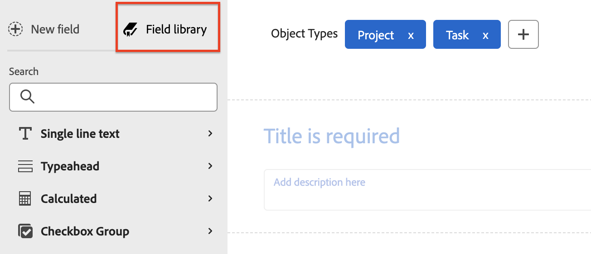

# Berechnete Felder zu einem Formular hinzufügen

Sie können ein berechnetes benutzerdefiniertes Feld hinzufügen, das vorhandene Daten verwendet, um neue Daten zu generieren, wenn das benutzerdefinierte Formular an ein Objekt angehängt wird.

Ein berechnetes benutzerdefiniertes Feld kann Folgendes enthalten:

* Ein einfacher Verweis auf ein einzelnes integriertes Feld.

  >[!INFO]
  >
  > **Beispiel:** Um den Umsatz zu berechnen, der durch Projekte und Aufgaben generiert wurde, können Sie ein berechnetes benutzerdefiniertes Feld erstellen, das das integrierte Feld &quot;Tatsächlicher Umsatz&quot;enthält. Wenn ein Benutzer das benutzerdefinierte Formular an ein Projekt oder eine Aufgabe anhängt, wird der Umsatz für das Projekt oder die Aufgabe im Feld angezeigt.

* Ein Ausdruck, der auf ein oder mehrere Felder verweist. Dabei kann es sich um benutzerdefinierte Felder, andere berechnete benutzerdefinierte Felder und integrierte Felder handeln.

  >[!INFO]
  >
  >**Beispiel:** Um den Gewinn zu berechnen, der durch Projekte und Aufgaben generiert wurde, können Sie ein berechnetes benutzerdefiniertes Feld namens &quot;Profit&quot;erstellen, das einen mathematischen Ausdruck enthält, der Kosten vom Umsatz abzieht.
  >
  >Dazu können Sie den mathematischen Ausdruck SUB (subtract) mit den integrierten Workfront-Feldern Tatsächliche Kosten und tatsächliche Umsätze verwenden.
  >
  >In den folgenden Schritten sehen Sie, wie dieses Beispiel ausgeführt werden kann.

## Zugriffsanforderungen

+++ Erweitern Sie , um die Zugriffsanforderungen für die Funktionalität in diesem Artikel anzuzeigen.

Sie müssen über Folgendes verfügen, um die Schritte in diesem Artikel durchzuführen:

<table style="table-layout:auto"> 
 <col> 
 <col> 
 <tbody> 
  <tr data-mc-conditions=""> 
   <td role="rowheader"> 
Adobe Workfront-Abo
 </td> 
   <td>Alle</td> 
  </tr> 
  <tr> 
   <td role="rowheader">Adobe Workfront-Lizenz</td> 
   <td>
   
Neu: Standard

   
oder

   
Aktuell: Plan
</td>
  </tr> 
  <tr data-mc-conditions=""> 
   <td role="rowheader">Konfigurationen auf Zugriffsebene</td> 
   <td> 
Administratorzugriff auf benutzerdefinierte Formulare
 </td> 
  </tr> 
 </tbody> 
</table>

Weitere Informationen zu den Informationen in dieser Tabelle finden Sie unter [Zugriffsanforderungen in der Workfront-Dokumentation](/help/quicksilver/administration-and-setup/add-users/access-levels-and-object-permissions/access-level-requirements-in-documentation.md).

+++

## Vorhandenes berechnetes benutzerdefiniertes Feld in einem benutzerdefinierten Formular wiederverwenden

Sie können dasselbe berechnete benutzerdefinierte Feld für benutzerdefinierte Formulare verwenden, die zu verschiedenen Objekten gehören. Sie können beispielsweise das Feld &quot;Errechneter Gewinn&quot;verwenden, das Sie für das benutzerdefinierte Projekt-Formular für eine Aufgabe in einem benutzerdefinierten Formular erstellt haben.

Bei Verwendung eines vorhandenen berechneten benutzerdefinierten Felds wird die Berechnung nicht auf das neue Formular übertragen. Sie müssen die Berechnung erneut im selben Feld zum neuen benutzerdefinierten Formular hinzufügen.

Sie können für dasselbe Feld auch eine andere Berechnung für das neue Formular erstellen. Die Beibehaltung des gleichen Namens für das berechnete benutzerdefinierte Feld gewährleistet Kohärenz und Konsistenz Ihrer Namenskonvention.

>[!IMPORTANT]
>
>Änderungen an berechneten Ausdrücken können dazu führen, dass der Feldwert für Objekte veraltet ist. Führen Sie einen der folgenden Schritte aus, um sicherzustellen, dass Sie die aktuelle Berechnung in diesen Feldern immer anzeigen:
>
>* Nachdem Sie ein Objekt gespeichert haben, in dem Sie Daten in einem angehängten benutzerdefinierten Formular bearbeitet haben, klicken Sie auf der Hauptseite des Objekts auf das Symbol Mehr und dann auf Benutzerdefinierte Ausdrücke neu berechnen .
>* Wählen Sie die Option Benutzerdefinierte Ausdrücke neu berechnen , wenn Sie Objekte stapelweise bearbeiten.
>* Wählen Sie bei der Bearbeitung eines berechneten benutzerdefinierten Felds in einem benutzerdefinierten Formular die Option Vorherige Berechnungen aktualisieren .

So verwenden Sie ein vorhandenes berechnetes benutzerdefiniertes Feld:

{{step-1-to-setup}}

1. Klicken Sie im linken Bereich auf **Benutzerdefinierter Forms** .

   <!-- >[!TIP]
    >
    >In the view that appears, you can review all custom forms and custom fields that have been created for your organization. You can also see who created each form and the fields that are associated with it. -->

1. Klicken Sie auf **Neues benutzerdefiniertes Formular.**
1. Wählen Sie die Objekttypen aus, an die das benutzerdefinierte Formular angehängt werden soll, und klicken Sie dann auf **Weiter**.

1. Klicken Sie oben links im Bildschirm auf **Feldbibliothek**.

   

1. Verwenden Sie das Suchfeld oder erweitern Sie den Abschnitt **Berechnet** , um das erforderliche berechnete Feld zu finden. Ziehen Sie dann das Feld an die Stelle, an der es im benutzerdefinierten Formular angezeigt werden soll.

1. (Optional) Wiederholen Sie den vorherigen Schritt, um weitere Felder hinzuzufügen.

   >[!NOTE]
   >
   >Sie können bis zu 500 Felder und Widgets in einem einzelnen benutzerdefinierten Formular hinzufügen. Je nach Komplexität eines Formulars kann die Leistung jedoch beeinträchtigt werden, wenn mehr als 100 Formulare vorhanden sind.
   >
   >
   >Beispiele für komplexe Formulare sind Formulare mit kaskadierenden Parametern, berechnete benutzerdefinierte Datenfelder und Optionen mit mehreren Werten in einem einzelnen Feld.

1. Um Ihre Änderungen zu speichern, klicken Sie auf **Anwenden** und fahren Sie mit einem anderen Abschnitt fort, um mit dem Erstellen Ihres Formulars fortzufahren.

   oder

   Klicken Sie auf **Speichern und schließen**.

## Neues berechnetes Feld hinzufügen

>[!IMPORTANT]
>
>Bevor Sie ein neues berechnetes benutzerdefiniertes Feld erstellen, identifizieren Sie die vorhandenen Felder, die Sie einbeziehen möchten, damit Sie sicher sind, dass die für die Berechnung erforderlichen Daten in Workfront vorhanden sind.

{{step-1-to-setup}}

1. Klicken Sie im linken Bereich auf **Benutzerdefinierter Forms** .

   <!-- >[!TIP]
    >
    >In the view that appears, you can review all custom forms and custom fields that have been created for your organization. You can also see who created each form and the fields that are associated with it. -->

1. Klicken Sie auf **Neues benutzerdefiniertes Formular.**
1. Wählen Sie die Objekttypen aus, an die das benutzerdefinierte Formular angehängt werden soll, und klicken Sie dann auf **Weiter**.

1. Suchen Sie auf der linken Seite des Bildschirms nach **Berechnet** und ziehen Sie es in einen Bereich auf der Arbeitsfläche.

   

1. Konfigurieren Sie auf der rechten Bildschirmseite die Optionen, die für den Typ des benutzerdefinierten Felds verfügbar sind, das Sie hinzufügen:

   <table style="table-layout:auto"> 
    <col> 
    </col> 
    <col> 
    </col> 
    <tbody> 
     <tr> 
      <td role="rowheader">Label</td> 
      <td>Geben Sie eine Beschriftung für das Feld ein. Dies wird Benutzern bei der Verwendung des benutzerdefinierten Formulars angezeigt. Das automatisch ausgefüllte Feld <b>Name</b> wird von Workfront in Berichten referenziert.</td> 
     </tr> 
     <tr> 
      <td role="rowheader" id="instructions">Anleitung</td> 
      <td> Standardmäßig wird hier die Formel gespeichert, die Sie für das Feld erstellen. Sie können Text hinzufügen, um zusätzliche Informationen über das Feld und die Formel darin bereitzustellen. Dies kann auf zwei Arten nützlich sein: 
       <ul> 
      <li>
Erinnern Sie sich daran, was die Formel ist und wie sie funktioniert. Dies ist besonders hilfreich, wenn Sie dieses berechnete benutzerdefinierte Feld für mehrere Formulare verwenden möchten.
 </li> 
      <li> 
Als QuickInfo können Benutzer sehen, wenn sie den Mauszeiger über das Feld bewegen. Hier fügen Sie Text hinzu, den Sie in der QuickInfo sehen möchten.
 
Wenn Sie nicht möchten, dass sie die Formel in der QuickInfo sehen, was für sie verwirrend sein kann, können Sie sie verbergen.</li> 
       </ul> </td> 
     </tr> 
     <tr> 
      <td role="rowheader">Format</td> 
      <td> 
Das Format, in dem die Ergebnisse des Felds gespeichert und angezeigt werden sollen.
 
Wenn das Feld in mathematischen Berechnungen verwendet wird, verwenden Sie immer das Format <strong>Zahl</strong> oder <strong>Währung</strong> . Wenn Sie "Zahl"oder "Währung"auswählen, schneidet das System automatisch Zahlen ab, die mit 0 beginnen.
 
      
<b>WICHTIG</b>: Bevor Sie ein Format auswählen, sollten Sie das richtige Format für das neue Feld berücksichtigen. Das Formatfeld kann nach dem Speichern des benutzerdefinierten Formulars nicht mehr bearbeitet werden. Die Auswahl des falschen Formats könnte sich auf zukünftige Berechnungen und aggregierte Werte in Berichts- und Listengruppierungen auswirken.

      
<strong>HINWEIS:</strong> Berechnete Felder mit dem Währungsformat dürfen keine Anführungszeichen enthalten. (Verwenden Sie beispielsweise 800.00 und nicht "800.00.") Die Verwendung von Anführungszeichen kann aufgrund von Nuancen bei der Sprachformatierung für Währungstypen zu unerwarteten Folgen führen.
</td>
     </tr> 
    </tbody> 
   </table>

1. Beginnen Sie im Feld **Berechnung** mit der Erstellung Ihrer Berechnung:
   1. Klicken Sie auf **Maximieren** , um den Berechnungs-Editor zu öffnen und Ihre Berechnung zu erstellen.

Eine Berechnung beginnt normalerweise mit einem Ausdruck, gefolgt von Klammern, die die Felder enthalten, auf die Sie verweisen möchten, wenn das benutzerdefinierte Formular an ein Objekt angehängt wird.

      Jedes Feld muss mit geschweiften Klammern umgeben sein. Wenn Sie mit der Eingabe des Namens eines Felds beginnen, unterbreitet das System Vorschläge und Sie können einen Vorschlag auswählen, um ihn in Ihre Berechnung einzufügen.

+++ **Erweitern, um die in berechneten benutzerdefinierten Feldern erforderliche Syntax anzuzeigen**

      Jedes Feld muss die unten beschriebene Syntax verwenden, wobei die einzelnen Feldnamen in geschweifte Klammern gesetzt werden müssen. Wenn Sie mit der Eingabe des Namens eines Felds beginnen, unterbreitet das System Vorschläge und Sie können einen Vorschlag auswählen, um ihn in Ihre Berechnung einzufügen. Wenn Sie Daten in einer Berechnung falsch eingeben, werden Sie durch eine Warnmeldung benachrichtigt. Sie können das Formular nur speichern, wenn Sie die Berechnung so bearbeiten, dass sie gültige Felder und einen gültigen berechneten Ausdruck enthält.

      >[!NOTE]
      >
      >Derzeit unterbreitet das System Vorschläge nur, wenn Sie mit der Eingabe des Namens eines Felds beginnen, auf das Sie auf ein Objekt verweisen möchten, an das das benutzerdefinierte Formular angehängt wird. Felder aus dem übergeordneten Objekt werden nicht vorgeschlagen.

      **Feldnamen mit geschweiften Klammern umgeben**

      * Wenn die Berechnung auf ein integriertes Feld verweisen soll, muss der Feldname von geschweiften Klammern umgeben sein.

        Beispiel: `{actualRevenue}`

        Bei Feldnamen wird zwischen Groß- und Kleinschreibung unterschieden und sie müssen in der Berechnung genau so angezeigt werden, wie sie im Workfront-System erscheinen.

        Navigieren Sie zum [Workfront API-Explorer](https://developer.adobe.com/workfront/api-explorer/), um die Feldnamen zu identifizieren, die in Berechnungen verwendet werden können.

      * Wenn die Berechnung auf ein benutzerdefiniertes Feld verweisen soll, muss der Feldname in geschweiften Klammern stehen und in den Klammern vor `DE:` stehen.

        Beispiel: `{DE:Profit}`

        Das System listet alle benutzerdefinierten Felder auf, aus denen Sie bei der Eingabe von `DE:` wählen können.

         * Wenn die Berechnung auf ein Feld verweisen soll, das Daten aus dem Objekt *parent* abruft, wenn das benutzerdefinierte Formular an ein Objekt angehängt wird, müssen Sie dem Feldnamen den Objekttyp des übergeordneten Objekts voranstellen (auch in geschweiften Klammern).

        Wenn das benutzerdefinierte Formular beispielsweise für Aufgaben konfiguriert ist und Sie möchten, dass das Feld den tatsächlichen Umsatz des übergeordneten Objekts berechnet, wenn das Formular an eine Aufgabe angehängt wird, müssen Sie &quot;`Project`&quot;als Objekttyp des Felds angeben:

        `{project}.{actualRevenue}`

        Oder, wenn es ein benutzerdefiniertes Feld ist:

        `{project}.{DE:profit}`

        **Elemente durch Punkte trennen**

        Wenn Sie in einem berechneten benutzerdefinierten Feld auf ein verwandtes Objekt verweisen, müssen Sie Objektnamen und -attribute durch Punkte trennen.

        Wenn Sie beispielsweise in einem benutzerdefinierten Formular vom Typ Aufgabe den Namen des Eigentümers des Portfolios in einem berechneten benutzerdefinierten Feld anzeigen möchten, geben Sie Folgendes ein:

        `{project}.{porfolio}.{owner}`

        Dadurch wird Folgendes bestimmt: Über das Objekt des benutzerdefinierten Formulars (eine Aufgabe) können Sie auf das nächste Objekt zugreifen, das mit der Aufgabe verbunden ist (ein Projekt). Von dort können Sie auf das nächste verwandte Objekt zum Projekt (ein Portfolio) zugreifen und dann auf die Felder verweisen, die für das Portfolioobjekt definiert sind (der Eigentümer)

        **Namenssyntax für die Referenzierung eines benutzerdefinierten Felds**

        Wenn Sie in einem berechneten benutzerdefinierten Feld auf ein anderes benutzerdefiniertes Feld verweisen, müssen Sie den Feldnamen so eingeben, wie er in der Benutzeroberfläche von Workfront angezeigt wird.

        Um beispielsweise auf die ausgewählte Option in einem benutzerdefinierten Feld mit der Bezeichnung Executive sponsor zu verweisen, geben Sie Folgendes ein:

        `{DE:Executive sponsor}`

        >[!NOTE]
        >
        >Die Syntax für ein typeahead -Feld unterscheidet sich von der für andere Feldtypen, da Sie am Ende `:name` hinzufügen müssen.
        >
        >Um beispielsweise auf die ausgewählte Option in einem benutzerdefinierten Typenvorfeld mit dem Namen &quot;Executive sponsor&quot;zu verweisen, geben Sie Folgendes ein:
        >
        >`{DE:Executive sponsor:name}`

        **Berechnete benutzerdefinierte Felder in benutzerdefinierten Formularen mit mehreren Objekten**

        In einem benutzerdefinierten Formular mit mehreren Objekten müssen die ausgewählten Objektarten mit mindestens einem Feld kompatibel sein, auf das in den berechneten benutzerdefinierten Feldern des Formulars verwiesen wird. Bei Feldern, die nicht mit dem Objekt kompatibel sind, wird im Formular &quot;K/A&quot;angezeigt.

        Um sicherzustellen, dass das berechnete Feld für alle Objekttypen ein korrektes Ergebnis anzeigt, müssen Sie mit `$$OBJCODE` eine Berechnung für jeden Objekttyp definieren.

        >[!INFO]
        >
        >**Beispiel:**
        >
        >In einem benutzerdefinierten Formular, das für die Arbeit mit Projekten, Aufgaben und Problemen konfiguriert wurde, können Sie die folgende Formel verwenden, um den Objekttyp anzuzeigen:
        >
        >`IF($$OBJCODE="PROJ","This is a project",IF($$OBJCODE="TASK","This is a task","This is an issue"))`
        >
        >In einem Projekt zeigt das Feld &quot;Dies ist ein Projekt&quot;, in einer Aufgabe wird &quot;Dies ist eine Aufgabe&quot; und in einem Problem wird &quot;Dies ist ein Problem&quot; angezeigt.

        >[!INFO]
        >
        >**Beispiel:** Obwohl es in Projekten kein Feld &quot;Zugeordneter Name&quot;gibt, gibt es ein integriertes Feld &quot;Eigentümer&quot;(das automatisch mit dem Namen der Person gefüllt wird, die das Projekt erstellt hat, es sei denn, dies wird manuell geändert).
        >
        >In Ihrem benutzerdefinierten Feld &quot;In Charge&quot;können Sie also &quot;`$$OBJCODE`&quot;wie unten gezeigt verwenden, um auf das Feld &quot;Inhaber&quot;zu verweisen, wenn das benutzerdefinierte Formular an ein Projekt angehängt wird, und auf das Feld &quot;Zugeordneter Name&quot;, wenn das Formular an eine Aufgabe angehängt wird:
        >
        >`IF($$OBJCODE="PROJ",{owner}.{name},{assignedTo}.{name})`

        Weitere Informationen zu Variablen wie `$$OBJCODE,` finden Sie unter [Übersicht über Wildcard-Filtervariablen](/help/quicksilver/reports-and-dashboards/reports/reporting-elements/understand-wildcard-filter-variables.md).

        **Automatische Aktualisierung berechneter benutzerdefinierter Felder**

        Berechnete benutzerdefinierte Felder eines Objekts werden automatisch neu berechnet, wenn Folgendes geschieht:

         * Es ändert sich etwas am Objekt, z. B. eine tägliche Timeline-Berechnung.
         * Jemand bearbeitet ein anderes Feld, das durch ein berechnetes benutzerdefiniertes Feld im Objekt referenziert wird.
         * Der berechnete Ausdruck ist leer und das Feld enthält einen Wert. Dadurch wird der Wert auf null gesetzt.

           >[!NOTE]
           >
           >
In einem benutzerdefinierten Formular, das an ein Objekt angehängt ist, werden Datums- und Uhrzeitanweisungen in berechneten benutzerdefinierten Feldern von der koordinierten UTC (Universal Time) berechnet und gespeichert, nicht von den Zeitzonenkonfigurationen, die für die Instanz Ihres Unternehmens und Ihr Benutzerprofil festgelegt sind. Berechnungen in einem benutzerdefinierten Formular werden basierend auf den individuellen Zeitzonen der einzelnen Benutzer generiert.

+++

   1. Klicken Sie in das große Textfeld und dann auf **Ausdrücke** und **Felder** , die verfügbar sind, um sie Ihrer Berechnung hinzuzufügen.

      Sie können auch mit der Eingabe eines Ausdrucks oder Felds in das große Textfeld beginnen und es dann auswählen, wenn es angezeigt wird. Jedes Element wird mit einem &quot;F&quot;für das Feld oder einem &quot;E&quot;für den Ausdruck angezeigt.

      Wenn Sie eine öffnende Klammer eingeben, wird die schließende Klammer automatisch hinzugefügt.

+++ **Erweitern, um nützliche Tipps anzuzeigen**

      >[!TIP]
      >
      >Sie können eine der folgenden Aktionen ausführen, um Hilfe bei der Berechnung zu erhalten:
      > 
      >* Bewegen Sie den Mauszeiger über einen Ausdruck in Ihrer Berechnung, um eine Beschreibung, ein Beispiel, in dem gezeigt wird, wie er verwendet werden kann, und einen Link &quot;Weitere Informationen&quot;zu weiteren Informationen im Artikel [Übersicht über berechnete Datenausdrücke](/help/quicksilver/reports-and-dashboards/reports/calc-cstm-data-reports/calculated-data-expressions.md) anzuzeigen.
      >  
      >* Verwenden Sie die Farbcodierung, um die hinzugefügten Komponenten zu identifizieren. Die Ausdrücke werden blau und die Felder grün angezeigt.
      >  
      >* Suchen Sie nach Berechnungsfehlern, die bei der Durchführung hervorgehoben sind. Sie können den Mauszeiger über einen hervorgehobenen Fehler bewegen, um eine kurze Beschreibung seiner Ursache anzuzeigen.
      >  
      >* Zeigen Sie im Bereich unter Ihrer Berechnung eine Vorschau der Ergebnisse an einem vorhandenen Workfront-Objekt an.
      ><!--or by providing test values (NOT READY YET; CHANGE THIS SCREENSHOT WHEN IT IS)-->
      >  
      >* Referenzausdrücke in einer langen Berechnung unter Verwendung der auf der linken Seite angezeigten Zeilennummern.

+++
   1. Klicken Sie auf **Minimieren** , wenn Sie mit der Erstellung der Berechnung für das berechnete benutzerdefinierte Feld fertig sind.

   1. (Optional) Verwenden Sie eine der folgenden Optionen, um Ihr berechnetes benutzerdefiniertes Feld weiter zu konfigurieren:

      <table style="table-layout:auto">
   <col> 
    <col> 
    <tbody> 
     <tr> 
      <td role="rowheader">Logik hinzufügen</td> 
      <td>Sie können die Anzeigelogik hinzufügen, um zu bestimmen, ob das berechnete Feld angezeigt wird, basierend auf mindestens einer Auswahl, die ein Benutzer beim Ausfüllen des Formulars in einem vorherigen Multiple-Choice-Feld (Dropdown, Kontrollkästchen oder Optionsfelder) trifft. <!-- For more information, see <a href="Need to add link for new article when it's written" class="MCXref xref">Add display logic and skip logic to a custom form</a>.--> 
Dies ist nur verfügbar, wenn dem berechneten benutzerdefinierten Feld im Formular mindestens ein Kontrollkästchen, ein Optionsfeld oder ein Dropdown-Feld vorangeht. 
 
Die Logik für das Überspringen ist für berechnete benutzerdefinierte Felder nicht verfügbar.
 </td> 
     </tr> 
     <tr> 
      <td role="rowheader">Vorherige Berechnungen aktualisieren</td> 
      <td>Wenn Sie ein vorhandenes berechnetes benutzerdefiniertes Feld bearbeiten, können Sie diese Option auswählen, um beim Speichern des benutzerdefinierten Formulars eine Aktualisierung der Berechnung Trigger. Dies geschieht nur einmal, wenn Sie das benutzerdefinierte Formular speichern. Die Option wechselt in den deaktivierten Status zurück, nachdem Sie dies getan haben.</td> 
     </tr> 
     <tr> 
      <td role="rowheader">Formel in Anleitungen anzeigen</td> 
      <td>Lassen Sie diese Option aktiviert, wenn Benutzer, die das benutzerdefinierte Formular ausfüllen, die Formel des Felds sehen sollen, wenn sie den Mauszeiger über das Feld bewegen. Weitere Informationen finden Sie in den Informationen zu <a href="#instructions" class="MCXref xref">Anweisungen</a> weiter oben in dieser Tabelle.</td> 
     </tr> 
    </tbody> 
   </table>

1. Um Ihre Änderungen zu speichern, klicken Sie auf **Anwenden** und fahren Sie mit einem anderen Abschnitt fort, um mit dem Erstellen Ihres Formulars fortzufahren.

   oder

   Klicken Sie auf **Speichern und schließen**.
