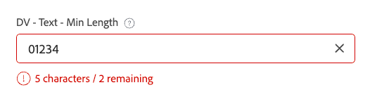
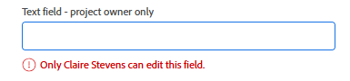

# Beispiele für erweiterte Logik in benutzerdefinierten Formularen

Logikregeln ermöglichen es Ihnen, die Felder in einem benutzerdefinierten Formular weiter anzupassen.

Dieser Artikel enthält Beispiele für Ausdrücke, die zum Erstellen einer erweiterten Logik in benutzerdefinierten Feldern verwendet werden.

Weitere Informationen zum Hinzufügen von Logik zu einem benutzerdefinierten Formular finden Sie unter [Hinzufügen von Logikregeln zu benutzerdefinierten Formularen und Feldern](/help/quicksilver/administration-and-setup/customize-workfront/create-manage-custom-forms/form-designer/design-a-form/display-skip-logic-form-designer.md).

## Zugriffsanforderungen

+++ Erweitern Sie , um die Zugriffsanforderungen für die -Funktion in diesem Artikel anzuzeigen.

<table style="table-layout:auto"> 
 <col> 
 <col> 
 <tbody> 
  <tr> 
   <td>Adobe Workfront-Paket</td> 
   <td><p>Beliebig</p></td> 
  </tr> 
  <tr> 
   <td>Adobe Workfront-Lizenz</td> 
   <td><p>Standard</p>
       <p>Plan</p></td>
  </tr> 
  <tr> 
   <td>Konfigurationen der Zugriffsebene</td> 
   <td> <p>Administrativer Zugriff auf benutzerdefinierte Formulare</p> </td> 
  </tr>  
 </tbody> 
</table>

Weitere Informationen finden Sie unter [Zugriffsanforderungen in der Dokumentation zu Workfront](/help/quicksilver/administration-and-setup/add-users/access-levels-and-object-permissions/access-level-requirements-in-documentation.md).

+++

## Beispiele für Validierungslogik

Validierungslogik wird mithilfe von Formeln erstellt, und Sie können die Logik so einfach oder so komplex gestalten, wie Sie benötigen. Die Validierung kann auf den Werten anderer Felder oder dem Status von Objekten basieren, und Sie können eine Fehlermeldung bereitstellen, die angibt, wenn die Validierung fehlschlägt.

Wenn das Feld mit der angewendeten Logik die definierten Validierungsbedingungen erfüllt, wenn ein Benutzer das benutzerdefinierte Formular ausfüllt, wird das Feld hervorgehoben und die Fehlermeldung angezeigt.

Sie können Validierungslogik auf die folgenden Feldtypen anwenden: einzeiliger Text, Absatz, Dropdown-Liste mit einfacher Auswahl, Dropdown-Liste mit Mehrfachauswahl, externe Suche, automatische Textvervollständigung, Datum, Kontrollkästchen-Gruppe und Optionsfelder.

### Lassen Sie nur zu, dass der Projektbesitzer „Rush“ für SLA auswählt

In diesem Beispiel hat ein Dropdown-Feld mit nur einer Auswahl Optionen für den SLA von Standard - 14 Tage, Priorität - 7 Tage und Eile - 2 Tage.

Ausdruck für die Überprüfung:

```
IF({ownerID}!=$$USER&&{DE:DV - Dropdown - Control Dates}="2",CONCAT("Only ",{owner}.{name}," may select X Rush"))
```

Wenn ein Benutzer, der nicht Projekteigentümer ist (einschließlich Systemadmins) versucht, **X Rush** auszuwählen, wird ein Fehler angezeigt:


### Datumsvalidierung basierend auf der Auswahl im vorherigen Feld

Wenn Sie mit dem Beispiel SLA fortfahren, können Sie ein Datumsfeld hinzufügen, das anhand der Einstellungen aus dem vorherigen Dropdown-Feld validiert wird.

Ausdruck für die Überprüfung:

```
IF({DE:DV - Date - Dropdown SLA}<ADDDAYS($$TODAY,{DE:DV - Dropdown - Control Dates}),CONCAT("Earliest: ",ADDDAYS($$TODAY,{DE:DV - Dropdown - Control Dates})))
```

Wenn Benutzende ein Datum vor dem zulässigen Datum auswählen, zeigt die Nachricht das früheste Datum an, das sie auswählen können:


### Minimale Zeichenanzahl mit der Option zum Überschreiben

In diesem Beispiel wird für ein Textfeld eine Mindestanzahl von Zeichen erzwungen, wobei die Anzahl der Zeichen angezeigt wird. Außerdem ist ein separates Kontrollkästchen eingerichtet, um die Validierung der Zeichenanzahl zu deaktivieren.

Ausdruck für die Überprüfung:

```
IF({DE:DV - Override}!="Disable Validation"&&LEN({DE:DV - Text - Min Length})<"7",CONCAT(LEN({DE:DV - Text - Min Length})," characters / ",("7"-LEN({DE:DV - Text - Min Length}))," remaining"))
```

Die Durchsetzung der Validierung kann außer Kraft gesetzt werden, indem das Kontrollkästchen aktiviert wird:


Im Textfeld wird eine laufende Zeichenzahl angegeben:



### Sperren Sie ein Feld, damit nur der Besitzer es bearbeiten kann

In diesem Beispiel kann ein Feld nur vom Projektbesitzer bearbeitet werden. Selbst der Systemadministrator bzw. die Systemadministratorin kann das Feld nicht bearbeiten.

Ausdruck für die Überprüfung:

```
IF({ownerID}!=$$USER,IF(ISBLANK({ownerID}),"Project Owner will provide this.",CONCAT("Only ",{owner}.{name}," can edit this.")))
```

Wenn ein(e) Benutzende(r), der/die nicht der/die Projektbesitzer(in) ist, versucht, Text in das Feld einzugeben, wird eine Meldung angezeigt, die besagt, dass nur der/die Projektbesitzer(in) das Feld bearbeiten kann.



### Mit automatischer Textvervollständigung können Werte basierend auf anderen Feldwerten zugelassen oder zurückgewiesen werden

In diesem Beispiel lässt ein Feld mit automatischer Textvervollständigung Werte basierend auf dem in einem anderen Feld des Formulars eingegebenen Wert dynamisch zu oder lehnt sie ab.

Ausdruck für die Überprüfung:

```
IF({DE:DV - Text - Budget}>"10000",
   IF({DE:DV - TA User - by Budget}.{role}!="Director","Requires Director Approver")
)
```

Wenn der Wert im Feld Budget größer als 10.000 USD ist, können nur Benutzer mit der Rolle Director aus der automatisierten Textvervollständigung ausgewählt werden, auch wenn in der automatisierten Textvervollständigung kein Rollenfilter aktiviert ist.


### Werte, die weniger als 10 Tage ab dem Eingabedatum liegen, verbieten

In diesem Beispiel lässt die Validierung nur Werte zu, die ab dem Eingabedatum 10 Tage in der Zukunft liegen. Die Option zum Außerkraftsetzen der Validierung (in einem separaten Kontrollkästchen) ist ebenfalls in der Formel enthalten, sodass das Datumsfeld leer bleibt.

Ausdruck für die Überprüfung:

```
IF({DE:DV - Override}!="Disable Validation"&&ISBLANK({DE:DV - Date - Deadline})!="true"&&{DE:DV - Date - Deadline}<ADDDAYS({entryDate},"10"),CONCAT("Earliest: ",ADDDAYS({entryDate},"10")))
```

Beliebiger Wert, der weniger als 10 Tage ab dem Eingabedatum der Validierung der Trigger liegt:


Bei einem leeren Wert wird die Validierungsmeldung nicht Trigger:


### Exakte/minimale/maximale Auswahl in einem Mehrfachauswahlfeld erzwingen

In diesem Beispiel erfordert ein Feld mit mehreren Auswahlmöglichkeiten, z. B. eine Kontrollkästchengruppe, dass der Benutzer eine bestimmte Anzahl von Optionen auswählt.

Validierungsausdruck (genau zwei auswählen):

```
IF({DE:DV - Override}!="Disable Validation"&&ARRAYLENGTH(ARRAY({DE:DV - Checkbox - Pick exactly 2},","))!="2","Pick Exactly 2 Options")
```

Validierungsausdruck (mindestens zwei auswählen):

```
IF({DE:DV - Override}!="Disable Validation"&&ARRAYLENGTH(ARRAY({DE:DV - Checkbox - Pick at least 2},","))<"2","Pick at least 2 choices")
```

Validierungsausdruck (maximal zwei auswählen):

```
IF({DE:DV - Override}!="Disable Validation"&&ARRAYLENGTH(ARRAY({DE:DV - Checkbox - Pick no more than 2},","))>"2","Pick no more than 2 choices")
```

Der/die Benutzende sieht Validierungsfehler, wenn er/sie nicht die richtige Anzahl von Optionen auswählt.


