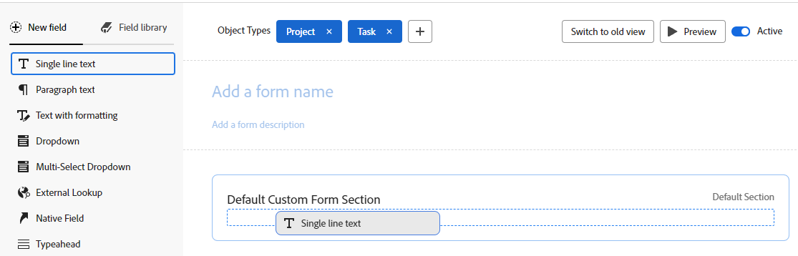

# Formular mit dem Formularentwickler erstellen

Sie können ein benutzerdefiniertes Formular mit dem Formularentwickler entwerfen. Sie können benutzerdefinierte Formulare an verschiedene Workfront-Objekte anhängen, um Daten zu diesen Objekten zu erfassen.

## Zugriffsanforderungen

+++ Erweitern Sie , um die Zugriffsanforderungen für die Funktionalität in diesem Artikel anzuzeigen.

Sie müssen über Folgendes verfügen, um die Schritte in diesem Artikel durchzuführen:

<table style="table-layout:auto"> 
 <col> 
 <col> 
 <tbody> 
  <tr data-mc-conditions=""> 
   <td role="rowheader"> 
Adobe Workfront-Abo
 </td> 
   <td>Alle</td> 
  </tr> 
  <tr> 
   <td role="rowheader">Adobe Workfront-Lizenz</td> 
   <td>
   
Neu: Standard

   
oder

   
Aktuell: Plan
</td> 
  </tr> 
  <tr data-mc-conditions=""> 
   <td role="rowheader">Konfigurationen auf Zugriffsebene</td> 
   <td> 
Administratorzugriff auf benutzerdefinierte Formulare
 </td> 
  </tr>  
 </tbody> 
</table>

Weitere Informationen zu den Informationen in dieser Tabelle finden Sie unter [Zugriffsanforderungen in der Workfront-Dokumentation](/help/quicksilver/administration-and-setup/add-users/access-levels-and-object-permissions/access-level-requirements-in-documentation.md).

+++

## Erstellen eines benutzerdefinierten Formulars

{{step-1-to-setup}}

1. Klicken Sie im linken Bereich auf **Benutzerdefinierter Forms** .

1. Klicken Sie auf **Neues benutzerdefiniertes Formular.**
1. Wählen Sie die Objekttypen aus, an die das benutzerdefinierte Formular angehängt werden soll, und klicken Sie dann auf **Weiter**.

   

1. Geben Sie im Bereich **Titel ist erforderlich** den Titel des benutzerdefinierten Formulars ein.
1. (Optional) Wenn Sie weitere Objekttypen zum Formular hinzufügen möchten, damit es an weitere Objekte angehängt werden kann, klicken Sie nach **Objekttypen** auf das Symbol **Hinzufügen**  und wählen Sie dann im angezeigten Menü den gewünschten Typ aus. Sie können dies wiederholen, um beliebig viele Objekttypen hinzuzufügen.

   Sie können auch auf das X für einen Objekttyp klicken, um ihn aus dem Formular zu löschen.

   >[!CAUTION]
   >
   >Beim Löschen eines benutzerdefinierten Formulars werden auch alle benutzerdefinierten Daten zu den mit dem Formular verknüpften Objekten gelöscht. Die gelöschten Daten können nicht wiederhergestellt werden. Ziehen Sie stattdessen die Deaktivierung eines benutzerdefinierten Formulars in Betracht. Wenn Sie ein benutzerdefiniertes Formular deaktivieren, das Sie nicht mehr verwenden, behalten Sie alle zugehörigen historischen Daten bei.
   >
   >Weitere Informationen finden Sie unter [Hinzufügen oder Löschen von Objekttypen aus einem vorhandenen benutzerdefinierten Formular](/help/quicksilver/administration-and-setup/customize-workfront/create-manage-custom-forms/form-designer/manage-a-form/add-or-remove-objects-from-a-form.md) und [Deaktivieren oder Reaktivieren eines benutzerdefinierten Formulars](/help/quicksilver/administration-and-setup/customize-workfront/create-manage-custom-forms/form-designer/manage-a-form/activate-deactivate-form.md).

1. Als Nächstes können Sie Ihrem benutzerdefinierten Formular Felder hinzufügen. Siehe die folgenden Abschnitte:
   * [Vorhandenes Feld oder Widget in einem anderen benutzerdefinierten Formular wiederverwenden](#reuse-an-existing-field-or-widget-already-used-in-another-custom-form)
   * [Hinweise zu Feldnamen und -bezeichnungen](#notes-on-field-names-and-labels)
   * [Textfelder hinzufügen](#add-text-fields)
   * [Berechnete Felder hinzufügen](#add-calculated-fields)
   * [Optionsfelder, Kontrollkästchengruppen und Dropdown-Listen hinzufügen](#add-radio-buttons-checkboxes-and-dropdowns)
   * [Typevorschau- und Datumsfelder hinzufügen](#add-typeahead-and-date-fields)
   * [Externe Suchfelder hinzufügen](#add-external-lookup-fields)
   * [Bilder, PDF und Videos hinzufügen](#add-images-pdfs-and-videos)
   * [Hinzufügen nativer Workfront-Felder](#add-workfront-native-fields)
   * [Hinzufügen von Adobe XD-Dateien](#add-adobe-xd-files)

## Hinzufügen neuer oder vorhandener Felder zu Ihrem benutzerdefinierten Formular

Sie können beim Entwerfen Ihres benutzerdefinierten Formulars neue oder vorhandene Felder verwenden.

### Vorhandenes Feld oder Widget in einem anderen benutzerdefinierten Formular wiederverwenden

1. Klicken Sie oben links im Bildschirm auf **Feldbibliothek**.

1. Ziehen Sie das Feld oder Widget in das benutzerdefinierte Formular.
1. (Optional) Wiederholen Sie den vorherigen Schritt, um weitere Felder oder Widgets hinzuzufügen.

   >[!NOTE]
   >
   >Sie können bis zu 500 Felder und Widgets in einem einzelnen benutzerdefinierten Formular hinzufügen. Je nach Komplexität eines Formulars kann die Leistung jedoch beeinträchtigt werden, wenn mehr als 100 Formulare vorhanden sind.
   >
   >
   >Beispiele für komplexe Formulare sind Formulare mit kaskadierenden Parametern, berechnete benutzerdefinierte Datenfelder und Optionen mit mehreren Werten in einem einzelnen Feld.

1. Um Ihre Änderungen zu speichern, klicken Sie auf **Anwenden** und fahren Sie mit einem anderen Abschnitt fort, um mit dem Erstellen Ihres Formulars fortzufahren.

   oder

   Klicken Sie auf **Speichern und schließen**.

### Hinweise zu Feldnamen und -bezeichnungen {#notes-on-field-names-and-labels}

Die **Beschriftung** ist für die meisten Felder verfügbar. Es handelt sich um eine beschreibende Bezeichnung, die über dem Feld oder Widget im benutzerdefinierten Formular angezeigt wird. Sie können den Titel jederzeit ändern.

>[!NOTE]
>
>Vermeiden Sie die Verwendung von Sonderzeichen in dieser Bezeichnung. Sie werden in Berichten nicht korrekt angezeigt.

Für jedes Feld ist ein **Name** erforderlich. So identifiziert das System das benutzerdefinierte Feld, wenn Sie es zu verschiedenen Bereichen in Workfront hinzufügen, z. B. Berichten, Startseite und API-Interaktionen. Wenn Sie das Feld oder Widget zum ersten Mal konfigurieren und den Titel eingeben, wird das Feld Name automatisch entsprechend ausgefüllt. Die Felder Titel und Name werden jedoch nicht synchronisiert. Dies gibt Ihnen die Möglichkeit, die Beschriftung zu ändern, die Ihre Benutzer sehen, ohne den Namen ändern zu müssen, den das System sieht.

Jeder benutzerdefinierte Feldname muss in der Workfront-Instanz Ihres Unternehmens eindeutig sein. Auf diese Weise können Sie ein bereits für ein anderes benutzerdefiniertes Formular erstelltes Formular wiederverwenden.

>[!NOTE]
>
>Obwohl dies möglich ist, sollten Sie diesen Namen nicht ändern, nachdem Sie oder andere Benutzer mit der Verwendung des benutzerdefinierten Formulars in Workfront begonnen haben. Wenn dies der Fall ist, erkennt das System das benutzerdefinierte Feld nicht mehr, in dem es jetzt in anderen Bereichen von Workfront referenziert werden kann.
>Wenn Sie beispielsweise das benutzerdefinierte Feld zu einem Bericht hinzufügen und später seinen Namen ändern, erkennt Workfront es nicht im Bericht und funktioniert dort nicht mehr ordnungsgemäß, es sei denn, Sie fügen es dem Bericht unter Verwendung des neuen Namens erneut hinzu.
>
>Es wird empfohlen, keinen Namen einzugeben, der bereits für integrierte Workfront-Felder verwendet wurde.
>
>Es wird empfohlen, das Punkt-/Punkt-Zeichen nicht im benutzerdefinierten Feldnamen zu verwenden, um Fehler bei der Verwendung des Felds in verschiedenen Bereichen von Workfront zu vermeiden.

Die folgenden Sonderzeichen werden in benutzerdefinierten Feldbezeichnungen und -namen nicht unterstützt.

* \t
* \n
* \r
* \f
* `[`
* `]`
* (
* )
* :
* `{`
* `}`

### Textfelder hinzufügen

Sie können einem benutzerdefinierten Formular mehrere verschiedene Textfelder hinzufügen.

+++ **Erweitern, um Beschreibungen der verfügbaren Textfelder anzuzeigen**

* **Einzeiliges Textfeld**: Ermöglicht Benutzern die Eingabe einer einzelnen Textzeile in das Feld.
* **Absatztextfeld**: Ermöglicht Benutzern die Eingabe mehrerer Textzeilen in das Feld.
* **Textfeld mit Formatierung**: Ermöglicht dem Benutzer die Eingabe mehrerer Textzeilen in das Feld und die Formatierung des Textes mit fett, kursiv, unterstrichen, Aufzählungszeichen, Nummerierung, Hyperlinks und Blockanführungszeichen. Eine Zeichenbeschränkung von 15.000 ermöglicht viel Text und Formatierung.

  Dieser benutzerdefinierte Feldtyp wird in Filtern für Listen und Berichte nicht unterstützt.

  Informationen zum Zugriff auf dieses Feld über die API finden Sie unter [Speicherung von Rich-Text-Feldern in der API](/help/quicksilver/administration-and-setup/customize-workfront/create-manage-custom-forms/rich-text-field-storage-in-the-api.md).

  >[!NOTE]
  >
  >Textfelder mit Formatierung sind nicht für mobile Workfront-Apps verfügbar (in den kommenden Versionen verfügbar).

* **Beschreibender Text**: Ermöglicht Ihnen das Einschließen von Anweisungen und das Verknüpfen zu Seiten außerhalb von Workfront.

+++

Hinzufügen eines Textfelds:

1. Suchen Sie auf der linken Bildschirmseite eines der folgenden Textfelder und ziehen Sie es in einen Bereich auf der Arbeitsfläche:

   * Einzelzeilentext
   * Absatztext
   * Textfeld mit Formatierung
   * Beschreibender Text

   

1. Konfigurieren Sie auf der rechten Bildschirmseite die Optionen, die für den Typ des benutzerdefinierten Felds verfügbar sind, das Sie hinzufügen:

   <table>
    <tr>
    <td>Eingabe in</td>
    <td>Beschreibung</td>
    <td>Verfügbar für </td>
    </tr>
    <tr>
    <td>Größe</td>
    <td>
Ändern Sie die Größe der Textfelder im Formular.

   </td>
    <td><ul>
    <li>Einzeiliger Text</li>
    <li>Text des Absatzes</li>
    <li>Text mit Formatierung</li>
    <li>Beschreibender Text</li>
    </ul></td>
    </tr>
    <tr>
    <td>Label</td>
    <td>
(Erforderlich) Geben Sie eine beschreibende Bezeichnung ein, die über dem Feld angezeigt werden soll. Sie können den Titel jederzeit ändern.

    
WICHTIG: Vermeiden Sie die Verwendung von Sonderzeichen in dieser Bezeichnung. Sie werden in Berichten nicht korrekt angezeigt. Weitere Informationen finden Sie unter <a href="design-a-form.md#notes-on-field-names-and-labels">Hinweise zu Feldnamen und -beschriftungen</a>.
</td>
    <td><ul>
    <li>Einzeiliger Text</li>
    <li>Text des Absatzes</li>
    <li>Text mit Formatierung</li>
    </ul></td>
    </tr>
    <tr>
     <td>Name</td>
    <td>
(Erforderlich) Mit diesem Namen identifiziert das System das Feld. Wenn Sie das Widget zum ersten Mal konfigurieren und den Titel eingeben, wird das Feld Name automatisch entsprechend ausgefüllt. Die Felder Titel und Name werden jedoch nicht synchronisiert. Dies gibt Ihnen die Möglichkeit, die Beschriftung zu ändern, die Ihre Benutzer sehen, ohne den Namen ändern zu müssen, den das System sieht.

    
Weitere Informationen finden Sie unter <a href="design-a-form.md#notes-on-field-names-and-labels">Hinweise zu Feldnamen und -beschriftungen</a>.

    </td>
    <td><ul>
    <li>Einzeiliger Text</li>
    <li>Text des Absatzes</li>
    <li>Text mit Formatierung</li>
    <li>Beschreibender Text</li>
    </ul></td>
    </tr>
    <tr>
    <td>Anleitung</td>
    <td>Geben Sie weitere Informationen zum Feld ein. Wenn Benutzer das benutzerdefinierte Formular ausfüllen, können sie den Mauszeiger über das Fragezeichen-Symbol bewegen, um eine QuickInfo mit den hier eingegebenen Informationen anzuzeigen.
    
    </td>
    <td><ul>
    <li>Einzeiliger Text</li>
    <li>Text des Absatzes</li>
    <li>Text mit Formatierung</li>
    </ul></td>
    </tr>
    <tr>
    <td>Format</td>
    <td>
Wählen Sie den Datentyp aus, der im benutzerdefinierten Feld erfasst werden soll.
 
<b>NOTE</b>:   
    <ul> 
    <li>Dieses Feld kann nach dem Speichern des Formulars nicht mehr bearbeitet werden. Wenn Sie Ihr Feld in mathematischen Berechnungen verwenden möchten, stellen Sie sicher, dass Sie ein Zahlenformat oder ein Währungsformat auswählen.</li> 
    <li>Wenn Sie "Zahl"oder "Währung"auswählen, schneidet das System automatisch Zahlen ab, die mit 0 beginnen.</li>
    <li>Die Zeichenbeschränkung für Zahlenfelder beträgt 16. Sie können auch ein Textfeld verwenden, um Zahlen einzugeben und die Begrenzung zu vermeiden.</li>
     </ul>
</td> </td>
    <td><ul>
    <li>Einzeiliger Text</li>
    <li>Text des Absatzes</li>
    </ul></td>
    </tr>
    <tr>
    <td>Anzeigetyp</td>
    <td>Zwischen einzelnen Zeilen- und Absatztextfeldern wechseln.</td>
    <td><ul>
    <li>Einzeiliger Text</li>
    <li>Text des Absatzes</li>
    </ul></td>
    </tr>
    <tr>
    <td>Hyperlink</td>
    <td> Wenn Sie einen Hyperlink auf den eingegebenen Text anwenden möchten, fügen Sie ihn hier hinzu. Der beschreibende Text wird als Link auf Objekten angezeigt, an die das Formular angehängt ist.</td>
    <td><ul><li>Beschreibender Text</li></ul></td>
    </tr>
   </table>

1. (Optional) Wiederholen Sie den vorherigen Schritt, um weitere Felder oder Widgets hinzuzufügen.

   oder

   Um ein Feld zu kopieren, bewegen Sie den Mauszeiger über ein Feld und klicken Sie auf das Kopiersymbol.

   

1. Um Ihre Änderungen zu speichern, klicken Sie auf **Anwenden** und fahren Sie mit einem anderen Abschnitt fort, um mit dem Erstellen Ihres Formulars fortzufahren.

   oder

   Klicken Sie auf **Speichern und schließen**.

### Berechnete Felder hinzufügen

In einem benutzerdefinierten Formular können Sie ein berechnetes benutzerdefiniertes Feld hinzufügen, das vorhandene Daten verwendet, um neue Daten zu generieren, wenn das benutzerdefinierte Formular an ein Objekt angehängt wird.

Informationen zum Hinzufügen eines berechneten Felds finden Sie unter [Hinzufügen berechneter Felder mit dem Formularentwickler](/help/quicksilver/administration-and-setup/customize-workfront/create-manage-custom-forms/form-designer/design-a-form/add-a-calculated-field.md).

### Optionsfelder, Kontrollkästchengruppen und Dropdown-Listen hinzufügen

Sie können einem benutzerdefinierten Formular Optionsfelder, Kontrollkästchengruppen, Dropdown-Menüs und Dropdown-Menüs mit Mehrfachauswahl hinzufügen.

+++ **Erweitern, um Beschreibungen der verfügbaren Felder anzuzeigen**

* **Optionsfelder**: Erfordert, dass Benutzer nur eine Auswahl auswählen.
* **Kontrollkästchengruppe**: Ermöglicht Benutzern die Auswahl mehrerer Optionen.
* **Dropdown**: Bietet eine Liste von Dropdown-Optionen.
* **Dropdown für mehrere Auswahlen**: Ermöglicht Benutzern die Auswahl mehrerer Auswahlmöglichkeiten aus einer Dropdown-Liste.

+++

>[!NOTE]
>
>Felder, die mehrere Auswahlmöglichkeiten zulassen, wie z. B. die Checkbox-Gruppe und das Dropdown-Menü mit mehreren Auswahlen, sind in Berichten schwer zu grafisch und gruppieren. Um eine einfachere Diagrammerstellung und Gruppierung in Berichten zu ermöglichen, können Sie für jede Auswahl separate Felder erstellen (z. B. ein einzeiliges Textfeld).

So fügen Sie Optionsfelder, Kontrollkästchengruppen und Dropdown-Listen hinzu:

1. Suchen Sie auf der linken Bildschirmseite eines der folgenden Felder und ziehen Sie es in einen Bereich auf der Arbeitsfläche.

   * Optionsschaltflächen
   * Kontrollkästchen-Gruppe
   * Dropdown
   * Mehrfachauswahl-Dropdown

   

1. Konfigurieren Sie auf der rechten Bildschirmseite die Optionen, die für den Typ des benutzerdefinierten Felds verfügbar sind, das Sie hinzufügen:

   <table style="table-layout:auto"> 
    <tbody> 
    <tr>
    <td>Eingabe in</td>
    <td>Beschreibung</td>
    <td>Verfügbar für </td>
    </tr>
    <tr> 
     <td role="rowheader">Label</td> 
     <td> 
(Erforderlich) Geben Sie eine beschreibende Bezeichnung ein, die über dem benutzerdefinierten Feld angezeigt werden soll. Sie können den Titel jederzeit ändern.
 
<b>WICHTIG</b>: Vermeiden Sie die Verwendung von Sonderzeichen in dieser Bezeichnung. Sie werden in Berichten nicht korrekt angezeigt. Weitere Informationen finden Sie unter <a href="design-a-form.md#notes-on-field-names-and-labels">Hinweise zu Feldnamen und -beschriftungen</a>.
 </td> 
     <td><ul>
    <li>Optionsschaltflächen</li>
    <li>Kontrollkästchen-Gruppe</li>
    <li>Dropdown</li>
    <li>Mehrfachauswahl-Dropdown</li>
    </ul></td>
     </tr> 
     <tr> 
    <td role="rowheader">Name</td> 
     <td> 
(Erforderlich) Mit diesem Namen identifiziert das System das Feld. Wenn Sie das Widget zum ersten Mal konfigurieren und den Titel eingeben, wird das Feld Name automatisch entsprechend ausgefüllt. Die Felder Titel und Name werden jedoch nicht synchronisiert. Dies gibt Ihnen die Möglichkeit, die Beschriftung zu ändern, die Ihre Benutzer sehen, ohne den Namen ändern zu müssen, den das System sieht.
 
    
Weitere Informationen finden Sie unter <a href="design-a-form.md#notes-on-field-names-and-labels">Hinweise zu Feldnamen und -beschriftungen</a>.
 </td>
     <td><ul>
    <li>Optionsschaltflächen</li>
    <li>Kontrollkästchen-Gruppe</li>
    <li>Dropdown</li>
    <li>Mehrfachauswahl-Dropdown</li>
    </ul></td>
    </tr> 
    <tr> 
    <td role="rowheader">Anleitung</td> 
    <td> 
Geben Sie zusätzliche Informationen zum benutzerdefinierten Feld ein. Wenn Benutzer das benutzerdefinierte Formular ausfüllen, können sie den Mauszeiger über das Fragezeichen-Symbol bewegen, um eine QuickInfo mit den hier eingegebenen Informationen anzuzeigen.
 
    
   

    </td> 
    <td><ul>
    <li>Optionsschaltflächen</li>
    <li>Kontrollkästchen-Gruppe</li>
    <li>Dropdown</li>
    <li>Mehrfachauswahl-Dropdown</li>
    </ul></td>
    </tr> 
    <tr> 
    <td role="rowheader">Format</td> 
    <td> 
Wählen Sie den Datentyp aus, der im benutzerdefinierten Feld erfasst werden soll.
 
<b>NOTE</b>:   
     <ul> 
    <li>Dieses Feld kann nach dem Speichern des Formulars nicht mehr bearbeitet werden. Wenn Sie Ihr Feld in mathematischen Berechnungen verwenden möchten, stellen Sie sicher, dass Sie ein Zahlenformat oder ein Währungsformat auswählen. </li> 
    <li>Wenn Sie "Zahl"oder "Währung"auswählen, schneidet das System automatisch Zahlen ab, die mit 0 beginnen.</li>
    <li>Die Zeichenbeschränkung für Zahlenfelder beträgt 16. Sie können auch ein Textfeld verwenden, um Zahlen einzugeben und die Begrenzung zu vermeiden.</li>
     </ul>
</td> 
     <td><ul>
    <li>Optionsschaltflächen</li>
    <li>Kontrollkästchen-Gruppe</li>
    <li>Dropdown</li>
    <li>Mehrfachauswahl-Dropdown</li>
    </ul></td>
    </tr> 
    <tr> 
     <td role="rowheader">Anzeigetyp</td> 
    <td>Wechseln Sie zwischen Optionsfeldern, Kontrollkästchengruppen, Dropdown-Listen oder Dropdown-Listen mit Mehrfachauswahl für das Feld.</td> 
    <td><ul>
    <li>Optionsschaltflächen</li>
    <li>Kontrollkästchen-Gruppe</li>
    <li>Dropdown</li>
    <li>Mehrfachauswahl-Dropdown</li>
    </ul></td>
    </tr> 
     <tr> 
    <td role="rowheader">Zu einem Pflichtfeld machen</td> 
    <td>Wählen Sie diese Option aus, wenn das Feld erforderlich sein soll, damit der Benutzer das benutzerdefinierte Formular ausfüllen kann. </td> 
    <td><ul>
    <li>Optionsschaltflächen</li>
    <li>Kontrollkästchen-Gruppe</li>
    <li>Dropdown</li>
    <li>Mehrfachauswahl-Dropdown</li>
    </ul></td>
     </tr> 
    <tr> 
    <td role="rowheader">Auswahl </td> 
    <td> 
    <ol> 
    <li> 
Klicken Sie auf <b>Optionen</b> und aktivieren Sie dann eine der folgenden Optionen:
 
    <ul> 
    <li><strong>Werte anzeigen</strong>: Zeigt die Werte jeder Auswahl im Feld an. Der Titel jeder Auswahl wird standardmäßig angezeigt.</li> 
     <li><strong>Sortieroptionen A-Z</strong>: Sortiert die Auswahlmöglichkeiten, die Sie dem Feld alphabetisch hinzufügen.</li> 
    </ul> 
    </li> 
    <li> 
Klicken Sie für jede Auswahlmöglichkeit, die Sie für den Benutzer hinzufügen, auf das Zahnradsymbol  und wählen Sie dann eine der folgenden Optionen aus:
 
    <ul> 
    <li><strong>Standardmäßig auswählen</strong>: Wählen Sie im Feld standardmäßig die Auswahl aus.</li> 
    <li> 
<strong>Auswahl ausblenden</strong>: Blendet die Auswahl im Feld aus. Ausgeblendete Optionen stehen in Berichten weiterhin zur Verfügung.
 </li> 
    <li> 
<strong>Auswahl entfernen</strong>: Entfernt die Auswahl aus dem Feld.
 
<b>WARNUNG</b>: Wenn Sie aktuelle Objekte haben, die diese Auswahl verwenden, entfernen Sie sie nicht aus dem Feld. Wenn Sie sie entfernen, gehen historische Daten verloren. Wählen Sie stattdessen die Option aus, um sie auszublenden. Dies verhindert, dass Benutzer sie in Zukunft auswählen.
 </li> 
    </ul> 
     </li> 
    </ol> </td> 
    <td><ul>
    <li>Optionsschaltflächen</li>
    <li>Kontrollkästchen-Gruppe</li>
    <li>Dropdown</li>
    <li>Mehrfachauswahl-Dropdown</li>
    </ul></td>
     </tr> 
    </tbody> 
    </table>

1. (Optional) Wiederholen Sie den vorherigen Schritt, um weitere Felder oder Widgets hinzuzufügen.

   oder

   Um ein Feld zu kopieren, bewegen Sie den Mauszeiger über ein Feld und klicken Sie auf das Kopiersymbol.

   

1. Um Ihre Änderungen zu speichern, klicken Sie auf **Anwenden** und fahren Sie mit einem anderen Abschnitt fort, um mit dem Erstellen Ihres Formulars fortzufahren.

   oder

   Klicken Sie auf **Speichern und schließen**.

### Typevorschau- und Datumsfelder hinzufügen

Sie können einem benutzerdefinierten Formular Typeahead- und Datumsfelder hinzufügen.

+++ **Erweitern, um Beschreibungen der verfügbaren Felder anzuzeigen**

* **typahead**: Ermöglicht Benutzern die Eingabe des Namens eines Objekts, das in Workfront vorhanden ist. Eine Liste mit Vorschlägen wird angezeigt, wenn der Benutzer mit der Eingabe beginnt. Dieser Feldtyp unterstützt die folgenden Objekte:
   * Benutzerin oder Benutzer
   * Gruppe
   * Aufgabengebiet
   * Portfolio
   * Programm
   * Projekt
   * Team
   * Vorlage
   * Firma
* **Datumsfeld**: Zeigt einen Kalender an, in dem Benutzer Datum und Uhrzeit auswählen können.

+++

So fügen Sie Eingabe- und Datumsfelder hinzu:

1. Suchen Sie auf der linken Bildschirmseite eines der folgenden Felder und ziehen Sie es in einen Bereich auf der Arbeitsfläche.

   * Typeahead
   * Datumsfeld

   

1. Konfigurieren Sie auf der rechten Bildschirmseite die Optionen, die für den Typ des benutzerdefinierten Felds verfügbar sind, das Sie hinzufügen:

   <table style="table-layout:auto"> 
    <tbody> 
     <tr>
    <td>Feldeinstellung</td>
    <td>Beschreibung</td>
    <td>Verfügbar für </td>
    </tr>
     <tr> 
      <td role="rowheader">Label</td> 
      <td> 
(Erforderlich) Geben Sie eine beschreibende Bezeichnung ein, die über dem benutzerdefinierten Feld angezeigt werden soll. Sie können den Titel jederzeit ändern.
 
<b>WICHTIG</b>: Vermeiden Sie die Verwendung von Sonderzeichen in dieser Bezeichnung. Sie werden in Berichten nicht korrekt angezeigt. Weitere Informationen finden Sie unter <a href="design-a-form.md#notes-on-field-names-and-labels">Hinweise zu Feldnamen und -beschriftungen</a>.
 </td> 
       <td><ul>
    <li>Typeahead</li>
    <li>Datumsfeld</li>
    </ul></td>
     </tr> 
     <tr> 
      <td role="rowheader">Name</td> 
      <td> 
(Erforderlich) Mit diesem Namen identifiziert das System das Feld. Wenn Sie das Widget zum ersten Mal konfigurieren und den Titel eingeben, wird das Feld Name automatisch entsprechend ausgefüllt. Die Felder Titel und Name werden jedoch nicht synchronisiert. Dies gibt Ihnen die Möglichkeit, die Beschriftung zu ändern, die Ihre Benutzer sehen, ohne den Namen ändern zu müssen, den das System sieht.
 
      
Weitere Informationen finden Sie unter <a href="design-a-form.md#notes-on-field-names-and-labels">Hinweise zu Feldnamen und -beschriftungen</a>.
 </td>
    <td><ul>
    <li>Typeahead</li>
    <li>Datumsfeld</li>
    </ul></td>
     </tr> 
     <tr> 
      <td role="rowheader">Anleitung</td> 
      <td> 
Geben Sie zusätzliche Informationen zum benutzerdefinierten Feld ein. Wenn Benutzer das benutzerdefinierte Formular ausfüllen, können sie den Mauszeiger über das Fragezeichen-Symbol bewegen, um eine QuickInfo mit den hier eingegebenen Informationen anzuzeigen.
 
      
  

      </td> 
         <td><ul>
    <li>Typeahead</li>
    <li>Datumsfeld</li>
    </ul></td>
     </tr> 
     <tr> 
      <td role="rowheader">Tageszeit anzeigen</td> 
      <td>Aktivieren Sie diese Option, wenn Sie die Tageszeit zusammen mit dem Datum im Feld anzeigen möchten.</td> 
         <td><ul>
    <li>Datumsfeld</li>
    </ul></td>
     </tr> 
     <tr> 
      <td role="rowheader">Referenzierter Objekttyp</td> 
      <td> 
Wählen Sie den Objekttyp aus, den Sie mit dem Feld verknüpfen möchten.
 
Nachdem Sie auf Übernehmen oder Speichern+Schließen geklickt haben, können Sie den Objekttyp für das Feld nicht mehr ändern.
 
<b>NOTE</b>:   
        <ul> 
         <li>Wenn Ihr Workfront-Administrator den Namen für Portfolios, Programme oder Projekte in der Benutzeroberfläche von Workfront angepasst hat, wird der standardmäßige Workfront-Name für das Objekt in dieser Dropdown-Liste und nicht der benutzerdefinierte Name angezeigt. Wenden Sie sich an Ihren Workfront-Administrator, wenn Sie Hilfe dazu benötigen. </li> 
         <li>Die folgenden Objekttypen werden in den mobilen Apps von iOS und Android Workfront unterstützt: Benutzer, Unternehmen, Gruppe, Auftragsrolle, Portfolio, Programm, Projekt und Vorlage.</li> 
        </ul> 
 </td> 
         <td><ul>
    <li>Typeahead</li>
    </ul></td>
     </tr>
     <tr>
      <td role="rowheader">Filter hinzufügen</td>
      <td>
Fügen Sie einen Filter für einen Objekttyp hinzu, um die Objekte zu beschränken, die Benutzer bei der Verwendung des Felds auswählen können. 
 
Sie können beispielsweise ein Feld so einschränken, dass Benutzernamen nur ausgewählt werden können, wenn sie die folgenden Kriterien erfüllen:
 
       <ul> 
        <li>Sie gehören zu einer oder mehreren Gruppen, die Sie angeben</li> 
        <li>Sie sind mit einer von Ihnen angegebenen Rolle oder Berufsbezeichnung verknüpft.</li> 
        <li>Sie gehören zur gleichen Gruppe wie die Person, die das Feld verwendet</li> 
       </ul> 
Sie müssen den Filter für den ausgewählten Objekttyp mithilfe der Textmodus-Syntax definieren. Informationen zum Erstellen eines Filters mit dem Textmodus finden Sie unter <a href="/help/quicksilver/reports-and-dashboards/reports/text-mode/edit-text-mode-in-filter.md">Bearbeiten eines Filters mit dem Textmodus</a>.

       
<b>NOTE</b>:
       <ul> 
        <li>Wenn Sie ein vorhandenes benutzerdefiniertes Formular bearbeiten, werden durch Hinzufügen eines Filters zu einem Feld vom TypAhead keine Objekte (außerhalb des Filterbereichs) entfernt, die Benutzer bereits über das Feld hinzugefügt haben.</li> 
        <li>Dieser Filter ist auf Mobilgeräten nicht verfügbar. Wenn Sie den Filter für ein Feld vom Typ voraus verwenden, wird das Feld auf den Mobilgeräten der Benutzer angezeigt, die vom Filter nicht betroffen sind.</li> 
        </ul>
</td> 
      <td>
       <ul>
       <li>Typeahead</li>
       </ul>
      </td>
     </tr>
     <tr> 
      <td role="rowheader">Zu einem Pflichtfeld machen</td> 
      <td>Wählen Sie diese Option aus, wenn das Feld erforderlich sein soll, damit der Benutzer das benutzerdefinierte Formular ausfüllen kann. </td> 
       <td><ul>
    <li>Typeahead</li>
    <li>Datumsfeld</li>
    </ul></td>
     </tr> 
    </tbody> 
   </table>

1. (Optional) Wiederholen Sie den vorherigen Schritt, um weitere Felder oder Widgets hinzuzufügen.

   oder

   Um ein Feld zu kopieren, bewegen Sie den Mauszeiger über ein Feld und klicken Sie auf das Kopiersymbol.

   

1. Um Ihre Änderungen zu speichern, klicken Sie auf **Anwenden** und fahren Sie mit einem anderen Abschnitt fort, um mit dem Erstellen Ihres Formulars fortzufahren.

   oder

   Klicken Sie auf **Speichern und schließen**.

### Externe Suchfelder hinzufügen

Ein externes Suchfeld ruft eine externe API auf und gibt Werte als Optionen in einem Dropdown-Feld zurück. Benutzer, die mit dem Objekt arbeiten, an das das benutzerdefinierte Formular angehängt ist, können eine oder mehrere dieser Optionen aus der Dropdown-Liste auswählen. Das externe Suchfeld ist auch in Listen und Berichten verfügbar.

Beispiele für die Verwendung des externen Suchfelds zum Aufrufen derselben Instanz von Workfront oder einer öffentlichen API finden Sie unter [Beispiele für das externe Suchfeld in einem benutzerdefinierten Formular](/help/quicksilver/administration-and-setup/customize-workfront/create-manage-custom-forms/form-designer/design-a-form/external-lookup-examples.md).

>[!NOTE]
>
>* Externe Suchfelder aus benutzerdefinierten Formularen werden in Dashboards derzeit nicht unterstützt. Sie können den Feldwert nicht inline bearbeiten und er wird möglicherweise nicht richtig in einem Dashboard angezeigt. (Externe Suchfelder werden in Leinwanddashboards unterstützt.)
>* Externe Suchfelder werden im Outlook-Plug-in nicht unterstützt.
>* Externe Suchfelder sind in Listen verfügbar, es sei denn, das Feld ist von einem anderen Feld abhängig.

So fügen Sie eine externe Suche hinzu:

1. Suchen Sie auf der linken Seite des Bildschirms nach **Externer Suchvorgang** und ziehen Sie ihn in einen Bereich auf der Arbeitsfläche.
1. Konfigurieren Sie rechts im Bildschirm die Optionen für das benutzerdefinierte Feld:

   <table style="table-layout:auto"> 
    <col> 
    <col> 
    <tbody> 
     <tr> 
      <td role="rowheader">Label</td> 
      <td> 
(Erforderlich) Geben Sie eine beschreibende Bezeichnung ein, die über dem benutzerdefinierten Feld angezeigt werden soll. Sie können den Titel jederzeit ändern.
 
<b>WICHTIG</b>: Vermeiden Sie die Verwendung von Sonderzeichen in dieser Bezeichnung. Sie werden in Berichten nicht korrekt angezeigt. Weitere Informationen finden Sie unter <a href="design-a-form.md#notes-on-field-names-and-labels">Hinweise zu Feldnamen und -beschriftungen</a>.
 </td> 
     </tr> 
     <tr> 
      <td role="rowheader">Name</td> 
      <td> 
(Erforderlich) Mit diesem Namen identifiziert das System das Feld. Wenn Sie das Widget zum ersten Mal konfigurieren und den Titel eingeben, wird das Feld Name automatisch entsprechend ausgefüllt. Die Felder Titel und Name werden jedoch nicht synchronisiert. Dies gibt Ihnen die Möglichkeit, die Beschriftung zu ändern, die Ihre Benutzer sehen, ohne den Namen ändern zu müssen, den das System sieht.
 
      
Weitere Informationen finden Sie unter <a href="design-a-form.md#notes-on-field-names-and-labels">Hinweise zu Feldnamen und -beschriftungen</a>.
 </td>
     </tr> 
      <td role="rowheader">Anleitung</td> 
      <td> 
Geben Sie zusätzliche Informationen zum benutzerdefinierten Feld ein. Wenn Benutzer das benutzerdefinierte Formular ausfüllen, können sie den Mauszeiger über das Fragezeichen-Symbol bewegen, um eine QuickInfo mit den hier eingegebenen Informationen anzuzeigen.
 </td> 
     </tr> 
     <tr> 
      <td role="rowheader">Format</td>
      <td>
Wählen Sie den Datentyp aus, der im benutzerdefinierten Feld erfasst werden soll.

      
<strong>NOTE:</strong>

      <ul><li>Sie können den Formattyp nach dem Speichern des Formulars ändern, mit einer Einschränkung: Alle vorhandenen Werte für Objekte müssen in der Lage sein, in den neuen Typ zu konvertieren. (Wenn der Formattyp beispielsweise Text ist und ein Objekt den Wert "abc"speichert, können Sie das Feld nicht konvertieren und erhalten eine Fehlermeldung, dass das System "abc"nicht in Zahl/Währung konvertieren kann.) Wenn Sie Ihr Feld in mathematischen Berechnungen verwenden möchten, stellen Sie sicher, dass Sie ein Zahlenformat oder ein Währungsformat auswählen.</li>
      <li>Wenn Sie "Zahl"oder "Währung"auswählen, schneidet das System automatisch Zahlen ab, die mit 0 beginnen.</li>
      <li>Die Zeichenbeschränkung für Zahlenfelder beträgt 16. Sie können auch ein Textfeld verwenden, um Zahlen einzugeben und die Begrenzung zu vermeiden.</li>
      </ul></td>
     </tr> 
     <tr> 
      <td role="rowheader">Basis-API-URL</td> 
      <td>
Geben Sie die URL für die API ein oder fügen Sie sie ein.

Die API-URL muss einen JSON-Inhalt der Optionen zurückgeben, die Sie im Dropdown-Menü anzeigen möchten. Sie können das Feld JSON-Pfad verwenden, um die spezifischen Werte aus den zurückgegebenen JSON-Optionen auszuwählen, die Dropdown-Optionen sein sollen.

Beim Eingeben der API-URL können Sie optional die folgenden Werte in die URL übergeben:

      <ul>
      <li>$$HOST - Dies stellt den aktuellen Workfront-Host dar und kann verwendet werden, um /search API-Aufrufe an die Workfront-API durchzuführen. Wenn dieser Platzhalter verwendet wird, wird die Authentifizierung verarbeitet und Benutzer müssen keine Authentifizierungskopfzeilen senden. (Beispielsweise können Benutzer Aufgaben mithilfe der Basis-URL <code>$$HOST/attask/api/task/search</code> durchsuchen und Aufgaben suchen sowie Werte aus einer zurückgegebenen Aufgabenliste auswählen.)</li>
      <li>
$$QUERY - Dies stellt den Suchtext dar, den der Endbenutzer in das Feld eingibt, und ermöglicht Ihnen die Implementierung der Abfragefilterung für Ihre Endbenutzer. (Der Benutzer sucht im Dropdown-Menü nach dem Wert.)

      
Wenn die API, auf die Sie verweisen, dies zulässt, können Sie in Ihre Suchabfrage auch Modifikatoren einfügen, um festzustellen, wie die Suche funktionieren soll. Beispielsweise können Sie Folgendes als Basis-API-URL verwenden, um Personen die Suche nach Workfront-Projekten zu ermöglichen, die bestimmten Text enthalten: <code>$$HOST/attask/api/v15.0/proj/search?name=$$QUERY&name_Mod=contains</code>.

Weitere Informationen zu den Workfront-Suchmodifikatoren finden Sie in den <a href="/help/quicksilver/wf-api/general/api-basics.md">API-Grundlagen</a>.

      
<strong>HINWEIS:</strong> Wenn Sie $$QUERY nicht verwenden und der Benutzer Text in das Suchfeld eingibt, werden die bereits vorhandenen Auswahlmöglichkeiten eingegrenzt. Wenn Sie jedoch $$QUERY verwenden und der Benutzer alles eingibt, wird ein neuer Netzwerkaufruf an Ihre API durchgeführt. Wenn Sie mehr als 2000 Werte in Ihrer API haben und die API Abfragen unterstützt, können Sie $$QUERY verwenden, um nicht nur aus den vorhandenen 2000 Werten zu suchen, sondern auch aus der ursprünglichen API mit den eingeschränkten Optionen.
</li>
      <li>
{fieldName} - Dabei ist fieldName ein benutzerdefiniertes oder natives Feld in Workfront. Auf diese Weise können Sie Dropdown-Optionsfilter für die Kaskadierung implementieren, wenn Sie den Wert eines bereits ausgewählten Felds an das externe Suchfeld übergeben, um Optionen nach unten zu filtern. (Beispielsweise ist das Feld Region bereits im Formular vorhanden und Sie schränken eine Liste von Ländern von der API auf Länder ein, die sich in einer bestimmten Region befinden.)

      
Bei einem externen Suchfeld, das von anderen Feldern abhängig ist (unter Verwendung der Syntax {fieldName} ), sind die von der API zurückgegebenen Optionen auf die Optionen beschränkt, die mit den Zeichenfolgen oder Werten übereinstimmen, die in den anderen Feldern eingegeben wurden. (Diese Funktion wird in Listen und Berichten nicht unterstützt.)
</li>
      <li>{referenceObject}.{fieldName} - Wobei das Feld Teil eines Objekts ist. Diese Syntax ähnelt benutzerdefinierten Ausdrücken. (Beispiel: PortfolioID={project}.{portfolioID})</li></ul>
      
<strong>HINWEIS:</strong> Überprüfen Sie die Dokumentation für die API, mit der Sie arbeiten, für die spezifischen Abfragen, die Sie definieren können.
</td>
     </tr>
     <tr> 
      <td role="rowheader">HTTP-Methode</td> 
      <td>Wählen Sie <strong>Get</strong>, <strong>Post</strong> oder <strong>Put</strong> für die Methode aus.</td> 
     </tr>
     <tr> 
      <td role="rowheader">JSON-Pfad</td>
      <td>
Geben Sie den JSON-Pfad für die API ein oder fügen Sie ihn ein.
 
Diese Option ermöglicht das Extrahieren von Daten aus der JSON-Datei, die von der API-URL zurückgegeben wird. Es dient dazu, festzulegen, welche Werte aus dem JSON-Bereich in den Dropdown-Optionen angezeigt werden.

Wenn Ihre API-URL beispielsweise JSON im folgenden Format zurückgibt: 
      <pre>
      {
       data: {
         { name: "USA"},
         { name: "Canada"}
       }
      }
      </pre>
      

      
dann können Sie "$.data[*].name"verwenden, um USA und Kanada als Dropdown-Optionen auszuwählen.
 
Weitere Informationen zum JSON-Pfad und zum Sicherstellen des richtigen JSON-Pfads finden Sie unter <a href="https://jsonpath.com/">https://jsonpath.com/</a>.
</td>
     </tr>
     <tr> 
      <td role="rowheader">Kopfzeilen</td>
      <td>
Klicken Sie auf <strong>Kopfzeile hinzufügen</strong> und geben Sie das Schlüssel-Wert-Paar ein oder fügen Sie es ein, das für die Authentifizierung mit der API erforderlich ist.

<strong>HINWEIS:</strong> Die Kopfzeilenfelder sind kein sicherer Ort, um Anmeldeinformationen zu speichern. Achten Sie darauf, was Sie eingeben und speichern.
</td>
     </tr>
     <tr> 
      <td role="rowheader">Mehrfachauswahl-Dropdown</td>
      <td>
Wählen Sie diese Option aus, damit der Benutzer mehr als einen Wert in der Dropdown-Liste auswählen kann.
</td>
     </tr>
     </tr>
     <tr> 
      <td role="rowheader">Zu einem Pflichtfeld machen</td>
      <td>
Wählen Sie diese Option aus, wenn das Feld erforderlich sein soll, damit der Benutzer das benutzerdefinierte Formular ausfüllen kann.
</td>
     </tr>       
    </tbody>
   </table>

1. Um Ihre Änderungen zu speichern, klicken Sie auf **Anwenden** und fahren Sie mit einem anderen Abschnitt fort, um mit dem Erstellen Ihres Formulars fortzufahren.

   oder

   Klicken Sie auf **Speichern und schließen**.

>[!NOTE]
>
>Die folgenden Elemente sind technische Einschränkungen des Aufrufs an die externe API:
>
>* Maximale Anzahl an Optionen: 2000 (nur die ersten 2000 eindeutigen Optionen aus der zurückgegebenen JSON werden angezeigt)
>* Zeitüberschreitung: 3 Sekunden
>* Anzahl weiterer Versuche: 3
>* Wartezeit zwischen Wiederholungen: 500 ms
>* Erwartete Antwortstatus: 2xx

### Bilder, PDF und Videos hinzufügen

Sie können einem benutzerdefinierten Formular Bilder, PDF und Videos hinzufügen. Benutzer, die mit dem Objekt arbeiten, an das das benutzerdefinierte Formular angehängt ist, können das Bild, die PDF oder das Video nur in den folgenden Bereichen anzeigen:

* Der Detailbereich des Objekts (z. B. für ein Projekt, den Bereich Projektdetails )
* Das Feld &quot;Bearbeiten&quot;für das Objekt, wenn das neue Adobe Workfront-Erlebnis wie &quot;Projekt bearbeiten&quot;und &quot;Aufgabe bearbeiten&quot;angezeigt wird

<!-- Do we need to tell them where they can't see it if we tell them where they can see it?
Currently, users cannot see the widget in the following areas:​
Lists and reports
Home and Summary
The Edit box for the object, if it doesn't have the new Adobe Workfront experience look and feel (for example, the Edit Expense box)
The Workfront Mobile app -->

+++ **Erweitern, um Beschreibungen der verfügbaren Felder anzuzeigen**

* **Bild**: Ermöglicht Benutzern das Hinzufügen von Bilddateien.
* **PDF**: Ermöglicht Benutzern das Hinzufügen von PDF
* **Videos**: Ermöglicht Benutzern das Hinzufügen von Videodateien.

+++

So fügen Sie Bilder, PDF oder Videos hinzu:

1. Suchen Sie auf der linken Bildschirmseite eines der folgenden Felder und ziehen Sie es in einen Bereich auf der Arbeitsfläche.

   * Bild
   * PDF
   * Video

   

1. Geben Sie eine der folgenden Eigenschaften für das Widget ein oder bearbeiten Sie sie:

   <table style="table-layout:auto"> 
    <col> 
    <col> 
    <tbody> 
     <tr> 
      <td role="rowheader">Label</td> 
      <td> 
(Erforderlich) Geben Sie eine beschreibende Bezeichnung ein, die über dem Widget angezeigt werden soll. Sie können den Titel jederzeit ändern.
 
<b>WICHTIG</b>: Vermeiden Sie die Verwendung von Sonderzeichen in dieser Bezeichnung. Sie werden in Berichten nicht korrekt angezeigt. Weitere Informationen finden Sie unter <a href="design-a-form.md#notes-on-field-names-and-labels">Hinweise zu Feldnamen und -beschriftungen</a>.
 </td> 
     </tr> 
     <tr> 
      <td role="rowheader">Name</td> 
      <td> 
(Erforderlich) Mit diesem Namen identifiziert das System das Widget. Wenn Sie das Widget zum ersten Mal konfigurieren und den Titel eingeben, wird das Feld Name automatisch entsprechend ausgefüllt. Die Felder Titel und Name werden jedoch nicht synchronisiert. Dies gibt Ihnen die Möglichkeit, die Beschriftung zu ändern, die Ihre Benutzer sehen, ohne den Namen ändern zu müssen, den das System sieht.
 
Weitere Informationen finden Sie unter <a href="design-a-form.md#notes-on-field-names-and-labels">Hinweise zu Feldnamen und -beschriftungen</a>.
 </td> 
     </tr> 
     <tr> 
      <td role="rowheader">URL</td> 
      <td> 
(Erforderlich) Geben oder fügen Sie die URL des Widgets ein, in dem es im Internet gespeichert ist.
 
      
Wenn Sie ein Video-Widget hinzufügen, können Sie dies derzeit tun, indem Sie Folgendes in das URL-Feld hinzufügen:
 
      <ul> 
      <li> 
YouTube- oder Vimeo-Link
 </li> 
      <li> 
Videolink "Google Drive"
 </li> 
      <li> 
Link zum Video mit MP4- und MOV-Erweiterung
 </li> 
      <li> 
Link zu Video, das bereits in den Bereich "Dokumente"in Ihrer Workfront-Instanz hochgeladen wurde. Anweisungen finden Sie unter <a href="#add-a-video-widget-to-a-custom-form-from-the-documents-area" class="MCXref xref">Hinzufügen eines Video-Widgets zu einem benutzerdefinierten Formular aus dem Bereich "Dokumente"</a> in diesem Artikel.
 </li> 
      </ul> 
       </td> 
     </tr> 
     <tr> 
      <td role="rowheader">Anleitung</td> 
      <td> 
Geben Sie weitere Informationen zum Widget ein. Wenn Benutzer das benutzerdefinierte Formular ausfüllen, können sie den Mauszeiger über das Fragezeichen-Symbol bewegen, um eine QuickInfo mit den hier eingegebenen Informationen anzuzeigen.
 </td> 
     </tr> 
     <tr> 
      <td role="rowheader">Größe</td> 
      <td>Ändern Sie die Anzeigegröße des Widgets nach Bedarf.</td> 
     </tr> 
    </tbody> 
   </table>

1. (Optional) Wiederholen Sie den vorherigen Schritt, um weitere Felder oder Widgets hinzuzufügen.

   oder

   Um ein Feld zu kopieren, bewegen Sie den Mauszeiger über ein Feld und klicken Sie auf das Kopiersymbol.

   

1. Um Ihre Änderungen zu speichern, klicken Sie auf **Anwenden** und fahren Sie mit einem anderen Abschnitt fort, um mit dem Erstellen Ihres Formulars fortzufahren.

   oder

   Klicken Sie auf **Speichern und schließen**.

#### Hinzufügen eines Video-Widgets zu einem benutzerdefinierten Formular aus dem Bereich &quot;Dokumente&quot;{#add-a-video-widget-to-a-custom-form-from-the-documents-area}

>[!IMPORTANT]
>
>Wenn Sie einem benutzerdefinierten Formular auf diese Weise ein Video hinzufügen, gelten nur die für das benutzerdefinierte Formular festgelegten Berechtigungen für das Video, wenn Benutzer auf das Formular eines Objekts zugreifen, nicht die Berechtigungen, die für das Video im Bereich &quot;Dokumente&quot;festgelegt wurden.

1. Gehen Sie zum Video im Bereich &quot;Dokumente&quot;und generieren Sie einen Testversand dafür, wie unter [Erstellen eines interaktiven Testversands für eine Website oder andere Webinhalte](/help/quicksilver/review-and-approve-work/proofing/creating-proofs-within-workfront/generate-interactive-proof-for-website-or-other-web-content.md) beschrieben.
1. Öffnen Sie den Testversand.
1. Klicken Sie mit der rechten Maustaste auf eine beliebige Stelle im Video und wählen Sie dann **Videobericht kopieren** aus.
1. Fügen Sie im benutzerdefinierten Formular, in das Sie das Video-Widget einfügen, die kopierte Adresse in das Feld **URL** ein.
1. Um Ihre Änderungen zu speichern, klicken Sie auf **Anwenden** und fahren Sie mit einem anderen Abschnitt fort, um mit dem Erstellen Ihres Formulars fortzufahren.

   oder

   Klicken Sie auf **Speichern und schließen**.

### Hinzufügen nativer Workfront-Felder

Sie können Ihren benutzerdefinierten Formularen native Workfront-Felder hinzufügen. Wenn das benutzerdefinierte Formular an ein Objekt angehängt wird, wird das Feld aus den Objektdaten ausgefüllt. Beispielsweise ruft das Feld Beschreibung in einem benutzerdefinierten Formular, das an ein Projekt angehängt ist, die Projektbeschreibung ab. (Wenn keine Daten verfügbar sind, kann im Feld &quot;K. A.&quot;angezeigt werden.)

+++ **Erweitern Sie die Liste der unterstützten nativen Felder**

Diese Tabelle listet die verfügbaren nativen Felder für bestimmte Workfront-Objekte in einem benutzerdefinierten Formular auf.

| Feldname | Projekt | Aufgabe | Problem | Vorlage | Vorlagenaufgabe | Portfolio | Programm | Gruppe |
|--------------------------- |-------- |------- |------- |--------- |-------------- | --------- |-------- |------ |
| Tatsächliches Abschlussdatum | ✓ | ✓ | ✓ |   |   |   |   |   |
| Tatsächliche Dauer | ✓ |   |   |   |   |   |   |   |
| Tatsächliche Stunden | ✓ |   | ✓ |   |   |   |   |   |
| Tatsächliches Startdatum | ✓ | ✓ | ✓ |   |   |   |   |   |
| Firma | ✓ |   |   | ✓ |   |   |   |   |
| Bedingung | ✓ | ✓ | ✓ |   |   |   |   |   |
| Bedingungstyp | ✓ |   |   | ✓ |   |   |   |   |
| Beschreibung | ✓ | ✓ | ✓ | ✓ | ✓ | ✓ | ✓ | ✓ |
| Dauer |   | ✓ |   |   | ✓ |   |   |   |
| Dauertyp |   | ✓ |   |   | ✓ |   |   |   |
| Dauer - Einheit |   | ✓ |   |   | ✓ |   |   |   |
| Eingegeben von | ✓ | ✓ | ✓ | ✓ | ✓ |   |   | ✓ |
| Eingabedatum | ✓ | ✓ | ✓ | ✓ | ✓ |   |   | ✓ |
| Gruppe | ✓ |   |   | ✓ |   | ✓ | ✓ |   |
| Zuletzt aktualisiert von | ✓ | ✓ | ✓ | ✓ | ✓ |   |   |   |
| Datum der letzten Aktualisierung | ✓ | ✓ | ✓ | ✓ | ✓ |   |   |   |
| Name | ✓ | ✓ | ✓ | ✓ | ✓ | ✓ | ✓ | ✓ |
| Besitzerin bzw. Besitzer | ✓ |   |   | ✓ |   | ✓ | ✓ |   |
| Geplantes Abschlussdatum | ✓ | ✓ | ✓ |   |   |   |   |   |
| Geplante Dauer | ✓ |   |   | ✓ |   |   |   |   |
| Geplante Stunden | ✓ | ✓ | ✓ |   | ✓ |   |   |   |
| Geplantes Startdatum | ✓ |   |   |   |   |   |   |   |
| Portfolio | ✓ |   |   | ✓ |   |   | ✓ |   |
| Priorität | ✓ | ✓ | ✓ | ✓ | ✓ |   |   |   |
| Programm | ✓ |   |   | ✓ |   |   |   |   |
| Voraussichtliches Abschlussdatum | ✓ | ✓ |   |   |   |   |   |   |
| Geplante Dauer in Minuten |   | ✓ |   |   |   |   |   |   |
| Geplanter Starttermin | ✓ | ✓ |   |   |   |   |   |   |
| Referenznummer | ✓ | ✓ | ✓ | ✓ | ✓ |   |   |   |
| Zeitplanmodus | ✓ |   |   | ✓ |   |   |   |   |
| Schweregrad |   |   | ✓ |   |   |   |   |   |
| Sponsor | ✓ |   |   | ✓ |   |   |   |   |
| Status | ✓ | ✓ |   |   |   |   |   |   |
| Story-Punkte |   | ✓ |   |   |   |   |   |   |
| Vorlage | ✓ |   |   |   |   |   |   |   |
| URL | ✓ | ✓ |   | ✓ | ✓ |   |   |   |

{style="table-layout:auto"}

+++

1. Suchen Sie auf der linken Bildschirmseite nach **Natives Feld** und ziehen Sie es in einen Bereich auf der Arbeitsfläche.
1. Konfigurieren Sie rechts im Bildschirm die Optionen für das benutzerdefinierte Feld:

   <table style="table-layout:auto"> 
    <col> 
    <col> 
    <tbody> 
     <tr> 
      <td role="rowheader">Label</td> 
      <td> 
(Erforderlich) Geben Sie eine beschreibende Bezeichnung ein, die über dem Feld angezeigt werden soll. Sie können den Titel jederzeit ändern.
 
<b>WICHTIG</b>: Vermeiden Sie die Verwendung von Sonderzeichen in dieser Bezeichnung. Sie werden in Berichten nicht korrekt angezeigt. Weitere Informationen finden Sie unter <a href="design-a-form.md#notes-on-field-names-and-labels">Hinweise zu Feldnamen und -beschriftungen</a>.
 </td> 
     </tr> 
     <tr> 
      <td role="rowheader">Name</td>
      <td> 
(Erforderlich) Mit diesem Namen identifiziert das System das Feld. Wenn Sie das Feld zum ersten Mal konfigurieren und den Titel eingeben, wird das Feld Name automatisch entsprechend ausgefüllt. Die Felder Titel und Name werden jedoch nicht synchronisiert. Dies gibt Ihnen die Möglichkeit, die Beschriftung zu ändern, die Ihre Benutzer sehen, ohne den Namen ändern zu müssen, den das System sieht.

      
Weitere Informationen finden Sie unter <a href="design-a-form.md#notes-on-field-names-and-labels">Hinweise zu Feldnamen und -beschriftungen</a>.
</td> 
     </tr> 
     <tr> 
      <td role="rowheader">Anleitung</td> 
      <td> 
Geben Sie weitere Informationen zum Feld ein. Wenn Benutzer das benutzerdefinierte Formular ausfüllen, können sie den Mauszeiger über das Fragezeichen-Symbol bewegen, um eine QuickInfo mit den hier eingegebenen Informationen anzuzeigen.</td> 
     </tr> 
     <tr> 
      <td role="rowheader">Referenzfeld</td> 
      <td>
(Erforderlich) Wählen Sie ein natives Workfront-Feld aus.

Es sind nur native Felder für die Objekte des Formulars verfügbar. Wenn beispielsweise in der Liste "Objekttypen"oben im Formularentwickler "Projekt"angezeigt wird, können Sie native Felder für Projekte auswählen, jedoch nicht für Aufgabenfelder.
</td>
     </tr>
     <tr> 
      <td role="rowheader">Größe</td> 
      <td>(Optional) Ändern Sie bei Bedarf die Anzeigegröße des Felds.</td> 
     </tr> 
    </tbody> 
   </table>

1. Um Ihre Änderungen zu speichern, klicken Sie auf **Anwenden** und fahren Sie mit einem anderen Abschnitt fort, um mit dem Erstellen Ihres Formulars fortzufahren.

   oder

   Klicken Sie auf **Speichern und schließen**.

### Hinzufügen von Adobe XD-Dateien

Sie können einen Adobe XD-Prototyp direkt zu einem benutzerdefinierten Formular hinzufügen. Benutzer, die mit dem Objekt arbeiten, an das das benutzerdefinierte Formular angehängt ist, können die Adobe XD-Datei nur in den folgenden Bereichen anzeigen:

* Der Detailbereich des Objekts (z. B. für ein Projekt, den Bereich Projektdetails )
* Das Feld &quot;Bearbeiten&quot;für das Objekt, wenn das neue Adobe Workfront-Erlebnis wie &quot;Projekt bearbeiten&quot;und &quot;Aufgabe bearbeiten&quot;angezeigt wird

Hinzufügen einer Adobe XD-Datei:

1. Suchen Sie auf der linken Bildschirmseite nach **Adobe XD** und ziehen Sie es in einen Bereich auf der Arbeitsfläche.
1. Geben Sie eine der folgenden Eigenschaften für das Widget ein oder bearbeiten Sie sie:

   <table style="table-layout:auto"> 
    <col> 
    <col> 
    <tbody> 
     <tr> 
      <td role="rowheader">Label</td> 
      <td> 
(Erforderlich) Geben Sie eine beschreibende Bezeichnung ein, die über dem Widget angezeigt werden soll. Sie können den Titel jederzeit ändern.
 
<b>WICHTIG</b>: Vermeiden Sie die Verwendung von Sonderzeichen in dieser Bezeichnung. Sie werden in Berichten nicht korrekt angezeigt. Weitere Informationen finden Sie unter <a href="design-a-form.md#notes-on-field-names-and-labels">Hinweise zu Feldnamen und -beschriftungen</a>.
 </td> 
     </tr> 
     <tr> 
      <td role="rowheader">Name</td> 
      <td> 
(Erforderlich) Mit diesem Namen identifiziert das System das Widget. Wenn Sie das Widget zum ersten Mal konfigurieren und den Titel eingeben, wird das Feld Name automatisch entsprechend ausgefüllt. Die Felder Titel und Name werden jedoch nicht synchronisiert. Dies gibt Ihnen die Möglichkeit, die Beschriftung zu ändern, die Ihre Benutzer sehen, ohne den Namen ändern zu müssen, den das System sieht.

    
Weitere Informationen finden Sie unter <a href="design-a-form.md#notes-on-field-names-and-labels">Hinweise zu Feldnamen und -beschriftungen</a>.
</td> 
     </tr> 
     <tr> 
      <td role="rowheader">URL</td> 
      <td> 
(Erforderlich) Geben Sie einen gültigen XD Prototyplink ein oder fügen Sie ihn ein.
 
      
Hinweis: Die Einstellung Link-Zugriff auf die Registerkarte Freigabe in Adobe XD muss auf Jeder mit dem Link festgelegt sein. Andernfalls können Benutzer den Prototyp nicht anzeigen. 
   </td> 
     </tr> 
     <tr> 
      <td role="rowheader">Anleitung</td> 
      <td> 
Geben Sie weitere Informationen zum Widget ein. Wenn Benutzer das benutzerdefinierte Formular ausfüllen, können sie den Mauszeiger über das Fragezeichen-Symbol bewegen, um eine QuickInfo mit den hier eingegebenen Informationen anzuzeigen.
    
 </td> 
     </tr> 
     <tr> 
      <td role="rowheader">Größe</td> 
      <td>(Optional) Ändern Sie bei Bedarf die Anzeigegröße des Widgets.</td> 
     </tr> 
    </tbody> 
   </table>

1. (Optional) Wiederholen Sie den vorherigen Schritt, um weitere Felder oder Widgets hinzuzufügen.

   oder

   Um ein Feld zu kopieren, bewegen Sie den Mauszeiger über ein Feld und klicken Sie auf das Kopiersymbol.

   

1. Um Ihre Änderungen zu speichern, klicken Sie auf **Anwenden** und fahren Sie mit einem anderen Abschnitt fort, um mit dem Erstellen Ihres Formulars fortzufahren.

   oder

   Klicken Sie auf **Speichern und schließen**.

## Organisieren und Anzeigen einer Vorschau eines Formulars mit dem Formularentwickler

Informationen zum Organisieren eines benutzerdefinierten Formulars mit Abschnittspausen und zum Anzeigen einer Vorschau des Formulars finden Sie unter [Organisieren und Anzeigen einer Vorschau eines Formulars mit dem Formularentwickler](/help/quicksilver/administration-and-setup/customize-workfront/create-manage-custom-forms/form-designer/design-a-form/organize-a-form.md).
