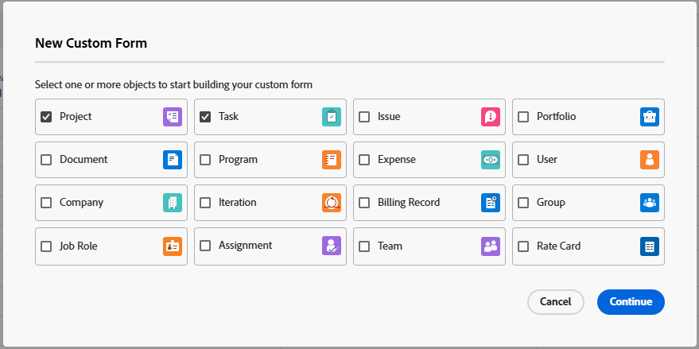

# Erstellen eines benutzerdefinierten Formulars

<!-- Audited: 6/2025 -->

{{preview-fast-release-general}}

Sie können mit dem Formular-Designer in Adobe Workfront ein benutzerdefiniertes Formular entwerfen. Sie können benutzerdefinierte Formulare an verschiedene Workfront-Objekte anhängen, um Daten zu diesen Objekten zu erfassen.

## Zugriffsanforderungen

+++ Erweitern, um die Zugriffsanforderungen für die in diesem Artikel beschriebene Funktionalität anzuzeigen.

<table style="table-layout:auto"> 
 <col> 
 <col> 
 <tbody> 
  <tr> 
   <td>Adobe Workfront-Paket</td> 
   <td> 
So erstellen Sie benutzerdefinierte Formulare für Aufgabengebiete, Tarifkarten und Zuweisungen: Workflow-Ultimate

      
So erstellen Sie benutzerdefinierte Formulare für alle anderen unterstützten Objekte: Beliebiges Workfront- oder Workflow-Paket
 </td> 
  </tr>  
  <tr> 
   <td>Adobe Workfront-Lizenz</td> 
   <td>
Standard

       
Abo
</td>
  </tr> 
  <tr> 
   <td>Konfigurationen der Zugriffsebene</td> 
   <td>Administrativer Zugriff auf benutzerdefinierte Formulare</td> 
  </tr>  
 </tbody> 
</table>

Weitere Informationen finden Sie unter [Zugriffsanforderungen in der Dokumentation zu Workfront](/help/quicksilver/administration-and-setup/add-users/access-levels-and-object-permissions/access-level-requirements-in-documentation.md).

+++

## Erste Schritte beim Entwurf eines benutzerdefinierten Formulars

{{step-1-to-setup}}

1. Klicken Sie im linken Panel auf **Benutzerdefinierte Formulare** und wählen Sie dann **Formulare** aus.

1. Klicken Sie auf **Neues benutzerdefiniertes Formular**.
1. Wählen Sie aus, an welche Objekttypen Sie das benutzerdefinierte Formular anhängen möchten, und klicken Sie dann auf **Fortfahren**.

   

   +++ Erweitern Sie , um die Liste der Objekte anzuzeigen, die benutzerdefinierte Formulare unterstützen.

   * Projekt
   * Aufgabe
   * Anfrage/Anfrage
   * Portfolio
   * Dokument
   * Programm
   * Ausgabe
   * Benutzerin oder Benutzer
   * Firma
   * Wiederholung
   * Abrechnungseintrag
   * Gruppe
   * Team

   Wenn Sie sich im Workflow-Ultimate-Paket befinden, können Sie auch benutzerdefinierte Formulare für diese Objekte erstellen:

   * Aufgabengebiet
   * Tarifkarte
   * Zuweisung

   +++

1. Geben Sie im Bereich **Einen Formularnamen hinzufügen** den benutzerdefinierten Titel des Formulars ein.
1. (Optional) Wenn Sie dem Formular weitere Objekttypen hinzufügen möchten, damit es mit weiteren Objekten verbunden werden kann, klicken Sie auf **Objekttypen** in der Kopfzeile des Formular-Designers. Wählen Sie die Objekttypen aus, die Sie hinzufügen möchten, und heben Sie die Auswahl der Objekttypen auf, die Sie aus dem Formular löschen möchten.

   >[!CAUTION]
   >
   >Beim Löschen eines benutzerdefinierten Formulars werden auch alle benutzerdefinierten Daten in den mit dem Formular verknüpften Objekten gelöscht. Die gelöschten Daten können nicht wiederhergestellt werden. Alternativ können Sie ein benutzerdefiniertes Formular deaktivieren, das Sie nicht mehr verwenden. Dadurch werden alle zugehörigen historischen Daten beibehalten.
   >
   >Weitere Informationen finden Sie unter [Hinzufügen oder Löschen von Objekttypen aus einem vorhandenen benutzerdefinierten Formular](/help/quicksilver/administration-and-setup/customize-workfront/create-manage-custom-forms/form-designer/manage-a-form/add-or-remove-objects-from-a-form.md) und [Deaktivieren oder Reaktivieren eines benutzerdefinierten Formulars](/help/quicksilver/administration-and-setup/customize-workfront/create-manage-custom-forms/form-designer/manage-a-form/activate-deactivate-form.md).

1. Als Nächstes können Sie damit beginnen, Ihrem benutzerdefinierten Formular Felder hinzuzufügen. Weitere Informationen finden Sie in den folgenden Abschnitten:
   * [Wiederverwenden eines vorhandenen Feldes oder Widgets, das bereits in einem anderen benutzerdefinierten Formular verwendet wurde](#reuse-an-existing-field-or-widget-already-used-in-another-custom-form)
   * [Hinweise zu Feldnamen und -Labels](#notes-on-field-names-and-labels)
   * [Hinzufügen von Textfeldern](#add-text-fields)
   * [Hinzufügen von berechneten Feldern](#add-calculated-fields)
   * [Hinzufügen von Optionsfeldern, Kontrollkästchengruppen und Dropdown-Listen](#add-radio-buttons-checkbox-groups-and-drop-downs)
   * [Hinzufügen von Feldern für die automatische Vervollständigung und von Datumsfeldern](#add-typeahead-and-date-fields)
   * [Hinzufügen von externen Suchfeldern](#add-external-lookup-fields)
   * [Hinzufügen von Bildern, PDFs und Videos](#add-images-pdfs-and-videos)
   * [Hinzufügen von nativen Workfront-Feldern](#add-workfront-native-fields)
   * [Hinzufügen von Adobe XD-Dateien](#add-adobe-xd-files)
   * [Hinzufügen von Planung-Verbindungsfeldern](#add-planning-connection-fields)

## Hinzufügen neuer oder vorhandener Felder zum benutzerdefinierten Formular

Sie können neue oder vorhandene Felder beim Entwerfen Ihres benutzerdefinierten Formulars verwenden.

Benutzerdefinierte Formulare sind auf 500 Felder beschränkt. Ein Zähler unten links zeigt an, wie viele Felder im Formular verwendet werden. Er ist immer sichtbar, wenn Sie im Formular-Designer scrollen.

### Wiederverwenden eines vorhandenen Feldes oder Widgets, das bereits in einem anderen benutzerdefinierten Formular verwendet wurde

1. Klicken Sie oben links im Bildschirm auf **Feldbibliothek**.

1. Verschieben Sie das gewünschte Feld oder Widget per Drag-and-Drop auf die Arbeitsfläche. Wiederholen Sie diesen Schritt, um weitere Felder oder Widgets hinzuzufügen.

   >[!NOTE]
   >
   >Sie können bis zu 500 Felder in einem einzigen benutzerdefinierten Formular hinzufügen. Je nach Komplexität Ihres benutzerdefinierten Formulars kann es jedoch zu Leistungseinbußen kommen, wenn mehr als 100 Felder in einem Formular vorhanden sind.
   >
   >
   >Beispiele für komplexe Formulare sind Formulare mit kaskadierenden Parametern, berechnete benutzerdefinierte Datenfelder und Optionen mit mehreren Werten in einem bestimmten Feld.

   >[!NOTE]
   >
   >Wenn Sie ein vorhandenes Feld als inaktiv kennzeichnen, ist es von diesem Zeitpunkt an nicht mehr für die Verwendung in Reporting-Elementen und benutzerdefinierten Formularen verfügbar. Wenn das inaktive Feld derzeit in einem Bericht oder Formular verwendet wird, bleiben das Feld und seine historischen Daten erhalten.

1. Um Ihre Änderungen zu speichern, klicken Sie auf **Anwenden** und gehen Sie zu einem anderen Abschnitt über, um mit der Erstellung Ihres Formulars fortzufahren.

   Oder

   Klicken Sie auf **Speichern und schließen**.

### Hinweise zu Feldnamen und -Labels {#notes-on-field-names-and-labels}

Das Label ist für die meisten Felder verfügbar. Es handelt sich um ein beschreibendes Label, das über dem Feld oder Widget im benutzerdefinierten Formular angezeigt wird. Sie können dieses Label jederzeit ändern.

>[!NOTE]
>
>Verwenden Sie möglichst keine Sonderzeichen in diesem Label, da sie in Berichten nicht korrekt angezeigt werden.

Für jedes Feld ist ein Name erforderlich. Dieser Name wird vom System zur Identifizierung des benutzerdefinierten Feldes verwendet, wenn Sie es verschiedenen Bereichen in Workfront hinzufügen, z. B. Berichten, der Startseite und API-Interaktionen. Wenn Sie das Feld oder Widget zum ersten Mal konfigurieren und das Label eingeben, wird dieser automatisch in das Feld „Name“ übernommen. Die Felder „Label“ und „Name“ werden nicht synchronisiert. Dadurch haben Sie die Möglichkeit, das Label zu ändern, das die Benutzenden sehen, ohne den Namen ändern zu müssen, den das System sieht.

Der Name des benutzerdefinierten Feldes muss in der Workfront-Instanz Ihrer Organisation eindeutig sein. Auf diese Weise können Sie einen bereits für ein anderes benutzerdefiniertes Formular erstellten Namen wiederverwenden.

>[!NOTE]
>
>Obwohl dies möglich ist, empfehlen wir, diesen Namen nicht zu ändern, nachdem Sie oder andere Benutzende mit der Verwendung des benutzerdefinierten Formulars in Workfront begonnen haben. Andernfalls erkennt das System das benutzerdefinierte Feld nicht mehr, in dem jetzt in anderen Bereichen von Workfront darauf verwiesen werden kann.
>Wenn Sie beispielsweise ein benutzerdefiniertes Feld zu einem Bericht hinzufügen und später seinen Namen ändern, erkennt Workfront es im Bericht nicht. Daher funktioniert es dort nicht mehr ordnungsgemäß, es sei denn, Sie fügen es dem Bericht unter dem neuen Namen erneut hinzu.
>
>Es wird empfohlen, keinen Namen einzugeben, der bereits für integrierte Workfront-Felder verwendet wird.
>
>Es wird empfohlen, im Namen des benutzerdefinierten Feldes keinen Punkt zu verwenden, um Fehler zu vermeiden, wenn das Feld in verschiedenen Bereichen von Workfront verwendet wird.

Die folgenden Sonderzeichen werden in Labels und Namen benutzerdefinierter Felder nicht unterstützt.

* \t
* \n
* \r
* \f
* `[`
* `]`
* (
* )
* :
* `{`
* `}`

### Hinzufügen von Textfeldern

Sie können einem benutzerdefinierten Formular mehrere unterschiedliche Textfelder hinzufügen.

+++ Erweitern, um Beschreibungen der verfügbaren Textfelder anzuzeigen

* **Textfeld mit einzelner Zeile**: Ermöglicht es Benutzenden, eine einzelne Textzeile in das Feld einzugeben.
* **Feld „Absatz“**: Ermöglicht es Benutzenden, mehrere Textzeilen in das Feld einzugeben.
* **Rich-Text**: Ermöglicht Benutzern, mehrere Textzeilen in das Feld einzugeben und den Text mit fett, kursiv, unterstrichen, Aufzählungszeichen, Nummerierung, Tiefgestellt und hochgestellt, Hyperlinks, Blockanführungszeichen, Überschriften und Tabellen zu formatieren. Eine Zeichenbeschränkung von 15.000 bietet viel Platz für Text und Formatierung.

  Der Rich-Text-Feldtyp ersetzt den Text durch den Feldtyp Formatierung . Sie können vorhandenen Text mit Formatierungsfeldern schnell in Rich-Text konvertieren, indem Sie auf die Schaltfläche **In Rich-Text konvertieren** in den Feldoptionen auf der rechten Seite klicken.

* **Textfeld mit Formatierung**: Ermöglicht es Benutzenden, mehrere Textzeilen in das Feld einzugeben und den Text mit Fettschrift, Kursivschrift, Unterstreichung, Aufzählungszeichen, Nummerierungen, Hyperlinks und Blockzitaten zu formatieren. Eine Beschränkung auf 15.000 Zeichen ermöglicht viel Text und Formatierungen.

  Dieser benutzerdefinierte Feldtyp wird in Filtern in Listen und Berichten nicht unterstützt.

  Informationen zum Zugriff auf dieses Feld über die API finden Sie unter [Speicherung von Rich-Text-Feldern in der API](/help/quicksilver/administration-and-setup/customize-workfront/create-manage-custom-forms/rich-text-field-storage-in-the-api.md).

  >[!NOTE]
  >
  >Textfelder mit Formatierung sind für Workfront-Apps nicht verfügbar (in kommenden Versionen verfügbar).

* **Beschreibender Text**: Ermöglicht das Einfügen von Anweisungen und Links zu Seiten außerhalb von Workfront.

+++

So fügen Sie ein Textfeld hinzu:

1. Suchen Sie auf der Registerkarte **Neues Feld** auf der linken Seite des Bildschirms nach einem der folgenden Textfelder und ziehen Sie es in Abschnitt auf der Arbeitsfläche:

   * Einzeiliger Text
   * Absatz
   * Rich-Text
   * Text mit Formatierung
   * Beschreibender Text

   

1. Konfigurieren Sie auf der rechten Seite des Bildschirms die Optionen, die für den Typ des benutzerdefinierten Feldes verfügbar sind, das Sie hinzufügen:

   <table>
    <tr>
    <td>Eingabe in</td>
    <td>Beschreibung</td>
    <td>Verfügbar für </td>
    </tr>
    <tr>
    <td>Größe</td>
    <td>
(Optional) Ändern Sie die Größe der Textfelder im Formular.

   </td>
    <td><ul>
    <li>Einzeiliger Text</li>
    <li>Absatz</li>
    <li>Rich Text</li>
    <li>Text mit Formatierung</li>
    <li>Beschreibender Text</li>
    </ul></td>
    </tr>
    <tr>
    <td>Label</td>
    <td>
(Erforderlich) Geben Sie ein beschreibendes Label ein, das über dem Feld angezeigt werden soll. Sie können dieses Label jederzeit ändern.

    
<b>Wichtig</b>: Verwenden Sie in diesem Label keine Sonderzeichen, da diese in Berichten nicht korrekt angezeigt werden. Weitere Informationen finden Sie unter <a href="design-a-form.md#notes-on-field-names-and-labels">Hinweise zu Feldnamen und -Labels</a>.
</td>
    <td><ul>
    <li>Einzeiliger Text</li>
    <li>Absatz</li>
    <li>Rich Text</li>
    <li>Text mit Formatierung</li>
    </ul></td>
    </tr>
    <tr>
     <td>Name</td>
    <td>
(Erforderlich) Über diesen Namen wird das Feld vom System identifiziert. Wenn Sie das Widget zum ersten Mal konfigurieren und das Label eingeben, wird dieses automatisch in das Feld „Name“ übernommen. Die Felder „Label“ und „Name“ werden nicht synchronisiert. Dadurch haben Sie die Möglichkeit, das Label zu ändern, das die Benutzenden sehen, ohne den Namen ändern zu müssen, den das System sieht.

    
Weitere Informationen finden Sie unter <a href="design-a-form.md#notes-on-field-names-and-labels">Hinweise zu Feldnamen und -Labels</a>.

    </td>
    <td><ul>
    <li>Einzeiliger Text</li>
    <li>Absatz</li>
    <li>Rich Text</li>
    <li>Text mit Formatierung</li>
    <li>Beschreibender Text</li>
    </ul></td>
    </tr>
    <tr>
    <td>Anweisungen</td>
    <td>Geben Sie zusätzliche Informationen zum Feld ein. Wenn Benutzer das benutzerdefinierte Formular ausfüllen, können sie den Mauszeiger über das Fragezeichen bewegen, um eine QuickInfo mit den hier eingegebenen Informationen anzuzeigen.
    
    </td>
    <td><ul>
    <li>Einzeiliger Text</li>
    <li>Absatz</li>
    <li>Rich Text</li>
    <li>Text mit Formatierung</li>
    </ul></td>
    </tr>
    <tr>
    <td>Format</td>
    <td>
Wählen Sie den Datentyp aus, der im benutzerdefinierten Feld erfasst werden soll.
 
<b>Hinweis</b>:   
    <ul> 
    <li>Dieses Feld kann nach dem Speichern des Formulars nicht mehr bearbeitet werden. Wenn Sie Ihr Feld in mathematischen Berechnungen verwenden möchten, müssen Sie unbedingt ein Zahlen- oder Währungsformat auswählen.</li> 
    <li>Wenn Sie „Zahl“ oder „Währung“ auswählen, kürzt das System automatisch Zahlen, die mit 0 beginnen.</li>
    <li>Zahlenfelder sind auf 16 Zeichen beschränkt. Sie können auch ein Textfeld verwenden, um Zahlen einzugeben und das Limit zu vermeiden.</li>
     </ul>
</td> </td>
    <td><ul>
    <li>Einzeiliger Text</li>
    <li>Absatz</li>
    </ul></td>
    </tr>
    <tr>
      <td>Berechtigungstyp „Finanzen“</td>
      <td>
Wählen Sie den Finanzberechtigungstyp aus, den die Benutzer haben müssen, damit sie dieses benutzerdefinierte Feld anzeigen oder bearbeiten können. Das Währungsformat muss ausgewählt sein.

      <ul>
      <li>
<strong>Keine Berechtigungen erforderlich:</strong> Alle Benutzer können dieses Feld sehen
</li>
      <li>
<strong>Allgemein:</strong> Benutzer müssen über Berechtigungen zum Bearbeiten oder Anzeigen von General Finance verfügen
</li>
      <li>
<strong>Rechnung: </strong> Benutzer müssen über die Berechtigung zum Bearbeiten oder Anzeigen von Abrechnungssätzen verfügen
</li>
      <li>
<strong>Kosten:</strong> Benutzer müssen berechtigt sein, Kostensätze zu bearbeiten oder anzuzeigen
</li>
      </ul>
      
Weitere Informationen finden Sie unter <a href="/help/quicksilver/administration-and-setup/customize-workfront/create-manage-custom-forms/form-designer/design-a-form/restrict-access-to-financial-data.md">Einschränken des Zugriffs auf Finanzdaten in benutzerdefinierten Feldern</a>.

      </td>
      <td><ul>
       <li>Einzeiliger Text</li>
       <li>Absatz</li>
       </ul></td>
    </tr>
    <tr>
    <td>Anzeigetyp</td>
    <td>Wechseln Sie zwischen Textfeldern mit einzelnen Zeilen und Absatzfeldern.</td>
    <td><ul>
    <li>Einzeiliger Text</li>
    <li>Absatz</li>
    </ul></td>
    </tr>
    <tr>
    <td>Hyperlink</td>
    <td> Wenn Sie einen Hyperlink auf den eingegebenen beschreibenden Text anwenden möchten, fügen Sie ihn hier hinzu. Der beschreibende Text wird als Link auf Objekten angezeigt, an die das Formular angehängt ist.</td>
    <td><ul><li>Beschreibender Text</li></ul></td>
    </tr>
    <tr>
     <td>Aktiv</td>
     <td>
Diese Option ist standardmäßig aktiviert.

Wenn Sie ein Feld als inaktiv festlegen, wird es aus Berichten, Filtern und Ansichten ausgeschlossen und ist nicht mehr in der Feldbibliothek für benutzerdefinierte Formulare verfügbar.
</td>
     <td><ul>
     <li>Einzeiliger Text</li>
     <li>Absatz</li>
     <li>Rich Text</li>
     <li>Text mit Formatierung</li>
     <li>Beschreibender Text</li></ul></td>
    </tr>
    <tr> 
      <td>Zu einem Pflichtfeld machen</td>
      <td>
Wählen Sie diese Option aus, wenn das Feld erforderlich sein soll, damit Benutzende das benutzerdefinierte Formular ausfüllen können.
</td>
    <td><ul>
    <li>Einzeiliger Text</li>
    <li>Absatz</li>
    <li>Rich Text</li>
    <li>Text mit Formatierung</li>
    </ul></td> 
    </tr> 
   </table>

1. (Optional) Wiederholen Sie den vorherigen Schritt, um weitere Felder oder Widgets hinzuzufügen.

   Oder

   Um ein Feld zu kopieren, bewegen Sie den Mauszeiger über ein Feld und klicken Sie auf das Kopiersymbol.

   

1. Um Ihre Änderungen zu speichern, klicken Sie auf **Anwenden** und wechseln Sie zu einem anderen Abschnitt, um mit der Erstellung Ihres Formulars fortzufahren.

   Oder

   Klicken Sie auf **Speichern und schließen**.

### Hinzufügen von berechneten Feldern

In einem benutzerdefinierten Formular können Sie ein berechnetes benutzerdefiniertes Feld hinzufügen, in dem vorhandene Daten verwendet werden, um neue Daten zu generieren, wenn das benutzerdefinierte Formular an ein Objekt angehängt wird.

Informationen zum Hinzufügen eines berechneten Feldes finden Sie unter [Hinzufügen berechneter Felder mit dem Formular-Designer](/help/quicksilver/administration-and-setup/customize-workfront/create-manage-custom-forms/form-designer/design-a-form/add-a-calculated-field.md).

### Hinzufügen von Optionsfeldern, Kontrollkästchengruppen und Dropdown-Listen

Sie können Optionsfelder, Kontrollkästchengruppen, Dropdown-Listen und Dropdown-Listen mit Mehrfachauswahl zu einem benutzerdefinierten Formular hinzufügen.

+++ Erweitern, um Beschreibungen der verfügbaren Felder anzuzeigen

* **Optionsfelder**: Benutzende können nur eine Option auswählen.
* **Kontrollkästchengruppe**: Benutzende können mehrere Optionen auswählen.
* **Einfachauswahl-Dropdown**: Bietet eine Liste mit Dropdown-Optionen.
* **Mehrfachauswahl-Dropdown**: Benutzende können mehrere Optionen in einer Dropdown-Liste auswählen.

+++

>[!NOTE]
>
>Felder, die mehrere Auswahlmöglichkeiten zulassen, z. B. „Kontrollkästchengruppe“ und „Mehrfachauswahl-Dropdown“ lassen sich in Berichten nur schwer grafisch darstellen und gruppieren. Um die grafische Darstellung und Gruppierungen in Berichten einfacher zu gestalten, können Sie für jede Option separate Felder erstellen (z. B. ein Textfeld mit einzelner Zeile).

So fügen Sie Optionsfelder, Kontrollkästchengruppen und Dropdown-Listen hinzu:

1. Suchen Sie auf der Registerkarte **Neues Feld** links auf dem Bildschirm nach einem der folgenden Felder und ziehen Sie es einen Abschnitt auf der Arbeitsfläche:

   * Optionsfelder
   * Kontrollkästchengruppe
   * Einfachauswahl-Dropdown
   * Mehrfachauswahl-Dropdown

   

1. Konfigurieren Sie auf der rechten Seite des Bildschirms die Optionen, die für den Typ des benutzerdefinierten Feldes verfügbar sind, das Sie hinzufügen:

   <table style="table-layout:auto"> 
    <tbody> 
    <tr>
    <td>Eingabe in</td>
    <td>Beschreibung</td>
    <td>Verfügbar für </td>
    </tr>
    <tr> 
     <td role="rowheader">Label</td> 
     <td> 
(Erforderlich) Geben Sie ein beschreibendes Label ein, das über dem benutzerdefinierten Feld angezeigt werden soll. Sie können dieses Label jederzeit ändern.
 
<b>Wichtig</b>: Verwenden Sie in diesem Label keine Sonderzeichen, da diese in Berichten nicht korrekt angezeigt werden. Weitere Informationen finden Sie unter <a href="design-a-form.md#notes-on-field-names-and-labels">Hinweise zu Feldnamen und -Labels</a>.
 </td> 
     <td><ul>
    <li>Optionsfelder</li>
    <li>Kontrollkästchengruppe</li>
    <li>Einfachauswahl-Dropdown</li>
    <li>Mehrfachauswahl-Dropdown</li>
    </ul></td>
     </tr> 
     <tr> 
    <td role="rowheader">Name</td> 
     <td> 
(Erforderlich) Über diesen Namen wird das Feld vom System identifiziert. Wenn Sie das Widget zum ersten Mal konfigurieren und das Label eingeben, wird dieses automatisch in das Feld „Name“ übernommen. Die Felder „Label“ und „Name“ werden nicht synchronisiert. Dadurch haben Sie die Möglichkeit, das Label zu ändern, das die Benutzenden sehen, ohne den Namen ändern zu müssen, den das System sieht.
 
    
Weitere Informationen finden Sie unter <a href="design-a-form.md#notes-on-field-names-and-labels">Hinweise zu Feldnamen und -Labels</a>.
 </td>
     <td><ul>
    <li>Optionsfelder</li>
    <li>Kontrollkästchengruppe</li>
    <li>Einfachauswahl-Dropdown</li>
    <li>Mehrfachauswahl-Dropdown</li>
    </ul></td>
    </tr> 
    <tr> 
    <td role="rowheader">Anweisungen</td> 
    <td> 
Geben Sie zusätzliche Informationen zum benutzerdefinierten Feld ein. Wenn Benutzende das benutzerdefinierte Formular ausfüllen, können sie den Mauszeiger über das Fragezeichen bewegen, um eine QuickInfo mit den hier eingegebenen Informationen anzuzeigen.
 
    
   

    </td> 
    <td><ul>
    <li>Optionsfelder</li>
    <li>Kontrollkästchengruppe</li>
    <li>Einfachauswahl-Dropdown</li>
    <li>Mehrfachauswahl-Dropdown</li>
    </ul></td>
    </tr> 
    <tr> 
    <td role="rowheader">Format</td> 
    <td> 
Wählen Sie den Datentyp aus, der im benutzerdefinierten Feld erfasst werden soll.
 
<b>Hinweis</b>:   
     <ul> 
    <li>Dieses Feld kann nach dem Speichern des Formulars nicht mehr bearbeitet werden. Wenn Sie Ihr Feld in mathematischen Berechnungen verwenden möchten, müssen Sie unbedingt ein Zahlen- oder Währungsformat auswählen. </li> 
    <li>Wenn Sie „Zahl“ oder „Währung“ auswählen, kürzt das System automatisch Zahlen, die mit 0 beginnen.</li>
    <li>Zahlenfelder sind auf 16 Zeichen beschränkt. Sie können auch ein Textfeld verwenden, um Zahlen einzugeben und das Limit zu vermeiden.</li>
     </ul>
</td> 
     <td><ul>
    <li>Optionsfelder</li>
    <li>Kontrollkästchengruppe</li>
    <li>Einfachauswahl-Dropdown</li>
    <li>Mehrfachauswahl-Dropdown</li>
    </ul></td>
    </tr> 
    <tr>
      <td>Berechtigungstyp „Finanzen“</td>
      <td>
Wählen Sie den Finanzberechtigungstyp aus, den die Benutzer haben müssen, damit sie dieses benutzerdefinierte Feld anzeigen oder bearbeiten können. Das Währungsformat muss ausgewählt sein.

      <ul>
      <li>
<strong>Keine Berechtigungen erforderlich:</strong> Alle Benutzer können dieses Feld sehen
</li>
      <li>
<strong>Allgemein:</strong> Benutzer müssen über Berechtigungen zum Bearbeiten oder Anzeigen von General Finance verfügen
</li>
      <li>
<strong>Rechnung: </strong> Benutzer müssen über die Berechtigung zum Bearbeiten oder Anzeigen von Abrechnungssätzen verfügen
</li>
      <li>
<strong>Kosten:</strong> Benutzer müssen berechtigt sein, Kostensätze zu bearbeiten oder anzuzeigen
</li>
      </ul>
      
Weitere Informationen finden Sie unter <a href="/help/quicksilver/administration-and-setup/customize-workfront/create-manage-custom-forms/form-designer/design-a-form/restrict-access-to-financial-data.md">Einschränken des Zugriffs auf Finanzdaten in benutzerdefinierten Feldern</a>.

      </td>
      <td><ul>
       <li>Optionsfelder</li>
       <li>Kontrollkästchengruppe</li>
       <li>Einfachauswahl-Dropdown</li>
       <li>Mehrfachauswahl-Dropdown</li>
       </ul></td>
    </tr>
    <tr> 
     <td role="rowheader">Anzeigetyp</td> 
    <td>Wechseln Sie zwischen Optionsfeldern, Kontrollkästchengruppen, Einfachauswahl-Dropdown oder Mehrfachauswahl-Dropdown für das Feld.</td> 
    <td><ul>
    <li>Optionsfelder</li>
    <li>Kontrollkästchengruppe</li>
    <li>Einfachauswahl-Dropdown</li>
    <li>Mehrfachauswahl-Dropdown</li>
    </ul></td>
    </tr> 
    <td role="rowheader">Auswahl </td> 
    <td> 
    
Wählen Sie eine der folgenden Optionen aus:
 
    <ul> 
    <li><strong>Werte anzeigen</strong>: Zeigt die Werte jeder Auswahlmöglichkeit im Feld an. Das Label jeder Auswahlmöglichkeit wird standardmäßig angezeigt.</li>
   <li><strong>Auswahl von A–Z sortieren</strong>: Sortiert die im Feld hinzugefügten Auswahlmöglichkeiten alphabetisch.</li>
    </ul>
     
Klicken Sie für jede Auswahl, die Sie dem Benutzer bzw. der Benutzerin hinzufügen, auf das Zahnradsymbol  und wählen Sie dann eine der folgenden Optionen aus:
 
    <ul> 
    <li><strong>Gemäß Standard anzeigen</strong>: Wählen Sie im Feld die Standardauswahl aus.</li> 
    <li> 
<strong>Auswahl ausblenden</strong>: Blendet die Auswahl im Feld aus. Ausgeblendete Auswahlmöglichkeiten bleiben in Berichten verfügbar.
 </li> 
    <li> 
<strong>Auswahl entfernen</strong>: Entfernt die Auswahl aus dem Feld.
 
<b>Warnung</b>: Wenn Sie aktuelle Objekte haben, die diese Auswahlmöglichkeit verwenden, entfernen Sie sie nicht aus dem Feld. Durch Entfernen gehen historische Daten verloren. Wählen Sie stattdessen die Option aus, um sie auszublenden, sodass die Benutzenden sie in Zukunft nicht mehr auswählen können.
 </li> 
    </ul>   
    
<b>Hinweis:</b> Es gibt keine Begrenzung dafür, wie viele Optionen Sie auswählen können. 
    
    </td> 
    <td><ul>
    <li>Optionsfelder</li>
    <li>Kontrollkästchengruppe</li>
    <li>Einfachauswahl-Dropdown</li>
    <li>Mehrfachauswahl-Dropdown</li>
    </ul>
    </td>
     </tr>
    <tr>
     <td>Aktiv</td>
     <td>
Diese Option ist standardmäßig aktiviert.

Wenn Sie ein Feld als inaktiv festlegen, wird es aus Berichten, Filtern und Ansichten ausgeschlossen und ist nicht mehr in der Feldbibliothek für benutzerdefinierte Formulare verfügbar.
</td>
     <td><ul>
     <li>Optionsfelder</li>
     <li>Kontrollkästchengruppe</li>
     <li>Einfachauswahl-Dropdown</li>
     <li>Mehrfachauswahl-Dropdown</li></ul></td>
    </tr>
    <tr> 
    <td role="rowheader">Zu einem Pflichtfeld machen</td> 
    <td>Wählen Sie diese Option aus, wenn das Feld erforderlich sein soll, damit Benutzende das benutzerdefinierte Formular ausfüllen können. </td> 
    <td><ul>
    <li>Optionsfelder</li>
    <li>Kontrollkästchengruppe</li>
    <li>Einfachauswahl-Dropdown</li>
    <li>Mehrfachauswahl-Dropdown</li>
    </ul></td>
     </tr> 
    <tr> 
    </tbody> 
    </table>

1. (Optional) Wiederholen Sie den vorherigen Schritt, um weitere Felder oder Widgets hinzuzufügen.

   Oder

   Um ein Feld zu kopieren, bewegen Sie den Mauszeiger über ein Feld und klicken Sie auf das Kopiersymbol.

   

1. Um Ihre Änderungen zu speichern, klicken Sie auf **Anwenden** und wechseln Sie zu einem anderen Abschnitt, um mit der Erstellung Ihres Formulars fortzufahren.

   Oder

   Klicken Sie auf **Speichern und schließen**.

### Hinzufügen von Feldern für die automatische Vervollständigung und von Datumsfeldern

Sie können einem benutzerdefinierten Formular Felder für die automatische Vervollständigung und Datumsfelder hinzufügen.

+++ Erweitern, um Beschreibungen der verfügbaren Felder anzuzeigen

* **Typeahead**: Ermöglicht es Benutzenden, den Namen eines Objekts einzugeben, das in Workfront vorhanden ist. Eine Liste mit Vorschlägen wird angezeigt, wenn Benutzende mit der Eingabe beginnen. Dieser Feldtyp unterstützt die folgenden Objekte:
   * Benutzerin oder Benutzer
   * Gruppe
   * Aufgabengebiet
   * Portfolio
   * Programm
   * Projekt
   * Team
   * Vorlage
   * Firma
* **Datum**: Zeigt einen Kalender an, in dem Benutzende ein Datum und eine Uhrzeit auswählen können.

+++

So fügen Sie Felder für die automatische Vervollständigung und Datumsfelder hinzu:

1. Suchen Sie auf der Registerkarte **Neues Feld** links auf dem Bildschirm nach einem der folgenden Felder und ziehen Sie es in einen Abschnitt der Arbeitsfläche.

   * Typeahead
   * Datum

   

1. Konfigurieren Sie auf der rechten Seite des Bildschirms die Optionen, die für den Typ des benutzerdefinierten Feldes verfügbar sind, das Sie hinzufügen:

   <table style="table-layout:auto"> 
    <tbody> 
     <tr>
    <td>Feldeinstellung</td>
    <td>Beschreibung</td>
    <td>Verfügbar für </td>
    </tr>
     <tr> 
      <td role="rowheader">Label</td> 
      <td> 
(Erforderlich) Geben Sie ein beschreibendes Label ein, das über dem benutzerdefinierten Feld angezeigt werden soll. Sie können dieses Label jederzeit ändern.
 
<b>Wichtig</b>: Verwenden Sie in diesem Label keine Sonderzeichen, da diese in Berichten nicht korrekt angezeigt werden. Weitere Informationen finden Sie unter <a href="design-a-form.md#notes-on-field-names-and-labels">Hinweise zu Feldnamen und -Labels</a>.
 </td> 
       <td><ul>
    <li>Typeahead</li>
    <li>Datum</li>
    </ul></td>
     </tr> 
     <tr> 
      <td role="rowheader">Name</td> 
      <td> 
(Erforderlich) Über diesen Namen wird das Feld vom System identifiziert. Wenn Sie das Widget zum ersten Mal konfigurieren und das Label eingeben, wird dieses automatisch in das Feld „Name“ übernommen. Die Felder „Label“ und „Name“ werden nicht synchronisiert. Dadurch haben Sie die Möglichkeit, das Label zu ändern, das die Benutzenden sehen, ohne den Namen ändern zu müssen, den das System sieht.
 
      
Weitere Informationen finden Sie unter <a href="design-a-form.md#notes-on-field-names-and-labels">Hinweise zu Feldnamen und -Labels</a>.
 </td>
    <td><ul>
    <li>Typeahead</li>
    <li>Datum</li>
    </ul></td>
     </tr> 
     <tr> 
      <td role="rowheader">Anweisungen</td> 
      <td> 
Geben Sie zusätzliche Informationen zum benutzerdefinierten Feld ein. Wenn Benutzende das benutzerdefinierte Formular ausfüllen, können sie den Mauszeiger über das Fragezeichen bewegen, um eine QuickInfo mit den hier eingegebenen Informationen anzuzeigen.
 
      
  

      </td> 
         <td><ul>
    <li>Typeahead</li>
    <li>Datum</li>
    </ul></td>
     </tr> 
     <tr> 
      <td role="rowheader">Tageszeit anzeigen</td> 
      <td>Wählen Sie diese Option aus, wenn Sie die Tageszeit zusammen mit dem Datum im Feld anzeigen möchten.</td> 
         <td><ul>
    <li>Datum</li>
    </ul></td>
     </tr> 
     <tr> 
      <td role="rowheader">Referenzierter Objekttyp</td> 
      <td> 
Wählen Sie den Objekttyp aus, den Sie mit dem Feld verknüpfen möchten.
 
Nachdem Sie auf <b>Anwenden</b> oder <b>Speichern und schließen</b> geklickt haben, können Sie den Objekttyp für das Feld nicht mehr ändern.
 
<b>Hinweis</b>:   
        <ul> 
         <li>Wenn die bzw. der Workfront-Admin den Namen für Portfolios, Programme oder Projekte in der Workfront-Benutzeroberfläche angepasst hat, wird in dieser Dropdown-Liste der standardmäßige Workfront-Name für das Objekt angezeigt, nicht der benutzerdefinierte Name. Wenden Sie sich an den bzw. die Workfront-Admin, wenn Sie Hilfe benötigen. </li> 
         <li>Die folgenden Objekttypen werden in Workfront-Apps für iOS und Android unterstützt: „Benutzerin oder Benutzer“, „Firma“, „Gruppe“, „Aufgabengebiet“, „Portfolio“, „Programm“, „Projekt“ und „Vorlage“.</li> 
        </ul> 
 </td> 
         <td><ul>
    <li>Typeahead</li>
    </ul></td>
     </tr>
     <tr>
      <td role="rowheader">Filter hinzufügen</td>
      <td>
Fügen Sie einen Filter für einen Objekttyp hinzu, um die Objekte zu begrenzen, die Benutzende auswählen können, wenn sie das Feld verwenden. 
 
Sie können beispielsweise ein Feld so beschränken, dass Benutzernamen nur ausgewählt werden können, wenn sie die folgenden Kriterien erfüllen:
 
       <ul> 
        <li>Sie gehören zu einer oder mehreren Gruppen, die Sie angeben.</li> 
        <li>Sie sind mit einer von Ihnen angegebenen Rolle oder einem von Ihnen angegebenen Aufgabengebiet verknüpft.</li> 
        <li>Sie gehören zur selben Gruppe wie die Person, die das Feld verwendet.</li> 
       </ul>
       
Sie müssen den Filter für den ausgewählten Objekttyp mithilfe der Textmodus-Syntax definieren. Weitere Informationen zum Erstellen eines Filters im Textmodus finden Sie unter <a href="/help/quicksilver/reports-and-dashboards/reports/text-mode/edit-text-mode-in-filter.md">Bearbeiten eines Filters im Textmodus</a>.

       
<b>Tipp:</b> Sie können einen Bericht erstellen, um Ihren Filter zu testen, bevor Sie den Filter direkt zum Feld mit automatischer Vervollständigung (Typeahead) hinzufügen. Auf diese Weise können Sie überprüfen, ob der Filter die richtigen Objekte zurückgibt. Anschließend können Sie im Bericht in den Textmodus wechseln, die Textmodusanweisung kopieren und zum Typeahead-Filter hinzufügen.

       
<b>Hinweis</b>:
       <ul> 
        <li>Wenn Sie ein vorhandenes benutzerdefiniertes Formular bearbeiten, werden beim Hinzufügen eines Filters zu einem Feld mit automatischer Vervollständigung keine Objekte entfernt (außerhalb des Bereichs des Filters), die Benutzende bereits mithilfe des Feldes hinzugefügt haben.</li> 
        <li>Dieser Filter ist auf Mobilgeräten nicht verfügbar. Wenn Sie den Filter für ein Feld mit automatischer Vervollständigung verwenden, wird das Feld auf den Mobilgeräten der Benutzenden angezeigt, ohne dass der Filter verfügbar ist.</li> 
        </ul>
</td> 
      <td>
       <ul>
       <li>Typeahead</li>
       </ul>
      </td>
     </tr>
     <tr>
      <td>Aktiv</td>
      <td>
Diese Option ist standardmäßig aktiviert.

Wenn Sie ein Feld als inaktiv festlegen, wird es aus Berichten, Filtern und Ansichten ausgeschlossen und ist nicht mehr in der Feldbibliothek für benutzerdefinierte Formulare verfügbar.
</td>
      <td><ul>
      <li>Typeahead</li>
      <li>Datum</li></ul></td>
     </tr>
     <tr> 
      <td role="rowheader">Zu einem Pflichtfeld machen</td> 
      <td>Wählen Sie diese Option aus, wenn das Feld erforderlich sein soll, damit Benutzende das benutzerdefinierte Formular ausfüllen können. </td> 
       <td><ul>
    <li>Typeahead</li>
    <li>Datum</li>
    </ul></td>
     </tr> 
    </tbody> 
   </table>

1. (Optional) Wiederholen Sie den vorherigen Schritt, um weitere Felder oder Widgets hinzuzufügen.

   Oder

   Um ein Feld zu kopieren, bewegen Sie den Mauszeiger über ein Feld und klicken Sie auf das Kopiersymbol.

   

1. Um Ihre Änderungen zu speichern, klicken Sie auf **Anwenden** und wechseln Sie zu einem anderen Abschnitt, um mit der Erstellung Ihres Formulars fortzufahren.

   Oder

   Klicken Sie auf **Speichern und schließen**.

### Hinzufügen von externen Suchfeldern

Ein externes Suchfeld ruft eine externe API auf und gibt Werte als Optionen in einem Dropdown-Feld zurück. Benutzende, die mit dem Objekt arbeiten, an das das benutzerdefinierte Formular angehängt ist, können eine oder mehrere dieser Optionen aus der Dropdown-Liste auswählen, je nachdem, ob das externe Suchfeld ein Feld mit Einfach- oder Mehrfachauswahl ist. Die externen Suchfelder sind auch in Listen und Berichten verfügbar.

Beispiele für die Verwendung des Feldes „Externer Lookup“ zum Aufrufen derselben Instanz von Workfront oder einer öffentlichen API finden Sie unter [Beispiele für das Feld „Externer Lookup“ in einem benutzerdefinierten Formular](/help/quicksilver/administration-and-setup/customize-workfront/create-manage-custom-forms/form-designer/design-a-form/external-lookup-examples.md).

>[!NOTE]
>
>* Felder des Typs „Externer Lookup“ sind nicht in Listen verfügbar, wenn das Feld eine Abhängigkeit von einem anderen Feld aufweist.

So fügen Sie eine externe Suche hinzu:

1. Suchen Sie auf der Registerkarte **Neues Feld** links auf dem Bildschirm nach **Externer Lookup** oder **Externe Suche mit Mehrfachauswahl** und ziehen Sie das Feld in einen Abschnitt auf der Arbeitsfläche.
1. Konfigurieren Sie auf der rechten Seite des Bildschirms die Optionen für das benutzerdefinierte Feld:

   <table style="table-layout:auto"> 
    <col> 
    <col> 
    <tbody> 
     <tr> 
      <td role="rowheader">Label</td> 
      <td> 
(Erforderlich) Geben Sie ein beschreibendes Label ein, das über dem benutzerdefinierten Feld angezeigt werden soll. Sie können dieses Label jederzeit ändern.
 
<b>Wichtig</b>: Verwenden Sie in diesem Label keine Sonderzeichen, da diese in Berichten nicht korrekt angezeigt werden. Weitere Informationen finden Sie unter <a href="design-a-form.md#notes-on-field-names-and-labels">Hinweise zu Feldnamen und -Labels</a>.
 </td> 
     </tr> 
     <tr> 
      <td role="rowheader">Name</td> 
      <td> 
(Erforderlich) Über diesen Namen wird das Feld vom System identifiziert. Wenn Sie das Widget zum ersten Mal konfigurieren und das Label eingeben, wird dieses automatisch in das Feld „Name“ übernommen. Die Felder „Label“ und „Name“ werden jedoch nicht synchronisiert. Dadurch haben Sie die Möglichkeit, das Label zu ändern, das den Benutzenden angezeigt wird, ohne den Namen ändern zu müssen, den das System sieht.

      
Weitere Informationen finden Sie unter <a href="design-a-form.md#notes-on-field-names-and-labels">Hinweise zu Feldnamen und -Labels</a>.
 </td>
     </tr> 
      <td role="rowheader">Anweisungen</td> 
      <td> 
Geben Sie zusätzliche Informationen zum benutzerdefinierten Feld ein. Wenn Benutzende das benutzerdefinierte Formular ausfüllen, können sie den Mauszeiger über das Fragezeichen bewegen, um eine QuickInfo mit den hier eingegebenen Informationen anzuzeigen.
 </td> 
     </tr> 
     <tr> 
      <td role="rowheader">Format</td>
      <td>
Wählen Sie den Datentyp aus, der im benutzerdefinierten Feld erfasst werden soll.

      
<strong>Hinweis:</strong>

      <ul><li>Sie können den Formattyp nach dem Speichern des Formulars ändern, mit einer Einschränkung: Alle vorhandenen Werte für Objekte müssen in den neuen Typ konvertiert werden können. (Wenn beispielsweise der Formattyp Text lautet und ein Objekt den Wert „abc“ speichert, können Sie das Feld nicht konvertieren und erhalten die Fehlermeldung, dass das System „abc“ nicht in Zahl/Währung konvertieren kann.) Wenn Sie Ihr Feld in mathematischen Berechnungen verwenden möchten, müssen Sie unbedingt ein Zahlen- oder Währungsformat auswählen.</li>
      <li>Wenn Sie „Zahl“ oder „Währung“ auswählen, kürzt das System automatisch Zahlen, die mit 0 beginnen.</li>
      <li>Zahlenfelder sind auf 16 Zeichen beschränkt. Sie können auch ein Textfeld verwenden, um Zahlen einzugeben und das Limit zu vermeiden.</li>
      </ul></td>
     </tr> 
     <tr>
      <td>Berechtigungstyp „Finanzen“</td>
      <td>
Wählen Sie den Finanzberechtigungstyp aus, den die Benutzer haben müssen, damit sie dieses benutzerdefinierte Feld anzeigen oder bearbeiten können. Das Währungsformat muss ausgewählt sein.

      <ul>
      <li>
<strong>Keine Berechtigungen erforderlich:</strong> Alle Benutzer können dieses Feld sehen
</li>
      <li>
<strong>Allgemein:</strong> Benutzer müssen über Berechtigungen zum Bearbeiten oder Anzeigen von General Finance verfügen
</li>
      <li>
<strong>Rechnung: </strong> Benutzer müssen über die Berechtigung zum Bearbeiten oder Anzeigen von Abrechnungssätzen verfügen
</li>
      <li>
<strong>Kosten:</strong> Benutzer müssen berechtigt sein, Kostensätze zu bearbeiten oder anzuzeigen
</li>
      </ul>
      
Weitere Informationen finden Sie unter <a href="/help/quicksilver/administration-and-setup/customize-workfront/create-manage-custom-forms/form-designer/design-a-form/restrict-access-to-financial-data.md">Einschränken des Zugriffs auf Finanzdaten in benutzerdefinierten Feldern</a>.

      </td>
     </tr>
     <tr> 
      <td role="rowheader">Basis-API-URL</td> 
      <td>
Geben Sie die URL für die API ein oder fügen Sie sie ein.

Die API-URL muss einen JSON-Inhalt der Optionen zurückgeben, die Sie in der Dropdown-Liste anzeigen möchten. Sie können das Feld „JSON-Pfad“ verwenden, um die spezifischen Werte aus der zurückgegebenen JSON als Dropdown-Optionen auszuwählen.

Bei der Eingabe der API-URL können Sie optional die folgenden Werte in die URL übergeben:

      <ul>
      <li>$$HOST – Stellt den aktuellen Workfront-Host dar und kann verwendet werden, um API-Aufrufe an die Workfront-API durchzuführen bzw. zu suchen. Wenn dieser Platzhalter verwendet wird, wird die Authentifizierung verarbeitet und die Benutzenden müssen keine Authentifizierungs-Header senden. (Benutzende können beispielsweise Aufgaben mithilfe der Basis-URL <code>$$HOST/attask/api/task/search</code> suchen. Auf diese Weise können Sie Aufgaben durchsuchen und Werte aus einer zurückgegebenen Aufgabenliste auswählen.)</li>
      <li>
$$QUERY – Stellt den Suchtext dar, den die Endbenutzenden in das Feld eingeben, und ermöglicht Ihnen die Implementierung der Abfragefilterung für die Endbenutzenden. (Die Benutzenden suchen nach dem Wert in der Dropdown-Liste.)

      
Wenn die API, auf die Sie verweisen, dies zulässt, können Sie auch Modifikatoren in Ihre Suchanfrage einbeziehen, um zu ermitteln, wie die Suche funktionieren sollte. Beispielsweise können Sie Folgendes als Basis-API-URL verwenden, damit Benutzende nach allen Workfront-Projekten suchen können, die bestimmten Text enthalten: <code>$$HOST/attask/api/v15.0/proj/search?name=$$QUERY&name_Mod=contains</code>.

Weitere Informationen zu den Workfront-Suchmodifikatoren finden Sie unter <a href="/help/quicksilver/wf-api/general/api-basics.md">API-Grundlagen</a>.

      
<strong>Hinweis:</strong> Wenn Sie $$QUERY nicht verwenden und die Benutzenden Text in das Suchfeld eingeben, werden die bereits verfügbaren Auswahlmöglichkeiten eingeschränkt. Wenn Sie $$QUERY jedoch verwenden und die Benutzenden etwas eingeben, wird ein neuer Netzwerkaufruf an Ihre API durchgeführt. Wenn Ihre API also mehr als 2.000 Werte enthält und die API Abfragen unterstützt, können Sie mit $$QUERY nicht nur nach den vorhandenen 2.000 Werten suchen, sondern auch nach der ursprünglichen API mit den eingeschränkten Optionen.
</li>
      <li>
{fieldName} – Dabei ist „fieldName“ ein benutzerdefiniertes oder natives Feld in Workfront. Auf diese Weise können Sie kaskadierende Dropdown-Optionsfilter implementieren, wenn Sie den Wert eines bereits ausgewählten Feldes an das externe Suchfeld übergeben, um Optionen zu filtern. (Das Feld „Region“ existiert beispielsweise bereits im Formular und Sie grenzen eine Liste mit Ländern über die API auf diejenigen ein, die sich in einer bestimmten Region befinden.)

      
Bei einem externen Suchfeld, das eine Abhängigkeit von anderen Feldern aufweist (unter Verwendung der {fieldName}-Syntax), sind die von der API zurückgegebenen Optionen auf diejenigen beschränkt, die mit allen Zeichenfolgen oder Werten übereinstimmen, die in die anderen Felder eingegeben wurden. (Diese Funktion wird in Listen und Berichten nicht unterstützt.)
</li>
      <li>{referenceObject}.{fieldName} - Wobei das Feld Teil eines Objekts ist. Diese Syntax ähnelt benutzerdefinierten Ausdrücken. (Beispiel: portfolioID={project}.{portfolioID})</li></ul>
      
<strong>Tipp:</strong> Informieren Sie sich in der Dokumentation für die API, mit der Sie arbeiten, über die spezifischen Abfragen, die Sie definieren können.
</td>
     </tr>
     <tr> 
      <td role="rowheader">HTTP-Methode</td> 
      <td>Wählen Sie als Methode <strong>Get</strong>, <strong>Post</strong>, oder <strong>Put</strong> aus.</td> 
     </tr>
     <tr> 
      <td role="rowheader">JSON-Pfad</td>
      <td>
Geben Sie den JSON-Pfad für die API ein oder fügen Sie ihn ein.
 
Diese Option ermöglicht das Extrahieren von Daten aus der von der API-URL zurückgegebenen JSON. Damit können Sie auswählen, welche Werte aus dem JSON-Code in den Dropdown-Optionen angezeigt werden sollen.

Wenn Ihre API-URL beispielsweise JSON im folgenden Format zurückgibt, können Sie „$.data[*].name“ verwenden, um USA und Kanada als Dropdown-Optionen auszuwählen: 
      <pre>
      &lbrace;
       data: &lbrace;
         { name: "USA"},
         { name: "Canada"}
       &rbrace;
      &rbrace;
      </pre>
      

     
Weitere Informationen zum JSON-Pfad und um sicherzustellen, dass Sie den richtigen Pfad angeben, finden Sie unter <a href="https://jsonpath.com/">https://jsonpath.com/</a>.
</td>
     </tr>
     <tr> 
      <td role="rowheader">Header</td>
      <td>
Klicken Sie auf <strong>Kopfzeile hinzufügen</strong> und geben Sie dann das für die Authentifizierung mit der API erforderliche Schlüssel-Wert-Paar ein oder fügen Sie es ein.

<strong>Hinweis:</strong> Die Header-Felder sind kein sicherer Ort zum Speichern von Anmeldeinformationen, und Sie sollten darauf achten, was Sie eingeben und speichern.
</td>
     </tr>
     <tr> 
      <td role="rowheader">Mehrfachauswahl-Dropdown</td>
      <td>
Wählen Sie diese Option aus, damit die Benutzerin bzw. der Benutzer mehrere Werte in der Dropdown-Liste auswählen kann.
</td>
     </tr>
     <tr>
      <td>Aktiv</td>
      <td>
Diese Option ist standardmäßig aktiviert.

Wenn Sie ein Feld als inaktiv festlegen, wird es aus Berichten, Filtern und Ansichten ausgeschlossen und ist nicht mehr in der Feldbibliothek für benutzerdefinierte Formulare verfügbar.
</td>
     </tr>
     <tr> 
      <td role="rowheader">Zu einem Pflichtfeld machen</td>
      <td>
Wählen Sie diese Option aus, wenn das Feld erforderlich sein soll, damit Benutzende das benutzerdefinierte Formular ausfüllen können.
</td>
     </tr>       
    </tbody>
   </table>

1. Um Ihre Änderungen zu speichern, klicken Sie auf **Anwenden** und wechseln Sie zu einem anderen Abschnitt, um mit der Erstellung Ihres Formulars fortzufahren.

   Oder

   Klicken Sie auf **Speichern und schließen**.

>[!NOTE]
>
>Bei den folgenden Elementen handelt es sich um technische Einschränkungen des Aufrufs der externen API:
>
>* Maximale Anzahl Optionen: 2.000 (es werden nur die ersten 2.000 eindeutigen Optionen aus der zurückgegebenen JSON angezeigt)
>* Zeitüberschreitung: 30 Sekunden
>* Anzahl weiterer Versuche: 3
>* Wartezeit zwischen weiteren Zustellversuchen: 500 ms
>* Erwartete Antwortstatus: 2xx

### Hinzufügen von Bildern, PDFs und Videos

Sie können einem benutzerdefinierten Formular Bilder, PDFs und Videos hinzufügen. Benutzende, die mit dem Objekt arbeiten, an das das benutzerdefinierte Formular angehängt ist, können das Bild, die PDF oder das Video nur in den folgenden Bereichen sehen:

* Der Bereich „Details“ des Objekts (z. B. für ein Projekt der Bereich „Projektdetails“).
* Das Bearbeitungsfeld für das Objekt, wenn es das neue Look-and-Feel von Adobe Workfront aufweist (z. B. die Felder „Projekt bearbeiten“ und „Aufgabe bearbeiten“).

<!--
 Do we need to tell them where they can't see it if we tell them where they can see it?
Currently, users cannot see the widget in the following areas:​
Lists and reports
Home and Summary
The Edit box for the object, if it doesn't have the new Adobe Workfront experience look and feel (for example, the Edit Expense box)
The Workfront Mobile app
-->

+++ Erweitern, um Beschreibungen der verfügbaren Felder anzuzeigen

* **Bild**: Ermöglicht Benutzenden das Hinzufügen von Bilddateien.
* **PDF**: Ermöglicht Benutzenden das Hinzufügen von PDFs.
* **Videos**: Ermöglicht Benutzenden das Hinzufügen von Videodateien.

+++

So fügen Sie Bilder, PDFs oder Videos hinzu:

1. Suchen Sie auf der Registerkarte **Neues Feld** links auf dem Bildschirm nach einem der folgenden Felder und ziehen Sie es in einen Abschnitt auf der Arbeitsfläche.

   * Bild
   * PDF
   * Video

   

1. Geben Sie eine der folgenden Eigenschaften für das Widget ein oder bearbeiten Sie sie:

   <table style="table-layout:auto"> 
    <col> 
    <col> 
    <tbody> 
         <tr> 
      <td role="rowheader">Größe</td> 
      <td>(Optional) Ändern Sie die Anzeigegröße des Widgets nach Bedarf.</td> 
     </tr> 
     <tr> 
      <td role="rowheader">Label</td> 
      <td> 
(Erforderlich) Geben Sie ein beschreibendes Label ein, das über dem Widget angezeigt werden soll. Sie können dieses Label jederzeit ändern.
 
<b>Wichtig</b>: Verwenden Sie in diesem Label keine Sonderzeichen, da diese in Berichten nicht korrekt angezeigt werden. Weitere Informationen finden Sie unter <a href="design-a-form.md#notes-on-field-names-and-labels">Hinweise zu Feldnamen und -Labels</a>.
 </td> 
     </tr> 
     <tr> 
      <td role="rowheader">Name</td> 
      <td> 
(Erforderlich) Über diesen Namen identifiziert das System das Widget. Wenn Sie das Widget zum ersten Mal konfigurieren und das Label eingeben, wird dieses automatisch in das Feld „Name“ übernommen. Die Felder „Label“ und „Name“ werden nicht synchronisiert. Dadurch haben Sie die Möglichkeit, das Label zu ändern, das die Benutzenden sehen, ohne den Namen ändern zu müssen, den das System sieht.
 
Weitere Informationen finden Sie unter <a href="design-a-form.md#notes-on-field-names-and-labels">Hinweise zu Feldnamen und -Labels</a>.
 </td> 
     </tr> 
     <tr> 
      <td role="rowheader">URL</td> 
      <td> 
(Erforderlich) Geben Sie die URL des Widgets ein, unter der es im Internet gespeichert ist, oder fügen Sie sie ein.
 
      
Wenn Sie ein Video-Widget hinzufügen möchten, können Sie dies derzeit tun, indem Sie Folgendes in das URL-Feld einfügen:
 
      <ul> 
      <li> 
Link zu YouTube oder Vimeo
 </li> 
      <li> 
Google Drive-Video-Link
 </li> 
      <li> 
Link zu einem Video mit MP4- und MOV-Erweiterung
 </li> 
      <li> 
Link zu einem Video, das bereits in den Bereich „Dokumente“ in Ihrer Workfront-Instanz hochgeladen wurde. Anweisungen finden Sie unter <a href="#add-a-video-widget-to-a-custom-form-from-the-documents-area" class="MCXref xref">Hinzufügen eines Video-Widgets zu einem benutzerdefinierten Formular aus dem Bereich „Dokumente“</a> in diesem Artikel.
 </li> 
      </ul> 
       </td> 
     </tr> 
     <tr> 
      <td role="rowheader">Anweisungen</td> 
      <td> 
Geben Sie zusätzliche Informationen zum Widget ein. Wenn Benutzende das benutzerdefinierte Formular ausfüllen, können sie den Mauszeiger über das Fragezeichen bewegen, um eine QuickInfo mit den hier eingegebenen Informationen anzuzeigen.
 </td> 
     </tr> 
     <tr>
      <td>Aktiv</td>
      <td>
Diese Option ist standardmäßig aktiviert.

Wenn Sie ein Feld als inaktiv festlegen, wird es aus Berichten, Filtern und Ansichten ausgeschlossen und ist nicht mehr in der Feldbibliothek für benutzerdefinierte Formulare verfügbar.
</td>
     </tr>
    </tbody> 
   </table>

   >[!NOTE]
   >Bei PDFs wird empfohlen, „Groß“ für die Anzeigegröße des Widgets zu verwenden.
   >Der PDF-Viewer eines Browsers beeinflusst die Anzeige für Benutzende. Wenn die PDF-Anzeige nicht optimal ist, müssen sie möglicherweise die Fenstergröße und den Zoom-Faktor des Browsers anpassen.

1. (Optional) Wiederholen Sie den vorherigen Schritt, um weitere Felder oder Widgets hinzuzufügen.

   Oder

   Um ein Feld zu kopieren, bewegen Sie den Mauszeiger über ein Feld und klicken Sie auf das Kopiersymbol.

   

1. Um Ihre Änderungen zu speichern, klicken Sie auf **Anwenden** und wechseln Sie zu einem anderen Abschnitt, um mit der Erstellung Ihres Formulars fortzufahren.

   Oder

   Klicken Sie auf **Speichern und schließen**.

#### Hinzufügen eines Videos zu einem benutzerdefinierten Formular aus dem Bereich „Dokumente“{#add-a-video-widget-to-a-custom-form-from-the-documents-area}

>[!IMPORTANT]
>
>Wenn Sie auf diese Weise ein Video zu einem benutzerdefinierten Formular hinzufügen, gelten die im Bereich „Dokumente“ festgelegten Berechtigungen für das Video, wenn Benutzende auf das Formular in einem Objekt zugreifen.

1. Gehen Sie im Bereich „Dokumente“ zu dem Video und generieren Sie einen Korrekturabzug, wie in [Erstellen eines interaktiven Korrekturabzugs für eine Website oder andere Web-Inhalte](/help/quicksilver/review-and-approve-work/proofing/creating-proofs-within-workfront/generate-interactive-proof-for-website-or-other-web-content.md) beschrieben.
1. Öffnen Sie den Korrekturabzug.
1. Klicken Sie mit der rechten Maustaste auf eine beliebige Stelle im Video und wählen Sie **Videoadresse kopieren** aus.
1. Fügen Sie im benutzerdefinierten Formular, in dem Sie das Video-Widget hinzufügen, die kopierte Adresse in das Feld **URL** ein.
1. Um Ihre Änderungen zu speichern, klicken Sie auf **Anwenden** und wechseln Sie zu einem anderen Abschnitt, um mit der Erstellung Ihres Formulars fortzufahren.

   Oder

   Klicken Sie auf **Speichern und schließen**.

### Hinzufügen von nativen Workfront-Feldern

Sie können Ihren benutzerdefinierten Formularen native Workfront-Felder hinzufügen. Wenn das benutzerdefinierte Formular an ein Objekt angehängt wird, werden die Daten im Feld aus den Objektdaten übernommen. Beispielsweise ruft das Feld „Beschreibung“ in einem benutzerdefinierten Formular, das an ein Projekt angehängt ist, die Projektbeschreibung ab. (Wenn keine Daten verfügbar sind, wird in dem Feld möglicherweise „K. A.“ angegeben.)

+++ Erweitern, um die Liste der unterstützten nativen Felder anzuzeigen

In dieser Tabelle sind die verfügbaren nativen Felder für bestimmte Workfront-Objekte in einem benutzerdefinierten Formular aufgeführt.

| Feldname | Projekt | Aufgabe | Problem | Vorlage | Vorlagenaufgabe | Portfolio | Programm | Gruppe |
|--------------------------- |-------- |------- |------- |--------- |-------------- | --------- |-------- |------ |
|  tatsächliche  | ✓  |   |   |   |   |   |   |   |
| Tatsächliches Abschlussdatum | ✓ | ✓ | ✓ |   |   |   |   |   |
| Tatsächliche Dauer | ✓ |   |   |   |   |   |   |   |
| Tatsächliche Stunden | ✓ |   | ✓ |   |   |   |   |   |
| Tatsächliches Startdatum | ✓ | ✓ | ✓ |   |   |   |   |   |
|   | ✓  |   |   |  ✓  |   |  ✓  |   |   |
| Firma | ✓ |   |   | ✓ |   |   |   |   |
| Bedingung | ✓ | ✓ | ✓ |   |   |   |   |   |
| Bedingungstyp | ✓ |   |   | ✓ |   |   |   |   |
|  Währung  |  ✓  |   |   |  ✓  |   |   |   |   |
| Beschreibung | ✓ | ✓ | ✓ | ✓ | ✓ | ✓ | ✓ | ✓ |
| Dauer |   | ✓ |   |   | ✓ |   |   |   |
| Dauertyp |   | ✓ |   |   | ✓ |   |   |   |
| Dauer – Einheit |   | ✓ |   |   | ✓ |   |   |   |
| Eingegeben von | ✓ | ✓ | ✓ | ✓ | ✓ |   |   | ✓ |
| Eingabedatum | ✓ | ✓ | ✓ | ✓ | ✓ |   |   | ✓ |
|  Wechselkursdatum  |  ✓  |   |   |   |   |   |   |   |
|  Fixkosten  |  ✓  |   |   |  ✓  |   |   |   |   |
|  Festeinnahmen  |  ✓  |   |   |  ✓  |   |   |   |   |
| Gruppe | ✓ |   |   | ✓ |   | ✓ | ✓ |   |
| Zuletzt aktualisiert von | ✓ | ✓ | ✓ | ✓ | ✓ |   |   |   |
| Datum der letzten Aktualisierung | ✓ | ✓ | ✓ | ✓ | ✓ |   |   |   |
| Name | ✓ | ✓ | ✓ | ✓ | ✓ | ✓ | ✓ | ✓ |
| Besitzer | ✓ |   |   | ✓ |   | ✓ | ✓ |   |
|  Performance Index-Methode  |  ✓  |   |   |  ✓  |   |   |   |   |
|  geplante  |  ✓  |   |   |  ✓  |   |   |   |   |
| Geplantes Abschlussdatum | ✓ | ✓ | ✓ |   |   |   |   |   |
| Geplante Dauer | ✓ |   |   | ✓ |   |   |   |   |
| Geplante Stunden | ✓ | ✓ | ✓ |   | ✓ |   |   |   |
| Geplantes Startdatum | ✓ |   |   |   |   |   |   |   |
| Portfolio | ✓ |   |   | ✓ |   |   | ✓ |   |
| Priorität | ✓ | ✓ | ✓ | ✓ | ✓ |   |   |   |
| Programm | ✓ |   |   | ✓ |   |   |   |   |
| Voraussichtliches Abschlussdatum | ✓ | ✓ |   |   |   |   |   |   |
| Geplante Dauer in Minuten |   | ✓ |   |   |   |   |   |   |
| Voraussichtlicher Starttermin | ✓ | ✓ |   |   |   |   |   |   |
| Referenznummer | ✓ | ✓ | ✓ | ✓ | ✓ |   |   |   |
| Zeitplanmodus | ✓ |   |   | ✓ |   |   |   |   |
| Schweregrad |   |   | ✓ |   |   |   |   |   |
| Sponsor | ✓ |   |   | ✓ |   |   |   |   |
| Status | ✓ | ✓ |   |   |   |   |   |   |
| Story-Punkte |   | ✓ |   |   |   |   |   |   |
| Vorlage | ✓ |   |   |   |   |   |   |   |
| Geschätzte Gesamtkosten   |  ✓  |   |   |  ✓  |   |   |   |   |
| Geschätzte Gesamteinnahmen   |  ✓  |   |   |  ✓  |   |   |   |   |
| URL | ✓ | ✓ |   | ✓ | ✓ |   |   |   |

{style="table-layout:auto"}

Diese zusätzlichen benutzerdefinierten Formularobjekttypen unterstützen auch native Feldverweise.

* Rechnungsnachweis: Feld Fester Umsatz
* Dokument: Name, Beschreibungsfelder
* Firma: Name, Felder für Gruppe
* Tarifkarte: Name, Beschreibung, Firma, Gruppenfelder
* Aufgabengebiet: Name, Beschreibungsfelder

<!--
Non-Labor Resource: Name, Description, Home Group, Non-labor Category, Non-labor Group, Unique Identifier fields
Staffing Plan: Name, Description, Owner, Group, Company, Currency, Schedule, Start Date, End Date, Available Estimated Hours, Total Estimated Hours, Reference Number, Entered By, Entry Date, Last Updated By, Last Updated Date, Total Estimated Cost, Total Estimated Revenue fields
Staffing Plan Resource: Total Estimated Cost, Total Estimated Revenue fields
-->

+++

1. Suchen Sie auf der Registerkarte **Neues Feld** links auf dem Bildschirm nach der Option **Native Feldreferenz** und ziehen Sie sie in einen Abschnitt auf der Arbeitsfläche.
1. Konfigurieren Sie auf der rechten Seite des Bildschirms die Optionen für das benutzerdefinierte Feld:

   <table style="table-layout:auto"> 
    <col> 
    <col> 
    <tbody> 
         <tr> 
      <td role="rowheader">Größe</td> 
      <td>(Optional) Ändern Sie die Anzeigegröße des Feldes nach Bedarf.</td> 
     </tr> 
     <tr> 
      <td role="rowheader">Label</td> 
      <td> 
(Erforderlich) Geben Sie ein beschreibendes Label ein, das über dem Feld angezeigt werden soll. Sie können dieses Label jederzeit ändern.
 
<b>Wichtig</b>: Verwenden Sie in diesem Label keine Sonderzeichen, da diese in Berichten nicht korrekt angezeigt werden. Weitere Informationen finden Sie unter <a href="design-a-form.md#notes-on-field-names-and-labels">Hinweise zu Feldnamen und -Labels</a>.
 </td> 
     </tr> 
     <tr> 
      <td role="rowheader">Name</td>
      <td> 
(Erforderlich) Über diesen Namen wird das Feld vom System identifiziert. Wenn Sie das Feld zum ersten Mal konfigurieren und das Label eingeben, wird dieser automatisch in das Feld „Name“ übernommen. Die Felder „Label“ und „Name“ werden nicht synchronisiert. Dadurch haben Sie die Möglichkeit, das Label zu ändern, das die Benutzenden sehen, ohne den Namen ändern zu müssen, den das System sieht.

      
Weitere Informationen finden Sie unter <a href="design-a-form.md#notes-on-field-names-and-labels">Hinweise zu Feldnamen und -Labels</a>.
</td> 
     </tr> 
     <tr> 
      <td role="rowheader">Anweisungen</td> 
      <td> 
Geben Sie zusätzliche Informationen zum Feld ein. Wenn Benutzende das benutzerdefinierte Formular ausfüllen, können sie den Mauszeiger über das Fragezeichen bewegen, um eine QuickInfo mit den hier eingegebenen Informationen anzuzeigen.</td> 
     </tr> 
     <tr> 
      <td role="rowheader">Referenzfeld</td> 
      <td>
(Erforderlich) Wählen Sie ein natives Workfront-Feld aus.

Für die Objekte des Formulars sind nur native Felder verfügbar. Wenn beispielsweise in der Liste „Objekttypen“ oben im Formular-Designer „Projekt“ angezeigt wird, können Sie native Felder für Projekte auswählen, jedoch keine Felder, die speziell für Aufgaben verwendet werden.
</td>
     </tr>
     <tr>
      <td role="rowheader">Filter hinzufügen</td>
      <td>
Fügen Sie einen Filter für das Referenzfeld hinzu, um die Liste der Elemente zu begrenzen, aus denen Benutzende bei der Verwendung des Feldes auswählen können. 
 
Sie können beispielsweise ein Feld so beschränken, dass Benutzernamen nur ausgewählt werden können, wenn sie die folgenden Kriterien erfüllen:
 
       <ul>
        <li>Sie gehören zu einer oder mehreren Gruppen, die Sie angeben.</li> 
        <li>Sie sind mit einer von Ihnen angegebenen Rolle oder einem von Ihnen angegebenen Aufgabengebiet verknüpft.</li> 
        <li>Sie gehören zur selben Gruppe wie die Person, die das Feld verwendet.</li> 
       </ul>
       
Sie müssen den Filter für das von Ihnen ausgewählte Referenzfeld mithilfe der Textmodus-Syntax definieren. Weitere Informationen finden Sie unter <a href="/help/quicksilver/reports-and-dashboards/reports/text-mode/edit-text-mode-in-filter.md">Bearbeiten eines Filters im Textmodus</a>.

       
<b>Hinweis</b>:
       <ul> 
        <li>Die Filteroption ist nur verfügbar, wenn Sie auf ein natives Feld mit automatischer Vervollständigung verweisen, z. B. „Portfolio“, „Firma“ oder „Besitzerin bzw. Besitzer“.</li>
        <li>Wenn Sie ein vorhandenes benutzerdefiniertes Formular bearbeiten, werden beim Hinzufügen eines Filters zu einem nativen Feld keine Objekte entfernt (außerhalb des Bereichs des Filters), die Benutzende bereits mithilfe des Feldes hinzugefügt haben.</li> 
        <li>Dieser Filter ist auf Mobilgeräten nicht verfügbar. Wenn Sie den Filter für ein natives Feld verwenden, wird das Feld auf den Mobilgeräten der Benutzenden angezeigt, ohne dass der Filter verfügbar ist.</li> 
        </ul>
</td> 
      <td>
     </tr>
     <tr>
      <td>Aktiv</td>
      <td>
Diese Option ist standardmäßig aktiviert.

Wenn Sie ein Feld als inaktiv festlegen, wird es aus Berichten, Filtern und Ansichten ausgeschlossen und ist nicht mehr in der Feldbibliothek für benutzerdefinierte Formulare verfügbar.
</td>
     </tr>
     <tr> 
      <td role="rowheader">Zu einem Pflichtfeld machen</td>
      <td>
Wählen Sie diese Option aus, wenn das Feld erforderlich sein soll, damit Benutzende das benutzerdefinierte Formular ausfüllen können.
</td>
     </tr> 
    </tbody> 
   </table>

1. Um Ihre Änderungen zu speichern, klicken Sie auf **Anwenden** und wechseln Sie zu einem anderen Abschnitt, um mit der Erstellung Ihres Formulars fortzufahren.

   Oder

   Klicken Sie auf **Speichern und schließen**.

### Hinzufügen von Adobe XD-Dateien

Sie können einen Adobe XD-Prototyp direkt zu einem benutzerdefinierten Formular hinzufügen. Benutzende, die mit dem Objekt arbeiten, an das das benutzerdefinierte Formular angehängt ist, können die Adobe XD-Datei nur in den folgenden Bereichen sehen:

* Der Bereich „Details“ des Objekts (z. B. für ein Projekt der Bereich „Projektdetails“)
* Das Bearbeitungsfeld für das Objekt, wenn es das neue Look-and-Feel des Adobe Workfront-Erlebnisses aufweist (z. B. die Felder „Projekt bearbeiten“ und „Aufgabe bearbeiten“)

So fügen Sie eine Adobe XD-Datei hinzu:

1. Suchen Sie auf der Registerkarte **Neues Feld** links auf dem Bildschirm nach **Adobe XD** und ziehen Sie den Eintrag in einen Abschnitt auf der Arbeitsfläche.
1. Geben Sie eine der folgenden Eigenschaften für das Widget ein oder bearbeiten Sie sie:

   <table style="table-layout:auto"> 
    <col> 
    <col> 
    <tbody> 
         <tr> 
      <td role="rowheader">Größe</td> 
      <td>(Optional) Ändern Sie die Anzeigegröße des Widgets nach Bedarf.</td> 
     </tr> 
     <tr> 
      <td role="rowheader">Label</td> 
      <td> 
(Erforderlich) Geben Sie ein beschreibendes Label ein, das über dem Widget angezeigt werden soll. Sie können dieses Label jederzeit ändern.
 
<b>Wichtig</b>: Verwenden Sie in diesem Label keine Sonderzeichen, da diese in Berichten nicht korrekt angezeigt werden. Weitere Informationen finden Sie unter <a href="design-a-form.md#notes-on-field-names-and-labels">Hinweise zu Feldnamen und -Labels</a>.
 </td> 
     </tr> 
     <tr> 
      <td role="rowheader">Name</td> 
      <td> 
(Erforderlich) Über diesen Namen identifiziert das System das Widget. Wenn Sie das Widget zum ersten Mal konfigurieren und das Label eingeben, wird dieses automatisch in das Feld „Name“ übernommen. Die Felder „Label“ und „Name“ werden nicht synchronisiert. Dadurch haben Sie die Möglichkeit, das Label zu ändern, das die Benutzenden sehen, ohne den Namen ändern zu müssen, den das System sieht.

    
Weitere Informationen finden Sie unter <a href="design-a-form.md#notes-on-field-names-and-labels">Hinweise zu Feldnamen und -Labels</a>.
</td> 
     </tr> 
     <tr> 
      <td role="rowheader">URL</td> 
      <td> 
(Erforderlich) Geben Sie einen gültigen XD-Prototyp-Link ein oder fügen Sie ihn ein.
 
      
<b>Hinweis</b>: Die Einstellung „Link-Zugriff“ auf der Registerkarte Freigeben in Adobe XD muss auf „Jeder, der über den Link verfügt“ festgelegt sein. Andernfalls können Benutzende den Prototyp nicht anzeigen. 
   </td> 
     </tr> 
     <tr> 
      <td role="rowheader">Anweisungen</td> 
      <td> 
Geben Sie zusätzliche Informationen zum Widget ein. Wenn Benutzende das benutzerdefinierte Formular ausfüllen, können sie den Mauszeiger über das Fragezeichen bewegen, um eine QuickInfo mit den hier eingegebenen Informationen anzuzeigen.
    
 </td> 
     </tr>
     <tr>
      <td>Aktiv</td>
      <td>
Diese Option ist standardmäßig aktiviert.

Wenn Sie ein Feld als inaktiv festlegen, wird es aus Berichten, Filtern und Ansichten ausgeschlossen und ist nicht mehr in der Feldbibliothek für benutzerdefinierte Formulare verfügbar.
</td>
     </tr>
    </tbody> 
   </table>

1. (Optional) Wiederholen Sie den vorherigen Schritt, um weitere Felder oder Widgets hinzuzufügen.

   Oder

   Um ein Feld zu kopieren, bewegen Sie den Mauszeiger über ein Feld und klicken Sie auf das Kopiersymbol.

   

1. Um Ihre Änderungen zu speichern, klicken Sie auf **Anwenden** und wechseln Sie zu einem anderen Abschnitt, um mit der Erstellung Ihres Formulars fortzufahren.

   Oder

   Klicken Sie auf **Speichern und schließen**.

### Hinzufügen von Planung-Verbindungsfeldern

>[!IMPORTANT]
>
>Die Informationen in diesem Abschnitt beziehen sich auf Adobe Workfront-Planung, eine zusätzliche Funktion von Adobe Workfront.
>
>Sie benötigen zusätzliche Pakete, um auf Workfront-Planung zugreifen zu können.
>
>Eine vollständige Liste der Anforderungen für den Zugriff auf Workfront-Planung finden Sie unter [Überblick über den Zugriff auf Adobe Workfront-Planung](/help/quicksilver/planning/access/access-overview.md).
> 
>Weitere Informationen zu Workfront-Planung finden Sie unter [Erste Schritte mit Adobe Workfront-Planung](/help/quicksilver/planning/general/planning-overview.md).

Sie können Einträge, die über Workfront-Planung verbunden sind, in einem benutzerdefinierten Feld eines Workfront-Objekts anzeigen, indem Sie dem benutzerdefinierten Formular eines Objekts das benutzerdefinierte Feld „Planungsverbindung“ hinzufügen.

Sie können das Feld „Planungsverbindung“ den benutzerdefinierten Formularen aller Objekte hinzufügen. Verbundene Einträge können Sie jedoch nur in den benutzerdefinierten Formularen anzeigen, die mit Workfront-Objekten verknüpft sind, die über Workfront-Planung verbunden werden können.

>[!NOTE]
>
>Benutzende, die Informationen im benutzerdefinierten Feld anzeigen, müssen Zugriff auf Workfront-Planung und auf die Arbeitsbereiche haben, die die mit Workfront-Objekten verbundenen Eintragstypen enthalten.

So fügen Sie ein Feld des Typs „Planungsverbindung“ hinzu:

1. Suchen Sie auf der Registerkarte **Neues Feld** links auf dem Bildschirm nach **Planungsverbindung** und ziehen Sie den Eintrag in einen Abschnitt auf der Arbeitsfläche.
1. Konfigurieren Sie auf der rechten Seite des Bildschirms die Optionen für das benutzerdefinierte Feld:

   <table style="table-layout:auto"> 
    <col> 
    <col> 
    <tbody> 
    <tr> 
      <td role="rowheader">Größe</td> 
      <td>(Optional) Ändern Sie die Anzeigegröße des Widgets nach Bedarf.</td> 
     </tr> 
     <tr> 
      <td role="rowheader">Label</td> 
      <td> 
(Erforderlich) Geben Sie ein beschreibendes Label ein, das über dem Feld angezeigt werden soll. Sie können dieses Label jederzeit ändern.
 
<b>Wichtig</b>: Verwenden Sie in diesem Label keine Sonderzeichen.
 
      
Es wird empfohlen, ein Label auszuwählen, anhand dessen Sie leicht erkennen können, woher der Planungseintrag stammt. Fügen Sie Informationen wie den Namen des Arbeitsbereichs oder den Namen des Eintragstyps hinzu. 
   </td> 
     </tr> 
     <tr> 
      <td role="rowheader">Name</td>
      <td> 
(Erforderlich) Das System identifiziert das Feld über den Namen. Wenn Sie das Feld zum ersten Mal konfigurieren und das Label eingeben, wird dieser automatisch in das Feld „Name“ übernommen. Die Felder „Label“ und „Name“ werden nicht synchronisiert. Dadurch haben Sie die Möglichkeit, das Label zu ändern, das die Benutzenden sehen, ohne den Namen ändern zu müssen, den das System sieht.
</td> 
     </tr> 
     <tr> 
      <td role="rowheader">Anweisungen</td> 
      <td> 
(Empfohlen) Geben Sie zusätzliche Informationen zum Feld ein. Wenn Benutzende das benutzerdefinierte Formular ausfüllen, können sie den Mauszeiger über das Fragezeichen bewegen, um eine QuickInfo mit den hier eingegebenen Informationen anzuzeigen.

      
Hier können Sie detaillierte Informationen über den Eintrag und die Objekte hinzufügen, die Sie verbinden. 

      </td> 
     </tr> 
     <tr> 
      <td role="rowheader">Objekttyp</td> 
      <td>
(Erforderlich) Wählen Sie einen Workfront-Objekttyp aus, der mit einem Eintragstyp in Workfront-Planung verbunden ist.

      Sie können unter den folgenden Objekttypen wählen:
      <ul><li> Projekt</li>
      <li> Portfolio</li><li> Programm</li><li> Firma</li><li> Gruppe</li></ul>
       
Es sind nur Workfront-Objekttypen für die Objekttypen des Formulars verfügbar.
 
 Wenn beispielsweise in der Liste „Objekttypen“ oben im Formular-Designer „Projekt“ angezeigt wird, können Sie in diesem Feld nur „Projekt“ und nicht „Portfolios“ auswählen. Portfolios können aber auch mit Eintragstypen verbunden werden.

      </td>
     </tr>
     <tr> 
      <td role="rowheader">Arbeitsbereich</td> 
      <td> 
(Erforderlich) Wählen Sie den Planungsarbeitsbereich aus, aus dem die Einträge stammen, die in Workfront angezeigt werden sollen.
 
 Es werden nur Arbeitsbereiche angezeigt, die mit den im Feld „Objekttyp“ ausgewählten Objekttypen verbunden sind. </td> 
     </tr> 
     <tr> 
      <td role="rowheader">Eintragstyp</td> 
      <td>
(Erforderlich) Wählen Sie den Eintragstyp von Workfront-Planung aus, der über eine Verbindung mit dem Workfront-Objekttyp verfügt.

Es werden nur Eintragstypen angezeigt, die über Verbindungen zu dem im Feld „Objekttyp“ ausgewählten Objekttyp verfügen. 
</td> 
     </tr>
     <tr> 
      <td role="rowheader">Verbindungsfeld</td> 
      <td>
(Erforderlich) Wählen Sie das Verbindungsfeld zwischen dem ausgewählten Planungseintragstyp, den Sie für die Workfront-Objekte anzeigen möchten, und dem Workfront-Objekttyp aus. 
 
 <b>Hinweis</b>: Sie können mehrere Verbindungsfelder zwischen denselben Objekt- und Eintragstypen haben, aber Sie können nur ein Feld auswählen.
  </td> 
     </tr>

<tr> 
      <td role="rowheader">Eintragstypfelder</td> 
      <td>
(Optional) Wählen Sie aus dem verbundenen Eintragstyp bis zu 7 Suchfelder aus, die im benutzerdefinierten Formular angezeigt werden sollen. Das primäre Feld ist standardmäßig ausgewählt und kann nicht bearbeitet werden. 
 
 Die ausgewählten Felder des verbundenen Eintrags werden in einer Tabellenansicht im benutzerdefinierten Formular angezeigt. Wenn das Formular mit einem Workfront-Objekt verbunden ist, ist die Tabellenansicht schreibgeschützt. 
  
    </td> 
     </tr>
     <tr>
      <td>Aktiv</td>
      <td>
Diese Option ist standardmäßig aktiviert.

Wenn Sie ein Feld als inaktiv festlegen, wird es aus Berichten, Filtern und Ansichten ausgeschlossen und ist nicht mehr in der Feldbibliothek für benutzerdefinierte Formulare verfügbar.
</td>
     </tr>
      </tbody> 
   </table>

1. (Optional) Wiederholen Sie die vorherigen Schritte, um weitere Felder hinzuzufügen.

   Oder

   Um ein Feld zu kopieren, bewegen Sie den Mauszeiger über ein Feld und klicken Sie auf das Kopiersymbol.

   

1. Um Ihre Änderungen zu speichern, klicken Sie auf **Anwenden** und wechseln Sie zu einem anderen Abschnitt, um mit der Erstellung Ihres Formulars fortzufahren.

   Oder

   Klicken Sie auf **Speichern und schließen**.

   Sie können das Formular jetzt an ein Objekt anhängen, das über Workfront-Planung verbunden ist, und einen der folgenden Schritte ausführen:

   * Anzeigen von Eintragstypen in Workfront-Planung, die mit dem Workfront-Objekt verbunden sind, falls vorhanden
   * Verbinden von Einträgen mit dem Workfront-Objekt oder Trennen von Einträgen

   Weitere Informationen finden Sie unter [Verwalten von Eintragsverbindungen aus Workfront-Objekten](/help/quicksilver/planning/records/manage-records-in-planning-section.md)

### Hinzufügen von UI-Erweiterungen

Eine App kann mithilfe des Feldtyps „UI-Erweiterungen“ in ein benutzerdefiniertes Workfront-Formular eingebettet werden. Um UI-Erweiterungen zu erstellen, benötigen Sie Zugriff auf Adobe App Builder in der Adobe Developer Console. Informationen dazu finden Sie unter [Einbetten einer App mithilfe eines benutzerdefinierten Workfront-Formulars](/help/quicksilver/app-builder/app-builder.md#embed-an-app-using-a-workfront-custom-form) im Artikel [Erstellen benutzerdefinierter Anwendungen für Workfront mit Adobe App Builder](/help/quicksilver/app-builder/app-builder.md).

## Organisieren eines Formulars und Anzeigen der Vorschau mit dem Formular-Designer

Informationen zum Organisieren eines benutzerdefinierten Formulars mit Abschnittsumbrüchen und zum Anzeigen einer Vorschau des Formulars finden Sie unter [Organisieren eines Formulars und Anzeigen der Vorschau mit dem Formular-Designer](/help/quicksilver/administration-and-setup/customize-workfront/create-manage-custom-forms/form-designer/design-a-form/organize-a-form.md).

