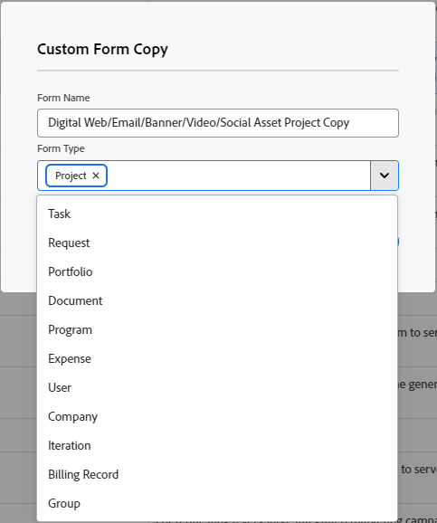

# Erstellen eines Formulars aus einer Kopie

<!--add preview tags and see below in comment out-->

Sie können ein neues benutzerdefiniertes Formular entwerfen, das auf einem vorhandenen Formular basiert. Sie können benutzerdefinierte Formulare an verschiedene Workfront-Objekte anhängen, um Daten über diese Objekte zu erfassen.

## Zugriffsanforderungen

+++ Erweitern Sie , um die Zugriffsanforderungen für die -Funktion in diesem Artikel anzuzeigen.

<table style="table-layout:auto"> 
 <col> 
 <col> 
 <tbody> 
  <tr> 
   <td>Adobe Workfront-Paket</td> 
   <td>
Beliebig
</td> 
  </tr> 
  <tr> 
   <td>Adobe Workfront-Lizenz</td> 
   <td>
Standard

       
Plan
</td>
  </tr> 
  <tr> 
   <td>Konfigurationen der Zugriffsebene</td> 
   <td> 
Administrativer Zugriff auf benutzerdefinierte Formulare
 </td> 
  </tr>  
 </tbody> 
</table>

Weitere Informationen finden Sie unter [Zugriffsanforderungen in der Dokumentation zu Workfront](/help/quicksilver/administration-and-setup/add-users/access-levels-and-object-permissions/access-level-requirements-in-documentation.md).

+++

## Kopieren eines benutzerdefinierten Formulars, um ein neues zu erstellen

{{step-1-to-setup}}

1. Klicken Sie auf **Benutzerdefinierte Forms.**
1. Wählen Sie das benutzerdefinierte Formular aus, das Sie als Grundlage für ein neues benutzerdefiniertes Formular verwenden möchten, und klicken Sie dann auf .
1. Geben Sie **Feld „Benutzerdefinierte**&quot; die folgenden Informationen ein:

   <table style="table-layout:auto"> 
    <col> 
    <col> 
    <tbody> 
     <tr> 
      <td role="rowheader">Formularname</td> 
      <td>Geben Sie einen Namen für das kopierte Formular ein.</td> 
     </tr> 
     <tr> 
      <td role="rowheader"> 
Formulartypen 
 </td> 
      <td> 
Wählen Sie im Feld <b>Formulartyp</b> die Objekttypen aus, mit denen das benutzerdefinierte Formular arbeiten soll, und klicken Sie auf das X neben den Typen, die Sie entfernen möchten. Typen, die bereits mit dem Formular verknüpft sind, sind in der Liste deaktiviert.
 
      

 
      
Das Formular muss mit mindestens einem Objekttyp verknüpft sein.
 
      </td> 
     </tr> 
    </tbody> 
   </table>

1. Klicken Sie **Kopieren**.

   Wenn im ursprünglichen Formular berechnete Felder auf Felder verweisen, die mit einem Objekttyp inkompatibel sind, den Sie dem neuen Formular hinzufügen, werden Sie in einer Meldung aufgefordert, die Berechnungen in diesen Feldern zu ändern.

   Wenn eine Zugriffsoption für einen Abschnittsumbruch im ursprünglichen Formular nicht mit einem Objekttyp kompatibel ist, den Sie dem neuen hinzufügen, werden Sie in einer Meldung aufgefordert, die Option anzupassen.

1. Wählen Sie das soeben kopierte Formular aus und klicken Sie dann auf .
1. Nehmen Sie Änderungen am Formular vor, wie in den folgenden Abschnitten des Artikels [Erstellen eines benutzerdefinierten Formulars](/help/quicksilver/administration-and-setup/customize-workfront/create-manage-custom-forms/form-designer/design-a-form/design-a-form.md) erläutert:

   * [Vorhandenes Feld oder Widget wiederverwenden, das bereits in einem anderen benutzerdefinierten Formular verwendet wurde](/help/quicksilver/administration-and-setup/customize-workfront/create-manage-custom-forms/form-designer/design-a-form/design-a-form.md#reuse-an-existing-field-or-widget-already-used-in-another-custom-form)
   * [Textfelder hinzufügen](/help/quicksilver/administration-and-setup/customize-workfront/create-manage-custom-forms/form-designer/design-a-form/design-a-form.md#add-text-fields)
   * [Hinzufügen von berechneten Feldern](/help/quicksilver/administration-and-setup/customize-workfront/create-manage-custom-forms/form-designer/design-a-form/design-a-form.md#add-calculated-fields)
   * [Hinzufügen von Optionsfeldern, Kontrollkästchen-Gruppen und Dropdown-Listen](/help/quicksilver/administration-and-setup/customize-workfront/create-manage-custom-forms/form-designer/design-a-form/design-a-form.md#add-radio-buttons-checkboxes-and-dropdowns)
   * [Felder für automatische Textvervollständigung und Datum hinzufügen](/help/quicksilver/administration-and-setup/customize-workfront/create-manage-custom-forms/form-designer/design-a-form/design-a-form.md#add-typeahead-and-date-fields)
   * [Bilder, PDFs und Videos hinzufügen](/help/quicksilver/administration-and-setup/customize-workfront/create-manage-custom-forms/form-designer/design-a-form/design-a-form.md#add-images-pdfs-and-videos)
   * [Adobe XD-Dateien hinzufügen](/help/quicksilver/administration-and-setup/customize-workfront/create-manage-custom-forms/form-designer/design-a-form/design-a-form.md#add-adobe-xd-files)
   * [Planning-Verbindungsfelder hinzufügen](/help/quicksilver/administration-and-setup/customize-workfront/create-manage-custom-forms/form-designer/design-a-form/design-a-form.md#add-planning-connection-fields)

1. (Optional) Fügen Sie nach dem Klicken auf **Speichern und schließen** das Formular an das Objekt an, in dem Sie es verwenden möchten, wie in [Hinzufügen eines benutzerdefinierten Formulars zu einem Objekt“ &#x200B;](/help/quicksilver/workfront-basics/work-with-custom-forms/add-a-custom-form-to-an-object.md).
