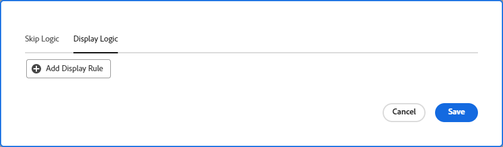
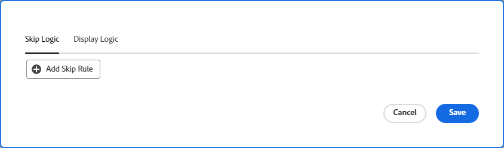

# Hinzufügen der Anzeigenlogik und Überspringen der Logik zu einem Formular

Sie können festlegen, welche Abschnitte eines benutzerdefinierten Formulars angezeigt oder übersprungen werden sollen, je nach den Optionen, die ein Benutzer beim Ausfüllen vornimmt.

>[!NOTE]
>
>Die Logik gilt nur innerhalb eines Formulars und kann nicht auf einer Auswahl aus einem anderen Formular basieren.

## Zugriffsanforderungen

+++ Erweitern Sie , um die Zugriffsanforderungen für die Funktionalität in diesem Artikel anzuzeigen.

Sie müssen über Folgendes verfügen, um die Schritte in diesem Artikel durchzuführen:

<table style="table-layout:auto"> 
 <col> 
 <col> 
 <tbody> 
  <tr data-mc-conditions=""> 
   <td role="rowheader">Adobe Workfront-Abo </td> 
   <td>Alle</td> 
  </tr> 
  <tr> 
   <td role="rowheader">Adobe Workfront-Lizenz</td> 
   <td>
   
Neu: Standard

   
oder

   
Aktuell: Plan
</td> 
  </tr> 
  <tr data-mc-conditions=""> 
   <td role="rowheader">Konfigurationen auf Zugriffsebene</td> 
   <td>Administratorzugriff auf benutzerdefinierte Formulare </td> 
  </tr>  
 </tbody> 
</table>

Weitere Informationen zu den Informationen in dieser Tabelle finden Sie unter [Zugriffsanforderungen in der Workfront-Dokumentation](/help/quicksilver/administration-and-setup/add-users/access-levels-and-object-permissions/access-level-requirements-in-documentation.md).

+++

## Logiksymbole anzeigen und überspringen

Benutzerdefinierte Formulare zeigen Symbole an, die angeben, welche Logik auf bestimmte Felder angewendet wird. Die Symbole in einem Feld im Formularentwickler weisen darauf hin, dass auf das Feld Logik angewendet wird.

| Symbol | Position im Feld im Formularentwickler | Definition |
|--- |--- |--- |
|  | Unten links | Das Feld ist das Zielfeld für die Anzeigerogik. Wenn eine bestimmte Auswahl im Formular vorgenommen wird, wird dieses Feld angezeigt. |
|  | Unten rechts | Das Feld definiert die Anzeigerogik. Eine bestimmte Auswahl oder ein Wert für dieses Feld zeigt das Zielfeld an. |
|  | Unten links | Das Feld ist das Zielfeld für die Logik zum Überspringen. Wenn eine bestimmte Auswahl im Formular vorgenommen wird, wird das Formular zu diesem Feld übersprungen und die dazwischen liegenden Felder werden ausgeblendet. |
|  | Unten rechts | Das Feld definiert die Logik zum Überspringen. Eine bestimmte Auswahl oder ein Wert für dieses Feld überspringt andere Felder und geht direkt zum Zielfeld. |

Wählen Sie ein Feld mit angewendeter Logik aus, um die vorhandenen Logikregeln in den Feldeinstellungen anzuzeigen.

## Überlegungen zur Verwendung der Anzeigelogik und der Logik zum Überspringen

* Um eine Anzeigerlogik zu einem benutzerdefinierten Feld, Widget oder Abschnittsumbruch hinzuzufügen, muss mindestens ein Auswahlfeld (Optionsfelder, Dropdown-Menüs oder Kontrollkästchen) vor dem Feld im Formular positioniert werden.
Weitere Informationen zu benutzerdefinierten Feldern und Widgets in benutzerdefinierten Formularen finden Sie unter [Erstellen eines benutzerdefinierten Formulars](/help/quicksilver/administration-and-setup/customize-workfront/create-manage-custom-forms/form-designer/design-a-form/design-a-form.md).
* Sie können einem Widget oder einer Abschnittsumbruch keine Logik zum Überspringen hinzufügen. Sie können sie nur zu einem Multiple-Choice-Feld hinzufügen (Optionsfelder, Dropdown-Listen oder Kontrollkästchen).
* Für Optionen eines Mehroptionen-Felds können Sie keine Anzeige- oder Auslassungslogik anwenden. Beispielsweise können Sie die Anzeige der Optionen eines Dropdown-Menüs, einer Kontrollkästchengruppe oder eines Optionsfelds nicht auf der Grundlage der Anzeige- oder Übersprunglogik eines anderen Felds einschränken.
* Sie können einem benutzerdefinierten Feld sowohl die Anzeigenlogik als auch die Logik überspringen, wenn Folgendes für das benutzerdefinierte Feld zutrifft:

   * Es handelt sich um ein Multiple-Choice-Feld (Optionsfelder, Dropdown-Listen oder Kontrollkästchen).
   * Dem Feld wird ein Multiple-Choice-Feld vorangestellt
   * Danach folgt ein weiteres benutzerdefiniertes Feld

* Beim Kopieren von Formularen mit Anzeigenlogik oder Logik zum Überspringen wird die Logik in das neue benutzerdefinierte Formular kopiert.
* Bei der Massenbearbeitung von Objekten werden alle benutzerdefinierten Felder im Feld &quot;Objekte bearbeiten&quot;angezeigt, einschließlich der Felder, die übersprungen oder ausgeblendet werden.
* Beachten Sie Folgendes, wenn Sie eine Logikregel für die Anzeige eines benutzerdefinierten Formulars erstellen:

   * Benutzerdefinierte Felder, die nicht in einer Logikanweisung zur Anzeige enthalten sind, werden standardmäßig in einem benutzerdefinierten Formular angezeigt.
   * Sie können Logikanweisungen für mehrere Felder erstellen.
   * Wenn auf alle Felder unter einem Abschnittsumbruch eine Anzeigereihenfolge angewendet wird und sie alle aufgrund der Logik ausgeblendet sind, wird der gesamte Abschnitt im benutzerdefinierten Formular ausgeblendet.

## Anzeigenlogik zu einem benutzerdefinierten Formular hinzufügen

Die Anzeigereihenfolge definiert, welche benutzerdefinierten Felder im Formular angezeigt werden, wenn der Benutzer einen bestimmten Wert in einem Multiple-Choice-Feld auswählt. Die Logik wird dem Zielfeld hinzugefügt, das nur bei Auswahl des Werts angezeigt wird.

{{step-1-to-setup}}

1. Klicken Sie auf **Benutzerdefinierter Forms**.
1. Erstellen Sie ein neues benutzerdefiniertes Formular oder öffnen Sie ein vorhandenes Formular. Weitere Informationen finden Sie unter [Erstellen eines benutzerdefinierten Formulars](/help/quicksilver/administration-and-setup/customize-workfront/create-manage-custom-forms/form-designer/design-a-form/design-a-form.md) .
1. Fügen Sie dem Formular nach Bedarf Felder hinzu. Vor dem anzuzeigenden Zielfeld muss mindestens ein Multiple-Choice-Feld (Optionsfeld, Dropdown-Menü oder Kontrollkästchen) positioniert werden.
1. Wählen Sie das Zielfeld aus und klicken Sie unten links im Bildschirm auf **Logik hinzufügen** .
1. Wählen Sie die Registerkarte **Logik anzeigen** aus.
1. Klicken Sie im Logikaufbau auf **Anzeigenregel hinzufügen** .

   

1. Führen Sie die folgenden Schritte im Builder aus, um die Logikanweisung zu erstellen.

   1. Die erste Option besteht darin, das definierende Feld auszuwählen. Dies ist das Feld mit dem Auswahlwert, das die Zielgruppe anzeigt. Es muss sich um ein Multiple-Choice-Feld handeln.
   1. Die zweite Option besteht darin, den Auswahlwert auszuwählen. Es sind nur die für dieses Feld bereits definierten Werte verfügbar.
   1. Die dritte Option ist **Ausgewählt** oder **Nicht ausgewählt**. Die Auswahl von **Ausgewählt** bedeutet, dass bei Auswahl des Werts das Zielfeld angezeigt wird. Die Auswahl von **Nicht ausgewählt** bedeutet, dass bei Auswahl eines anderen Werts im Definitionsfeld das Zielfeld angezeigt wird.
   1. Um der Logikanweisung eine Regel **und** hinzuzufügen, klicken Sie direkt unter der soeben erstellten Regel auf **Regel hinzufügen** . Befolgen Sie dieselben Anweisungen zum Erstellen der Regel. Alle Und-Regeln müssen erfüllt sein, damit das Zielfeld angezeigt wird.

      

   1. Um der Logikanweisung eine Regel **oder** hinzuzufügen, klicken Sie unten im Logikaufbau auf **Regel hinzufügen** . Klicken Sie dann im Bereich Oder auf **Regel hinzufügen** und befolgen Sie dieselben Anweisungen zum Erstellen der Regel. Wenn eine Oder-Regel erfüllt ist, wird das Zielfeld angezeigt.

1. Klicken Sie auf **Speichern** , wenn Sie mit dem Erstellen der Logikanweisung fertig sind.

   Die Symbole für die Anzeigenlogik werden dem Zielfeld und dem Definitionsfeld im Formularentwickler hinzugefügt.

## Logik zum Überspringen zu einem benutzerdefinierten Formular hinzufügen

Logik überspringen definiert benutzerdefinierte Formularfelder, die übersprungen werden, wenn der Benutzer einen bestimmten Wert in einem Multiple-Choice-Feld auswählt. Übersprungene Felder werden im Formular ausgeblendet. Die Logik wird auf das definierende Feld angewendet, in dem die Auswahl vorgenommen wird, nicht auf die Felder, die übersprungen werden.

{{step-1-to-setup}}

1. Klicken Sie auf **Benutzerdefinierter Forms**.
1. Erstellen Sie ein neues benutzerdefiniertes Formular oder öffnen Sie ein vorhandenes Formular. Weitere Informationen finden Sie unter [Erstellen eines benutzerdefinierten Formulars](/help/quicksilver/administration-and-setup/customize-workfront/create-manage-custom-forms/form-designer/design-a-form/design-a-form.md) .
1. Fügen Sie dem Formular nach Bedarf Felder hinzu. Das definierende Feld für die Logik zum Überspringen muss ein Multiple-Choice-Feld sein (Optionsfeld, Dropdown-Menü oder Kontrollkästchen).
1. Wählen Sie das definierende Feld aus und klicken Sie unten links im Bildschirm auf **Logik hinzufügen** .
1. Wählen Sie die Registerkarte **Logik überspringen** aus.
1. Klicken Sie im Logikaufbau auf **Regel zum Überspringen hinzufügen** .

   

1. Führen Sie die folgenden Schritte im Builder aus, um die Logikanweisung zu erstellen.

   1. Das definierende Feld wird im Builder angezeigt. Dies ist das Feld, auf das Sie die Logik zum Überspringen angewendet haben.
   1. Die erste Option besteht darin, den Auswahlwert auszuwählen. Es sind nur die für das Feld bereits definierten Werte verfügbar.
   1. Die zweite Option ist **Ausgewählt** oder **Nicht ausgewählt**. Die Auswahl von **Ausgewählt** bedeutet, dass bei Auswahl des Werts das Zielfeld angezeigt und die dazwischen liegenden Felder übersprungen werden. Die Auswahl von **Nicht ausgewählt** bedeutet, dass bei Auswahl eines anderen Werts im definierenden Feld das Zielfeld angezeigt und die dazwischen liegenden Felder übersprungen werden.
   1. Die dritte Option ist das Zielfeld oder der Ort, zu dem übersprungen werden soll. Wählen Sie einen Feldnamen oder **Formularende** aus. Möglicherweise müssen Sie zuerst auf das Wort &quot;leer&quot;klicken, bevor Sie eine Option auswählen.

      

   1. Um der Logikanweisung eine Regel **oder** hinzuzufügen, klicken Sie unten im Logikaufbau auf **Regel hinzufügen** . Wählen Sie dann die Optionen aus, die denselben Aufforderungen zum Erstellen der Regel folgen. Wenn eine **Oder** -Regel erfüllt ist, wird das Zielfeld angezeigt.

1. Klicken Sie auf **Speichern** , wenn Sie mit dem Erstellen der Logikanweisung fertig sind.

   Die Symbole für die Logik überspringen werden dem Zielfeld und dem Definitionsfeld im Formularentwickler hinzugefügt.

