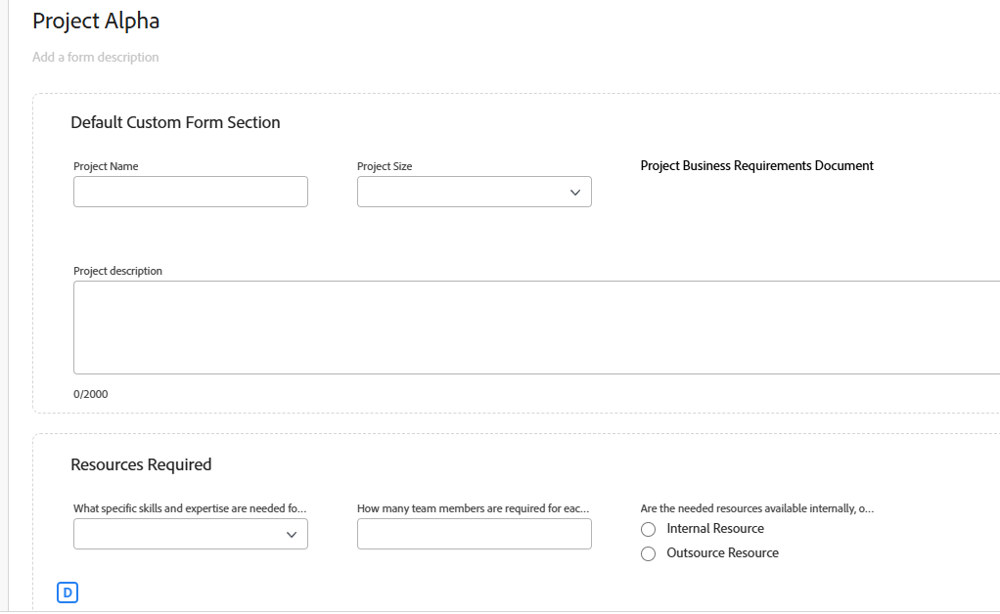
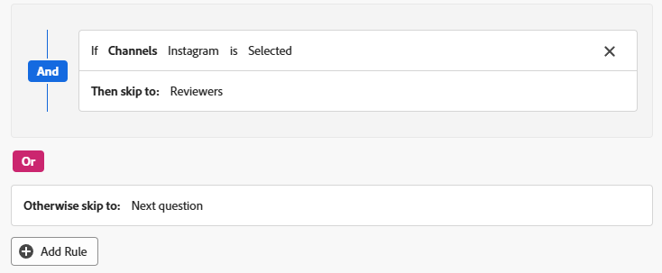

# Hinzufügen von Logikregeln zu benutzerdefinierten Formularen und Feldern

Mit logischen Regeln können Sie die Felder in Ihrem Formular weiter anpassen.

Beispielsweise können Sie basierend auf den Entscheidungen, die ein Benutzer beim Ausfüllen eines benutzerdefinierten Formulars trifft, Felder oder Abschnitte in einem benutzerdefinierten Formular anzeigen oder überspringen.

>[!NOTE]
>
>Logik gilt nur innerhalb eines Formulars und kann nicht auf Auswahlen aus einem anderen Formular basieren.

## Zugriffsanforderungen

+++ Erweitern, um die Zugriffsanforderungen für die in diesem Artikel beschriebene Funktionalität anzuzeigen.

<table style="table-layout:auto"> 
 <col> 
 <col> 
 <tbody> 
  <tr> 
   <td>Adobe Workfront-Paket</td> 
   <td> <p>So wenden Sie erweiterte Anzeige-, Standardwert-, bedingte Formatierung oder Bearbeitungslogik an: Workflow-Prime oder höher</p>
         <p>So wenden Sie alle anderen Logiktypen an: Beliebiges Workfront- oder Workflow-Paket</p> </td> 
  </tr> 
  <tr> 
   <td>Adobe Workfront-Lizenz</td> 
   <td><p>Standard</p>
       <p>Abo</p></td>
  </tr> 
  <tr> 
   <td>Konfigurationen der Zugriffsebene</td> 
   <td> <p>Administrativer Zugriff auf benutzerdefinierte Formulare</p> </td> 
  </tr>  
 </tbody> 
</table>

Weitere Informationen finden Sie unter [Zugriffsanforderungen in der Dokumentation zu Workfront](/help/quicksilver/administration-and-setup/add-users/access-levels-and-object-permissions/access-level-requirements-in-documentation.md).

+++

## Symbole der logischen Indikatoren

Benutzerdefinierte Formulare zeigen Symbole an, um anzugeben, wann die Logik auf die Felder angewendet wird.

Klicken Sie **der Kopfzeile** Formular-Designer auf „Logik anzeigen“, um die Symbole für die verschiedenen Feldlogiktypen ein- oder auszublenden.

| Symbol | Definition |
| --- | --- |
|  | Das Feld ist das Zielfeld, auf das die Anzeigelogik angewendet wird. Wenn eine bestimmte Auswahl im Formular vorgenommen wird, wird dieses Feld angezeigt. |
|  | Das Feld ist das Referenzfeld für die Anzeigelogik. Eine bestimmte Auswahl oder ein bestimmter Wert in diesem Feld zeigt das Zielfeld an. |
|  | Das Feld ist das Zielfeld, auf das die Logik zum Überspringen angewendet wird. Eine bestimmte Auswahl oder ein bestimmter Wert in diesem Feld überspringt andere Felder und wechselt direkt zum Referenzfeld. |
|  | Das Feld ist das Referenzfeld für die Logik zum Überspringen . Wenn für das Zielfeld eine bestimmte Auswahl getroffen wurde, springt das Formular zu diesem Feld weiter und die Felder dazwischen werden ausgeblendet. |
|  | Das Feld ist das Zielfeld, auf das die Validierungslogik angewendet wird. Eine bestimmte Auswahl oder ein bestimmter Wert im Referenzfeld bestimmt, ob die Validierung fehlschlägt. Zielfeld und Referenzfeld können für die Validierungslogik identisch sein. |
|  | Das Feld ist das Referenzfeld für die Validierungslogik. Eine bestimmte Auswahl oder ein bestimmter Wert in diesem Feld bestimmt, ob die Validierung im Zielfeld fehlschlägt. Zielfeld und Referenzfeld können für die Validierungslogik identisch sein. |
|  | Das Feld ist das Zielfeld, auf das die Standardwertlogik angewendet wird. Eine bestimmte Auswahl oder ein bestimmter Wert im Referenzfeld bestimmt den Standardwert. Das Zielfeld und das Referenzfeld können für die Standardwertlogik identisch sein. |
|  | Das Feld ist das Referenzfeld für die Standardwertlogik. Eine bestimmte Auswahl oder ein bestimmter Wert in diesem Feld bestimmt den Standardwert im Zielfeld. Das Zielfeld und das Referenzfeld können für die Standardwertlogik identisch sein. |
|  | Das Feld ist das Zielfeld, auf das die Formatierungslogik angewendet wird. Eine bestimmte Auswahl oder ein bestimmter Wert im Referenzfeld bestimmt die Formatierung. Zielfeld und Referenzfeld können für die Formatierungslogik identisch sein. |
|  | Das Feld ist das Referenzfeld für die Formatierungslogik. Eine bestimmte Auswahl oder ein bestimmter Wert in diesem Feld bestimmt die Formatierung im Zielfeld. Zielfeld und Referenzfeld können für die Formatierungslogik identisch sein. |
|  | Das Feld ist das Zielfeld, auf das die Bearbeitbarkeitslogik angewendet wird. Das Feld kann bearbeitbar oder schreibgeschützt sein, wenn die definierten Bedingungen erfüllt sind. Das Zielfeld und das Referenzfeld können für die Bearbeitbarkeitslogik identisch sein. |
|  | Das Feld ist das Referenzfeld für die Bearbeitbarkeitslogik. Wenn die definierten Bedingungen in diesem Feld erfüllt sind, wird die Logik auf das Zielfeld angewendet. Das Zielfeld und das Referenzfeld können für die Bearbeitbarkeitslogik identisch sein. |


Wählen Sie nur zur Anzeige und zum Überspringen der Logik ein Feld aus, um die vorhandenen Logikregeln in den Feldeinstellungen anzuzeigen.


## Überlegungen zur Verwendung der Anzeigelogik und zum Überspringen der Logik

* Um Anzeigelogik zu einem benutzerdefinierten Feld, Widget oder Abschnittsumbruch hinzuzufügen, muss mindestens ein Multiple-Choice-Feld (Optionsfelder, Dropdown-Listen oder Kontrollkästchen) vor dem Feld im Formular positioniert werden.
Informationen zu benutzerdefinierten Feldern und Widgets in benutzerdefinierten Formularen finden Sie unter [Erstellen eines benutzerdefinierten Formulars](/help/quicksilver/administration-and-setup/customize-workfront/create-manage-custom-forms/form-designer/design-a-form/design-a-form.md).
* Sie können keine Logik zum Überspringen zu einem Widget oder Abschnittsumbruch hinzufügen. Sie können sie nur einem Multiple-Choice-Feld hinzufügen (Optionsschaltflächen, Dropdown-Liste oder Kontrollkästchen).
* Es ist nicht möglich, eine Logik zum Anzeigen oder Überspringen anzuwenden, um die Auswahl eines Felds mit mehreren Optionen ein- oder auszublenden. Sie können beispielsweise die Auswahl, die für ein Dropdown-Feld, eine Kontrollkästchen-Gruppe oder ein Optionsfeld angezeigt wird, nicht auf der Grundlage der Anzeige- oder Überspringen-Logik eines anderen Felds einschränken.
* Sie können sowohl Anzeigelogik als auch Überspringen-Logik zu einem benutzerdefinierten Feld hinzufügen, wenn Folgendes für das benutzerdefinierte Feld zutrifft:

   * Es handelt sich um ein Feld mit Mehrfachauswahl (Optionsfelder, Dropdown oder Kontrollkästchen)
   * Ihm geht ein Multiple-Choice-Feld voran
   * Darauf folgt ein weiteres benutzerdefiniertes Feld

* Beim Kopieren von Formularen mit Anzeigelogik oder Überspringen wird die Logik in das neue benutzerdefinierte Formular kopiert.
* Bei der Massenbearbeitung von Objekten werden alle benutzerdefinierten Felder im Feld Objekte bearbeiten angezeigt, einschließlich der übersprungenen oder ausgeblendeten Felder.
* Beachten Sie Folgendes, wenn Sie eine Anzeigelogik-Regel für ein benutzerdefiniertes Formular erstellen:

   * Benutzerdefinierte Felder, die nicht in einer Display-Logikanweisung enthalten sind, werden standardmäßig in einem benutzerdefinierten Formular angezeigt.
   * Sie können Logikanweisungen mit mehreren Feldern erstellen.
   * Wenn auf alle Felder unter einem Abschnittsumbruch eine Anzeigelogik angewendet wurde und sie infolge der Logik alle ausgeblendet sind, wird der gesamte Abschnitt im benutzerdefinierten Formular ausgeblendet.

## Hinzufügen einer Anzeigelogik zu einem benutzerdefinierten Formular

Die Anzeigelogik definiert, welche benutzerdefinierten Felder im Formular angezeigt werden, wenn Benutzende einen bestimmten Wert in einem Multiple-Choice-Feld auswählen. Die Logik wird dem Zielfeld hinzugefügt, das nur angezeigt wird, wenn der Wert ausgewählt ist.

>[!NOTE]
>
>Dieses Verfahren beschreibt den grundlegenden Modus für die Anzeigelogik. Eine erweiterte Anzeigelogik ist ebenfalls verfügbar. Weitere Informationen finden Sie unter [Hinzufügen einer erweiterten Anzeigelogik zu einem benutzerdefinierten Formular](#add-advanced-display-logic-to-a-custom-form) in diesem Artikel.

{{step-1-to-setup}}

1. Klicken Sie **Benutzerdefinierte Forms**.
1. Ein neues benutzerdefiniertes Formular erstellen oder ein vorhandenes Formular öffnen. Siehe [Erstellen eines benutzerdefinierten Formulars](/help/quicksilver/administration-and-setup/customize-workfront/create-manage-custom-forms/form-designer/design-a-form/design-a-form.md) für Details.
1. Fügen Sie dem Formular nach Bedarf Felder hinzu. Mindestens ein Multiple-Choice-Feld (Optionsfeld, Dropdown oder Kontrollkästchen) muss vor dem Zielfeld positioniert werden, das angezeigt wird.
1. Wählen Sie das Zielfeld aus und klicken Sie auf **Logik**.
1. Wählen Sie die **Anzeige** im Logikgenerator aus.
1. Klicken Sie **Anzeigeregel hinzufügen**.

   

1. Gehen Sie wie folgt vor, um die Logikanweisung im Builder zu erstellen.

   1. Die erste Option besteht darin, das definierende Feld auszuwählen. Dies ist das Feld mit dem Auswahlwert, der die Zielgruppe anzeigt. Es muss ein Multiple-Choice-Feld sein.
   1. Die zweite Option besteht darin, den Auswahlwert auszuwählen. Nur die für dieses Feld bereits definierten Werte sind verfügbar.
   1. Die dritte Option ist **Ausgewählt** oder **Nicht ausgewählt**. Die Auswahl **Ausgewählt** bedeutet, dass bei Auswahl des Werts das Zielfeld angezeigt wird. Die Auswahl **Nicht ausgewählt** bedeutet, dass das Zielfeld angezeigt wird, wenn ein anderer Wert im definierenden Feld ausgewählt wird.
   1. Um eine Und **Regel** die Logikanweisung hinzuzufügen, klicken Sie **Regel hinzufügen** direkt unter der soeben erstellten Regel. Befolgen Sie die gleichen Anweisungen, um die Regel zu erstellen. Alle - und -Regeln müssen erfüllt sein, damit das Zielfeld angezeigt wird.

      

   1. Um eine **OR**-Regel zur Logikanweisung hinzuzufügen, klicken Sie **Regel hinzufügen** unten im Logik-Builder. Klicken Sie dann im Bereich **auf „Regel hinzufügen** und folgen Sie denselben Anweisungen, um die Regel zu erstellen. Wenn eine OR-Regel erfüllt ist, wird das Zielfeld angezeigt.

1. Klicken Sie **Anwenden** wenn Sie mit dem Erstellen der Logikanweisung fertig sind.

   Die Logik wird angewendet, und die Logiksymbole werden dem Zielfeld und dem Referenzfeld im Formular-Designer hinzugefügt.

## Hinzufügen einer erweiterten Anzeigelogik zu einem benutzerdefinierten Formular

Mit der erweiterten Anzeigelogik für benutzerdefinierte Formularfelder können Sie komplexe Logik mithilfe von Formeln erstellen. Sie können diese Logik auf die folgenden Feldtypen anwenden: Einzelzeilentext, Absatz, Rich-Text, Einzelauswahl-Dropdown, Mehrfachauswahl-Dropdown, externe Suche, Mehrfachauswahl-externe Suche, native Feldreferenz, interne Suche, Berechnet, Datum, Kontrollkästchen-Gruppe und Optionsfelder.

>[!NOTE]
>
>Dieses Verfahren beschreibt den erweiterten Modus für die Anzeigelogik. Eine grundlegende Anzeigelogik ist ebenfalls verfügbar. Weitere Informationen finden Sie unter [Anzeigelogik zu einem benutzerdefinierten Formular hinzufügen](#add-display-logic-to-a-custom-form) in diesem Artikel.

### Beispiele

Sie können die erweiterte Anzeigelogik verwenden, um die Sichtbarkeit von benutzerdefinierten Formularabschnitten auf der Grundlage von Benutzerrollen und die Sichtbarkeit eines Felds basierend auf dem Status eines anderen Felds zu steuern.

Auf den Standardabschnitt im Formular wird keine Logik angewendet, sodass er immer für alle Benutzer sichtbar ist.

Unter Verwendung der folgenden Bedingung wird der Abschnitt Erforderliche Ressourcen nur angezeigt, wenn ein Benutzer mit dem Aufgabengebiet „Ressourcen-Manager“ das Formular anzeigt.

`IF($$USER.{roleID}="123abc", true)`

Beachten Sie, dass `123abc` die Rollen-ID des Ressourcen-Managers darstellt.



Dieselbe Bedingung mit einer anderen Rollen-ID wird auf den Abschnitt „Projekt-KPIs“ angewendet, um festzulegen, dass nur die Rolle „Finanzberater“ den Abschnitt anzeigen kann.

Unter Verwendung der folgenden Bedingung wird das Feld Verkaufs-KPI erst angezeigt, wenn das Projekt abgeschlossen ist. Diese Logik wird direkt auf das Feld und nicht auf einen Formularabschnitt angewendet. Es ist nicht erforderlich anzugeben, welche Rolle das Feld anzeigen kann, da dies bereits in dem Abschnitt definiert ist, in dem sich das Feld befindet.

`IF({status}="CPL", true)`


### Erweiterte Anzeigelogik definieren

{{step-1-to-setup}}

1. Klicken Sie **Benutzerdefinierte Forms**.
1. Ein neues benutzerdefiniertes Formular erstellen oder ein vorhandenes Formular öffnen. Siehe [Erstellen eines benutzerdefinierten Formulars](/help/quicksilver/administration-and-setup/customize-workfront/create-manage-custom-forms/form-designer/design-a-form/design-a-form.md) für Details.
1. Fügen Sie dem Formular nach Bedarf Felder hinzu.
1. Wählen Sie das Feld aus, auf das Logik angewendet werden soll, und klicken Sie auf **Logik hinzufügen**.
1. Wählen Sie die **Anzeige** im Logikgenerator aus.
1. Aktivieren Sie **Erweiterter Modus**.

   Diese Option kann für Feldtypen, die den einfachen Modus der Anzeigelogik nicht unterstützen, automatisch aktiviert werden.

   

1. Erstellen Sie die Anzeigebedingung im Editor.

   Weitere Informationen zu Berechnungen und Ausdrücken finden Sie unter [Hinzufügen berechneter Felder zu einem ](/help/quicksilver/administration-and-setup/customize-workfront/create-manage-custom-forms/form-designer/design-a-form/add-a-calculated-field.md) und [Übersicht über berechnete Datenausdrücke](/help/quicksilver/reports-and-dashboards/reports/calc-cstm-data-reports/calculated-data-expressions.md).

1. Klicken Sie auf **Übernehmen**.

   Die Logik wird angewendet, und die Logiksymbole werden dem Zielfeld und dem Referenzfeld im Formular-Designer hinzugefügt.

   >[!NOTE]
   >
   >Die erweiterte Anzeigelogik wird im Vorschaumodus des Formular-Designers nicht unterstützt.

## Hinzufügen einer Logik zum Überspringen zu einem benutzerdefinierten Formular

Die Überspringen-Logik definiert benutzerdefinierte Formularfelder, die übersprungen werden, wenn Benutzende einen bestimmten Wert in einem Multiple-Choice-Feld auswählen. Übersprungene Felder werden im Formular ausgeblendet. Die Logik wird auf das definierende Feld angewendet, in dem die Auswahl getroffen wird, nicht auf die übersprungenen Felder.

{{step-1-to-setup}}

1. Klicken Sie **Benutzerdefinierte Forms**.
1. Ein neues benutzerdefiniertes Formular erstellen oder ein vorhandenes Formular öffnen. Siehe [Erstellen eines benutzerdefinierten Formulars](/help/quicksilver/administration-and-setup/customize-workfront/create-manage-custom-forms/form-designer/design-a-form/design-a-form.md) für Details.
1. Fügen Sie dem Formular nach Bedarf Felder hinzu. Das definierende Feld für die Logik zum Überspringen muss ein Multiple-Choice-Feld sein (Optionsfeld, Dropdown oder Kontrollkästchen).
1. Wählen Sie das definierende Feld aus und klicken **unten links** Bildschirm auf „Logik hinzufügen“.
1. Wählen Sie die **Überspringen** im Logikgenerator.
1. Klicken Sie **Regel zum Überspringen hinzufügen**.

   

1. Gehen Sie wie folgt vor, um die Logikanweisung im Builder zu erstellen.

   1. Das definierende Feld wird im Builder angezeigt. Dies ist das Feld, auf das Sie die Logik zum Überspringen angewendet haben.
   1. Die erste Option besteht darin, den Auswahlwert auszuwählen. Nur die bereits für das Feld definierten Werte sind verfügbar.
   1. Die zweite Option ist **Ausgewählt** oder **Nicht ausgewählt**. Die Auswahl **Ausgewählt** bedeutet, dass bei Auswahl des Werts das Zielfeld angezeigt wird und die Felder dazwischen übersprungen werden. Die Auswahl **Nicht ausgewählt** bedeutet, dass, wenn ein anderer Wert im definierenden Feld ausgewählt ist, das Zielfeld angezeigt wird und die Felder dazwischen übersprungen werden.
   1. Die dritte Option ist das Zielfeld oder der Ort, zu dem Sie wechseln möchten. Wählen Sie einen Feldnamen oder &quot;**des Formulars“**. Möglicherweise müssen Sie zuerst auf das Wort „leer“ klicken, bevor Sie eine Option auswählen.

      

   1. Um eine **OR**-Regel zur Logikanweisung hinzuzufügen, klicken Sie **Regel hinzufügen** unten im Logik-Builder. Wählen Sie dann die Optionen aus, die denselben Aufforderungen folgen, um die Regel zu erstellen. Wenn eine **Oder**-Regel erfüllt ist, wird das Zielfeld angezeigt.

1. Klicken Sie **Anwenden** wenn Sie mit dem Erstellen der Logikanweisung fertig sind.

   Die Logik wird angewendet, und die Logiksymbole werden dem Zielfeld und dem Referenzfeld im Formular-Designer hinzugefügt.

## Hinzufügen einer Standardwertlogik zu einem benutzerdefinierten Formular

Mit der Standardwertlogik können Sie Standardwerte für benutzerdefinierte Formularfelder mithilfe von Formeln konfigurieren. Der Standardwert wird angezeigt, wenn die definierten Bedingungen erfüllt sind. Ein Standardwert kann ein statischer Wert oder ein dynamischer Wert sein, der auf andere Felder innerhalb des -Objekts verweist. Obwohl der Standardwert auf andere Felder verweisen kann, ändert er sich nicht, wenn andere Felder im Formular geändert werden.

Sie können eine erweiterte Standardwertlogik auf die folgenden Feldtypen anwenden: Einzelzeilentext, Absatz, Einzelauswahl-Dropdown, Mehrfachauswahl-Dropdown, externe Suche, Mehrfachauswahl-externe Suche, native Feldreferenz, interne Suche, Kontrollkästchen-Gruppe und Optionsfelder.

>[!TIP]
>
>Ein Standardwert wird nur einmal auf ein benutzerdefiniertes Feld angewendet, wenn das benutzerdefinierte Formular an das -Objekt angehängt wird. Wenn die Standardwertformel vom Wert eines anderen Felds abhängig ist, muss der Wert im anderen Feld bereits vorhanden sein, wenn das benutzerdefinierte Formular angehängt wird.

>[!NOTE]
>
>Die Standardwertlogik im Formular-Designer ist weiterhin vorhanden. Wenn beide Typen auf dasselbe Feld angewendet werden, hat die erweiterte Logik Vorrang. Informationen zur standardmäßigen Standardwertlogik finden Sie unter [Hinzufügen von Optionsschaltflächen, Kontrollkästchen und Dropdown](/help/quicksilver/administration-and-setup/customize-workfront/create-manage-custom-forms/form-designer/design-a-form/design-a-form.md#add-radio-buttons-checkbox-groups-and-drop-downs) in [Erstellen eines benutzerdefinierten Formulars](/help/quicksilver/administration-and-setup/customize-workfront/create-manage-custom-forms/form-designer/design-a-form/design-a-form.md).
>
>Für native Referenzfelder ist die Standardwertlogik nur in der Benutzeroberfläche und nicht in der Workfront-API verfügbar.

### Beispiel

Wenn der Projektstatus „Planung“ ist, wird der Standardwert des Dropdown-Felds mit Mehrfachauswahl, auf das die Logik angewendet wird, mithilfe der folgenden Formel aus der Projektbeschreibung abgerufen.

```
IF({status} = 'PLN', ARRAY({description}, ','))
```

Wenn das benutzerdefinierte Formular mit einem Projekt verknüpft ist und der Projektstatus „Planung“ lautet, wird der Feldwert für die Projektbeschreibung als Standardwert im Mehrfachauswahl-Feld verwendet. Da es sich um ein Feld mit mehreren Auswahlmöglichkeiten handelt, können mehrere Werte abgerufen werden, wenn die Werte mit der Beschreibung übereinstimmen. Wenn der Beschreibungswert nicht mit einer der Mehrfachauswahl-Wertoptionen übereinstimmt, hat das Mehrfachauswahl-Feld keinen Standardwert, und die Benutzenden können einen Wert aus dem Dropdown-Menü auswählen.

### Standardwertlogik definieren

1. Klicken Sie **Benutzerdefinierte Forms**.
1. Ein neues benutzerdefiniertes Formular erstellen oder ein vorhandenes Formular öffnen. Siehe [Erstellen eines benutzerdefinierten Formulars](/help/quicksilver/administration-and-setup/customize-workfront/create-manage-custom-forms/form-designer/design-a-form/design-a-form.md) für Details.
1. Fügen Sie dem Formular nach Bedarf Felder hinzu.
1. Wählen Sie das Feld aus, auf das Logik angewendet werden soll, und klicken Sie auf **Logik hinzufügen**.
1. Wählen Sie im **-Builder** Registerkarte „Standardwert“ aus.

   

1. Erstellen Sie die Standardwertbedingung im Editor.

   Weitere Informationen zu Berechnungen und Ausdrücken finden Sie unter [Hinzufügen berechneter Felder zu einem ](/help/quicksilver/administration-and-setup/customize-workfront/create-manage-custom-forms/form-designer/design-a-form/add-a-calculated-field.md) und [Übersicht über berechnete Datenausdrücke](/help/quicksilver/reports-and-dashboards/reports/calc-cstm-data-reports/calculated-data-expressions.md).

1. Klicken Sie auf **Übernehmen**.

   Die Logik wird angewendet, und die Logiksymbole werden dem Zielfeld und dem Referenzfeld im Formular-Designer hinzugefügt.

   >[!NOTE]
   >
   >Die Standardwertlogik wird im Vorschaumodus des Formular-Designers nicht unterstützt.

## Hinzufügen von Validierungslogik zu einem benutzerdefinierten Formular

Validierungslogik wird mithilfe von Formeln erstellt, und Sie können die Logik so einfach oder so komplex gestalten, wie Sie benötigen. Die Validierung kann auf den Werten anderer Felder oder dem Status von Objekten basieren, und Sie können eine Fehlermeldung bereitstellen, die angibt, wenn die Validierung fehlschlägt.

Wenn das Feld mit der angewendeten Logik die definierten Validierungsbedingungen erfüllt, wenn ein Benutzer das benutzerdefinierte Formular ausfüllt, wird das Feld hervorgehoben und die Fehlermeldung angezeigt.

Sie können Validierungslogik auf die folgenden Feldtypen anwenden: Einzelzeilentext, Absatz, Einzelauswahl-Dropdown, Mehrfachauswahl-Dropdown, externe Suche, Mehrfachauswahl-externe Suche, interne Suche, Datum, Kontrollkästchen-Gruppe und Optionsschaltflächen.

### Beispiele

Unter Verwendung der folgenden Bedingung zeigt das Feld Budget eine Nachricht unter dem Feld an, wenn der Benutzer einen Wert eingibt, der die Nachricht Trigger. Wenn der eingegebene Wert beispielsweise negativ ist, wird die erste Meldung angezeigt. Wenn der/die Benutzende versucht, den Projektstatus in „aktuell“ zu ändern, bevor er/sie einen Budgetwert eingibt, wird die zweite Meldung angezeigt.

```
IF({DE:Budget Field} < 0,
     "Budget cannot be negative",
     IF({DE:Budget Field} == 0 && {status} == "CUR", "Budget must be specified before moving to Current status")
)
```

Ein weiteres einfaches Beispiel: Ein Telefonnummernfeld muss eine bestimmte Anzahl von Ziffern enthalten, damit es gültig ist.

Ein zusätzliches Beispiel für die Validierung anhand anderer Felder ist ein Feld für die Größe des Besprechungsraums (klein, mittel oder groß) und ein separates Feld für die Anzahl der Besprechungsteilnehmer. Die Anzahl der Personen für jede Raumgröße wird in die Validierungsformel geschrieben. Wenn die Anzahl der Teilnehmer, die der Benutzer betritt, für den ausgewählten Besprechungsraum zu hoch ist, wird die Fehlermeldung angezeigt.

Weitere Beispiele für Validierungslogik finden Sie unter [Beispiele für erweiterte Logik in benutzerdefinierten Formularen](/help/quicksilver/administration-and-setup/customize-workfront/create-manage-custom-forms/form-designer/design-a-form/advanced-logic-examples.md).

### Validierungslogik definieren

{{step-1-to-setup}}

1. Klicken Sie **Benutzerdefinierte Forms**.
1. Ein neues benutzerdefiniertes Formular erstellen oder ein vorhandenes Formular öffnen. Siehe [Erstellen eines benutzerdefinierten Formulars](/help/quicksilver/administration-and-setup/customize-workfront/create-manage-custom-forms/form-designer/design-a-form/design-a-form.md) für Details.
1. Fügen Sie dem Formular nach Bedarf Felder hinzu.
1. Wählen Sie das Feld aus, auf das Logik angewendet werden soll, und klicken Sie auf **Logik hinzufügen**.
1. Wählen Sie die **Validierung** im Logikgenerator aus.

   

1. Erstellen Sie die Validierungsbedingung im Editor, einschließlich der Fehlermeldung, die angezeigt werden soll, wenn die Validierung nicht erfüllt ist.

   Weitere Informationen zu Berechnungen und Ausdrücken finden Sie unter [Hinzufügen berechneter Felder zu einem ](/help/quicksilver/administration-and-setup/customize-workfront/create-manage-custom-forms/form-designer/design-a-form/add-a-calculated-field.md) und [Übersicht über berechnete Datenausdrücke](/help/quicksilver/reports-and-dashboards/reports/calc-cstm-data-reports/calculated-data-expressions.md).

1. Klicken Sie auf **Übernehmen**.

   Die Logik wird angewendet, und die Logiksymbole werden dem Zielfeld und dem Referenzfeld im Formular-Designer hinzugefügt.

   >[!NOTE]
   >
   >Validierungslogik wird im Vorschaumodus des Formular-Designers nicht unterstützt.

## Hinzufügen von Formatierungslogik zu einem benutzerdefinierten Formular

Die Formatierungslogik markiert einen Feldwert, wenn er die definierten Bedingungen erfüllt. Die angewendete Formatierung funktioniert bei mehreren Feldern gleichzeitig.

Sie können Formatierungslogik auf die folgenden Feldtypen anwenden: Einzelzeilentext, Absatz, Einzelauswahl-Dropdown, Mehrfachauswahl-Dropdown, externe Suche, Mehrfachauswahl-externe Suche, interne Suche, Berechnet, Datum, Kontrollkästchen-Gruppe und Optionsschaltflächen.

Die auf benutzerdefinierte Formulare angewendete Formatierung ist getrennt von der Formatierung, die auf Listen und Berichte angewendet wird. Informationen zur Berichtsformatierung finden Sie unter [Verwenden der bedingten Formatierung in Ansichten](/help/quicksilver/reports-and-dashboards/reports/reporting-elements/use-conditional-formatting-views.md).

### Beispiel

Unter Verwendung der folgenden Bedingung wird das Feld Budget rot angezeigt, wenn der Benutzer einen Wert von 1000 oder höher eingibt. Das Feld erscheint gelb, wenn der Benutzer einen Wert von 500 oder mehr eingibt.

Um eine Definition für die Formatierung hinzuzufügen, die den Mauszeiger über etwas bewegt, verwenden Sie das Feld Anweisungen im benutzerdefinierten Formular. Beispielsweise könnte im Feld Budget die Meldung „Bitte geben Sie ein Budget innerhalb eines angemessenen Bereichs ein. Werte über 500 sind ein Warnhinweis, und über 1000 wird als zu hoch angesehen.“

```
IF(
     {DE:Budget Field} >=1000,
     FORMAT($$NEGATIVE),
     IF({DE:Budget Field} >= 500, FORMAT($$NOTICE))
)
```

### Formatierungslogik definieren

{{step-1-to-setup}}

1. Klicken Sie **Benutzerdefinierte Forms**.
1. Ein neues benutzerdefiniertes Formular erstellen oder ein vorhandenes Formular öffnen. Siehe [Erstellen eines benutzerdefinierten Formulars](/help/quicksilver/administration-and-setup/customize-workfront/create-manage-custom-forms/form-designer/design-a-form/design-a-form.md) für Details.
1. Fügen Sie dem Formular nach Bedarf Felder hinzu.
1. Wählen Sie das Feld aus, auf das Logik angewendet werden soll, und klicken Sie auf **Logik hinzufügen**.
1. Wählen Sie die **Formatierung** im Logikgenerator aus.

   

1. Erstellen Sie die Formatierungsbedingung im Editor.

   Pro Feld können bis zu fünf Formatierungsregeln hinzugefügt werden.

   Die Farboptionen für die Feldhervorhebung sind:

   * `$$POSITIVE (green)`
   * `$$INFORMATIVE (blue)`
   * `$$NEGATIVE (red)`
   * `$$NOTICE (orange)`

   Die Textformatierungsoptionen sind:

   * `$$BOLD`
   * `$$ITALIC`
   * `$$UNDERLINE`

   Pro Funktion kann nur eine Farboption zusammen mit bis zu drei zusätzlichen Textformatierungsoptionen verwendet werden. Wenn keine Farboption angegeben wird, wird die Standardfarbe des Systems angewendet.

   Weitere Informationen zu Berechnungen und Ausdrücken finden Sie unter [Hinzufügen berechneter Felder zu einem ](/help/quicksilver/administration-and-setup/customize-workfront/create-manage-custom-forms/form-designer/design-a-form/add-a-calculated-field.md) und [Übersicht über berechnete Datenausdrücke](/help/quicksilver/reports-and-dashboards/reports/calc-cstm-data-reports/calculated-data-expressions.md).

1. Klicken Sie auf **Übernehmen**.

   Die Logik wird angewendet, und die Logiksymbole werden dem Zielfeld und dem Referenzfeld im Formular-Designer hinzugefügt.

   >[!NOTE]
   >
   >Die Formatierungslogik wird im Vorschaumodus des Formular-Designers nicht unterstützt.

## Hinzufügen einer Bearbeitbarkeitslogik zu einem benutzerdefinierten Formular

Die Bearbeitbarkeitslogik bestimmt, ob ein benutzerdefiniertes Formularfeld bearbeitet werden kann oder ob es schreibgeschützt ist. Diese Logik wird mithilfe von Formeln erstellt. Wenn das Feld die definierten Bedingungen erfüllt, kann es als bearbeitbar oder schreibgeschützt festgelegt werden.

Sie können eine Bearbeitbarkeitslogik auf die folgenden Feldtypen anwenden: Einzelzeilentext, Absatz, Rich-Text, Einzelauswahl-Dropdown, Mehrfachauswahl-Dropdown, externe Suche, Mehrfachauswahl-externe Suche, interne Suche, Datum, Kontrollkästchen-Gruppe und Optionsfelder.

### Beispiel

Mithilfe der folgenden Formel kann das Feld mit angewendeter Logik nur bearbeitet werden, wenn in einem anderen Feld namens „Optionsfeld“ die Option „Aktiviert“ ausgewählt ist.

```
IF({DE:Radio} = "Enabled", true)
```

Mit der folgenden Formel kann das Feld Beschreibung nur bearbeitet werden, wenn es leer ist. Nachdem ein Wert eingegeben wurde, ist er schreibgeschützt.

```
IF(ISBLANK({DE:Description}), true)
```

Mithilfe der folgenden Formel kann das Feld mit angewendeter Logik nur bearbeitet werden, wenn ein Benutzer mit dem Aufgabengebiet „Ressourcen-Manager“ das Formular anzeigt.

```
IF($$USER.{role}.{name}="Resource Manager", true)
```

### Definieren der Bearbeitbarkeitslogik

{{step-1-to-setup}}

1. Klicken Sie **Benutzerdefinierte Forms**.
1. Ein neues benutzerdefiniertes Formular erstellen oder ein vorhandenes Formular öffnen. Siehe [Erstellen eines benutzerdefinierten Formulars](/help/quicksilver/administration-and-setup/customize-workfront/create-manage-custom-forms/form-designer/design-a-form/design-a-form.md) für Details.
1. Fügen Sie dem Formular nach Bedarf Felder hinzu.
1. Wählen Sie das Feld aus, auf das Logik angewendet werden soll, und klicken Sie auf **Logik hinzufügen**.
1. Wählen Sie im **-Builder** Registerkarte „Bearbeitbarkeit“ aus.

   

1. Erstellen Sie die Bearbeitbarkeitsbedingung im Editor.

   Weitere Informationen zu Berechnungen und Ausdrücken finden Sie unter [Hinzufügen berechneter Felder zu einem ](/help/quicksilver/administration-and-setup/customize-workfront/create-manage-custom-forms/form-designer/design-a-form/add-a-calculated-field.md) und [Übersicht über berechnete Datenausdrücke](/help/quicksilver/reports-and-dashboards/reports/calc-cstm-data-reports/calculated-data-expressions.md).

1. Klicken Sie auf **Übernehmen**.

   Die Logik wird angewendet, und die Logiksymbole werden dem Zielfeld und dem Referenzfeld im Formular-Designer hinzugefügt.

   >[!NOTE]
   >
   >Die Bearbeitbarkeitslogik wird im Vorschaumodus des Formular-Designers nicht unterstützt.
