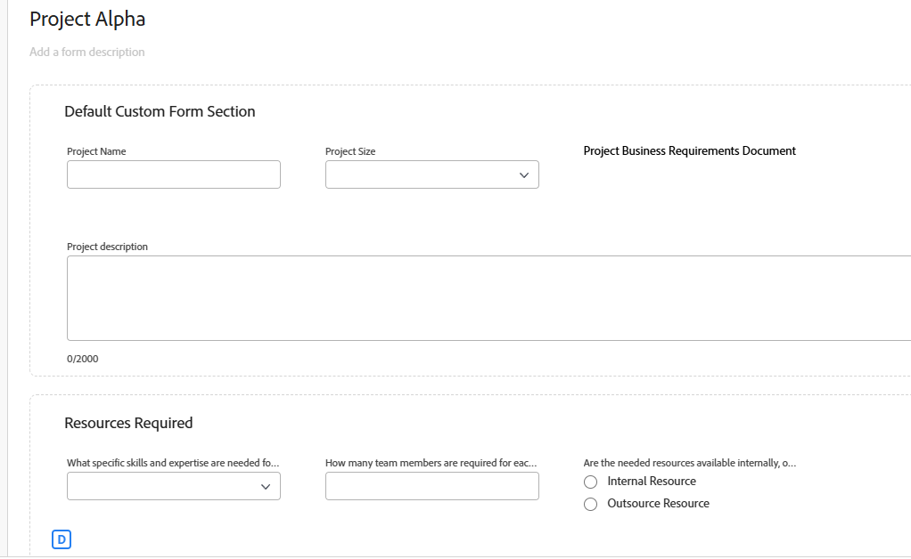

# Hinzufügen von Logikregeln zu benutzerdefinierten Formularen und Feldern

Mit logischen Regeln können Sie die Felder in Ihrem Formular weiter anpassen.

Beispielsweise können Sie basierend auf den Entscheidungen, die ein Benutzer beim Ausfüllen eines benutzerdefinierten Formulars trifft, Felder oder Abschnitte in einem benutzerdefinierten Formular anzeigen oder überspringen.

>[!NOTE]
>
>Logik gilt nur innerhalb eines Formulars und kann nicht auf Auswahlen aus einem anderen Formular basieren.

## Zugriffsanforderungen

+++ Erweitern Sie , um die Zugriffsanforderungen für die -Funktion in diesem Artikel anzuzeigen.

Sie müssen über folgenden Zugriff verfügen, um die Schritte in diesem Artikel ausführen zu können:

<table style="table-layout:auto"> 
 <col> 
 <col> 
 <tbody> 
  <tr data-mc-conditions=""> 
   <td role="rowheader">Adobe Workfront-Plan </td> 
   <td>Beliebig</td> 
  </tr> 
  <tr> 
   <td role="rowheader">Adobe Workfront-Lizenz</td> 
   <td>
   <p>Neu: Standard</p>
   <p>oder</p>
   <p>Aktuell: Plan</p></td> 
  </tr> 
  <tr data-mc-conditions=""> 
   <td role="rowheader">Konfigurationen der Zugriffsebene</td> 
   <td>Administrativer Zugriff auf benutzerdefinierte Formulare </td> 
  </tr>  
 </tbody> 
</table>

Weitere Informationen zu den Informationen in dieser Tabelle finden Sie unter [Zugriffsanforderungen in der Dokumentation zu Workfront](/help/quicksilver/administration-and-setup/add-users/access-levels-and-object-permissions/access-level-requirements-in-documentation.md).

+++

## Logiksymbole anzeigen und überspringen

Benutzerdefinierte Formulare zeigen Symbole an, um anzugeben, wann die Logik zum Anzeigen oder Überspringen auf bestimmte Felder angewendet wird. Symbole auf einem Feld im Formular-Designer geben an, dass Logik auf das Feld angewendet wird.

| Symbol | Speicherort auf dem Feld im Formular-Designer | Definition |
|--- |--- |--- |
|  | Unten links | Das Feld ist das Zielfeld für die Anzeigelogik. Wenn eine bestimmte Auswahl im Formular vorgenommen wird, wird dieses Feld angezeigt. |
|  | Unten rechts | Das Feld definiert die Anzeigelogik. Eine bestimmte Auswahl oder ein bestimmter Wert in diesem Feld zeigt das Zielfeld an. |
|  | Unten links | Das Feld ist das Zielfeld für die Logik zum Überspringen . Wenn eine bestimmte Auswahl im Formular vorgenommen wird, springt das Formular zu diesem Feld weiter und die Felder dazwischen werden ausgeblendet. |
|  | Unten rechts | Das Feld definiert die Logik zum Überspringen. Eine bestimmte Auswahl oder ein bestimmter Wert in diesem Feld überspringt andere Felder und wechselt direkt zum Zielfeld. |


Wählen Sie ein Feld mit angewendeter Logik aus, um die vorhandenen Logikregeln in den Feldeinstellungen anzuzeigen.


## Überlegungen zur Verwendung der Anzeigelogik und zum Überspringen der Logik

* Um Anzeigelogik zu einem benutzerdefinierten Feld, Widget oder Abschnittsumbruch hinzuzufügen, muss mindestens ein Multiple-Choice-Feld (Optionsfelder, Dropdown-Listen oder Kontrollkästchen) vor dem Feld im Formular positioniert werden.
Informationen zu benutzerdefinierten Feldern und Widgets in benutzerdefinierten Formularen finden Sie unter [Erstellen eines benutzerdefinierten Formulars](/help/quicksilver/administration-and-setup/customize-workfront/create-manage-custom-forms/form-designer/design-a-form/design-a-form.md).
* Sie können keine Logik zum Überspringen zu einem Widget oder Abschnittsumbruch hinzufügen. Sie können sie nur einem Multiple-Choice-Feld hinzufügen (Optionsschaltflächen, Dropdown-Liste oder Kontrollkästchen).
* Es ist nicht möglich, eine Logik zum Anzeigen oder Überspringen anzuwenden, um die Auswahl eines Felds mit mehreren Optionen ein- oder auszublenden. Sie können beispielsweise die Auswahl, die für ein Dropdown-Feld, eine Kontrollkästchen-Gruppe oder ein Optionsfeld angezeigt wird, nicht auf der Grundlage der Anzeige- oder Überspringen-Logik eines anderen Felds einschränken.
* Sie können sowohl Anzeigelogik als auch Überspringen-Logik zu einem benutzerdefinierten Feld hinzufügen, wenn Folgendes für das benutzerdefinierte Feld zutrifft:

   * Es handelt sich um ein Feld mit Mehrfachauswahl (Optionsfelder, Dropdown oder Kontrollkästchen)
   * Ihm geht ein Multiple-Choice-Feld voran
   * Darauf folgt ein weiteres benutzerdefiniertes Feld

* Beim Kopieren von Formularen mit Anzeigelogik oder Überspringen wird die Logik in das neue benutzerdefinierte Formular kopiert.
* Bei der Massenbearbeitung von Objekten werden alle benutzerdefinierten Felder im Feld Objekte bearbeiten angezeigt, einschließlich der übersprungenen oder ausgeblendeten Felder.
* Beachten Sie Folgendes, wenn Sie eine Anzeigelogik-Regel für ein benutzerdefiniertes Formular erstellen:

   * Benutzerdefinierte Felder, die nicht in einer Display-Logikanweisung enthalten sind, werden standardmäßig in einem benutzerdefinierten Formular angezeigt.
   * Sie können Logikanweisungen mit mehreren Feldern erstellen.
   * Wenn auf alle Felder unter einem Abschnittsumbruch eine Anzeigelogik angewendet wurde und sie infolge der Logik alle ausgeblendet sind, wird der gesamte Abschnitt im benutzerdefinierten Formular ausgeblendet.

## Hinzufügen einer Anzeigelogik zu einem benutzerdefinierten Formular

Die Anzeigelogik definiert, welche benutzerdefinierten Felder im Formular angezeigt werden, wenn Benutzende einen bestimmten Wert in einem Multiple-Choice-Feld auswählen. Die Logik wird dem Zielfeld hinzugefügt, das nur angezeigt wird, wenn der Wert ausgewählt ist.

<!--
>[!NOTE]
>
><span class="preview">This procedure describes the basic mode for display logic. Advanced display logic is also available. For more information, see [Add advanced display logic to a custom form](#add-advanced-display-logic-to-a-custom-form), in this article.</span>
-->

{{step-1-to-setup}}

1. Klicken Sie **Benutzerdefinierte Forms**.
1. Ein neues benutzerdefiniertes Formular erstellen oder ein vorhandenes Formular öffnen. Siehe [Erstellen eines benutzerdefinierten Formulars](/help/quicksilver/administration-and-setup/customize-workfront/create-manage-custom-forms/form-designer/design-a-form/design-a-form.md) für Details.
1. Fügen Sie dem Formular nach Bedarf Felder hinzu. Mindestens ein Multiple-Choice-Feld (Optionsfeld, Dropdown oder Kontrollkästchen) muss vor dem Zielfeld positioniert werden, das angezeigt wird.
1. Wählen Sie das Zielfeld aus und klicken Sie auf **Logik**.
1. Wählen Sie die **Anzeige** im Logikgenerator aus.
1. Klicken Sie **Anzeigeregel hinzufügen**.

   

1. Gehen Sie wie folgt vor, um die Logikanweisung im Builder zu erstellen.

   1. Die erste Option besteht darin, das definierende Feld auszuwählen. Dies ist das Feld mit dem Auswahlwert, der die Zielgruppe anzeigt. Es muss ein Multiple-Choice-Feld sein.
   1. Die zweite Option besteht darin, den Auswahlwert auszuwählen. Nur die für dieses Feld bereits definierten Werte sind verfügbar.
   1. Die dritte Option ist **Ausgewählt** oder **Nicht ausgewählt**. Die Auswahl **Ausgewählt** bedeutet, dass bei Auswahl des Werts das Zielfeld angezeigt wird. Die Auswahl **Nicht ausgewählt** bedeutet, dass das Zielfeld angezeigt wird, wenn ein anderer Wert im definierenden Feld ausgewählt wird.
   1. Um eine Und **Regel** die Logikanweisung hinzuzufügen, klicken Sie **Regel hinzufügen** direkt unter der soeben erstellten Regel. Befolgen Sie die gleichen Anweisungen, um die Regel zu erstellen. Alle - und -Regeln müssen erfüllt sein, damit das Zielfeld angezeigt wird.

      

   1. Um eine **OR**-Regel zur Logikanweisung hinzuzufügen, klicken Sie **Regel hinzufügen** unten im Logik-Builder. Klicken Sie dann im Bereich **auf „Regel hinzufügen** und folgen Sie denselben Anweisungen, um die Regel zu erstellen. Wenn eine OR-Regel erfüllt ist, wird das Zielfeld angezeigt.

1. Klicken Sie **Anwenden** wenn Sie mit dem Erstellen der Logikanweisung fertig sind.

   Die Symbole für die Anzeigelogik werden dem Zielfeld und dem definierenden Feld im Formular-Designer hinzugefügt.

<!--
<div class="preview">

## Add advanced display logic to a custom form

The advanced display logic for custom form fields allows you to build complex logic using formulas. You can apply this logic to the following field types: drop-down, radio button, checkbox, typeahead, single line text, paragraph text, date field, text with formatting, and calculated fields.

### Examples

You can use advanced display logic to control the visibility of custom form sections based on user roles and the visibility of a field based on another field's status.

No logic is applied to the default section on the form, so it is always visible to all users.

Using the following condition, the Resources Required section is only displayed when a user with the job role of Resource Manager views the form.

```IF($$USER.{roleID}="123abc", true)```

Note that ```123abc``` represents the role ID of the Resource Manager.



The same condition with a different role ID is applied to the Project Financial KPIs section to define that  only the Financial Advisor role can view the section.

Using the following condition, the Sold KPI field only becomes visible when the project is complete. This logic is applied directly to the field instead of to a form section. There is no need to specify which role can view the field, because that is already defined in the section that the field is in.

```IF({status}="CPL", true)```


### Define advanced display logic

{{step-1-to-setup}}

1. Click **Custom Forms**.
1. Create a new custom form or open an existing form. See [Create a custom form](/help/quicksilver/administration-and-setup/customize-workfront/create-manage-custom-forms/form-designer/design-a-form/design-a-form.md) for details.
1. Add fields to the form as needed.
1. Select the field to apply logic to, and click **Add Logic**.
1. Select the **Display** tab on the logic builder.
1. Turn on **Advanced mode**.
   
   This option might be turned on automatically, for fields that do not support the simple mode of display logic.

   

1. Build the display condition in the editor.

   For more information about calculations and expressions, see [Add calculated fields to a form](/help/quicksilver/administration-and-setup/customize-workfront/create-manage-custom-forms/form-designer/design-a-form/add-a-calculated-field.md) and [Overview of calculated data expressions](/help/quicksilver/reports-and-dashboards/reports/calc-cstm-data-reports/calculated-data-expressions.md).

1. Click **Apply**.
   
   The logic is applied to the field and the display logic icon is added in the form designer.

</div>
-->

## Hinzufügen einer Logik zum Überspringen zu einem benutzerdefinierten Formular

Die Überspringen-Logik definiert benutzerdefinierte Formularfelder, die übersprungen werden, wenn Benutzende einen bestimmten Wert in einem Multiple-Choice-Feld auswählen. Übersprungene Felder werden im Formular ausgeblendet. Die Logik wird auf das definierende Feld angewendet, in dem die Auswahl getroffen wird, nicht auf die übersprungenen Felder.

{{step-1-to-setup}}

1. Klicken Sie **Benutzerdefinierte Forms**.
1. Ein neues benutzerdefiniertes Formular erstellen oder ein vorhandenes Formular öffnen. Siehe [Erstellen eines benutzerdefinierten Formulars](/help/quicksilver/administration-and-setup/customize-workfront/create-manage-custom-forms/form-designer/design-a-form/design-a-form.md) für Details.
1. Fügen Sie dem Formular nach Bedarf Felder hinzu. Das definierende Feld für die Logik zum Überspringen muss ein Multiple-Choice-Feld sein (Optionsfeld, Dropdown oder Kontrollkästchen).
1. Wählen Sie das definierende Feld aus und klicken **unten links** Bildschirm auf „Logik hinzufügen“.
1. Wählen Sie die **Überspringen** im Logikgenerator.
1. Klicken Sie **Regel zum Überspringen hinzufügen**.

   

1. Gehen Sie wie folgt vor, um die Logikanweisung im Builder zu erstellen.

   1. Das definierende Feld wird im Builder angezeigt. Dies ist das Feld, auf das Sie die Logik zum Überspringen angewendet haben.
   1. Die erste Option besteht darin, den Auswahlwert auszuwählen. Nur die bereits für das Feld definierten Werte sind verfügbar.
   1. Die zweite Option ist **Ausgewählt** oder **Nicht ausgewählt**. Die Auswahl **Ausgewählt** bedeutet, dass bei Auswahl des Werts das Zielfeld angezeigt wird und die Felder dazwischen übersprungen werden. Die Auswahl **Nicht ausgewählt** bedeutet, dass, wenn ein anderer Wert im definierenden Feld ausgewählt ist, das Zielfeld angezeigt wird und die Felder dazwischen übersprungen werden.
   1. Die dritte Option ist das Zielfeld oder der Ort, zu dem Sie wechseln möchten. Wählen Sie einen Feldnamen oder &quot;**des Formulars“**. Möglicherweise müssen Sie zuerst auf das Wort „leer“ klicken, bevor Sie eine Option auswählen.

      

   1. Um eine **OR**-Regel zur Logikanweisung hinzuzufügen, klicken Sie **Regel hinzufügen** unten im Logik-Builder. Wählen Sie dann die Optionen aus, die denselben Aufforderungen folgen, um die Regel zu erstellen. Wenn eine **Oder**-Regel erfüllt ist, wird das Zielfeld angezeigt.

1. Klicken Sie **Anwenden** wenn Sie mit dem Erstellen der Logikanweisung fertig sind.

   Die Symbole zum Überspringen werden dem Zielfeld und dem definierenden Feld im Formular-Designer hinzugefügt.

## Hinzufügen von Validierungslogik zu einem benutzerdefinierten Formular

Validierungslogik wird mithilfe von Formeln erstellt, und Sie können die Logik so einfach oder so komplex gestalten, wie Sie benötigen. Die Validierung kann auf den Werten anderer Felder oder dem Status von Objekten basieren, und Sie können eine Fehlermeldung bereitstellen, die angibt, wenn die Validierung fehlschlägt.

Wenn das Feld mit der angewendeten Logik die definierten Validierungsbedingungen erfüllt, wenn ein Benutzer das benutzerdefinierte Formular ausfüllt, wird das Feld hervorgehoben und die Fehlermeldung angezeigt.

Sie können Validierungslogik auf die folgenden Feldtypen anwenden: einzeiliger Text, Absatz, Dropdown-Liste mit einfacher Auswahl, Dropdown-Liste mit Mehrfachauswahl, externe Suche, automatische Textvervollständigung, Datum, Kontrollkästchen-Gruppe und Optionsfelder.

### Beispiele

Unter Verwendung der folgenden Bedingung zeigt das Feld Budget eine Nachricht unter dem Feld an, wenn der Benutzer einen Wert eingibt, der die Nachricht Trigger. Wenn der eingegebene Wert beispielsweise negativ ist, wird die erste Meldung angezeigt. Wenn der/die Benutzende versucht, den Projektstatus in „aktuell“ zu ändern, bevor er/sie einen Budgetwert eingibt, wird die zweite Meldung angezeigt.

```
IF({DE:Budget Field} < 0,
     "Budget cannot be negative",
     IF({DE:Budget Field} == 0 && {status} == "CUR", "Budget must be specified before moving to Current status")
)
```

Ein weiteres einfaches Beispiel: Ein Telefonnummernfeld muss eine bestimmte Anzahl von Ziffern enthalten, damit es gültig ist.

Ein zusätzliches Beispiel für die Validierung anhand anderer Felder ist ein Feld für die Größe des Besprechungsraums (klein, mittel oder groß) und ein separates Feld für die Anzahl der Besprechungsteilnehmer. Die Anzahl der Personen für jede Raumgröße wird in die Validierungsformel geschrieben. Wenn die Anzahl der Teilnehmer, die der Benutzer betritt, für den ausgewählten Besprechungsraum zu hoch ist, wird die Fehlermeldung angezeigt.

### Validierungslogik definieren

{{step-1-to-setup}}

1. Klicken Sie **Benutzerdefinierte Forms**.
1. Ein neues benutzerdefiniertes Formular erstellen oder ein vorhandenes Formular öffnen. Siehe [Erstellen eines benutzerdefinierten Formulars](/help/quicksilver/administration-and-setup/customize-workfront/create-manage-custom-forms/form-designer/design-a-form/design-a-form.md) für Details.
1. Fügen Sie dem Formular nach Bedarf Felder hinzu.
1. Wählen Sie das Feld aus, auf das Logik angewendet werden soll, und klicken Sie auf **Logik hinzufügen**.
1. Wählen Sie die **Validierung** im Logikgenerator aus.

   

1. Erstellen Sie die Validierungsbedingung im Editor, einschließlich der Fehlermeldung, die angezeigt werden soll, wenn die Validierung nicht erfüllt ist.

   Weitere Informationen zu Berechnungen und Ausdrücken finden Sie unter [Hinzufügen berechneter Felder zu einem ](/help/quicksilver/administration-and-setup/customize-workfront/create-manage-custom-forms/form-designer/design-a-form/add-a-calculated-field.md) und [Übersicht über berechnete Datenausdrücke](/help/quicksilver/reports-and-dashboards/reports/calc-cstm-data-reports/calculated-data-expressions.md).

1. Klicken Sie **Apply**.

   Die Logik wird auf das Feld im Formular-Designer angewendet.

<!--
<div class="preview">

## Add formatting logic to a custom form

Formatting logic highlights a field value when it meets the defined conditions. The applied formatting will work on multiple fields at once.

You can apply formatting logic to the following field types: single line text, paragraph, single-select dropdown, multi-select dropdown, external lookup, typeahead, calculated, date, checkbox group, and radio buttons.

Formatting applied to custom forms is separate from formatting applied to lists and reports. For information on report formatting, see [Use conditional formatting in views](/help/quicksilver/reports-and-dashboards/reports/reporting-elements/use-conditional-formatting-views.md).

### Example

Using the following condition, the Budget field appears red when the user enters a value of 1000 or more. The field appears yellow when the user enters a value of 500 or more.

To add a hover-over definition of the formatting, use the Instructions field in the custom form. For example, a message on the Budget field could say "Please enter a budget within a reasonable range. Values over 500 are a warning notice, and above 1000 is considered too high."

```
IF(
     {DE:Budget Field} >=1000,
     FORMAT($$NEGATIVE),
     IF({DE:Budget Field} >= 500, FORMAT($$NOTICE))
)
```

### Define formatting logic

{{step-1-to-setup}}

1. Click **Custom Forms**.
1. Create a new custom form or open an existing form. See [Create a custom form](/help/quicksilver/administration-and-setup/customize-workfront/create-manage-custom-forms/form-designer/design-a-form/design-a-form.md) for details.
1. Add fields to the form as needed.
1. Select the field to apply logic to, and click **Add Logic**.
1. Select the **Formatting** tab on the logic builder.

   

1. Build the formatting condition in the editor.

   You can add up to five formatting rules per field.

   The field highlighting color options are:

   * `$$POSITIVE (green)`
   * `$$INFORMATIVE (blue)`
   * `$$NEGATIVE (red)`
   * `$$NOTICE (orange)`
   
   The text formatting options are:
   
   * `$$BOLD`
   * `$$ITALIC`
   * `$$UNDERLINE`

   Only one color option may be used per function, along with up to three additional text formatting options. If no color option is specified, the system's default color is applied.

   For more information about calculations and expressions, see [Add calculated fields to a form](/help/quicksilver/administration-and-setup/customize-workfront/create-manage-custom-forms/form-designer/design-a-form/add-a-calculated-field.md) and [Overview of calculated data expressions](/help/quicksilver/reports-and-dashboards/reports/calc-cstm-data-reports/calculated-data-expressions.md).

1. Click **Apply**.
   
   The logic is applied to the field in the form designer.

</div>
-->
