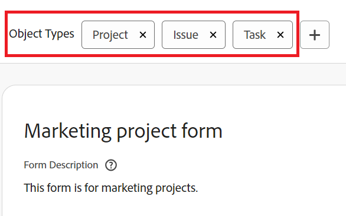

# Hinzufügen oder Löschen von Objekttypen aus einem vorhandenen benutzerdefinierten Formular mit dem Formularentwickler

Mit dem Formularentwickler können Sie Objekttypen zu einem vorhandenen benutzerdefinierten Formular hinzufügen oder löschen.

## Zugriffsanforderungen

Sie müssen über Folgendes verfügen, um die Schritte in diesem Artikel durchzuführen:

<table style="table-layout:auto"> 
 <col> 
 <col> 
 <tbody> 
  <tr data-mc-conditions=""> 
   <td role="rowheader"> 
Adobe Workfront-Plan*
 </td> 
   <td>Beliebig</td> 
  </tr> 
  <tr> 
   <td role="rowheader">Adobe Workfront-Lizenz*</td> 
   <td>
   
Aktueller Plan: Standard

   
oder

   
Veralteter Plan: Plan
</td> 
  </tr> 
  <tr data-mc-conditions=""> 
   <td role="rowheader">Konfigurationen auf Zugriffsebene*</td> 
   <td>
Administratorzugriff auf benutzerdefinierte Formulare
 
Informationen dazu, wie Workfront-Administratoren diesen Zugriff gewähren, finden Sie unter <a href="/help/quicksilver/administration-and-setup/add-users/configure-and-grant-access/grant-users-admin-access-certain-areas.md" class="MCXref xref">Benutzern administrativen Zugriff auf bestimmte Bereiche gewähren</a>.
</td> 
  </tr>  
 </tbody> 
</table>

&#42;Wenden Sie sich an Ihren Workfront-Administrator, um zu erfahren, welche Konfigurationen für Plan, Lizenztyp oder Zugriffsstufe Sie verwenden.

## Hinzufügen von Objekttypen zu einem vorhandenen benutzerdefinierten Formular

Sie können dem Formular weitere Objekttypen hinzufügen, damit es an mehrere Objekte angehängt werden kann.

>[!NOTE]
>
>Die Berechtigungen für Abschnittsumbrüche können vom Objekttyp beeinflusst werden. Die eingeschränkte Berechtigung zum Bearbeiten für benutzerdefinierte Formularabschnitte ist nur für die Objekttypen Projekt, Aufgabe, Problem und Benutzer verfügbar.
>
>Weitere Informationen finden Sie unter [Wie sich mehrere Objektarten auf die Genehmigungen von Abschnittsumbrüchen auswirken können](/help/quicksilver/administration-and-setup/customize-workfront/create-manage-custom-forms/form-designer/design-a-form/organize-a-form.md#how-multiple-object-types-can-affect-section-break-permissions).

1. Klicken Sie auf **Hauptmenü** icon  Klicken Sie oben rechts in Adobe Workfront auf **Einrichtung** .

1. Klicken **Benutzerdefinierte Forms** im linken Bereich.

   In der angezeigten Ansicht können Sie alle benutzerdefinierten Formulare überprüfen, die für Ihr Unternehmen erstellt wurden. Sie können auch sehen, wer jedes Formular erstellt hat, mit welchem Objekttyp es funktioniert und ob es aktiv ist.

1. Wählen Sie das benutzerdefinierte Formular aus, dem Sie weitere Objekttypen hinzufügen möchten, und klicken Sie dann auf **Bearbeiten**.

1. Klicken Sie oben im Formular auf das Pluszeichen + nach **Objekttypen** und wählen Sie dann den gewünschten Typ im angezeigten Menü aus. Sie können dies wiederholen, um beliebig viele Objekttypen hinzuzufügen.

   

1. Klicken **Speichern und schließen**.

   >[!TIP]
   >
   >Sie können auf **Anwenden** Sie können jederzeit ein benutzerdefiniertes Formular erstellen, um Ihre Änderungen zu speichern und das Formular offen zu halten.

## Löschen von Objekttypen in einem benutzerdefinierten Formular

Sie können Objekttypen aus einem vorhandenen benutzerdefinierten Formular löschen. Ein benutzerdefiniertes Formular muss mindestens einen Objekttyp aufweisen.

>[!CAUTION]
>
>Wenn Personen das benutzerdefinierte Formular bereits an Objekte des Typs angehängt haben, den Sie löschen möchten, und dem das Formular Daten hinzugefügt haben, werden diese Daten beim Löschen dieses Objekttyps im Formular dauerhaft gelöscht. Sie kann historische Informationen enthalten, die Benutzer später benötigen.
>
>Im Allgemeinen empfehlen wir, die Anzahl der Bearbeitungen eines bereits verwendeten benutzerdefinierten Formulars zu minimieren. Es gibt kein Benachrichtigungssystem, um Benutzer, die das benutzerdefinierte Formular verwenden, über Ihre Änderungen zu informieren.

So löschen Sie einen Objekttyp:

1. Klicken Sie auf **Hauptmenü** icon  Klicken Sie oben rechts in Adobe Workfront auf **Einrichtung** .

1. Klicken **Benutzerdefinierte Forms** im linken Bereich.
1. Wählen Sie das benutzerdefinierte Formular aus, das Sie bearbeiten möchten, und klicken Sie auf **Bearbeiten**.
1. Klicken Sie auf das X auf einem der **Objekttypen** die Sie aus dem Formular löschen möchten, klicken Sie auf **Löschen** in der angezeigten Warnmeldung angezeigt.

   

1. (Optional) Wiederholen Sie den vorherigen Schritt für jeden anderen Objekttyp, den Sie aus dem Formular entfernen möchten.
1. Klicken **Fertig** Klicken Sie auf **Schließen und speichern**.
