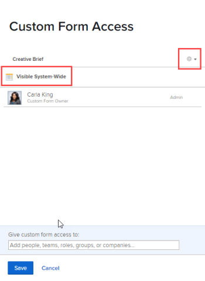

# Freigeben eines benutzerdefinierten Formulars

{{preview-fast-release-general}}

Sie können den Zugriff für ein benutzerdefiniertes Formular konfigurieren, um zu steuern, wer es anzeigen, freigeben und bearbeiten kann - Person, Rolle, Gruppe, Team, Unternehmen, Geschäftsprofil.

## Zugriffsanforderungen

+++ Erweitern, um die Zugriffsanforderungen für die in diesem Artikel beschriebene Funktionalität anzuzeigen.

<table style="table-layout:auto"> 
 <col> 
 <col> 
 <tbody> 
  <tr> 
   <td>Adobe Workfront-Paket</td> 
   <td>
Beliebig
</td> 
  </tr> 
  <tr> 
   <td>Adobe Workfront-Lizenz</td> 
   <td>
Standard

       
Abo
</td>
  </tr> 
  <tr> 
   <td>Konfigurationen der Zugriffsebene</td> 
   <td> 
Administrativer Zugriff auf benutzerdefinierte Formulare
 </td> 
  </tr>  
 </tbody> 
</table>

Weitere Informationen finden Sie unter [Zugriffsanforderungen in der Dokumentation zu Workfront](/help/quicksilver/administration-and-setup/add-users/access-levels-and-object-permissions/access-level-requirements-in-documentation.md).

+++

## Zugriff auf benutzerdefinierte Formulare {#access-to-custom-forms}

Wenn Sie ein neues benutzerdefiniertes Formular erstellen und jemand es an ein Objekt anhängt, kann standardmäßig jeder Benutzer, der dem Objekt zugewiesen ist, das Formular anzeigen und ausfüllen. Dazu gehören Benutzer mit einer Beitragenden - oder Anfragelizenz sowie externe Benutzer.

Bei einem Objekt, an das das benutzerdefinierte Formular noch nicht angehängt wurde, kann ein Benutzer (selbst wenn er über eine Zugriffsebene für Planer verfügt) es jedoch nicht über das Dropdown-Menü Benutzerdefinierte Forms anhängen, es sei denn, einer der folgenden Punkte ist erfüllt:

* Jemand hat das benutzerdefinierte Formular als „Jeder im System kann anzeigen und anhängen“ freigegeben
* Jemand hat das benutzerdefinierte Formular für den Benutzer oder dessen Team, Aufgabengebiet, Gruppe, Unternehmen oder Geschäftsprofil freigegeben, wobei mindestens die Berechtigung zum Anzeigen mit der ausgewählten Option „An benutzerdefinierte Daten anhängen“ gewährt wurde
* Der Benutzer verfügt über eine Standard- oder Planlizenz und die Zugriffsebene ermöglicht den administrativen Zugriff auf benutzerdefinierte Formulare

<!--

## Share a custom form from the list of forms

Rather than leaving a custom form in the default sharing state (described in [Access to custom forms](#access-to-custom-forms) in this article), you can configure specific levels of access to the form for certain users, job roles, groups, teams, and companies.

{{step-1-to-setup}}

1. In the left panel, click **Custom Forms**.
1. Select the custom form, then click .
1. In the box that displays, under **Give custom form access to**, start typing the name of the user, team, job role, group, company, or business profile you want to share the custom form with, then press **Enter** when the name displays.
1. To adjust access for the user, team, job role, group, company, or business profile you just added, click the drop-down menu to the right of the name, then configure one of the following available options and any of its advanced settings:

   <table style="table-layout:auto"> 
    <col> 
    <col> 
    <tbody> 
     <tr> 
      <td role="rowheader">View it</td> 
      <td> 
This option provides the ability to view and fill out the custom form on objects. At the object level, users must also have at least Contribute access with the <strong>Edit custom form</strong> advanced setting enabled. For example, if the form is attached to a project, users must have Contribute access to that project, or they will not be able to fill out the form.

      
      
<b>NOTE</b>: For users with Light and Contributor licenses (or Work, Review, and Request licenses), this is the highest available option.

      
      
Click <strong>Advanced Settings</strong> to specify whether you want to allow the following:
 
       <ul> 
        <li><strong>Attach to custom data</strong>: Ability to attach the custom form to projects, tasks, and issues for which they have Manage access</li> 
        <li> 
<strong>Share</strong>: Ability to share the custom form with others in the system
 
Users with a Light or Contributor license (or Work, Review, or Request license) can share a custom form only through the API or a custom forms report.
 </li>
       </ul> </td> 
     </tr> 
     <tr> 
      <td role="rowheader">Manage it</td> 
      <td> 
This option available only for users with a Standard or Plan license. 
 
In addition to being able to add the form to objects they have access to edit, users can also fully edit the custom form, including adding, editing, and deleting fields.
 
Click <strong>Advanced Settings</strong> to specify whether you want to allow following:
 
       <ul> 
        <li> 
<strong>Attach to custom data</strong>: Ability to attach the custom form to projects, tasks, and issues for which they have Manage access
 </li> 
        <li><strong>Delete</strong>: Delete the custom form from the system</li> 
        <li><strong>Share</strong>: Share the custom form with others in the system</li> 
       </ul> </td> 
     </tr> 
    </tbody> 
   </table>

1. (Optional) Repeat Steps 4-5 to add other names to the list and configure their options.
1. (Optional) If you want to limit access to the custom form (on objects where it's attached) to those you have specified in the previous steps, click the gear icon  in the upper right corner of the sharing box, then click **Remove system-wide access**.

   If you change your mind, you can click **Make this visible system-wide** (the default option).

   >[!NOTE]
   >
   >* When you make a custom form visible system-wide, you allow users only to see and fill it out on objects they are assigned to, not to attach it to other objects. You can grant the ability to attach the custom form to objects using the option "Attach to custom data" explained under step 5.
   >* Most organizations want to ensure that everyone in the system can fill out a custom form when it's attached to objects they work on and view its data in reports. If this is true for your organization, we recommend that you use **Make this visible system-wide**. When the option is configured this way, "Visible System-Wide" displays in the dialog box:
   >   
   >
   >   
   >If you are concerned about a custom form where users might enter sensitive data when it is attached to certain objects, limiting sharing for those *objects* might be better rather than limiting access to the form itself.

1. Click **Save**.

-->

## Freigeben eines benutzerdefinierten Formulars

Anstatt ein benutzerdefiniertes Formular im Standardfreigabestatus zu belassen (beschrieben unter [Zugriff auf benutzerdefinierte Formulare](#access-to-custom-forms) in diesem Artikel), können Sie bestimmte Zugriffsebenen für das Formular für bestimmte Benutzer, Aufgabengebiete, Gruppen, Teams, Unternehmen und Geschäftsprofile konfigurieren.

{{step-1-to-setup}}

1. Klicken Sie im linken Bedienfeld auf **Benutzerdefinierte Forms**.
1. Wählen Sie das benutzerdefinierte Formular in der Liste aus und klicken Sie dann auf .

   ODER

   Ein benutzerdefiniertes Formular öffnen oder ein neues benutzerdefiniertes Formular erstellen. Klicken Sie dann oben **im Formular** Designer auf „Freigeben“.

1. Geben Sie im Freigabefeld unter **Zugriff auf benutzerdefinierte Formulare gewähren** den Namen des Benutzers, Teams, Aufgabengebiets, der Gruppe, des Unternehmens oder des Geschäftsprofils ein, für den Sie das benutzerdefinierte Formular freigeben möchten, und drücken Sie dann die **Eingabetaste** wenn der Name angezeigt wird.
1. Um den Zugriff für den soeben hinzugefügten Benutzer, das Team, das Aufgabengebiet, die Gruppe, das Unternehmen oder das Geschäftsprofil anzupassen, klicken Sie auf das Dropdown-Menü rechts neben dem Namen und konfigurieren Sie dann eine der folgenden verfügbaren Optionen und eine ihrer erweiterten Einstellungen:

   <table style="table-layout:auto"> 
    <col> 
    <col> 
    <tbody> 
     <tr> 
      <td role="rowheader">Ansicht</td> 
      <td> 
Diese Option bietet die Möglichkeit, das benutzerdefinierte Formular für Objekte anzuzeigen und auszufüllen. Auf Objektebene müssen Benutzer außerdem mindestens über Beitragszugriff verfügen, wenn die erweiterte Einstellung <strong>Benutzerdefiniertes Formular bearbeiten</strong> aktiviert ist. Wenn das Formular beispielsweise an ein Projekt angehängt ist, müssen Benutzende Beitragszugriff auf dieses Projekt haben, sonst können sie das Formular nicht ausfüllen.

   
<b>HINWEIS</b>: Für Benutzende mit Light- und Contributor-Lizenzen (oder Arbeits-, Prüfungs- und Anfragelizenzen) ist dies die höchste verfügbare Option.
 
Klicken Sie <strong>Erweiterte Einstellungen</strong>, um anzugeben, ob Folgendes zulässig sein soll:
 
       <ul> 
        <li><strong>An benutzerdefinierte Daten anhängen</strong>: Möglichkeit, das benutzerdefinierte Formular an Projekte, Aufgaben und Probleme anzuhängen, für die sie Verwaltungszugriff haben</li> 
        <li> 
<strong>Freigeben</strong>: Möglichkeit, das benutzerdefinierte Formular für andere Personen im System freizugeben
 
Benutzende mit einer Light- oder Contributor-Lizenz (oder Arbeits-, Prüfungs- oder Anfragelizenz) können ein benutzerdefiniertes Formular nur über die API oder einen benutzerdefinierten Formularbericht freigeben.
 </li>
       </ul> </td> 
     </tr> 
     <tr> 
      <td role="rowheader">Verwalten</td> 
      <td> 
Diese Option ist nur für Benutzer mit einer Standard- oder Planlizenz verfügbar. 
 
Benutzer können das Formular nicht nur zu Objekten hinzufügen, auf die sie Zugriff haben, um es zu bearbeiten, sondern auch das benutzerdefinierte Formular vollständig bearbeiten, einschließlich Felder hinzufügen, bearbeiten und löschen.
 
Klicken Sie <strong>Erweiterte Einstellungen</strong>, um anzugeben, ob Folgendes zulässig sein soll:
 
       <ul> 
        <li> 
<strong>An benutzerdefinierte Daten anhängen</strong>: Möglichkeit, das benutzerdefinierte Formular an Projekte, Aufgaben und Probleme anzuhängen, für die sie Verwaltungszugriff haben
 </li> 
        <li><strong>Löschen</strong>: Löschen des benutzerdefinierten Formulars aus dem System</li> 
        <li><strong>Freigeben</strong>: Freigeben des benutzerdefinierten Formulars für andere Personen im System</li> 
       </ul> </td> 
     </tr> 
    </tbody> 
   </table>

1. (Optional) Wiederholen Sie die Schritte 5 bis 6, um der Liste weitere Namen hinzuzufügen und ihre Optionen zu konfigurieren.
1. (Optional) Wenn Sie den Zugriff auf das benutzerdefinierte Formular (auf Objekte, an die es angehängt ist) auf die in den vorherigen Schritten angegebenen beschränken möchten, klicken Sie auf den Dropdown-Pfeil unter **Wer hat Zugriff** und wählen Sie dann **Nur eingeladene Personen können Zugriff**.

   Wenn Sie Ihre Meinung ändern, können Sie **Alle im System können anzeigen** auswählen.

   >[!NOTE]
   >
   >* Wenn Sie ein benutzerdefiniertes Formular systemweit sichtbar machen, lassen Sie es Benutzerinnen und Benutzern nur für die Objekte anzeigen und ausfüllen, denen sie zugewiesen sind, nicht aber, es an andere Objekte anzuhängen. Sie können das benutzerdefinierte Formular mit der Option „An benutzerdefinierte Daten anhängen“, die in Schritt 6 erläutert wird, an Objekte anhängen.
   >* Die meisten Unternehmen möchten sicherstellen, dass jeder im System ein benutzerdefiniertes Formular ausfüllen kann, wenn es an Objekte angehängt wird, an denen er arbeitet, und seine Daten in Berichten anzeigen kann. Wenn dies für Ihre Organisation zutrifft, empfehlen wir die Verwendung von **Jeder im System kann anzeigen**.
   >* Wenn Sie **Alle im System können anzeigen und anhängen** auswählen, können alle Benutzer das Formular an andere Objekte anhängen.
   >
   >Beispielbild in der Vorschau-Umgebung:
   >
   >   
   >Beispielbild in der Produktionsumgebung:
   >
   >   
   >Wenn Sie Bedenken bei einem benutzerdefinierten Formular haben, bei dem Benutzer möglicherweise vertrauliche Daten eingeben, wenn sie an bestimmte Objekte angehängt sind, ist es möglicherweise effektiver, die Freigabe für diese *Objekte* zu beschränken, anstatt den Zugriff auf das Formular selbst zu beschränken.

1. Klicken Sie auf **Speichern**.

## Entfernen des Zugriffs auf ein benutzerdefiniertes Formular

{{step-1-to-setup}}

1. Klicken Sie im linken Bedienfeld auf **Benutzerdefinierte Forms**.
1. Wählen Sie das benutzerdefinierte Formular in der Liste aus und klicken Sie dann auf .
1. Klicken Sie im Freigabefeld auf das Dropdown-Menü rechts neben dem Namen des Benutzers, Teams, der Rolle, der Gruppe, der Firma oder des Geschäftsprofils, auf die bzw. das Sie keinen besonderen Zugriff mehr auf das Formular haben möchten, und wählen Sie **Entfernen**.
1. (Optional) Wiederholen Sie den vorherigen Schritt für andere Namen, die Sie entfernen möchten.
1. Klicken Sie auf **Speichern**.

