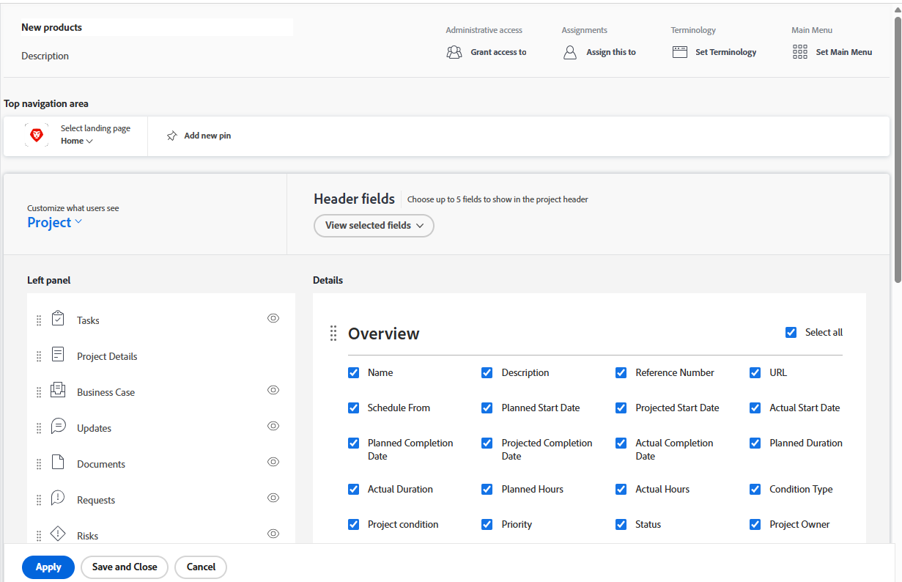

# Anpassen der Detailansicht mithilfe einer Layout-Vorlage

{{preview-fast-release-general}}

Als Adobe Workfront-Admin können Sie mithilfe einer Layout-Vorlage bestimmen, welche Informationen angezeigt werden, wenn Benutzende beim Anzeigen einer Aufgabe, eines Problems, eines Dokuments, eines Programms oder eines Portfolios ) im linken Bereich klicken.

<!--
or billing record
-->

Sie können auch die Reihenfolge der Informationen ändern, in der diese Informationen angezeigt werden. Sie können beispielsweise für alle Aufgaben, die Ihren Benutzerinnen und Benutzern angezeigt werden, benutzerdefinierte Forms-Informationen für alle Aufgaben, die Ihren Benutzerinnen und Benutzern angezeigt werden, an den Anfang der Detailansicht verschieben.

Informationen zum Erstellen von Layout-Vorlagen finden Sie unter [Erstellen und Verwalten von Layout-Vorlagen](../use-layout-templates/create-and-manage-layout-templates.md).

Weitere Informationen zu Layout-Vorlagen für Gruppen finden [ unter „Erstellen und Ändern der Layout-Vorlagen einer Gruppe](../../../administration-and-setup/manage-groups/work-with-group-objects/create-and-modify-a-groups-layout-templates.md).

Nachdem Sie eine Layout-Vorlage konfiguriert haben, müssen Sie sie Benutzern zuweisen, damit die von Ihnen vorgenommenen Änderungen für andere sichtbar sind. Informationen zum Zuweisen einer Layout-Vorlage an Benutzer finden Sie unter [Zuweisen von Benutzern zu einer Layout-Vorlage](../use-layout-templates/assign-users-to-layout-template.md).

Die Änderungen, die Sie an der Detailansicht für ein Objekt vornehmen, bestimmen auch die Verfügbarkeit und Reihenfolge der Felder, die Benutzenden in den folgenden Bereichen angezeigt werden:

* Felder zum Erstellen eines Objekts, z. B. Aufgabe erstellen

  

* Die Seite „Objekt bearbeiten“ wird beim Bearbeiten eines Objekts angezeigt, z. B. „Aufgabe bearbeiten“, „Problem bearbeiten“ und „Projekt bearbeiten“

  

* Die Bildschirme „Objekte bearbeiten“ werden angezeigt, wenn Objekte stapelweise bearbeitet werden. Derzeit wird dies für die Massenbearbeitung von Projekten unterstützt.

  

* Zusammenfassungsbereich  für Listen von Aufgaben und Problemen

  

  >[!NOTE]
  >
  >Änderungen an den Layout-Vorlagen wirken sich nur bei den Aufgaben und Problemen, die dem angemeldeten Benutzer zugewiesen sind, auf die Reihenfolge und Verfügbarkeit der Felder im Zusammenfassungsbereich aus.

* Konvertierungsfelder, wie die Felder „Problem in Aufgabe konvertieren“ oder „Problem in Projekt konvertieren“.

  

Weitere Informationen zu Layout-Vorlagen für Gruppen finden [ unter „Erstellen und Ändern der Layout-Vorlagen einer Gruppe](../../../administration-and-setup/manage-groups/work-with-group-objects/create-and-modify-a-groups-layout-templates.md).

## Zugriffsanforderungen

+++ Erweitern Sie , um die Zugriffsanforderungen für die -Funktion in diesem Artikel anzuzeigen.

<table style="table-layout:auto"> 
 <col> 
 <col> 
 <tbody> 
  <tr> 
   <td>Adobe Workfront-Paket</td> 
   <td>
Beliebig
</td> 
  </tr> 
  <tr> 
   <td>Adobe Workfront-Lizenz</td> 
   <td>
Standard

       
Plan
</td>
  </tr> 
  </tr> 
  <tr> 
   <td>Konfigurationen der Zugriffsebene</td> 
   <td> 
Um diese Schritte auf Systemebene durchzuführen, benötigen Sie die Zugriffsebene „Systemadministrator“.

        
Um sie für eine Gruppe auszuführen, müssen Sie ein Manager dieser Gruppe sein.
 </td> 
  </tr> 
 </tbody> 
</table>

Weitere Informationen finden Sie unter [Zugriffsanforderungen in der Dokumentation zu Workfront](/help/quicksilver/administration-and-setup/add-users/access-levels-and-object-permissions/access-level-requirements-in-documentation.md).

+++

## Anpassen, was Benutzenden in der Detailansicht angezeigt wird

1. Beginnen Sie mit der Arbeit an einer Layout-Vorlage, wie unter [Erstellen und Verwalten von Layout-Vorlagen](../../../administration-and-setup/customize-workfront/use-layout-templates/create-and-manage-layout-templates.md) beschrieben.
1. Klicken Sie auf den Abwärtspfeil  unter **Anpassen, was Benutzer sehen** und klicken Sie dann auf **Projekt**, **Aufgabe**, **Problem**, **Programm** oder **Portfolio.**<!--, or billing record-->
1. Führen Sie im **Details** einen der folgenden Schritte aus, um anzupassen, was Benutzende in der Detailansicht sehen:

   * Ziehen Sie beliebige Abschnittsüberschriften , um ihre Reihenfolge zu ändern.
   * Aktivieren oder deaktivieren Sie Optionen in den verschiedenen Bereichen (z **B.**, **Finanzen** und **Benutzerdefinierte Forms**), um sie ein- oder auszublenden.

     Wenn Sie alle Felder in einem dieser Abschnitte ausblenden, wird der gesamte Abschnitt ausgeblendet.

     Alle Felder sind standardmäßig aktiviert. Sie können das Kontrollkästchen **Alle auswählen** in einem Bereich aktivieren oder deaktivieren, um alle Felder in diesem Bereich ein- oder auszublenden.

   Beispielbild in der Vorschau-Umgebung:
   

   Beispielbild in der Produktionsumgebung:
   

1. In der Vorschau-Umgebung: Passen Sie die Layout-Vorlage weiter an. Sie können jederzeit auf **Übernehmen** klicken, um Ihren Fortschritt zu speichern.

   ODER

   Wenn Sie mit der Anpassung fertig sind, klicken Sie auf **Speichern und schließen**.

1. In der Produktionsumgebung: Passen Sie die Layout-Vorlage weiter an.

   Oder

   Wenn Sie mit der Anpassung fertig sind, klicken Sie auf **Speichern**.

   >[!TIP]
   >
   >Sie können jederzeit auf **Speichern** klicken, um Ihren Fortschritt zu speichern, und dann später mit dem Ändern der Vorlage fortfahren.
