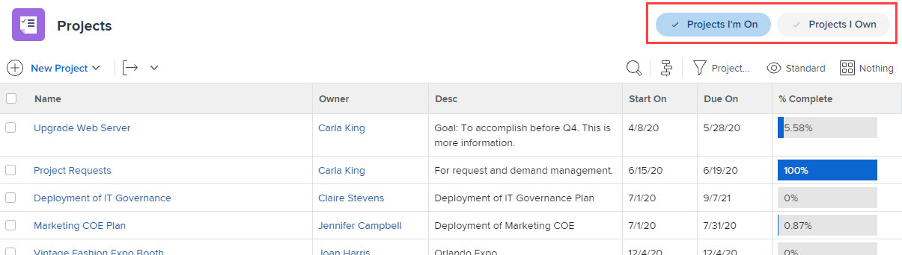

# Anpassen von Filtern, Ansichten und Gruppierungen mithilfe einer Layout-Vorlage

Als Adobe Workfront-Admin können Sie mithilfe einer Layout-Vorlage festlegen, welche Listensteuerelemente in den Dropdown-Menüs Filtern, Anzeigen und Gruppieren angezeigt werden. Diese Menüs werden überall in Workfront über Listen angezeigt, z. B. über der Aufgabenliste für ein Projekt:

Weitere Informationen zu Layout-Vorlagen finden Sie unter [Erstellen und Verwalten von Layout-](../../../administration-and-setup/customize-workfront/use-layout-templates/create-and-manage-layout-templates.md).

Weitere Informationen zu Layout-Vorlagen für Gruppen finden [ unter „Erstellen und Ändern der Layout-Vorlagen einer Gruppe](../../../administration-and-setup/manage-groups/work-with-group-objects/create-and-modify-a-groups-layout-templates.md).

Nachdem Sie eine Layout-Vorlage konfiguriert haben, müssen Sie sie Benutzern zuweisen, damit die von Ihnen vorgenommenen Änderungen für andere sichtbar sind. Informationen zum Zuweisen einer Layout-Vorlage an Benutzer finden Sie unter [Zuweisen von Benutzern zu einer Layout-Vorlage](../use-layout-templates/assign-users-to-layout-template.md).

## Zugriffsanforderungen

+++ Erweitern Sie , um die Zugriffsanforderungen für die -Funktion in diesem Artikel anzuzeigen.

Sie müssen über folgenden Zugriff verfügen, um die Schritte in diesem Artikel ausführen zu können:

<table style="table-layout:auto"> 
 <col> 
 <col> 
 <tbody> 
  <tr> 
   <td role="rowheader">Adobe Workfront-Plan</td> 
   <td>Beliebig</td> 
  </tr> 
  <tr> 
   <td role="rowheader">Adobe Workfront-Lizenz*</td> 
   <td>
Neu: Standard

  
 Aktuell: Plan

   </td> 
  </tr> 
  <tr> 
   <td role="rowheader">Konfigurationen der Zugriffsebene</td> 
   <td> 
Um diese Schritte auf Systemebene durchzuführen, benötigen Sie die Zugriffsebene „Systemadministrator“.
Um sie für eine Gruppe auszuführen, müssen Sie ein Manager dieser Gruppe sein.
 </td> 
  </tr> 
 </tbody> 
</table>

*Weitere Informationen finden Sie unter [Zugriffsanforderungen in der Dokumentation zu Workfront](/help/quicksilver/administration-and-setup/add-users/access-levels-and-object-permissions/access-level-requirements-in-documentation.md).

+++

## Anpassen der Listensteuerelemente „Filtern“, „Anzeigen“ und „Gruppieren“:

1. Beginnen Sie mit der Arbeit an einer Layout-Vorlage, wie unter [Erstellen und Verwalten von Layout-Vorlagen](../../../administration-and-setup/customize-workfront/use-layout-templates/create-and-manage-layout-templates.md) beschrieben.
1. Klicken Sie auf den Abwärtspfeil  unter **Was Benutzer sehen** und klicken Sie dann auf **Listen** im angezeigten Dropdown-Menü.

   

1. Klicken Sie auf den Abwärtspfeil  unter **Wählen Sie eine anzupassende Liste aus** und wählen Sie dann den Typ des Workfront-Objekts aus, für das Sie die Listensteuerelemente „Filter“, „Ansicht“ und „Gruppierung“ anpassen möchten.

   

   >[!NOTE]
   >
   >Wenn Sie Projekte als anzupassende Liste auswählen und dann im Filterabschnitt Projekte deaktivieren, an denen ich mitarbeite oder deren Inhaber ich bin, können Benutzer diesen Filter nicht mehr sehen oder verwenden:
   >
   >* In der Liste der Filter, die angezeigt wird, wenn sie auf das Filtersymbol  oberhalb einer Liste klicken:
   >   
   >  
   >   
   >* In der Kopfzeile des Bereichs Projekte:
   >   
   >  

1. (Optional) Wenn Sie den Standardfilter, die Standardansicht oder die Standardgruppierung für die Layout-Vorlage ändern möchten, bewegen Sie den Mauszeiger über den Filter, die Ansicht oder die Gruppierung und klicken Sie auf **Als Standard festlegen**.

   Mit den von Ihnen gewählten Standardwerten wird festgelegt, welche Filter-, Ansicht- und Gruppierungsbenutzer in den Listen in Workfront angezeigt werden, wenn ihnen die Layout-Vorlage zugewiesen wird. Wenn Sie diese Standardeinstellungen nicht ändern, sehen Benutzerinnen und Benutzer alle Listen wie folgt:

   * **Filter**: Alle
   * **Ansicht**: Standard (falls zutreffend; einige Listen haben diese Ansicht nicht)
   * **Gruppierung**: nichts

   Sie können die Optionen Alle, Standard und Nichts ausblenden, nachdem Sie verschiedene Standardwerte ausgewählt haben (siehe Schritt 5), sie können jedoch nicht gelöscht werden.

   Sie können jede andere Option löschen, die als Standard verwendet wird, aber Sie müssen zuerst eine andere Standardoption auswählen.

   Informationen zum Löschen von Filtern, Ansichten und Gruppierungen finden Sie unter [Erstellen, Bearbeiten und Freigeben von Standardfiltern, Ansichten und Gruppierungen](../../../administration-and-setup/set-up-workfront/configure-system-defaults/create-and-share-default-fvgs.md).

1. Ausblenden und Hinzufügen von Listensteuerelementen:

   <table style="table-layout:auto"> 
    <col> 
    <col> 
    <tbody> 
     <tr> 
      <td role="rowheader">Ausblenden eines Listensteuerelements</td> 
      <td> 
Deaktivieren oder aktivieren Sie das Kontrollkästchen neben dem Listensteuerelement, das Sie ein- oder ausblenden möchten.
 
Wenn ein Kontrollkästchen abgeblendet ist, können Sie dieses Listensteuerelement nicht ausblenden. Die Standardeinstellung für die  für jedes Listensteuerelement ist abgeblendet, da die Einstellung, die derzeit als Standard konfiguriert ist, nicht ausgeblendet werden kann.
 </td> 
     </tr> 
     <tr> 
      <td role="rowheader">Hinzufügen eines benutzerdefinierten Listensteuerelements</td> 
      <td> 
 
        <ol> 
         <li value="1"> Klicken Sie <strong>Filter hinzufügen</strong>, <strong>Ansicht hinzufügen</strong> oder <strong>Gruppierung hinzufügen</strong> am unteren Rand der Liste Filter, Ansicht oder Gruppierung. Geben Sie in das angezeigte Feld den Namen eines vorhandenen benutzerdefinierten Listensteuerelements ein, das Sie zuvor für Ihre Organisation erstellt haben. Klicken Sie dann auf den Namen, wenn es angezeigt wird.</li> 
         <li value="2"> Wenn Sie das neue benutzerdefinierte Listensteuerelement als Standardfilter, Ansicht oder Gruppierung für die Layout-Vorlage festlegen möchten, klicken Sie auf <strong>Als Standard festlegen</strong>. </li> 
         <li value="3"> 
Klicken Sie <strong>Hinzufügen</strong> wenn Sie fertig sind.
 
<b>HINWEIS</b>: 
Benutzerinnen und Benutzer können benutzerdefinierte Listensteuerelemente zu ihren eigenen Listen hinzufügen. Wenn Sie einer Layout-Vorlage benutzerdefinierte Listensteuerelemente hinzufügen, werden die Listensteuerelemente hinzugefügt und an das untere Ende des Bereichs verschoben; die eigenen werden nicht ersetzt.
 
Dies gilt auch, wenn Sie den Benutzer einer neuen Layout-Vorlage zuweisen, die über benutzerdefinierte Listensteuerelemente verfügt. 
 
Informationen zum Anpassen von Listensteuerelementen finden Sie unter <a href="../../../reports-and-dashboards/reports/reporting-elements/filters-overview.md" class="MCXref xref">Filterübersicht</a>, <a href="../../../reports-and-dashboards/reports/reporting-elements/views-overview.md" class="MCXref xref">Ansichtsübersicht in Adobe Workfront</a> und <a href="../../../reports-and-dashboards/reports/reporting-elements/groupings-overview.md" class="MCXref xref">Gruppierungsübersicht in Adobe Workfront</a>.
 
 </li> 
        </ol> 
 </td> 
     </tr> 
    </tbody> 
   </table>

1. Passen Sie die Layout-Vorlage weiter an.

   Oder

   Wenn Sie mit der Anpassung fertig sind, klicken Sie auf **Speichern**.

   >[!TIP]
   >
   >Sie können jederzeit auf Speichern klicken, um Ihren Fortschritt zu speichern, und dann später mit dem Ändern der Vorlage fortfahren.
