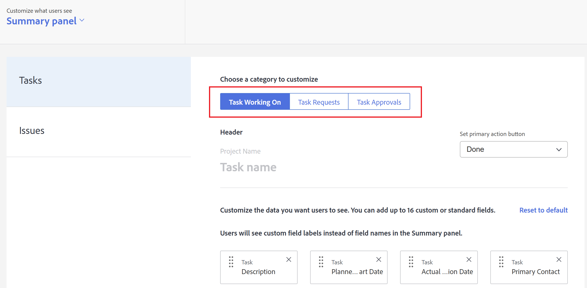

# Anpassen des Bedienfelds Zusammenfassung mithilfe einer Layout-Vorlage

<!--Audited: 11/2024-->

<!--The highlighted information on this page refers to functionality not yet generally available. It is available only in the Preview environment for all customers. After the monthly releases to Production, the same features are also available in the Production environment for customers who enabled fast releases.    

For information about fast releases, see [Enable or disable fast releases for your organization](/help/quicksilver/administration-and-setup/set-up-workfront/configure-system-defaults/enable-fast-release-process.md).    -->

Mit einer Layout-Vorlage können Sie konfigurieren, was Benutzern im Zusammenfassungsbereich angezeigt wird, wenn sie auf eine Aufgabe oder ein Problem klicken. Jede Konfiguration, die Sie mithilfe der folgenden Schritte vornehmen, wirkt sich auf das Bedienfeld Zusammenfassung aus. Diese Anpassungen gelten nicht für das Bedienfeld „Dokumentzusammenfassung“.

Sie können Folgendes konfigurieren:

* Welche Felder für eine Aufgabe oder ein Problem im Bereich Details angezeigt werden und in welcher Reihenfolge
* Ob für eine ausgewählte Aufgabe oder ein ausgewähltes Problem Aktualisierungen, protokollierte Zeit, angehängte Dokumente und Zeitstempel angezeigt werden

Sie können auch die Felder anpassen, die Benutzende im Bereich Startseite sehen, wenn sie auf eine ihnen zugewiesene Projekt-, Dokument- oder Dokumentversionsgenehmigung klicken.

Weitere Informationen über das Bedienfeld Zusammenfassung finden Sie unter [Übersicht](../../../workfront-basics/the-new-workfront-experience/summary-overview.md).

Informationen zum Erstellen von Layout-Vorlagen finden Sie unter [Erstellen und Verwalten von Layout-Vorlagen](../use-layout-templates/create-and-manage-layout-templates.md).

Weitere Informationen zu Layout-Vorlagen für Gruppen finden [ unter „Erstellen und Ändern der Layout-Vorlagen einer Gruppe](../../../administration-and-setup/manage-groups/work-with-group-objects/create-and-modify-a-groups-layout-templates.md).

Nachdem Sie eine Layout-Vorlage konfiguriert haben, müssen Sie sie Benutzern zuweisen, damit die von Ihnen vorgenommenen Änderungen für andere sichtbar sind. Informationen zum Zuweisen einer Layout-Vorlage an Benutzer finden Sie unter [Zuweisen von Benutzern zu einer Layout-Vorlage](../use-layout-templates/assign-users-to-layout-template.md).

## Zugriffsanforderungen

+++ Erweitern Sie , um die Zugriffsanforderungen für die -Funktion in diesem Artikel anzuzeigen.

Sie müssen über folgenden Zugriff verfügen, um die Schritte in diesem Artikel ausführen zu können:

<table style="table-layout:auto"> 
 <col> 
 <col> 
 <tbody> 
  <tr> 
   <td role="rowheader">Adobe Workfront-Plan</td> 
   <td>Beliebig</td> 
  </tr> 
  <tr> 
   <td role="rowheader">Adobe Workfront-Lizenz*</td> 
   <td>
Neu: Standard

  
 Aktuell: Plan

   </td> 
  </tr> 
  <tr> 
   <td role="rowheader">Konfigurationen der Zugriffsebene</td> 
   <td> 
Um diese Schritte auf Systemebene durchzuführen, benötigen Sie die Zugriffsebene „Systemadministrator“.
Um sie für eine Gruppe auszuführen, müssen Sie ein Manager dieser Gruppe sein.
 </td> 
  </tr> 
 </tbody> 
</table>

*Weitere Informationen finden Sie unter [Zugriffsanforderungen in der Dokumentation zu Workfront](/help/quicksilver/administration-and-setup/add-users/access-levels-and-object-permissions/access-level-requirements-in-documentation.md).

+++

## Anpassen des Bedienfelds Zusammenfassung mithilfe einer Layout-Vorlage

1. Beginnen Sie mit der Arbeit an einer Layout-Vorlage, wie unter [Erstellen und Verwalten von Layout-Vorlagen](../../../administration-and-setup/customize-workfront/use-layout-templates/create-and-manage-layout-templates.md) beschrieben.

1. Klicken Sie auf den Abwärtspfeil  unter **Anpassen, was Benutzer sehen** und klicken Sie dann auf **Zusammenfassungsbereich**.

1. Klicken Sie in der unten angezeigten Liste auf den Objekttyp, für den Sie das Bedienfeld Zusammenfassung anpassen möchten.

   In der folgenden Tabelle wird erläutert, was Sie für jedes Objekt anpassen können

   <table style="table-layout:auto"> 
    <col> 
    <col> 
    <tbody> 
     <tr> 
      <td role="rowheader">Aufgaben</td> 
      <td> 
In einer Aufgabenliste wirkt sich diese Einstellung auf das Bedienfeld Zusammenfassung aus, das rechts auf der Seite angezeigt wird, wenn ein(e) Benutzende(r) eine Aufgabe auswählt und dann auf das Symbol Zusammenfassung öffnen .

   
  
 </td> 
     </tr> 
     <tr> 
      <td role="rowheader">Probleme</td> 
      <td>
In einer Liste von Problemen wirkt sich diese Einstellung auf das Bedienfeld Zusammenfassung aus, das rechts auf der Seite angezeigt wird, wenn ein(e) Benutzende(r) ein Problem auswählt und dann auf das Symbol Zusammenfassung öffnen .
 </td> 
     </tr> 
    </tbody> 
   </table>

<!--These were removed with the new Home: 

<tr> 
      <td role="rowheader">Projects</td> 
      <td><ul><li>
In Home, when a user clicks a project approval assigned to them, your configuration for this setting affects the area to the right of the approval.

      
<b>IMPORTANT:</b> 

This is a deprecated feature. Any changes you make to this area are related to a feature that Workfront has removed. This option will be removed from Workfront with a later maintenance update.
</li>
      </ul> 
      </td> 
     </tr> 
     <tr> 
      <td role="rowheader">Documents</td> 
      <td>
     <ul><li>
In Home, when a user clicks a document approval assigned to them, your configuration for this setting affects the area to the right of the approval.

      
<b>IMPORTANT:</b> 

 This is a deprecated feature. Any changes you make to this area are related to a feature that Workfront has removed. This option will be removed from Workfront with a later maintenance update.
</li>
      </ul>
      </td> 
     </tr> 
     <tr> 
      <td role="rowheader">Document Versions</td> 
      <td><ul><li>
In Home, when a user clicks an approval assigned to them for a particular version of a document, your configuration for this setting affects the area to the right of the approval.

      

<b>IMPORTANT:</b>
 This is a deprecated feature. Any changes you make to this area are related to a feature that Workfront has removed. This option will be removed from Workfront with a later maintenance update.
</li>
      </ul>
      </td> 
     </tr> -->

>[!IMPORTANT]
>
>Wenn die Zuweisung einer Aufgabe aufgehoben wird, werden die Feldanpassungen für den Benutzer, der der Layout-Vorlage zugewiesen ist, in der Zusammenfassung nicht angezeigt.

1. (Bedingt) Wenn Sie im vorherigen Schritt auf Aufgaben oder Probleme geklickt haben, wählen Sie die Aufgabenkategorie oder das Problem aus, die bzw. das Sie anpassen möchten.

   

1. (Bedingt) Wenn das Dropdown-Menü **Schaltfläche für primäre Aktion festlegen** angezeigt wird (wenn Sie **Aufgaben** oder **Probleme** in der Liste auf der linken Seite auswählen), klicken Sie auf die primäre Aktion (**Fertig** oder **Status**), die Benutzenden im Zusammenfassungsbereich zur Verfügung stehen soll, wenn sie eine Aufgabe oder ein Problem aufrufen.

   

1. Felder  oder  für den ausgewählten Objekttyp hinzufügen.

   

1. Wiederholen Sie die Schritte 3 bis 6, um das Bedienfeld Zusammenfassung für alle anderen Objekttypen anzupassen.
1. Klicken Sie **Globale Einstellungen** unten links auf und aktivieren oder deaktivieren Sie dann eine der folgenden Optionen in Bezug auf Adobe Workfront-Objekte in der Zusammenfassung:

   <table style="table-layout:auto"> 
    <col> 
    <col> 
    <tbody> 
     <tr> 
      <td role="rowheader">Updates für Arbeiten anzeigen</td> 
      <td>Zeigt alle Aktualisierungen an, die an einer ausgewählten Aufgabe oder einem ausgewählten Problem im Bedienfeld Zusammenfassung vorgenommen wurden. Dazu gehören sowohl Systemaktualisierungen als auch von Benutzenden vorgenommene Aktualisierungen. Benutzer können weiterhin Systemaktualisierungen herausfiltern, wie unter <a href="../../../workfront-basics/updating-work-items-and-viewing-updates/update-work.md#enable" class="MCXref xref">Aktivieren oder Deaktivieren von Systemaktualisierungen</a> in <a href="../../../workfront-basics/updating-work-items-and-viewing-updates/update-work.md" class="MCXref xref">Aktualisierungsarbeit</a> beschrieben.</td> 
     </tr> 
     <tr> 
      <td role="rowheader">Zeit für Arbeit erfassen</td> 
      <td>Zeigt die Option Zeit im Vergleich zur Arbeit protokollieren an, wenn eine Aufgabe oder ein Problem ausgewählt wurde, sodass Benutzende die Zeit für Arbeitselemente direkt über die Bereiche Startseite und Zusammenfassung protokollieren können.</td> 
     </tr> 
     <tr> 
      <td role="rowheader">Anzeigen der mit der Arbeit verbundenen Dokumente</td> 
      <td>Zeigt im Zusammenfassungsbereich einen Dokumentbereich an, wenn eine Aufgabe oder ein Problem ausgewählt wurde, in dem alle an die Aufgabe oder das Problem angehängten Dokumente aufgelistet sind. Benutzer können auf Dokumente klicken, um sie in einem Vorschaufenster anzuzeigen.</td> 
     </tr> 
     <tr> 
      <td role="rowheader">Zeitstempel ausblenden</td> 
      <td>Blendet Zeitstempel für die folgenden Datumsfelder im Zusammenfassungsbereich aus:
       <ul>
        <li>Geplantes Abschlussdatum</li>
        <li>Verpflichtungsdatum</li>
        <li>Gesendet am</li>
       </ul></td> 
     </tr> 
    </tbody> 
   </table>

1. Passen Sie die Layout-Vorlage weiter an.

   Oder

   Wenn Sie mit der Anpassung fertig sind, klicken Sie auf **Speichern**.

Weitere Informationen zu Layout-Vorlagen finden Sie unter [Erstellen und Verwalten von Layout-](../../../administration-and-setup/customize-workfront/use-layout-templates/create-and-manage-layout-templates.md).
