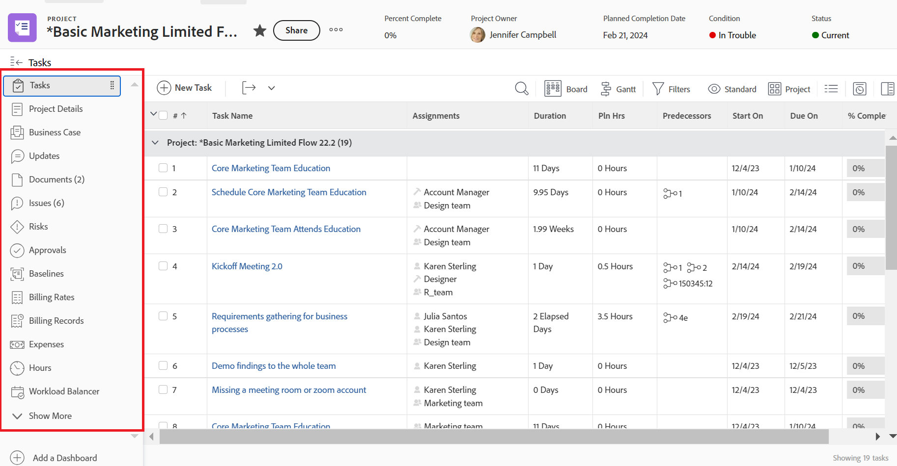

# Anpassen des linken Bedienfelds mithilfe einer Layoutvorlage

In einer Layoutvorlage können Sie anpassen, was Benutzer im linken Fensterbereich sehen [!DNL Adobe Workfront].

Sie können beispielsweise bestimmen, welche der folgenden Elemente Benutzern im linken Bereich angezeigt werden, wenn Sie eine Aufgabe anzeigen:

>[!IMPORTANT]
>
>An der Bestellung und Sichtbarkeit vorgenommene Änderungen werden in der Mobile App übernommen.

Informationen zum Erstellen von Layoutvorlagen finden Sie unter [Erstellen und Verwalten von Layoutvorlagen](../use-layout-templates/create-and-manage-layout-templates.md).

Informationen zu Layoutvorlagen für Gruppen finden Sie unter [Erstellen und Ändern von Gruppenlayoutvorlagen](../../../administration-and-setup/manage-groups/work-with-group-objects/create-and-modify-a-groups-layout-templates.md).

Nachdem Sie eine Layoutvorlage konfiguriert haben, müssen Sie sie Benutzern zuweisen, damit die vorgenommenen Änderungen für andere sichtbar sind. Informationen zum Zuweisen einer Layoutvorlage zu Benutzern finden Sie unter [Benutzer einer Layoutvorlage zuweisen](../use-layout-templates/assign-users-to-layout-template.md).

## Zugriffsanforderungen

Sie müssen über folgenden Zugriff verfügen, um die Schritte in diesem Artikel ausführen zu können:

<table style="table-layout:auto"> 
 <col> 
 <col> 
 <tbody> 
  <tr> 
   <td role="rowheader">[!DNL Adobe Workfront] Plan</td> 
   <td>Beliebig</td> 
  </tr> 
  <tr> 
   <td role="rowheader">[!DNL Adobe Workfront] Lizenz</td> 
   <td>[!UICONTROL Plan]</td> 
  </tr> 
  <tr> 
   <td role="rowheader">Konfigurationen auf Zugriffsebene</td> 
   <td> Um diese Schritte auf Systemebene durchzuführen, benötigen Sie die Zugriffsstufe [!UICONTROL Systemadministrator].
Um sie für eine Gruppe durchzuführen, müssen Sie ein Manager dieser Gruppe sein.
 
<b>NOTE</b>: Wenn Sie noch keinen Zugriff haben, fragen Sie Ihren [!DNL Workfront] Administrator , wenn sie zusätzliche Einschränkungen für Ihre Zugriffsebene festlegen. Für Informationen zur [!DNL Workfront] Administrator kann Ihre Zugriffsebene ändern, siehe <a href="../../../administration-and-setup/add-users/configure-and-grant-access/create-modify-access-levels.md" class="MCXref xref">Benutzerdefinierte Zugriffsebenen erstellen oder ändern</a>.
 </td> 
  </tr> 
 </tbody> 
</table>

## Anpassen des linken Bereichs für einen Bereich in [!DNL Workfront]:

1. Beginnen Sie mit der Arbeit an einer Layoutvorlage, wie beschrieben in [Erstellen und Verwalten von Layoutvorlagen](../../../administration-and-setup/customize-workfront/use-layout-templates/create-and-manage-layout-templates.md).
1. Klicken Sie auf den Abwärtspfeil.  under **[!UICONTROL Anpassen der Ansicht von Benutzern]** und klicken Sie dann auf das linke Bedienfeld, das Sie anpassen möchten.

   >[!NOTE]
   >
   >Informationen zum [!UICONTROL Startseite] in dieser Dropdown-Liste, siehe [Anpassen [!UICONTROL Startseite] und [!UICONTROL Zusammenfassung] Layout-Vorlage verwenden](../../../administration-and-setup/customize-workfront/use-layout-templates/customize-home-summary-layout-template.md). Informationen zur Option Listen finden Sie unter [Anpassen von Filtern, Ansichten und Gruppierungen mithilfe einer Layoutvorlage](../../../administration-and-setup/customize-workfront/use-layout-templates/customize-fvg-list-controls-layout-template.md).

1. Im **[!UICONTROL Linke Leiste]** führen Sie einen der folgenden Schritte aus, um zu bestimmen, was Benutzer im linken Bereich für die Option sehen ([!DNL Workfront] Bereich oder Objekttyp), die Sie ausgewählt haben:

   * Anzeigen  oder ausblenden  Elemente. Beliebiges Element ohne  oder  kann nicht ausgeblendet werden.

   * Elemente ziehen  , um ihre Reihenfolge im linken Bereich zu ändern.
   <table style="table-layout:auto"> 
    <col> 
    <col> 
    <col> 
    <thead> 
     <tr> 
      <th>Option</th> 
      <th>Wenn Benutzer auf Folgendes klicken..</th> 
      <th>Sie sehen die Elemente des linken Bedienfelds, die Sie aus den folgenden Optionen auswählen:</th> 
     </tr> 
    </thead> 
    <tbody> 
     <tr> 
      <td>[!UICONTROL Projekt]</td> 
      <td>Der Name eines Projekts</td> 
      <td>[!UICONTROL Aufgaben], [!UICONTROL Projektdetails], [!UICONTROL Geschäftsfall], [!UICONTROL Updates], [!UICONTROL Dokumente], [!UICONTROL Probleme], [!UICONTROL Risiken], [!UICONTROL Validierungen], [!UICONTROL Grundlinien], [!UICONTROL Abrechnungsraten], [!UICONTROL Abrechnung], Aufzeichnungen UICONTROL Ausgaben], [!UICONTROL Stunden], [!UICONTROL Workload Balancer], [!UICONTROL People], [!UICONTROL Utilization], [!UICONTROL Queue Details], [!UICONTROL Routing Rules], [!UICONTROL Queue Topic], [!UICONTROL Topic Group], [!UICONTROL Metrics]</td> 
     </tr> 
     <tr> 
      <td>[!UICONTROL Task]</td> 
      <td>Der Name einer Aufgabe</td> 
      <td> [!UICONTROL Aktualisierungen], [!UICONTROL Dokumente], [!UICONTROL Aufgabendetails], [!UICONTROL Unteraufgabe], [!UICONTROL Probleme], [!UICONTROL Stunden], [!UICONTROL Genehmigungen], [!UICONTROL Ausgaben], [!UICONTROL Vorgänger]</td> 
     </tr> 
     <tr> 
      <td>[!UICONTROL Problem]</td> 
      <td>Der Name eines Problems</td> 
      <td> [!UICONTROL Aktualisierungen], [!UICONTROL Dokumente], [!UICONTROL Problemdetails], [!UICONTROL Stunden], [!UICONTROL Genehmigungen]</td> 
     </tr> 
     <tr> 
      <td>[!UICONTROL Portfolio]</td> 
      <td>Der Name eines Portfolios</td> 
      <td>[!UICONTROL Projekte], [!UICONTROL Programme], [!UICONTROL Portfolio Details], [!UICONTROL Portfolio] [!UICONTROL Optimierung], [!UICONTROL Dokumente], [!UICONTROL Updates]</td> 
     </tr> 
     <tr> 
      <td>[!UICONTROL Programm]</td> 
      <td>Der Name eines Programms</td> 
      <td>[!UICONTROL Projekte], [!UICONTROL Programmdetails], [!UICONTROL Updates], [!UICONTROL Dokumente]</td> 
     </tr> 
     <tr> 
      <td>[!UICONTROL Vorlage]</td> 
      <td>Der Name einer Projektvorlage</td> 
      <td>[!UICONTROL Vorlagenaufgaben], [!UICONTROL Vorlagendetails], [!UICONTROL Aktualisierungen], [!UICONTROL Dokumente], [!UICONTROL Risiken], [!UICONTROL Ausgaben], [!UICONTROL Personen], [!UICONTROL Genehmigungen], [!UICONTROL Abrechnungsraten], [!UICONTROL Warteschlangendetails], [!UICONTROL Routing Rules],!UICONTROL Warteschlangenthema], [!UICONTROL Themengruppe]</td> 
     </tr> 
     <tr> 
      <td>[!UICONTROL Vorlagenaufgabe]</td> 
      <td>Der Name einer Vorlagenaufgabe</td> 
      <td>[!UICONTROL Aktualisierungen], [!UICONTROL Dokumente], [!UICONTROL Vorlagenaufgaben], [!UICONTROL Unteraufgaben], [!UICONTROL Ausgaben], [!UICONTROL Genehmigungen], [!UICONTROL Vorgänger]</td>
     </tr>
     <!--
      <tr> 
       <td>Document</td> 
       <td>Document Details (for a document uploaded to Workfront)</td> 
       <td>Updates, Approvals, All Versions, Custom Forms</td> 
      </tr>
     --> 
     <tr> 
      <td> [!UICONTROL Rechnungsdatensatz]</td> 
      <td>Der Name eines Abrechnungsdatensatzes für ein Projekt</td> 
      <td>[!UICONTROL Rechnungsdatensätze], [!UICONTROL Rechnungsstunden], [!UICONTROL Rechnungskosten], [!UICONTROL Festeinnahmen]</td> 
     </tr> 
     <tr> 
      <td>[!UICONTROL Projekte]</td> 
      <td>Projekte  im [!UICONTROL Hauptmenü] </td> 
      <td>[!UICONTROL Projekte]</td> 
     </tr> 
     <tr> 
      <td>[!UICONTROL Anforderungen]</td> 
      <td>Der Name einer Anforderung</td> 
      <td>[!UICONTROL Neue Anfrage], [!UICONTROL Gesendete Anfragen], [!UICONTROL Alle Anfragen], [!UICONTROL Entwürfe]</td> 
     </tr> 
     <tr> 
      <td>[!UICONTROL Dashboards]</td> 
      <td>Der Name eines Dashboards</td> 
      <td>[!UICONTROL My Dashboards], [!UICONTROL Shared Dashboards], [!UICONTROL All Dashboards]
<b>NOTE</b>: Wenn Sie benutzerdefinierte Registerkarten für den Bereich [!UICONTROL Berichte] mithilfe einer Layoutvorlage in [!DNL Adobe Workfront Classic], werden sie am Ende dieser Liste angezeigt. Benutzer werden im Bereich [!UICONTROL Dashboards] unten im linken Bereich angezeigt.
 </td> 
     </tr> 
     <tr> 
      <td>[!UICONTROL Scrum Team]</td> 
      <td>Der Name eines Scrum-Teams</td> 
      <td>
[!UICONTROL Iterations], [!UICONTROL Current iteration], [!UICONTROL Backlog], [!UICONTROL Workload Balancer], [!UICONTROL Updates], [!UICONTROL Team Settings]
 
<strong>HINWEIS:</strong> Die <strong>[!UICONTROL Aktuelle Iteration]</strong> -Element wird nur dann im linken Bereich angezeigt, wenn bei der Iteration mindestens eine Aufgabe oder ein Problem vorliegt.
</td> 
     </tr> 
     <tr> 
      <td>[!UICONTROL Kanban Team]</td> 
      <td>Der Name eines Kanban-Teams</td> 
      <td>[!UICONTROL Workload Balancer], [!UICONTROL Kanban Board], [!UICONTROL Backlog], [!UICONTROL Updates], [!UICONTROL Team Settings]</td> 
     </tr> 
     <tr> 
      <td>[!UICONTROL Wasserfallteam]</td> 
      <td>Der Name eines Wasserfallteams</td> 
      <td>[!UICONTROL Workload Balancer], [!UICONTROL Updates], [!UICONTROL Team Requests], [!UICONTROL Team Settings]</td> 
     </tr> 
     <tr> 
      <td>[!UICONTROL Iteration]</td> 
      <td>Der Name einer Iteration</td> 
      <td>[!UICONTROL Meldungen], [!UICONTROL Probleme], [!UICONTROL Meldungsboard], [!UICONTROL Übersicht], [!UICONTROL Custom Forms], [!UICONTROL Updates] </td> 
     </tr> 
     <!--
      <tr> 
       <td>Company</td> 
       <td>The name of the company</td> 
       <td> 
People (cannot be hidden), Billing Rates, Custom Forms 
 </td> 
      </tr>
     --> 
     <!--
      <tr> 
       <td>Timesheets</td> 
       <td>The name of the timesheet</td> 
       <td>My Timesheets, Timesheets I Approve, All Timesheets (cannot be hidden) </td> 
      </tr>
     --> 
     <!--
      <tr> 
       <td>Resourcing</td> 
       <td>The name of the resource</td> 
       <td>Planner (cannot be hidden), Workload Balancer, Utilization, Resource Pools </td> 
      </tr>
     --> 
     <!--
      <tr> 
       <td>User Details</td> 
       <td>____________</td> 
       <td>Details (cannot be hidden), Org Chart, Time Off, Custom Forms </td> 
      </tr>
     --> 
    </tbody> 
   </table>

   >[!NOTE]
   >
   >Die letzten drei Elemente im **[!UICONTROL Anpassen der Ansicht von Benutzern]** Dropdown-Liste ([!UICONTROL Listen], [!UICONTROL Startseite und Zusammenfassung]und [!UICONTROL Branding]) dienen zum Konfigurieren anderer Bereiche als dem linken Bereich. Weitere Informationen finden Sie in diesen Artikeln:
>   >   
* [Anpassen von Filtern, Ansichten und Gruppierungen mithilfe einer Layoutvorlage](../../../administration-and-setup/customize-workfront/use-layout-templates/customize-fvg-list-controls-layout-template.md)
>* [Anpassen [!UICONTROL Startseite] und [!UICONTROL Zusammenfassung] Layout-Vorlage verwenden](../../../administration-and-setup/customize-workfront/use-layout-templates/customize-home-summary-layout-template.md)
* [Adobe von Marken [!DNL Workfront] Layout-Vorlage verwenden](../../../administration-and-setup/customize-workfront/use-layout-templates/brand-wf-using-a-layout-template.md)

1. (Optional) Wenn Sie ein Element des linken Bedienfelds hinzufügen möchten, das mit einem der Dashboards Ihres Unternehmens verknüpft ist, klicken Sie auf **[!UICONTROL Benutzerspezifischen Abschnitt hinzufügen]**, geben Sie einen **[!UICONTROL Titel des benutzerdefinierten Abschnitts]** Fügen Sie für das Element das Dashboard hinzu.

   Dashboard-Elemente werden unten im linken Bereich angezeigt. Benutzer sehen den Titel des von Ihnen eingegebenen benutzerdefinierten Abschnitts neben dem Dashboard-Element, wenn sie den Mauszeiger über das linke Bedienfeld bewegen.

   >[!NOTE]
   >
   Benutzer können benutzerdefinierte Dashboard-Elemente zu ihrem eigenen linken Bereich hinzufügen. Wenn Sie benutzerdefinierte Dashboard-Elemente zu einer Layoutvorlage hinzufügen, werden Ihre Elemente mit ihren Elementen zusammengeführt, ohne sie zu überschreiben oder zurückzusetzen. Dies gilt auch, wenn Sie Benutzer einer neuen Layoutvorlage mit benutzerdefinierten Dashboard-Elementen zuweisen. Informationen dazu, wie Benutzer das linke Bedienfeld anpassen können, finden Sie unter [Erstellen benutzerdefinierter Registerkarten oder Abschnitte](../../../workfront-basics/manage-your-account-and-profile/configuring-your-user-profile/create-custom-tabs.md).

   Weitere Informationen zu Dashboards finden Sie unter [Dashboards](../../../reports-and-dashboards/dashboards/dashboards-overview.md).

1. Fahren Sie mit der Anpassung der Layoutvorlage fort.

   Oder

   Wenn Sie mit der Anpassung fertig sind, klicken Sie auf **[!UICONTROL Speichern]**.

   >[!TIP]
   >
   Sie können auf [!UICONTROL Speichern] Sie können den Fortschritt jederzeit speichern und die Vorlage später ändern.
