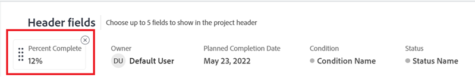

# Anpassen von Objektkopfzeilen mithilfe einer Layout-Vorlage

{{preview-fast-release-general}}

Als Adobe Workfront-Administrator oder Gruppenadministrator können Sie eine Layout-Vorlage verwenden, um die Felder zu konfigurieren, die Benutzende in der Kopfzeile des Objekts sehen, wenn sie die Seite eines Objekts öffnen.

>[!IMPORTANT]
>
>Das Anpassen von Objektkopfzeilen ist derzeit für Projekte, Aufgaben und Probleme verfügbar.

Informationen zum Erstellen von Layout-Vorlagen finden Sie unter [Erstellen und Verwalten von Layout-Vorlagen](../use-layout-templates/create-and-manage-layout-templates.md).

Weitere Informationen zu Layout-Vorlagen für Gruppen finden [&#x200B; unter „Erstellen und Ändern der Layout-Vorlagen einer Gruppe](../../../administration-and-setup/manage-groups/work-with-group-objects/create-and-modify-a-groups-layout-templates.md).

Nachdem Sie eine Layout-Vorlage konfiguriert haben, müssen Sie sie Benutzern zuweisen, damit die von Ihnen vorgenommenen Änderungen für andere sichtbar sind. Informationen zum Zuweisen einer Layout-Vorlage an Benutzer finden Sie unter [Zuweisen von Benutzern zu einer Layout-Vorlage](../use-layout-templates/assign-users-to-layout-template.md).

## Zugriffsanforderungen

+++ Erweitern Sie , um die Zugriffsanforderungen für die -Funktion in diesem Artikel anzuzeigen.

<table style="table-layout:auto"> 
 <col> 
 <col> 
 <tbody> 
  <tr> 
   <td>Adobe Workfront-Paket</td> 
   <td>
Beliebig
</td> 
  </tr> 
  <tr> 
   <td>Adobe Workfront-Lizenz</td> 
   <td>
Standard

       
Plan
</td>
  </tr> 
  </tr> 
  <tr> 
   <td>Konfigurationen der Zugriffsebene</td> 
   <td> 
Um diese Schritte auf Systemebene durchzuführen, benötigen Sie die Zugriffsebene „Systemadministrator“.

        
Um sie für eine Gruppe auszuführen, müssen Sie ein Manager dieser Gruppe sein.
 </td> 
  </tr> 
 </tbody> 
</table>

Weitere Informationen finden Sie unter [Zugriffsanforderungen in der Dokumentation zu Workfront](/help/quicksilver/administration-and-setup/add-users/access-levels-and-object-permissions/access-level-requirements-in-documentation.md).

+++

## Anpassen von Objektkopfzeilen

1. Beginnen Sie mit der Arbeit an einer Layout-Vorlage, wie unter [Erstellen und Verwalten von Layout-Vorlagen](../../customize-workfront/use-layout-templates/create-and-manage-layout-templates.md) beschrieben.
1. Wählen Sie im Dropdown **Menü „Was Benutzer sehen** die Option **Projekte**, **Aufgaben** oder **Probleme**.

   <!--when this will be possible for more than 3 objects, at production, make this more general: update the sentence above to say "select an object you want to customize in the Customize what users see drop-down menu). -->

1. Bewegen Sie [!UICONTROL &#x200B; Mauszeiger im Abschnitt &#x200B;]Kopfzeilenfelder“ über die angezeigten Felder und führen Sie einen der folgenden Schritte aus:
   * Klicken Sie auf das **x**-Symbol, um ein Feld zu entfernen

     Oder

   * Klicken Sie auf das **grab**-Symbol und halten Sie es gedrückt, um das Feld per Drag-and-Drop an eine neue Position zu ziehen.

   <!--(NOTE: make sure the default names of these fields have not changed; otherwise, update screen shot)-->

   

1. Die Kopfzeile eines Objekts kann bis zu fünf Felder enthalten.
Wenn Sie bereits fünf Felder ausgewählt haben, müssen Sie ein Feld entfernen, bevor Sie ein neues hinzufügen können.
1. Beginnen Sie **Feld &quot;** hinzufügen“, den Namen eines nicht bearbeitbaren Workfront-Felds einzugeben, das Sie hinzufügen möchten, und wählen Sie es aus, wenn es in der Liste angezeigt wird. Das Feld wird direkt rechts neben dem Feld Feld Feld hinzufügen hinzugefügt und als erstes Feld in der oberen linken Ecke der Kopfzeile des -Objekts angezeigt.

   >[!TIP]
   >
   >* Sie können nur Felder hinzufügen, die im Bereich Übersicht des Abschnitts Details des Objekts angezeigt werden und nicht bearbeitbar sind. Nicht bearbeitbare Felder sind Felder, die Benutzende nicht manuell bearbeiten können. Sie werden automatisch von Workfront berechnet.
   >
   >* Sie können bearbeitbare Felder hinzufügen, die bereits Teil der Standardkopfzeilen sind (z. B. Projektbesitzer, Status, Prozent abgeschlossen, Zuweisungen).
   >
   >* Wenn Sie das Feld „Gelöst von“ zur Kopfzeile eines Problems hinzufügen, ändert sich das Feld in „Problem, Aufgabe oder Projekt lösen“, wenn mit dem Problem ein Lösungsobjekt verknüpft ist.

   

1. (Optional) Ziehen Sie die Felder in eine andere Reihenfolge.

1. In der Vorschau-Umgebung: Passen Sie die Layout-Vorlage weiter an. Sie können jederzeit auf **Übernehmen** klicken, um Ihren Fortschritt zu speichern.

   ODER

   Wenn Sie mit der Anpassung fertig sind, klicken Sie auf **Speichern und schließen**.

1. In der Produktionsumgebung: Passen Sie die Layout-Vorlage weiter an.

   Oder

   Wenn Sie mit der Anpassung fertig sind, klicken Sie auf **Speichern**.

   >[!TIP]
   >
   >Sie können jederzeit auf **Speichern** klicken, um Ihren Fortschritt zu speichern, und dann später mit dem Ändern der Vorlage fortfahren.
