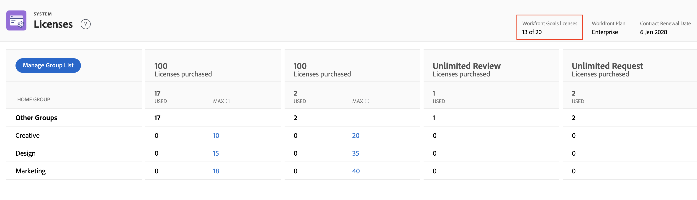
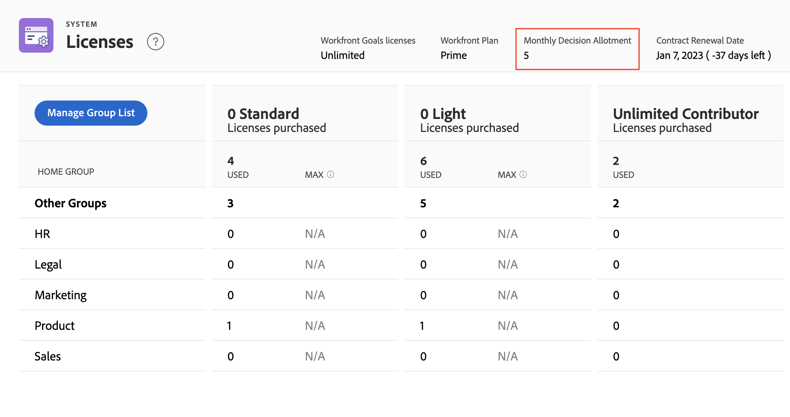

# Verfügbare Lizenzen im System verwalten

<!-- Audited: 12/2023 -->

Als Adobe Workfront-Administrator können Sie auf Informationen zu Ihrem Workfront-Konto zugreifen, einschließlich der Anzahl der für Ihr Unternehmen erworbenen Lizenzen sowie der Anzahl der aktuell verwendeten Lizenzen.

## Zugriffsanforderungen

+++ Erweitern, um die Zugriffsanforderungen für die in diesem Artikel beschriebene Funktionalität anzuzeigen.

<table style="table-layout:auto"> 
 <col> 
 <col> 
 <tbody> 
  <tr> 
   <td role="rowheader">Workfront-Paket</td> 
   <td>
Beliebig
</td> 
  </tr> 
  <tr> 
   <td role="rowheader">Adobe Workfront-Lizenz</td> 
   <td>
Standard
 
Plan
</td> 
  </tr> 
  <tr> 
   <td role="rowheader">Konfigurationen der Zugriffsebene</td> 
   <td>Sie müssen ein Workfront-Administrator sein. </td> 
  </tr> 
 </tbody> 
</table>

Weitere Informationen finden Sie unter [Zugriffsanforderungen in der Dokumentation zu Workfront](/help/quicksilver/administration-and-setup/add-users/access-levels-and-object-permissions/access-level-requirements-in-documentation.md).

>[!NOTE]
>
>Die folgenden Anweisungen gelten für die Pakete Select, Prime und Ultimate .
>
>Für das Paket Auswählen :
>
>1. Systemadministratoren können keine Beschränkungen für Hauptgruppen festlegen.
>2. Systemadministratoren können nur die Gesamtanzahl der Lizenzen sehen, die für alle Hauptgruppen verwendet werden.
>3. Gruppenadministratoren können überhaupt nicht auf die Seite Lizenzen zugreifen.
>
>Für die Prime- und Ultimate-Pakete:
>
>1. Systemadministratoren können der Seite „Lizenzen“ Hauptgruppen hinzufügen, um die Lizenznutzung in diesen Gruppen anzuzeigen, und sie können auch Lizenzbeschränkungen festlegen.
>2. Gruppenadministratoren können auf die Seite Lizenzen zugreifen und die Nutzung von Lizenzen in den von ihnen verwalteten Gruppen anzeigen, die von Systemadministratoren zur Seite Lizenzen hinzugefügt wurden.
>3. Gruppenadministratoren können keine Informationen für andere Hauptgruppen anzeigen oder Höchstwerte hinzufügen.

+++

## Anzeigen der Lizenzen Ihres Unternehmens

Die Anzahl der verwendeten Lizenzen wird automatisch aktualisiert, wenn Sie Benutzenden, die Sie zu Workfront hinzufügen, Zugriffsebenen zuweisen. Weitere Informationen finden Sie unter [Benutzer hinzufügen](../../administration-and-setup/add-users/create-and-manage-users/add-users.md).

So zeigen Sie Lizenzinformationen in Ihrem System an:

{{step-1-to-setup}}

1. Klicken Sie unten im linken Bedienfeld auf **System** > **Lizenzen**.

   Weitere Informationen zu den auf dieser Seite aufgelisteten Lizenzen finden Sie unter [Lizenzen - Übersicht](../../administration-and-setup/add-users/access-levels-and-object-permissions/wf-licenses.md).

   >[!NOTE]
   >
   >Proof-Lizenzen sind nur für Kunden verfügbar, die das kostenpflichtige Workfront Proof-Add-on zusätzlich zu ihrer Workfront-Lizenz erworben haben. Weitere Informationen zu diesem Add-on finden Sie unter [Workfront Proof: Artikelindex](../../workfront-proof/workfront-proof.md).

1. (Bedingt) Wenn Sie die Meldung sehen **Um ein Maximum festzulegen, müssen Sie eine Hauptgruppe hinzufügen**, fügen Sie eine Hauptgruppe in Ihrem System hinzu, wie im Abschnitt [Hinzufügen oder Entfernen einer Hauptgruppe zur Seite Lizenzen](#add-or-remove-a-home-group-to-the-licenses-page) in diesem Artikel beschrieben.

   >[!NOTE]
   >
   >Für die neuen Pläne erlaubt der Auswahlplan den Administratoren nicht, Lizenzen nach Hauptgruppe anzuzeigen. Sie können nur die Gesamtanzahl der verwendeten Lizenzen sehen. Die Prime- und Ultimate-Pläne bieten die Möglichkeit, die maximale Anzahl von Lizenzen pro Hauptgruppe festzulegen.

## Informationen zu Lizenzen für Workfront-Add-ons anzeigen

Wenn Ihr Unternehmen über das kostenpflichtige Workfront Proof-Add-on verfügt, werden die Anzahl der verwendeten Lizenzen und die Anzahl der verfügbaren Lizenzen angezeigt. Beispiel: **5 von 10 Proof** Lizenzen zeigt an, dass das Unternehmen derzeit 5 der 10 von ihm erworbenen Workfront Proof-Lizenzen verwendet.

Wenn Ihr Unternehmen Workfront Goals erworben hat, werden hier auch die Lizenzinformationen für dieses Produkt angezeigt. In diesem Fall können Sie die folgenden Informationen anzeigen:

* Die Gesamtzahl der von Ihrem Unternehmen erworbenen Workfront Goals-Lizenzen
* Die Anzahl der mit Benutzenden verknüpften Workfront Goals-Lizenzen. Dies ist die Anzahl der Benutzerinnen und Benutzer, denen in ihrer Zugriffsebene mindestens Zugriff auf Ziele gewähren muss.

Informationen zu Workfront-Zielen finden Sie unter [Adobe Workfront-Ziele - Übersicht](../../workfront-goals/goal-management/wf-goals-overview.md). Informationen zum Zugriff auf Workfront-Ziele finden Sie unter [Zugriff auf Adobe Workfront-Ziele gewähren](../../administration-and-setup/add-users/configure-and-grant-access/grant-access-goals.md).

>[!NOTE]
>
>Mit Workfront können Sie weitere von Ihnen erworbene Workfront Goals-Lizenzen zuweisen. Wenn Sie jedoch mehr Lizenzen zuweisen, als Ihr Workfront Goals-Vertrag zulässt, setzt sich ein Workfront-Kundenbetreuer mit Ihnen in Verbindung, um Ihnen mitzuteilen, dass Sie Ihre Vertragsnummer überschritten haben.
>

<!--
If an organization has other paid add-on products, their license information also displays here. If the organization doesn't have any paid add-on products, nothing displays here. (Drafted this because not sure this is accurate: Scenario Planner is an add-on product and its licenses are not displayed there.)
-->

>[!TIP]
>
>Benutzende ohne Administratorzugriff können einen Gruppenbericht verwenden, um die Lizenzanzahl anzuzeigen. Erstellen Sie auf der Registerkarte Bericht einen neuen Gruppenbericht und fügen Sie die folgenden Spalten hinzu:
>
>* Lizenztyp-Limit: Worker-Limit
>* Lizenztyp-Limit: Planer-Limit
>
>Weitere Informationen zum Erstellen eines Berichts finden Sie unter [Erstellen eines benutzerdefinierten Berichts](../../reports-and-dashboards/reports/creating-and-managing-reports/create-custom-report.md).

## Informationen zu monatlichen Korrekturabzugs- und Dokumentenentscheidungszuteilungen anzeigen

>[!IMPORTANT]
>
>Die Beschränkungen für Korrekturabzugs- und Dokumententscheidungen gelten nur für Benutzende mit den neuen Lizenzen. Weitere Informationen finden Sie unter [Übersicht über neue Lizenzen](/help/quicksilver/administration-and-setup/add-users/how-access-levels-work/licenses-overview.md).

Korrekturabzugs- und Dokumentenentscheidungen sind auf alle nicht gebührenpflichtigen Workfront-Lizenzen beschränkt. Die Limits werden monatlich pro Benutzer zurückgesetzt.

Die Entscheidungsbeschränkungen für jede Lizenz variieren je nach Plan. Sie können Ihre monatliche Zuteilung unter Setup > Lizenzen einsehen.

Weitere Informationen zu Korrekturabzugs- und Dokumentenentscheidungsbeschränkungen finden Sie unter [Eingeschränkte Dokument- und Korrekturabzugsentscheidung für nicht bezahlte Benutzer - Übersicht](/help/quicksilver/review-and-approve-work/proof-doc-decision-limits.md).

## Hinzufügen oder Entfernen einer Hauptgruppe zur Lizenzseite {#add-or-remove-a-home-group-to-the-licenses-page}

Jeder Benutzer kann nur einer Hauptgruppe zugewiesen werden. Workfront bietet eine gruppenorientierte Lizenzanzahl, indem berechnet wird, wie viele Lizenzen in den einzelnen Hauptgruppen zugewiesen und aktuell verwendet werden.

Wenn die Meldung **Um ein Maximum festzulegen, müssen Sie eine Hauptgruppe hinzufügen** auf der Seite Lizenzen angezeigt wird, müssen Sie mindestens eine Hauptgruppe zur Seite Lizenzen hinzufügen.

>[!IMPORTANT]
>
>* Um Lizenzen mit Hauptgruppen effektiv zu verwalten, empfehlen wir, bestimmte Hauptgruppen für Geschäftseinheiten einzurichten, bevor die maximale Lizenzanzahl aktualisiert wird. Weitere Informationen finden Sie unter [Hauptgruppen - Übersicht](../../administration-and-setup/manage-groups/groups-overview/home-groups.md).
>* Sie können nur Gruppen der obersten Ebene als Hauptgruppen hinzufügen, nicht als Untergruppen. Wenn eine Benutzerin oder ein Benutzer eine Untergruppe als Hauptgruppe zugewiesen hat, wird seine bzw. seine Lizenz zur Lizenzanzahl für die Gruppe der obersten Ebene über dieser Untergruppe hinzugefügt.
>

So fügen Sie der Seite „Lizenzen“ eine Hauptgruppe hinzu oder entfernen diese:

{{step-1-to-setup}}

1. Klicken Sie unten im linken Bedienfeld auf **System** > **Lizenzen**.

1. Klicken Sie **Gruppenliste verwalten**.
1. Geben Sie den Namen der Gruppe der obersten Ebene in das Feld **Hauptgruppen** ein.
1. Um die Gruppe hinzuzufügen, klicken Sie auf ihren Namen, wenn sie angezeigt wird.

   Oder

   Um die Gruppe zu entfernen, klicken Sie auf das X-Symbol rechts neben ihrem Namen.

1. Klicken Sie auf **Speichern**.

Als Workfront-Administrator können Sie die maximale Lizenzanzahl für die Hauptgruppen festlegen, um zu verhindern, dass eine Geschäftseinheit Workfront-Lizenzen verwendet, die für andere Geschäftseinheiten erworben wurden. Anweisungen finden Sie unter [Festlegen der maximalen Lizenzanzahl für eine Hauptgruppe](#set-the-maximum-license-count-for-a-home-group) in diesem Artikel.

## Festlegen der maximalen Lizenzanzahl für eine Hauptgruppe {#set-the-maximum-license-count-for-a-home-group}

Als Workfront-Administrator können Sie die maximale Lizenzanzahl für die Hauptgruppen der Ebene in Ihrem System festlegen. Auf diese Weise können Sie verhindern, dass eine Geschäftseinheit Workfront-Lizenzen verwendet, die für andere Geschäftseinheiten innerhalb Ihres Unternehmens erworben wurden.

Standardmäßig ist die maximale Lizenzanzahl auf „Nicht zutreffend“ festgelegt, was bedeutet, dass es keine Beschränkung gibt.

Gruppenadministratoren können die Anzahl der Lizenzen anzeigen, die ihnen in einer von ihnen verwalteten Hauptgruppe zugewiesen und verwendet wurden. Weitere Informationen finden Sie unter [Anzeigen der Anzahl der zugeordneten und in einer Gruppe verwendeten Lizenzen](../../administration-and-setup/manage-groups/create-and-manage-groups/view-number-licenses-allocated-used-group.md).

So legen Sie die maximale Lizenzanzahl für eine Hauptgruppe fest:

{{step-1-to-setup}}

1. Klicken Sie unten im linken Bedienfeld auf **System** > **Lizenzen**.

1. Suchen Sie die Hauptgruppe in der Liste.
1. Klicken Sie in **Spalte &quot;**&quot; der Gruppe auf den Wert, für den Sie ein Maximum festlegen möchten.
1. Geben Sie die maximale Zahl ein, und drücken Sie dann die Eingabetaste.

   

   >[!NOTE]
   >
   >Geben Sie nicht 0 ein, um den maximalen Lizenzwert einer Gruppe auf den Standardwert zurückzusetzen. Löschen Sie stattdessen die Zahl im Feld . Wenn Sie den maximalen Lizenzwert auf 0 setzen, bedeutet dies, dass dieser Gruppe keine Lizenzen zugewiesen sind.
