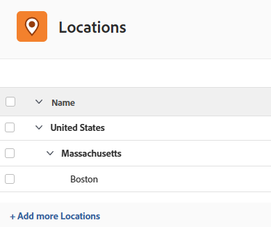

# Konfigurieren von Speicherorten

{{preview-fast-release-general}}

Sie können die verfügbaren Standardspeicherorte konfigurieren, um in Tarifkarten Aufgabengebiete als Attribute zuzuweisen. Dadurch wird sichergestellt, dass die Tarifkarten die Marktpreise an jedem Standort genau widerspiegeln.

Mit Tarifkarten kann Ihr Unternehmen Abrechnungssätze für Projekte einfach verwalten. Weitere Informationen finden Sie unter [Tarifkarten verwalten](/help/quicksilver/administration-and-setup/manage-enterprise-operations/manage-rate-cards.md) und [Tarifattribute definieren](/help/quicksilver/administration-and-setup/manage-enterprise-operations/define-rate-attributes.md).

## Zugriffsanforderungen

+++ Erweitern, um die Zugriffsanforderungen für die in diesem Artikel beschriebene Funktionalität anzuzeigen.

<table style="table-layout:auto"> 
 <col> 
 <col> 
 <tbody> 
  <tr> 
   <td>[!DNL Adobe Workfront] Packstück</td> 
   <td>Workflow Ultimate</td> 
  </tr> 
  <tr> 
   <td>[!DNL Adobe Workfront] Lizenz</td> 
   <td>[!UICONTROL Standard]</td>
  </tr> 
  <tr> 
   <td>Konfigurationen der Zugriffsebene</td> 
   <td>[!UICONTROL Systemadministrator]</td> 
  </tr> 
 </tbody> 
</table>

Weitere Informationen finden Sie unter [Zugriffsanforderungen](/help/quicksilver/administration-and-setup/add-users/access-levels-and-object-permissions/access-level-requirements-in-documentation.md) in der Dokumentation zu Workfront.

+++

## Speicherort hinzufügen

{{step-1-to-setup}}

1. Klicken Sie im linken Bedienfeld auf [!UICONTROL **Standorte**].
1. Klicken Sie in der Produktionsumgebung unten [!UICONTROL **der Liste auf**]Weitere Standorte hinzufügen“.
   Klicken Sie in der Vorschau [!UICONTROL **Umgebung unten**] der Liste auf „Neue Zeile“

1. Geben Sie den Speicherort-Namen und die Beschreibung ein.
1. Klicken Sie außerhalb der Zeile, um den Speicherort zu speichern.
1. Um einen Speicherort in der Produktionsumgebung zu löschen, wählen Sie ihn in der Liste aus und klicken Sie auf das **Löschen**-Symbol .
   Um einen Speicherort in der Vorschau-Umgebung zu löschen, wählen Sie ihn in der Liste aus und klicken [!UICONTROL **in der**] unten auf dem Bildschirm auf „Löschen“

>[!NOTE]
>
>Standorte, die mit Aufgabengebieten auf einer Tarifkarte verknüpft sind, können nicht gelöscht werden.

## Unterspeicherort hinzufügen

Sie können einen Unterspeicherort zu einem vorhandenen Speicherort hinzufügen. Wenn Sie beispielsweise bereits über einen Standort in Großbritannien verfügen, könnte London ein Unterstandort sein.

Drei Ebenen von Unterstandorten sind zulässig. Land, Bundesland oder Provinz sowie Stadt sind gängige Einsatzgebiete von Unterstandorten.

Jeder Unterspeicherort kann auf dieselbe Weise wie ein Standort der obersten Ebene als Attribut auf einer Tarifkarte hinzugefügt werden, um den Tarif für ein bestimmtes Aufgabengebiet an diesem Standort zu definieren.

{{step-1-to-setup}}

1. Klicken Sie im linken Bedienfeld auf [!UICONTROL **Standorte**].
1. Wählen Sie in der Produktionsumgebung einen vorhandenen Speicherort in der Liste aus und klicken Sie auf [!UICONTROL **Unterspeicherort hinzufügen**].
   Wählen Sie in der Vorschau-Umgebung einen vorhandenen Speicherort in der Liste aus und klicken Sie [!UICONTROL **Unterspeicherort hinzufügen**] in der Aktionsleiste am unteren Bildschirmrand.

1. Geben Sie den Speicherort-Namen und die Beschreibung ein.
1. Klicken Sie außerhalb des Eingabebereichs, um den Speicherort zu speichern.

   Die Unterposition wird unter der Position auf der obersten Ebene eingerückt.

   Beispielbild in der Produktionsumgebung:
   

   Beispielbild in der Vorschau-Umgebung:
   

