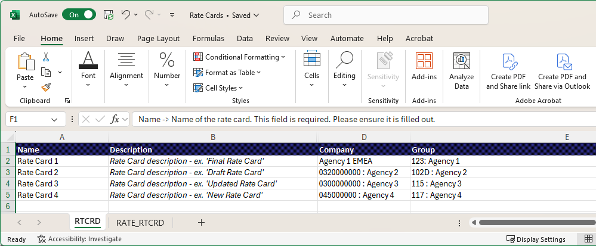

# Importieren von Tarifkarten aus einer Vorlage

Sie können eine Vorlagendatei verwenden, um Ihre Tarifkarten in Excel zu erstellen und sie in Adobe Workfront zu importieren, anstatt alle Aufgabengebiete und Tarife manuell hinzuzufügen.

Um die in diesem Artikel beschriebenen Beispiel-Ratenkarten anzuzeigen, laden Sie die [Beispieldatei](assets/rate-cards-sample.zip) herunter.

Weitere Informationen zu Tarifkarten finden Sie unter [Tarifkarten verwalten](/help/quicksilver/administration-and-setup/manage-enterprise-operations/manage-rate-cards.md).

## Wichtige Regeln für die Arbeit mit der Vorlagendatei

* Geben Sie entweder das Aufgabengebiet ODER die Kategorie der sonstigen Ressource ein, aber nicht beides.
* Die Reihenfolge der Tarifkarten auf der Registerkarte RATE_RTCRD muss mit der Reihenfolge der Karten auf der Registerkarte RTCRD übereinstimmen (1 für den ersten, 2 für den zweiten usw.).
* Das Start- und Enddatum müssen den zulässigen Formaten entsprechen.
* Tarifkarten können ohne Tarife importiert und später aktualisiert werden.
* Benutzerdefinierte Attribute (Agentur, Kostenstelle usw.) können variieren. Fragen Sie Ihren Systemadministrator nach den genauen Anforderungen.
* Gelöschte Zeilen in der Vorlage löschen keine vorhandenen Datensätze im System.

## Zugriffsanforderungen

+++ Erweitern, um die Zugriffsanforderungen für die in diesem Artikel beschriebene Funktionalität anzuzeigen.

<table style="table-layout:auto"> 
 <col> 
 <col> 
 <tbody> 
  <tr> 
   <td>[!DNL Adobe Workfront] Packstück</td> 
   <td>Workflow Ultimate</td> 
  </tr> 
  <tr> 
   <td>[!DNL Adobe Workfront] Lizenz</td> 
   <td>[!UICONTROL Standard]</td> 
  </tr> 
  <tr> 
   <td>Konfigurationen der Zugriffsebene</td> 
   <td>Zugriff auf [!UICONTROL Rate Cards] bearbeiten</td> 
  </tr> 
 </tbody> 
</table>

Weitere Informationen finden Sie unter [Zugriffsanforderungen](/help/quicksilver/administration-and-setup/add-users/access-levels-and-object-permissions/access-level-requirements-in-documentation.md) in der Dokumentation zu Workfront.

+++

## Ausfüllen der Vorlagendatei

{{step-1-to-setup}}

1. Klicken Sie im linken Bedienfeld auf [!UICONTROL **Tarifkarten**].
1. Klicken Sie auf **Neue Tarifkarte** und dann auf **Excel-Vorlage herunterladen**.
1. Befolgen Sie die Anweisungen des Browsers, um die Vorlagendatei auf Ihrem Computer zu speichern.
1. Öffnen Sie die Vorlagendatei in Excel.

   >[!TIP]
   >
   > Speichern Sie die Datei unter einem neuen Namen, wenn Sie die leere Vorlagendatei beibehalten und später erneut verwenden möchten.

   Die Vorlage weist zwei Registerkarten auf. Beide Registerkarten müssen über die richtigen Informationen verfügen, um die Tarifkarten erfolgreich importieren zu können.

   * RTCRD: Tarifkarten definieren (Basisinformationen)
   * RATE_RTCRD: Definieren Sie die detaillierten Tarife für jede Tarifkarte

### Füllen Sie die Registerkarte RTCRD (Rate Card Setup) aus.

Auf dieser Registerkarte können Sie alle Tarifkarten erstellen und auflisten. Jede Zeile stellt eine Tarifkarte dar.

1. Geben Sie die Informationen für eine Tarifkarte in jeder Zeile ein:

   * **Name** (erforderlich): Der Name der Tarifkarte, z. B. „Global Billing 2025“.

     Dieser Name ist die Hauptkennung der Tarifkarte. Jede Tarifkarte muss einen eindeutigen Namen haben.

   * **Beschreibung** (optional): Eine freie Textbeschreibung der Tarifkarte. Hier können Sie Zweck, Umfang oder Gültigkeit beschreiben, z. B. „Gilt für nordamerikanische Projekte“.
   * **Unternehmen** (optional): Dabei kann es sich entweder um den Firmennamen oder die Unternehmens-ID handeln. Beim Import werden beide erkannt.

     Beispiel: Coffesta oder _68c0234e00000541dd8c0757723daa68_

   * **Gruppe** (optional): Dies kann entweder der Gruppenname oder die Gruppen-ID sein. Beim Import werden beide erkannt.

     Beispiel: Marketing oder _68c0234e00000541dd8c0757723daa68_

   * **Benutzerdefinierte Felder** (optional): Sie können zusätzliche Spalten mit benutzerdefinierten Feldnamen hinzufügen, wenn Ihre Umgebung bestimmte Anforderungen hat.

   >[!NOTE]
   >
   >* Sie müssen mindestens den Namen für jede Tarifkarte eingeben.
   >* Jede Tarifkarte erhält automatisch eine Folgenummer basierend auf ihrer Zeilenposition. Beispielsweise lautet die erste von Ihnen definierte Tarifkarte (in Zeile 2) Sequenz 1, die nächste ist 2 usw. Diese Sequenznummern werden auf der Registerkarte RATE_RTCRD zum Anhängen von Raten verwendet.

### Füllen Sie die Registerkarte RATE_RTCRD (Tarife einrichten) aus.

Definieren Sie alle Tarife, die zu den Tarifkarten auf dieser Registerkarte gehören.

Jede Zeile auf der Registerkarte definiert eine bestimmte Rate. Sie können mehrere Tarife unter derselben Tarifkarte erstellen, indem Sie die Reihenfolge der Tarifkarten wiederholen.

Achten Sie darauf, dass sich Datumsangaben nicht überschneiden, es sei denn, dies ist beabsichtigt.

1. Geben Sie die Informationen für einen Tarif in jeder Zeile ein:

   * **Name** (erforderlich): Eine Bezeichnung für die Tarifzeile.

     Es empfiehlt sich, den Namen der Tarifkarte wiederzuverwenden, um Klarheit zu schaffen, z. B. „Globale Abrechnung 2025 - Entwicklerrate“.

   * **Tarifkartenreferenz** (erforderlich): Die Sequenznummer der Tarifkarte, zu der dieser Tarif gehört.

     Wenn die Tarifkarte die erste war, die Sie auf der Registerkarte RTCRD aufgeführt haben (Zeile 2), geben Sie 1 ein. Wenn es die zweite war, geben Sie 2 ein, und so weiter.

   * **Aufgabengebiet** (erforderlich, wenn keine sonstige Ressourcenkategorie verwendet wird): Das Aufgabengebiet, für das der Satz gilt. Dabei kann es sich entweder um den Namen des Aufgabengebiets oder um die Aufgabengebiet-ID handeln. Beim Import werden beide erkannt.

     Beispiel: Designer oder _68c0234e00000541dd8c0757723daa68_

   * **Sonstige Ressourcenkategorie** (erforderlich, wenn das Aufgabengebiet nicht verwendet wird): Die sonstige Ressourcenkategorie, für die der Satz gilt. Dabei kann es sich entweder um den Kategorienamen oder die Kategorie-ID handeln. Beim Import werden beide erkannt.

     Beispiel: Kamera oder _68c0234e00000541dd8c0757723daa68_

     >[!IMPORTANT]
     >
     >Daten können nicht sowohl in den Spalten **Aufgabengebiet** als auch in der Spalte **Sonstige Ressourcenkategorie** eingegeben werden. Eine ist erforderlich.

   * **Startdatum** (optional): Das Datum, an dem der Kurs in Kraft tritt.

     Das Datum muss einem der folgenden Formate entsprechen (je nach Standort): MM/TT/JJJJ, TT/JJJJ, MM/TT/JJJ, MM/TT/JJJ, TT/JJJJ, TT/JJJJ, MM/TT/MM, JJJJ-MM-TT, JJJJJ-TT-MM

     Beispiel: 01/01/2025

     Weitere Informationen finden Sie [Anforderungen an die Datumsformatierung](#date-formatting-requirements) unten.

   * **Enddatum** (optional): Das Datum, an dem der Kurs nicht mehr gültig ist.

     Dieses Datum muss denselben unterstützten Formaten wie das Startdatum folgen.

     Weitere Informationen finden Sie [Anforderungen an die Datumsformatierung](#date-formatting-requirements) unten.

   * **Wert** (optional): Der numerische Wert, z. B. 150. Der Standardwert lautet 0.
   * **Währung** (optional): Die Währung für den Kurs, z. B. USD, EUR, GBP. Der Standardwert ist die Systemwährung.
   * **Gesperrt** (optional): Gibt an, ob die Rate gesperrt ist. Gültige Werte sind True oder False.
   * **Attribute** (optional/benutzerdefiniert): Die letzten Spalten (Agentur, Standort, Kostenstelle usw.) sind Tarifattribute, die sich je nach Kundenkonfiguration unterscheiden. Dies sind anpassbare Felder, die je nach Kundenumgebung variieren können.

     Beispiel: Agentur = „1: Agentur,“ Standort = „Chicago“, Kostenstelle = „22: Kostenstelle“

### Füllen Sie die Registerkarte RALS (Rate Card Alias) aus.

Erstellen Sie alle Aliase auf dieser Registerkarte und listen Sie sie auf. Jede Zeile stellt einen Alias dar.

Wenn die Tarifkarte mit einem Projekt verbunden ist, wird der Alias auf Informationen wie Platzhalterzuweisungen, Ausgaben und Berichten anstelle des Namens des internen Aufgabengebiets angezeigt. Für jede Kombination aus Aufgabengebiet und Attribut innerhalb einer einzigen Tarifkarte kann nur ein Alias vorhanden sein.

Dem System wird ein Alias hinzugefügt, der jedoch nicht mit einem Aufgabengebiet verbunden ist, das auf den Informationen auf dieser Registerkarte basiert.

1. Geben Sie in jeder Zeile den Namen eines Alias ein.

   Geben Sie pro Zeile nur einen Aliasnamen ein: einen Aufgabengebiet-Alias, einen Alias für die sonstige Ressourcenkategorie oder einen Alias für den Ausgabentyp.

### Füllen Sie die Registerkarte RCRMET_RTCRD_RALS (Tarifkarten-Metadaten) aus

Auf dieser Registerkarte können Sie die Verbindungen zwischen Ressourcen und Aliassen für eine bestimmte Tarifkarte definieren.

1. Geben Sie die Informationen in jeder Zeile ein:

   * **Tarifkarte** (erforderlich): Der Name oder die Sequenznummer der Tarifkarte, zu der die Ressource und der Alias gehören. Die Tarifkarte muss auf der Registerkarte RTCRD aufgeführt sein.

     Für eine Sequenznummer: Wenn die Tarifkarte die erste war, die Sie auf der Registerkarte RTCRD aufgeführt haben (Zeile 2), geben Sie 1 ein. Wenn es die zweite war, geben Sie 2 ein, und so weiter.

   * **Aufgabengebiet** (erforderlich, wenn der Ausgabentyp und die sonstige Ressourcenkategorie nicht verwendet werden): Das Aufgabengebiet, mit dem der Alias verbunden ist. Dabei kann es sich entweder um den Namen des Aufgabengebiets oder um die Aufgabengebiet-ID handeln. Beim Import werden beide erkannt.

     Beispiel: Designer oder _68c0234e00000541dd8c0757723daa68_

   * **Ausgabentyp** (erforderlich, wenn Aufgabengebiet und sonstige Ressourcenkategorie nicht verwendet werden): Der Ausgabentyp, mit dem der Alias verbunden ist. Dabei kann es sich entweder um den Namen des Ausgabentyps oder um die Ausgabentyp-ID handeln. Beim Import werden beide erkannt.

     Beispiel: Reise oder _68c0234e00000541dd8c0757723daa68_

   * **Sonstige Ressourcenkategorie** (erforderlich, wenn Aufgabengebiet und Ausgabentyp nicht verwendet werden): Die sonstige Ressourcenkategorie, mit der der Alias verbunden ist. Dabei kann es sich entweder um den Kategorienamen oder die Kategorie-ID handeln. Beim Import werden beide erkannt.

     Beispiel: Kamera oder _68c0234e00000541dd8c0757723daa68_

     >[!IMPORTANT]
     >
     >Sie können nicht alle drei der Spalten **Aufgabengebiet**, **Ausgabentyp** und **Sonstige Ressourcenkategorie** eingeben. Eine ist erforderlich.

   * **Ressourcenalias** Der Alias, der auf der Registerkarte „RSALS“ eingegeben wurde.

### Anforderungen an die Datumsformatierung

Beim Vorbereiten von Tarifkartendaten für den Import müssen Sie sicherstellen, dass die Datumsspalten als **Allgemein** und nicht als **Datum“** sind.

Wenn die Spalten auf das Datumsformat eingestellt sind, kann es vorkommen, dass das System Werte während des Importvorgangs falsch interpretiert, was zu Fehlern oder fehlgeschlagenen Uploads führt. Bei Verwendung des Formats Allgemein wird die numerische oder Textdarstellung des Datums beibehalten, sodass das System die Werte korrekt validieren und anwenden kann.

Die Befolgung dieser Schritte verhindert unnötige Probleme und gewährleistet einen reibungslosen und korrekten Import von Ratendaten.

1. Wählen Sie vor dem Speichern oder Hochladen der Datei die Datumsspalten im Arbeitsblatt aus.
1. Ändern Sie das Spaltenformat in **Allgemein**.
1. Stellen Sie sicher, dass die Werte weiterhin korrekt angezeigt werden (z. B. 01/01/2025 oder 2025-01-01).

## Importieren der Vorlagendatei

{{step-1-to-setup}}

1. Klicken Sie im linken Bedienfeld auf [!UICONTROL **Tarifkarten**].
1. Klicken Sie auf **Neue Tarifkarte** und dann auf **Neue Tarifkarten importieren**.
1. Ziehen Sie Ihre Datei per Drag-and-Drop in das Dialogfeld oder klicken Sie **Excel-Datei auswählen** um zur Datei auf Ihrem Computer zu navigieren.
1. Klicken Sie **Importieren starten**.

   Wenn keine Probleme mit der Datei auftreten, wird eine Bestätigungsmeldung angezeigt und die neuen Tarifkarten werden in der Liste angezeigt.

1. Wenn die Datei Probleme enthält, wird eine Fehlermeldung angezeigt. Klicken Sie auf **Probleme anzeigen**, um die Probleme in einem separaten Bildschirm anzuzeigen.

   Sie müssen die Probleme in der Excel-Datei korrigieren und erneut importieren, bevor die Tarifkarten in Workfront vorhanden sind.

## Vorhandene Tarifkarten aktualisieren

Sie können die Tarife in Ihren bestehenden Tarifkarten mit derselben Excel-Vorlage aktualisieren und diese Änderungen in Workfront hochladen.

{{step-1-to-setup}}

1. Klicken Sie im linken Bedienfeld auf [!UICONTROL **Tarifkarten**].
1. Klicken Sie auf **Neue Tarifkarte** und dann auf **Aktualisierungen der Tarifkarte importieren**.
1. Ziehen Sie Ihre Datei per Drag-and-Drop in das Dialogfeld oder klicken Sie **Excel-Datei auswählen** um zur Datei auf Ihrem Computer zu navigieren.
1. Klicken Sie **Importieren starten**.

   Wenn keine Probleme mit der Datei auftreten, wird eine Bestätigungsmeldung angezeigt und die neuen Tarifkarten werden in der Liste angezeigt.

1. Wenn die Datei Probleme enthält, wird eine Fehlermeldung angezeigt. Klicken Sie auf **Probleme anzeigen**, um die Probleme in einem separaten Bildschirm anzuzeigen.

   Sie müssen die Probleme in der Excel-Datei korrigieren und erneut importieren, bevor die Aktualisierungen der Tarifkarte in Workfront vorhanden sind.

