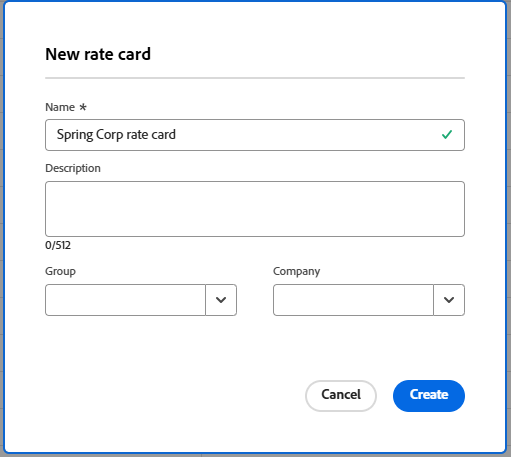

# Verwalten von Tarifkarten

Eine Tarifkarte stellt die vertragliche Vereinbarung mit Ihrem Kunden dar, in der Stundensätze für die Aufgabengebiete definiert sind, die die Arbeit abschließen. In einer Tarifkarte können Sie mehrere Abrechnungssätze pro Aufgabengebiet definieren, die auf Attributen wie Agentur, Standort oder Kostenstelle basieren. Ihre eindeutigen Tarifattribute werden im Bereich Setup konfiguriert. Weitere Informationen finden Sie unter [Definieren von &#x200B;](/help/quicksilver/administration-and-setup/manage-enterprise-operations/define-rate-attributes.md).

Sie könnten beispielsweise für Designer in Paris ein Aufgabengebiet für Agency A, für Agency B ein anderes Designer in Paris und für Agency B ein drittes Designer in New York haben, das keiner Agency zugewiesen ist, die jeweils unterschiedliche Abrechnungssätze aufweisen. Für Aufgabengebiete auf einer Tarifkarte sind jedoch keine Attribute erforderlich. Die Attribute dienen als Werkzeuge zur Festlegung detaillierterer Raten. Ein Abrechnungssatz auf einer Tarifkarte kann auch ein Gültigkeitsdatum sein, sodass der Satz an einem bestimmten Datum beginnt und endet.

Sie können die Sätze auch auf einer Tarifkarte sperren, um zu verhindern, dass sie auf Projekt- oder Aufgabenebene überschrieben werden. Gesperrte Sätze sind die höchsten in der Abrechnungssatz-Hierarchie, mit Ausnahme der für ein Projekt beibehalten Sätze. Weitere Informationen finden Sie unter [Übersicht über Umsatz und Kostenhierarchie](/help/quicksilver/manage-work/projects/project-finances/overview-revenue-cost-hierarchy.md).

## Zugriffsanforderungen

+++ Erweitern, um die Zugriffsanforderungen für die in diesem Artikel beschriebene Funktionalität anzuzeigen.

<table style="table-layout:auto"> 
 <col> 
 <col> 
 <tbody> 
  <tr> 
   <td>[!DNL Adobe Workfront] Packstück</td> 
   <td>Workflow Ultimate</td> 
  </tr> 
  <tr> 
   <td>[!DNL Adobe Workfront] Lizenz</td> 
   <td>[!UICONTROL Standard]</td>
  </tr> 
  <tr> 
   <td>Konfigurationen der Zugriffsebene</td> 
   <td>Zugriff auf [!UICONTROL Rate Cards] bearbeiten</td> 
  </tr> 
  <tr> 
   <td>Objektberechtigungen</td> 
   <td>Um eine Tarifkarte zu bearbeiten, die für Sie freigegeben wurde, müssen Sie über Verwaltungsberechtigungen für die Tarifkarte verfügen.</td> 
  </tr> 
 </tbody> 
</table>

Weitere Informationen finden Sie unter [Zugriffsanforderungen](/help/quicksilver/administration-and-setup/add-users/access-levels-and-object-permissions/access-level-requirements-in-documentation.md) in der Dokumentation zu Workfront.

+++

## Tarifkarte hinzufügen

{{step-1-to-setup}}

1. Klicken Sie im linken Bedienfeld auf [!UICONTROL **Tarifkarten**].
1. Klicken Sie auf [!UICONTROL **Neue Tarifkarte**] und dann auf [!UICONTROL **Neue Tarifkarte erstellen**].
1. Geben Sie einen Namen und eine Beschreibung für die Tarifkarte in das Feld [!UICONTROL **Neue**]&quot; ein.

   Der Name muss eindeutig sein.

   

1. (Optional) Wählen Sie eine [!UICONTROL **Gruppe**] für die Tarifkarte. Das ist die Agentur, die die Tarifkarte definiert.
1. (Optional) Wählen Sie [!UICONTROL **Tarifkarte**] Firma“ aus. Dies ist der Kunde, für den die Preise vertraglich festgelegt sind.

   >[!NOTE]
   >
   >Die Gruppe und die Firma werden nicht nur in den Tarifkartendetails verwendet, sondern auch als Filter, wenn eine Tarifkarte an ein Projekt angehängt wird.

1. Klicken Sie auf **Erstellen**.

   Der Bildschirm Tarifkarte > Aufgabengebiete und Tarife wird angezeigt.

1. Klicken Sie [!UICONTROL **Aufgabengebiet hinzufügen**].
1. Wählen Sie [!UICONTROL **Feld „Neuer Abrechnungssatz**] ein [!UICONTROL **Aufgabengebiet**], um Abrechnungssätze für zu definieren.

   

1. (Optional) Wählen Sie Attribute für den Abrechnungssatz wie Agentur, Standort oder Kostenstelle.

   >[!NOTE]
   >
   >Diese Attribute werden separat definiert und können sich auf Umsatz- und Kostenberechnungen auswirken. Weitere Informationen finden Sie unter [Definieren von &#x200B;](/help/quicksilver/administration-and-setup/manage-enterprise-operations/define-rate-attributes.md).

1. Wählen Sie [!UICONTROL **Abrechnungssatz**] Währung“ aus.
1. (Optional) Geben Sie einen [!UICONTROL **Aufgabengebiet-Alias**] für das Aufgabengebiet ein.

   Wenn der eingegebene Aliasname noch nicht vorhanden ist, können Sie ihn hinzufügen.

   Wenn die Tarifkarte mit einem Projekt verbunden ist, wird der Alias auf Informationen wie Platzhalterzuweisungen, Ausgaben und Berichten anstelle des Namens des internen Aufgabengebiets angezeigt.

   >[!NOTE]
   >
   >* Für jede Kombination aus Aufgabengebiet und Attribut innerhalb einer einzigen Tarifkarte kann nur ein Alias vorhanden sein.
   >* Ein Alias muss auf der Tarifkarte aktualisiert werden und kann nicht für ein Projekt bearbeitet werden.

1. Geben [!UICONTROL **im Feld „Abrechnungssatz**] den Abrechnungssatz für dieses Aufgabengebiet und seine Attribute ein.
1. (Optional) Wählen Sie [!UICONTROL **Sperrrate**] aus, um diese Rate zu sperren und nicht zuzulassen, dass sie auf Projekt- oder Aufgabenebene geändert wird. Sie können sie bei Bedarf später entsperren.
1. (Optional) Klicken Sie auf [!UICONTROL **Gültigkeitsdatum hinzufügen**], um den Abrechnungssatz mit Gültigkeitsdaten zu versehen.
1. (Optional) Klicken Sie [!UICONTROL **erneut auf &quot;**] hinzufügen“, um weitere Abrechnungssätze mit Wirksamkeitsdaten für dieses Aufgabengebiet und seine Attribute hinzuzufügen.
1. (Bedingt) Wenn Sie mehr als einen Abrechnungssatz für dieses Aufgabengebiet hinzufügen, geben Sie die folgenden Informationen ein:

   * [!UICONTROL **Abrechnungssatz**]: Der Wert des Abrechnungssatzes für den Zeitraum.
   * [!UICONTROL **Startdatum**]: Das Datum, an dem der Kurs beginnt.
   * [!UICONTROL **Enddatum**]: Das Datum, an dem der Kurs endet.

     Der erste Abrechnungssatz muss kein Startdatum haben, und der letzte Abrechnungssatz muss kein Enddatum haben. Datumslücken zwischen den Sätzen sind zulässig, Datumsüberschneidungen sind jedoch nicht zulässig. Während einer Lücke werden andere Bereiche der Verrechnungssatz-Hierarchie verwendet, um den Verrechnungssatz basierend auf dem Umsatztyp einer Aufgabe zu bestimmen. Weitere Informationen finden Sie unter [Übersicht über Umsatz und Kostenhierarchie](/help/quicksilver/manage-work/projects/project-finances/overview-revenue-cost-hierarchy.md).

1. Klicken Sie auf [!UICONTROL **Speichern**].
1. (Optional) Um einen weiteren Abrechnungssatz hinzuzufügen, entweder für dasselbe Aufgabengebiet mit unterschiedlichen Attributen oder für ein anderes Aufgabengebiet, klicken Sie auf [!UICONTROL **Aufgabengebiet hinzufügen**].

   Die Tarife für jede Funktion werden bei der Erstellung der Tarifkarte hinzugefügt. Der derzeit gültige Kurs, basierend auf den Datumsangaben, wird mit einem Symbol  gekennzeichnet.

   

## Details und Tarife der Tarifkarte bearbeiten

{{step-1-to-setup}}

1. Klicken Sie im linken Bedienfeld auf [!UICONTROL **Tarifkarten**].
1. Um eine vorhandene Tarifkarte zu bearbeiten, klicken Sie auf den Namen der Tarifkarte in der Liste Tarifkarten .
1. Um die Details der Tarifkarte zu aktualisieren, klicken [!UICONTROL **im linken**] auf „Details“.
1. (Optional) Um ein benutzerdefiniertes Formular an die Tarifkarte anzuhängen, klicken Sie auf das Feld [!UICONTROL **Benutzerdefiniertes Formular hinzufügen**] in der oberen rechten Ecke der Detailseite und wählen Sie ein benutzerdefiniertes Formular aus der angezeigten Liste aus.

   Weitere Informationen zum Anhängen eines benutzerdefinierten Formulars finden Sie unter [Hinzufügen eines benutzerdefinierten Formulars zu einem Objekt](/help/quicksilver/workfront-basics/work-with-custom-forms/add-a-custom-form-to-an-object.md).

1. Klicken Sie [!UICONTROL **Änderungen speichern**] nachdem Sie die Tarifkartendetails bearbeitet haben.
1. Klicken Sie [!UICONTROL **linken Bedienfeld auf**] Aufgabengebiete und Tarife“, um die Abrechnungssätze zu bearbeiten.
1. Um eine Rate zu bearbeiten, aktivieren Sie das Kontrollkästchen neben der Rate und klicken Sie [!UICONTROL **Bearbeiten**] in der Aktionsleiste am unteren Bildschirmrand.

   Weitere Informationen über die Aktionsleiste finden Sie unter [Verwenden erweiterter Listen](/help/quicksilver/workfront-basics/navigate-workfront/use-lists/enhanced-lists.md).

   >[!NOTE]
   >
   >Da jeder Satz mit der Kombination aus Funktion und Attributen verknüpft ist, um einen eindeutigen Satz zu erstellen, können die Funktion und die Attribute beim Bearbeiten eines Satzes nicht geändert werden.

1. Um einen Abrechnungssatz aus der Tarifkarte zu löschen, aktivieren Sie das Kontrollkästchen neben dem Satz und klicken Sie in der Aktionsleiste [!UICONTROL **Löschen**].
1. Um eine Rate zu sperren, aktivieren Sie das Kontrollkästchen neben der Rate und klicken Sie in [!UICONTROL **Aktionsleiste**] Sperren“.

   Gesperrte Tarife können nicht auf Projekt- oder Aufgabenebene geändert werden. Neben Gesperrte Tarife in der Liste wird ein Sperrsymbol angezeigt.

   Sie können eine gesperrte Rate auch über die Aktionsleiste entsperren.

1. Gehen Sie wie folgt vor, um die Sätze um einen Prozentsatz anzupassen:

   1. Wählen Sie auf dem Bildschirm Tarifkarte > Aufgabengebiete und Tarife alle Tarife aus, die Sie anpassen möchten.

      Sie können einen Tarif oder mehrere Tarife auswählen. Alle werden um denselben Prozentsatz angepasst.

   1. Klicken Sie [!UICONTROL **der Aktionsleiste auf**] Abrechnungssätze anpassen“.
   1. Wählen [!UICONTROL **im Feld Abrechnungssätze für Aufgabengebiete anpassen**] aus, ob die Abrechnungssätze für den ausgewählten Zeitraum (die vorhandenen Gültigkeitsdaten) oder für einen benutzerdefinierten Datumsbereich, den Sie definieren, angepasst werden sollen.

      

   1. Geben Sie den Anpassungswert für die Kurse ein.

      Dieser Wert wird als Prozentsatz angewendet. Wenn Sie beispielsweise 10 eingeben, erhöhen sich die ausgewählten Raten um 10 %.

   1. Klicken Sie [!UICONTROL **Tarife aktualisieren**].
   1. Klicken [!UICONTROL **auf**] Bestätigungsmeldung.

      Die ausgewählten Raten werden um den Prozentsatz erhöht.

## Tarifkarte importieren

Siehe den Artikel [Importieren von Tarifkarten aus einer Vorlage](/help/quicksilver/administration-and-setup/manage-enterprise-operations/import-rate-cards.md).

## Tarifkarte kopieren

{{step-1-to-setup}}

1. Klicken Sie im linken Bedienfeld auf [!UICONTROL **Tarifkarten**].
1. Aktivieren Sie das Kontrollkästchen neben der Tarifkarte in der Liste und klicken Sie auf das **Kopieren**-Symbol .
1. Geben Sie in das Feld „Tarifkarte kopieren [!UICONTROL **einen Namen für**] neue Tarifkarte ein. Klicken Sie dann auf [!UICONTROL **Erstellen**].

   Die neue Tarifkarte wird gespeichert. Bearbeiten Sie die Details der Tarifkarte, Aufgabengebiete und Tarife nach Bedarf.

## Gesamte Tarifkarte löschen

{{step-1-to-setup}}

1. Klicken Sie im linken Bedienfeld auf [!UICONTROL **Tarifkarten**].
1. Aktivieren Sie das Kontrollkästchen neben der Tarifkarte in der Liste und klicken Sie auf das **Löschen**-Symbol .

   >[!NOTE]
   >
   >Eine Tarifkarte, die an ein Projekt angehängt ist, wird aus dem Projekt gelöscht.

