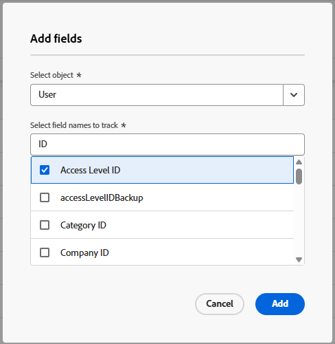

# Änderungsverlauf anzeigen und verwalten

{{preview-fast-release-general}}

Sie können den Änderungsverlauf, einschließlich der Auditprotokolle, im Bereich „Änderungsverfolgung“ von Setup einsehen.

* **Auditprotokolle** sind Änderungen, die von Benutzern ausgelöst werden.
Weitere Informationen zu Auditprotokollen und zum Bereich Auditprotokolle finden Sie unter [Übersicht über Auditprotokolle](/help/quicksilver/administration-and-setup/add-users/create-and-manage-users/audit-logs.md) und [Auditprotokolle anzeigen und exportieren](/help/quicksilver/administration-and-setup/add-users/create-and-manage-users/view-and-export-audit-logs.md).
* **Konfiguration** zeigt an, welche Felder für die Änderungsverlaufsliste verfolgt werden.
  Als Workfront-Administrator können Sie konfigurieren, welche Objektfelder und Aktionen Workfront verfolgt. Sie können beispielsweise Workfront alle Änderungen nachverfolgen lassen, die Benutzer an den Namen von Problemen im gesamten System vornehmen. Jede Änderung des Problemnamens wird dann als Eintrag im Änderungsprotokoll angezeigt.

* **Liste der**: Ermöglicht die Anzeige eines Protokolls mit Änderungen an Workfront-Objekten, einschließlich Attributen wie:

  * Objekt
  * Objekttyp
  * Art der Änderung (Vorgang)
  * Source der Änderung, z. B. bestimmte Benutzende, APIs, Workfront Fusion, KI-LLMs oder das Workfront-System

  Die Workflow-Aktivität „Einheitliche Überprüfung und Genehmigung“ wird im Änderungsverlauf erfasst, einschließlich Teilnehmern und Entscheidungen.

## Zugriffsanforderungen

+++ Erweitern, um die Zugriffsanforderungen für die in diesem Artikel beschriebene Funktionalität anzuzeigen.

<table style="table-layout:auto"> 
 <col> 
 <col> 
 <tbody> 
  <tr> 
   <td>[!DNL Adobe Workfront] Packstück</td> 
   <td>Beliebig</td> 
  </tr> 
  <tr> 
   <td>[!DNL Adobe Workfront] Lizenz</td> 
   <td>[!UICONTROL Standard]</td> 
  </tr> 
  <tr> 
   <td>Konfigurationen der Zugriffsebene</td> 
   <td>
Systemadministrator

       
So zeigen Sie den Änderungsverlauf an: Administratorzugriff auf den Änderungsverlauf

       
So konfigurieren Sie getrackte Felder: Systemadministrator
</td> 
  </tr> 
 </tbody> 
</table>

Weitere Informationen finden Sie unter [Zugriffsanforderungen](/help/quicksilver/administration-and-setup/add-users/access-levels-and-object-permissions/access-level-requirements-in-documentation.md) in der Dokumentation zu Workfront.

+++

## Felder hinzufügen, die verfolgt werden sollen

{{step-1-to-setup}}

1. Klicken Sie im linken Bedienfeld auf **Tracking ändern > Konfiguration**.
1. Klicken Sie im Konfigurationsbildschirm auf **Feld hinzufügen**.
1. Wählen **im Feld „Felder**&quot; ein Objekt aus. Sie können mit der Eingabe des Objektnamens beginnen und ihn dann auswählen, wenn er in der Liste angezeigt wird.
1. Wählen Sie als Nächstes die Feldnamen aus, die Sie für dieses Objekt verfolgen möchten. Sie können den Feldnamen eingeben und dann auswählen, wenn er in der Liste angezeigt wird.

   Für das Objekt sind sowohl benutzerdefinierte Felder als auch native Felder verfügbar.
   Bereits getrackte Felder werden wie in der Liste ausgewählt angezeigt.

   

1. Nachdem Sie alle Felder ausgewählt haben, die Sie nachverfolgen möchten, klicken Sie auf **Hinzufügen**.

   Die Felder werden der Liste Getrackte Felder hinzugefügt.

## Felder entfernen, die nicht mehr verfolgt werden sollen

Sie können Felder entfernen, die das System nicht für einen bestimmten Objekttyp über die Workfront-Benutzeroberfläche verfolgen soll.

{{step-1-to-setup}}

1. Klicken Sie im linken Bedienfeld auf **Tracking ändern > Konfiguration**.
1. Wählen Sie im Konfigurationsbildschirm das Feld bzw. die Felder aus, die Sie nicht mehr verfolgen möchten.

   Möglicherweise wird derselbe Feldname mehrmals angezeigt. Die Felder werden nach Objekt gruppiert, sodass Sie das richtige Feld finden können. Sie können auch das Suchfeld oben auf dem Bildschirm verwenden.

1. Wählen **Löschen** in der Aktionsleiste am unteren Bildschirmrand aus.
1. Klicken Sie **der Bestätigungsmeldung** Entfernen“.

   Die Felder werden aus der Liste Getrackte Felder entfernt.

## Anzeigen des Konfigurationsbereichs für die Änderungsnachverfolgung

>[!NOTE]
>
>In der Produktionsumgebung ist die Konfiguration derzeit nur als Information verfügbar und kann nicht geändert werden. Die Möglichkeit, zu ändern, welche Felder verfolgt werden, wird in naher Zukunft verfügbar sein.

So zeigen Sie die verfolgten Änderungstypen an:

{{step-1-to-setup}}

1. Klicken Sie im linken Bedienfeld auf **Tracking ändern >** Konfiguration**.

   Die Felder werden nach Objekttyp gruppiert angezeigt.

1. Um Felder unter einem bestimmten Objekt anzuzeigen, klicken Sie auf den Dropdown-Pfeil neben dem Objekttyp.

## Anzeigen des Änderungsverlaufs

Workfront-Administratoren können den Änderungsverlauf im Bereich „Setup“ anzeigen.

Die Liste „Änderungsverlauf“ ist eine erweiterte Liste und enthält Filter, Spalten, Zeilenhöhe, eine Datumsauswahl und eine Suchleiste.

{{step-1-to-setup}}

1. Klicken Sie im linken Bedienfeld auf **Tracking ändern > Verlaufsliste**.

   Die Liste „Änderungsverlauf“ wird geöffnet.

1. Um die Datumsangaben anzupassen, für die Änderungen angezeigt werden, klicken Sie auf die Datumsauswahl und wählen Sie die neuen Datumsangaben aus.

   Änderungen sind für die letzten 90 Tage verfügbar.

1. Um nach einem bestimmten Begriff zu suchen, klicken Sie auf die Suchleiste und geben Sie den Begriff ein. Die Ergebnisse werden bei der Eingabe in der Liste hervorgehoben.
1. (Optional) Informationen zum Filtern nach einer Spalte finden Sie unter [Filtern von Elementen in einer erweiterten Liste](/help/quicksilver/workfront-basics/navigate-workfront/use-lists/enhanced-lists.md#filter-items-in-an-enhanced-list) im Artikel [Verwenden erweiterter Listen](/help/quicksilver/workfront-basics/navigate-workfront/use-lists/enhanced-lists.md).
1. (Optional) Informationen zum Ausblenden, Anzeigen oder Neuanordnen von Spalten finden Sie unter [Spalten anpassen](/help/quicksilver/workfront-basics/navigate-workfront/use-lists/enhanced-lists.md#customize-columns) im Artikel [Verwenden erweiterter Listen](/help/quicksilver/workfront-basics/navigate-workfront/use-lists/enhanced-lists.md).
1. (Optional) Informationen zum Hinzufügen oder Entfernen von Spalten finden Sie unter [Hinzufügen und Entfernen von Spalten mit ](/help/quicksilver/workfront-basics/navigate-workfront/use-lists/enhanced-lists.md#add-and-remove-columns-with-the-column-manager) Spaltenmanager“ im Artikel [Verwenden erweiterter Listen](/help/quicksilver/workfront-basics/navigate-workfront/use-lists/enhanced-lists.md).
1. (Optional) Informationen zum Anpassen der Zeilenhöhe finden Sie unter [Ändern der Zeilenhöhe in einer Ansicht](/help/quicksilver/workfront-basics/navigate-workfront/use-lists/enhanced-lists.md#change-the-row-height-in-a-view) im Artikel [Verwenden erweiterter Listen](/help/quicksilver/workfront-basics/navigate-workfront/use-lists/enhanced-lists.md).

## Änderungsverlauf exportieren

{{step-1-to-setup}}

1. Klicken Sie im linken Bedienfeld auf **Tracking ändern > Verlaufsliste**.
1. Filtern Sie die Liste, um die zu exportierenden Elemente anzuzeigen.
1. Klicken Sie auf **Export**-Symbol  und wählen Sie aus, ob Sie im XLSX- oder CSV-Format speichern möchten.

   Das Feld Datei speichern wird geöffnet, und Sie können die exportierte Datei auf Ihrem Computer speichern.
   Speichern der exportierten Datei beenden Sie können ihn jetzt auf Ihrem Computer finden und für andere freigeben.

