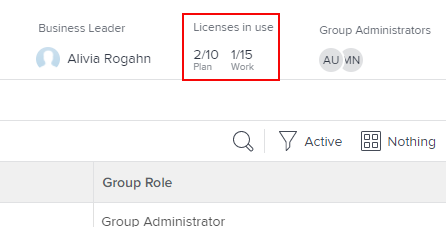
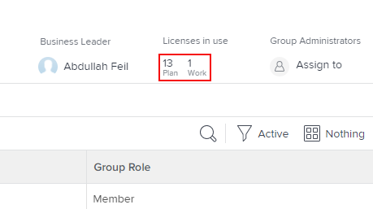
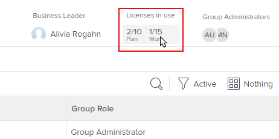
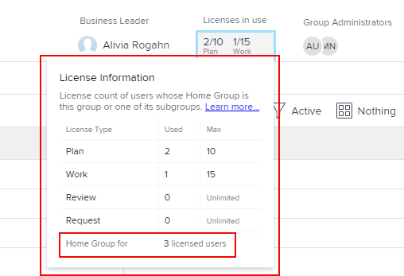

# Anzahl der zugeordneten und in einer Gruppe verwendeten Lizenzen anzeigen

Als Adobe Workfront-Administrator können Sie die Anzahl der einzelnen Lizenztypen anzeigen, die derzeit in Ihrer Gruppe und ihren Untergruppen verwendet werden. Dies ist nützlich, wenn Sie beurteilen müssen, ob Lizenzen neu verteilt werden sollen.

Wenn es Gruppen oberhalb der von Ihnen verwalteten Gruppe gibt, können deren Administratoren dies auch für Ihre Gruppe tun. Dasselbe gilt für Workfront-Administratoren (für jede Gruppe).

>[!IMPORTANT]
>
>Die Lizenz eines/r Benutzenden wird nur dann in einer bestimmten Gruppe gezählt, wenn es sich bei der Gruppe um die Hauptgruppe des/r Benutzenden handelt.

## Zugriffsanforderungen

+++ Erweitern, um die Zugriffsanforderungen für die in diesem Artikel beschriebene Funktionalität anzuzeigen.

<table style="table-layout:auto"> 
 <col> 
 <col> 
 <tbody> 
  <tr> 
   <td>Adobe Workfront-Paket</td> 
   <td>
Beliebig
</td> 
  </tr> 
  <tr> 
   <td>Adobe Workfront-Lizenz</td> 
   <td>
Standard

       
Abo
</td>
  </tr>
  <tr> 
   <td>Konfigurationen der Zugriffsebene</td> 
   <td>Sie müssen Gruppenadministrator der Gruppe oder Systemadministrator sein.</td>
  </tr>
 </tbody> 
</table>

Weitere Informationen finden Sie unter [Zugriffsanforderungen](/help/quicksilver/administration-and-setup/add-users/access-levels-and-object-permissions/access-level-requirements-in-documentation.md) in der Dokumentation zu Workfront.

+++

## Anzahl der in einer Gruppe verwendeten Lizenzen anzeigen

{{step-1-to-setup}}

1. Klicken Sie im linken Bereich auf **Gruppen** .

1. Klicken Sie auf den Namen der Gruppe.
1. Zeigen Sie auf der angezeigten Seite im Kopfzeilenbereich oben rechts den Bereich **Verwendete Lizenzen** an, um die Anzahl der **Plan** und **Work**-Lizenzen anzuzeigen.

   Wenn Sie eine Gruppe der obersten Ebene anzeigen und der Workfront-Administrator eine Höchstzahl jedes Lizenztyps für die Gruppe definiert hat, werden diese Zahlen ebenfalls angezeigt. In der folgenden Gruppe können beispielsweise maximal 10 Benutzende über eine Planlizenz und 15 über eine Arbeitslizenz verfügen:

   

   Informationen dazu, wie Workfront-Admins die maximale Anzahl zugewiesener Lizenzen für eine Gruppe definieren, finden Sie im Abschnitt [Festlegen der maximalen Lizenzanzahl für eine Hauptgruppe](../../../administration-and-setup/get-started-wf-administration/manage-available-licenses-in-your-system.md#set) im Artikel [Verwalten verfügbarer Lizenzen in Ihrem System](../../../administration-and-setup/get-started-wf-administration/manage-available-licenses-in-your-system.md).

   >[!NOTE]
   >
   >Wenn es sich bei der gewünschten Gruppe um eine Untergruppe handelt, können Sie nur die Anzahl der verwendeten Lizenzen und nicht die maximale Anzahl der für die Gruppe zugewiesenen Lizenzen anzeigen. Dies liegt daran, dass Workfront-Admins keine maximale Lizenzanzahl für eine Untergruppe definieren.
   >
   >
   >

1. Für eine separate Zählung der einzelnen Lizenztypen, die derzeit in der Gruppe verwendet werden (einschließlich Überprüfung und Anfrage), klicken Sie auf den Textbereich direkt unter **Verwendete Lizenzen:**

   

   Das angezeigte Feld enthält dieselben Informationen für alle vier Workfront-Lizenztypen: Plan, Arbeit, Überprüfung und Anfrage. Unten im Feld sehen Sie die Gesamtzahl der Lizenzen, die von den Mitgliedern dieser Gruppe oder einer ihrer Untergruppen verwendet werden:

   

   Bei Prüfungs- und Anfragelizenzen wird in der Spalte Maximal immer Unbegrenzt angezeigt.
