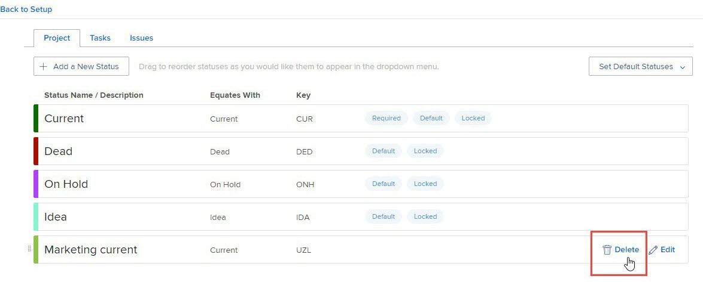

# Löschen eines Gruppenstatus

Als Gruppenadministrator können Sie einen Status für eine von Ihnen verwaltete Gruppe löschen, wenn diese nicht als erforderlicher oder gesperrter Status auf Systemebene oder für eine höhere Gruppe in der Hierarchie konfiguriert ist.

Wenn es Gruppen über der von Ihnen verwalteten Gruppe gibt, können deren Administratoren dies auch für Ihre Gruppe tun. Dasselbe gilt für Workfront-Administratoren (für jede Gruppe).

>[!NOTE]
>
>Folgendes kann nicht gelöscht werden:
>
>* Die integrierte Statusplanung, &quot;Aktuell&quot;und &quot;Abgeschlossen&quot;. Sie können ihre Namen aktualisieren, ihre Farben bearbeiten und sperren oder entsperren, sie können jedoch nicht gelöscht werden.
>* Status, bei denen die Genehmigung für mindestens ein mit der Gruppe oder einer ihrer Untergruppen verknüpftes Objekt ausstehend ist.

## Zugriffsanforderungen

Sie müssen über Folgendes verfügen, um die Schritte in diesem Artikel durchzuführen:

<table style="table-layout:auto"> 
 <col> 
 <col> 
 <tbody> 
  <tr> 
   <td role="rowheader">Workfront-Plan*</td> 
   <td>Beliebig</td> 
  </tr> 
  <tr> 
   <td role="rowheader">Adobe Workfront-Lizenz*</td> 
   <td> 
Plan 
 
Sie müssen Gruppenadministrator der Gruppe oder Workfront-Administrator sein. Weitere Informationen finden Sie unter <a href="../../../administration-and-setup/manage-groups/group-roles/group-administrators.md" class="MCXref xref">Gruppenadministratoren</a> und <a href="../../../administration-and-setup/add-users/configure-and-grant-access/grant-a-user-full-administrative-access.md" class="MCXref xref">Gewähren eines vollen Administratorzugriffs</a>.
 </td> 
  </tr> 
 </tbody> 
</table>

&#42;Wenn Sie herausfinden möchten, welchen Plan oder welchen Lizenztyp Sie haben, wenden Sie sich an Ihren Workfront-Administrator.

## Löschen eines Gruppenstatus

1. Klicken Sie auf **Hauptmenü** icon  Klicken Sie oben rechts in Adobe Workfront auf **Einrichtung** .

1. Klicken Sie im linken Bereich auf **Gruppen**.
1. Klicken Sie auf den Namen der Gruppe der obersten Ebene.
1. Klicken Sie im linken Bereich auf **Status**.
1. Bewegen Sie in der Liste der angezeigten Status den Mauszeiger über den zu löschenden Status und klicken Sie auf **Löschen** wenn es ganz rechts erscheint.

   

1. Wählen Sie in dem angezeigten Feld einen Status aus, um einen Ersetzungsstatus für Objekte (Projekte, Aufgaben, Probleme und Genehmigungsprozesse) festzulegen, die den Status verwenden, den Sie löschen möchten.

   Es sind nur Status verfügbar, die dem Status entsprechen, den Sie löschen. Wenn Sie beispielsweise einen Status löschen, der mit &quot;Aktuell&quot;übereinstimmt, können Sie nur Status sehen, die mit &quot;Aktuell&quot;übereinstimmen.

   Außerdem hängen die angezeigten Status davon ab, ob der zu löschende Status entsperrt oder gesperrt ist:

   * **Wenn sie entsperrt ist**: Es sind nicht ausgeblendete, gesperrte und entsperrte Status verfügbar.

      Neben den Status, die für die Untergruppe erstellt wurden, werden auch Status berücksichtigt, die von Gruppen der Systemebene und der oberen Ebene übernommen wurden.

   * **Wenn sie gesperrt ist**: Einer der folgenden Punkte ist wahr:

      * Wenn es andere gesperrte, nicht ausgeblendete Status gibt, sind nur diese verfügbar.
      * Wenn kein gesperrter, nicht ausgeblendeter Status vorhanden ist, ist der standardmäßige Workfront-Status verfügbar, auch wenn er ausgeblendet oder entsperrt ist.

         Informationen zu den standardmäßigen Workfront-Status finden Sie unter [Zugriff auf die Liste der Systemprojektstatus](../../../administration-and-setup/customize-workfront/creating-custom-status-and-priority-labels/project-statuses.md), [Zugriff auf die Liste der Systemaufgabenstatus](../../../administration-and-setup/customize-workfront/creating-custom-status-and-priority-labels/task-statuses.md)und die Informationen zu den 4 erforderlichen Problemstatus in [Zugriff auf die Liste der Systemfehlerstatus](../../../administration-and-setup/customize-workfront/creating-custom-status-and-priority-labels/issue-statuses.md).

1. Klicken **Status löschen**.

   Wenn der gelöschte Status der Standardstatus für diesen Typ in der Gruppe war, wird der Ersetzungsstatus übernommen.

   Wenn der gelöschte Status in den Projektvoreinstellungen als Standardprojektstatus festgelegt wurde, wird die Voreinstellung jetzt auf den Ersetzungsstatus gesetzt.

## Beim Löschen einer Gruppe

Wenn eine Gruppe gelöscht und durch eine andere Gruppe ersetzt wird, werden alle eindeutigen Status, die die gelöschte Gruppe hatte, zum Status der Ersatzgruppe hinzugefügt. Weitere Informationen finden Sie unter [Benutzerdefinierte Status in einer Gruppe, die verschoben oder gelöscht wird](../../../administration-and-setup/manage-groups/manage-group-statuses/custom-statuses-in-group-moved-or-deleted.md).
