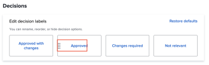

# Konfigurieren der Standardeinstellungen für Korrekturabzüge

Mit diesen Einstellungen können Sie Standardwerte festlegen, die für alle von Ihren Benutzern erstellten neuen Korrekturabzüge gelten. Benutzer können jedoch die meisten dieser Einstellungen beim Erstellen eines Korrekturabzugs überschreiben.

## Zugriffsanforderungen

+++ Erweitern Sie , um die Zugriffsanforderungen für die -Funktion in diesem Artikel anzuzeigen.

Sie müssen über folgenden Zugriff verfügen, um die Schritte in diesem Artikel ausführen zu können:

<table style="table-layout:auto"> 
 <col> 
 <col> 
 <tbody> 
  <tr> 
   <td role="rowheader">Adobe Workfront-Plan*</td> 
   <td>Beliebig</td> 
  </tr> 
  <tr> 
   <td role="rowheader">Adobe Workfront-Lizenz*</td> 
   <td>
   
Neu: Standard

   oder
   
Aktuell: Plan
</td> 
  </tr> 
  <tr> 
   <td role="rowheader">Konfigurationen der Zugriffsebene*</td> 
   <td> 
Sie müssen ein Workfront-Administrator sein. Informationen zu Workfront-Administratoren finden Sie unter <a href="../../../administration-and-setup/add-users/configure-and-grant-access/grant-a-user-full-administrative-access.md" class="MCXref xref">Gewähren des vollständigen Administratorzugriffs für einen Benutzer</a>.
 </td> 
  </tr> 
 </tbody> 
</table>

&#42;Wenden Sie sich an Ihren Workfront-Administrator, um herauszufinden, über welchen Plan, welchen Lizenztyp oder welchen Zugriff Sie verfügen.

+++

## Konfigurieren neuer Standardeinstellungen für Korrekturabzüge

{{step-1-to-setup}}

1. Klicken Sie im linken Bedienfeld auf **Testsendungen** > **Testversandeinstellungen**.
1. Konfigurieren **im Abschnitt „Standardeinstellungen für** Korrekturabzug“ die folgenden Einstellungen:

   <table style="table-layout:auto"> 
    <col> 
    <col> 
    <tbody> 
     <tr> 
      <td role="rowheader" colspan="2"><b>Empfängerinnen und Empfänger</b></td> 
     </tr> 
     <tr> 
      <td role="rowheader">Anmeldung erforderlich</td> 
      <td> 
Prüfer müssen sich mit ihrer E-Mail-Adresse und ihrem Kennwort anmelden, bevor sie Korrekturabzüge anzeigen können, die im Konto Ihres Unternehmens erstellt wurden. Wenn diese Option aktiviert ist, können Benutzende den Korrekturabzug nicht für Gastreviewer freigeben.
 
<b>WICHTIG</b>: Wenn diese Option aktiviert ist, ist die Anmeldung für alle neu erstellten Korrekturabzüge erforderlich.
 </td> 
     </tr> 
     <tr> 
      <td role="rowheader">Kopieren des Inhabers aus dem Original-Korrekturabzug für neue Versionen</td> 
      <td> 
Der Inhaber der ersten Version eines Korrekturabzugs ist auch Besitzer aller aufeinander folgenden Versionen des Korrekturabzugs, unabhängig davon, wer diese Versionen erstellt. Diese Einstellung ist standardmäßig aktiviert.
 </td> 
     </tr> 
     <tr> 
      <td role="rowheader">Benutzern die Möglichkeit geben, ihre Kommentare zu Korrekturabzügen zu löschen</td> 
      <td>Benutzer können ihre eigenen Kommentare löschen. Diese Einstellung ist standardmäßig aktiviert.</td> 
     </tr> 
     <tr> 
      <td role="rowheader">Entscheidungen müssen elektronisch signiert werden </td> 
      <td> 
Entscheidungsträger werden aufgefordert, ihre Anmeldedaten für Workfront einzugeben, wenn sie eine Entscheidung über einen Korrekturabzug treffen.
 
<b>WICHTIG</b>: Wenn diese Option aktiviert ist, können Benutzende den Korrekturabzug nicht für Gastreviewer freigeben, die keine Anmeldeinformationen haben.
 </td> 
     </tr> 
     <tr> 
      <td role="rowheader" colspan="2"><b>Frist</b></td> 
     </tr> 
     <tr> 
      <td role="rowheader">Standardfrist festlegen</td> 
      <td> 
Das System wendet diese Frist auf alle neuen Korrekturabzüge in Ihrem Konto an, die keinen automatisierten Workflow haben.
 </td> 
     </tr> 
     <tr> 
      <td role="rowheader">Empfänger benachrichtigen, bevor der Korrekturabzug gefährdet ist</td> 
      <td>Die Empfänger werden per E-Mail benachrichtigt, bevor der Korrekturabzug gemäß der oben genannten Frist als gefährdet gilt.</td> 
     </tr> 
     <tr> 
      <td role="rowheader" colspan="2"><b>E-Mail-Benachrichtigungen</b></td> 
     </tr> 
     <tr> 
      <td role="rowheader">Empfänger benachrichtigen, wenn sie zu einem Korrekturabzug hinzugefügt werden</td> 
      <td>Empfänger werden per E-Mail benachrichtigt, wenn sie zu einem Korrekturabzug hinzugefügt werden.</td> 
     </tr> 
    </tbody> 
   </table>

1. Klicken Sie auf **Speichern**.

## Konfigurieren von Korrekturabzugsentscheidungen

Benutzende können Korrekturabzugsentscheidungen verwenden, um den Status des Korrekturabzugs nach der Überprüfung anzugeben.

>[!NOTE]
>
>Die Logik hinter Korrekturabzugsentscheidungen wird verwendet, um den Gesamtstatus eines Korrekturabzugs-Workflows zu berechnen, wenn mehrere Entscheidungen mit verschiedenen Ebenen vorhanden sind. Die Entscheidungen „Genehmigt“ und „Mit Änderungen genehmigt“ werden im nächsten Schritt in einem automatischen Workflow Trigger.

So konfigurieren Sie Korrekturabzugsentscheidungen:

{{step-1-to-setup}}

1. Klicken Sie im linken Bedienfeld auf **Testsendungen** > **Testversandeinstellungen**.
1. Im Abschnitt **Entscheidungen** können Sie

   1. **Entscheidung umbenennen**: Klicken Sie auf den Text im Entscheidungsfeld und beginnen Sie, die neue Entscheidungsbeschriftung einzugeben.

      >[!TIP]
      >
      >Behalten Sie die Logik für eine Entscheidung bei, wenn Sie sie umbenennen. Die Standardentscheidung „Abgelehnt“ kann beispielsweise in &quot;*Version erforderlich“* werden, sie sollte jedoch nicht in „An Drucker *&quot;* werden.

      

   1. **Entscheidungsreihenfolge neu anordnen**: Ziehen Sie die Entscheidungsfelder in die Reihenfolge, in der sie in der Korrekturabzugsansicht angezeigt werden sollen.

      

   1. **Entscheidung ausblenden**: Bewegen Sie den Mauszeiger über das Entscheidungsfeld und klicken Sie oben rechts auf das Symbol „Ausblenden“.

      

1. (Optional) Um zu den Workfront-Standardeinstellungen zurückzukehren, klicken Sie auf **Standardeinstellungen wiederherstellen**.
1. Klicken Sie auf **Speichern**.
