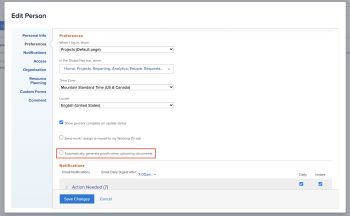
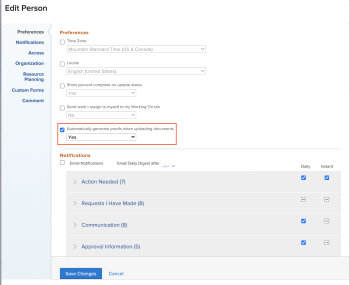

# Konfigurieren, ob Korrekturabzüge automatisch generiert werden

Sie können konfigurieren, ob das System automatisch Korrekturabzüge generiert, wenn Sie Benutzer bzw. Benutzerinnen angeben, die Dokumente zu Workfront hinzufügen. Diese Einstellung ist standardmäßig deaktiviert.

## Zugriffsanforderungen

Sie müssen über Folgendes verfügen:

<table style="table-layout:auto"> 
 <col> 
 <col> 
 <tbody> 
  <tr> 
   <td role="rowheader"><a href="https://business.adobe.com/products/workfront/pricing.html" target="_blank">Adobe Workfront-Plan</a> </td> 
   <td>Beliebig</td> 
  </tr> 
  <tr> 
   <td role="rowheader"><a href="../../../administration-and-setup/add-users/access-levels-and-object-permissions/wf-licenses.md" class="MCXref xref">Überblick über Lizenzen</a>*</td> 
   <td>Plan</td> 
  </tr> 
  <tr> 
   <td role="rowheader">Zugreifen auf Konfigurationen</td> 
   <td> 
Sie müssen ein Workfront-Administrator sein. Informationen zu Workfront-Administratoren finden Sie unter <a href="../../../administration-and-setup/add-users/configure-and-grant-access/grant-a-user-full-administrative-access.md" class="MCXref xref">Gewähren des vollständigen Administratorzugriffs für einen Benutzer</a>.
 </td> 
  </tr> 
 </tbody> 
</table>

&#42;Wenden Sie sich an Ihren Workfront-Administrator, um herauszufinden, über welchen Plan, welchen Lizenztyp oder welchen Zugriff Sie verfügen.

## Konfigurieren, ob Korrekturabzüge automatisch für einen einzelnen Benutzer generiert werden

1. Klicken Sie auf **Hauptmenü**-Symbol  in der rechten oberen Ecke von Adobe Workfront und dann auf **Benutzer** .
1. Wählen Sie einen Benutzer mit Proofing-Zugriff aus und klicken Sie dann auf **Bearbeiten**.
1. Aktivieren **oder deaktivieren Sie** Abschnitt „Voreinstellungen **das Kontrollkästchen „Beim Hochladen von Dokumenten automatisch Korrekturabzüge**&quot;.

   

1. Klicken Sie auf **Änderungen speichern**.

## Konfigurieren, ob Korrekturabzüge automatisch für mehrere Benutzer generiert werden

1. Klicken Sie auf **Hauptmenü**-Symbol  in der rechten oberen Ecke von Adobe Workfront und dann auf **Benutzer** .
1. Wählen Sie Benutzer mit Proofing-Zugriff aus und klicken Sie dann auf **Bearbeiten**.

   >[!IMPORTANT]
   >
   >Wenn nicht alle Benutzer Korrekturabzugszugriff haben, wird die Option Beim Hochladen von Dokumenten automatisch Korrekturabzüge generieren nicht angezeigt.

1. Aktivieren Sie im Abschnitt **Voreinstellungen** das Kontrollkästchen **Beim Hochladen von Dokumenten automatisch Korrekturabzüge generieren** und wählen Sie dann **Ja** oder **Nein**.

   

1. Klicken Sie auf **Änderungen speichern**.

