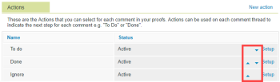

# Konfigurieren der Testversandeinstellungen für Ihre Organisation

Als Adobe Workfront-Administrator oder Workfront Proof-Administrator können Sie die standardmäßigen Testversandeinstellungen für Ihre Organisation anpassen. Zu diesen Einstellungen gehören standardmäßige Freigabeoptionen, Branding und mehr.

## Zugriffsanforderungen

+++ Erweitern Sie , um die Zugriffsanforderungen für die Funktionalität in diesem Artikel anzuzeigen.

Sie müssen über Folgendes verfügen:

<table style="table-layout:auto"> 
 <col> 
 <col> 
 <tbody> 
  <tr> 
   <td role="rowheader">Adobe Workfront-Plan*</td> 
   <td> 
Aktueller Plan: Pro oder höher
 
oder
 
Veralteter Plan: Premium oder Auswahl
 
Weitere Informationen zum Testen des Zugriffs mit den verschiedenen Plänen finden Sie unter <a href="../../../administration-and-setup/manage-workfront/configure-proofing/access-to-proofing-functionality.md" class="MCXref xref">Zugriff auf die Testfunktion in Workfront</a>.
 </td> 
  </tr> 
  <tr> 
   <td role="rowheader">Adobe Workfront-Lizenz*</td> 
   <td> 
Aktueller Plan: Arbeit oder Plan
 
Veralteter Plan: Beliebig (Sie müssen die Testfunktion für den Benutzer aktiviert haben)
 </td> 
  </tr> 
  <tr> 
   <td role="rowheader">Konfigurationen auf Zugriffsebene*</td> 
   <td> 
In Ihrem Profil für Testberechtigungen muss "Administrator"ausgewählt sein. Weitere Informationen finden Sie unter <a href="../../../administration-and-setup/manage-workfront/configure-proofing/configure-a-users-proofing-access.md" class="MCXref xref">Konfigurieren des Testzugriffs eines Benutzers</a>.
 </td> 
  </tr> 
 </tbody> 
</table>

&#42;Wenden Sie sich an Ihren Workfront-Administrator, um zu erfahren, welchen Plan, welchen Lizenztyp oder welchen Zugriff Sie haben.

+++

## Aktionen konfigurieren

Informationen zur Verwendung von Aktionen im Testversand-Viewer finden Sie unter [Verwenden von Aktionen für Testkommentare](../../../review-and-approve-work/proofing/reviewing-proofs-within-workfront/comment-on-a-proof/use-actions-on-comments-in-viewer.md).

Sie können Aktionen für Ihre Organisation wie folgt konfigurieren:

* [Hinzufügen oder Umbenennen einer Aktion](#add-or-rename-an-action)
* [Eine Aktion deaktivieren oder reaktivieren](#deactivate-or-reactivate-an-action)
* [Aktionen neu ordnen](#reorder-actions)

### Hinzufügen oder Umbenennen einer Aktion {#add-or-rename-an-action}

{{step1-to-proofing}}

1. Klicken Sie oben rechts auf der Workfront Proof-Benutzeroberfläche auf **Einstellungen** > **Kontoeinstellungen** und dann auf die Registerkarte **Einstellungen** .

1. Führen Sie einen der folgenden Schritte aus:

   * Um eine neue Aktion zu erstellen, klicken Sie im Abschnitt **Aktionen** auf **Neue Aktion**.

     Die Anzahl der Aktionen, die Sie in Ihrem Konto einrichten können, ist unbegrenzt.

   * Um eine vorhandene Aktion umzubenennen, klicken Sie neben der Aktion auf **Einrichten** .

1. Geben Sie einen Namen für die Aktion ein und klicken Sie dann auf **Speichern**.
1. Klicken Sie auf **Speichern.**

### Deaktivieren oder Reaktivieren einer Aktion {#deactivate-or-reactivate-an-action}

{{step1-to-proofing}}

1. Klicken Sie oben rechts auf der Workfront Proof-Benutzeroberfläche auf **Einstellungen** > **Kontoeinstellungen** und dann auf die Registerkarte **Einstellungen** .

1. Klicken Sie neben der Aktion, die Sie deaktivieren oder reaktivieren möchten, auf **Einrichten** .
1. Wählen Sie **Aktivieren** oder **Deaktivieren** und klicken Sie dann auf **Speichern**.

### Aktionen neu ordnen {#reorder-actions}

{{step1-to-proofing}}

1. Klicken Sie oben rechts auf der Workfront Proof-Benutzeroberfläche auf **Einstellungen** > **Kontoeinstellungen** und dann auf die Registerkarte **Einstellungen** .

1. Klicken Sie auf die blauen Pfeile nach oben und unten neben **Einrichten** , um die Aktionen neu anzuordnen.

   

## Benutzerdefinierte Geräte für Testsendungen konfigurieren

Sie können Ihrem System beliebige benutzerdefinierte Geräte hinzufügen, sodass Benutzer interaktive Inhalte überprüfen und simulieren können, wie der Inhalt auf einem bestimmten Gerät angezeigt wird.

Informationen dazu, wie Benutzer beim Überprüfen interaktiver Inhalte Geräte auswählen können, finden Sie unter [Ändern der interaktiven Testversandauflösung im Testversand-Viewer](../../../review-and-approve-work/proofing/reviewing-proofs-within-workfront/review-a-proof/view-interactive-content-as-it-appears-in-device.md)

So fügen Sie ein benutzerdefiniertes Gerät hinzu:

{{step1-to-proofing}}

1. Klicken Sie oben rechts auf der Workfront Proof-Benutzeroberfläche auf **Einstellungen** > **Kontoeinstellungen** und dann auf die Registerkarte **Einstellungen** .

1. Klicken Sie im Abschnitt **Benutzerdefinierte Geräte für Testsendungen** auf **Neues Gerät hinzufügen**.

1. Geben Sie im angezeigten Feld **Neues Gerät hinzufügen** die folgenden Informationen an:

   <table style="table-layout:auto"> 
    <col> 
    <col> 
    <tbody> 
     <tr> 
      <td role="rowheader">Name</td> 
      <td>Der Name, den Benutzer sehen, wenn sie das Gerät im Desktop Proofing Viewer auswählen, wie unter <a href="../../../review-and-approve-work/proofing/reviewing-proofs-within-workfront/review-a-proof/view-interactive-content-as-it-appears-in-device.md" class="MCXref xref">Ändern der interaktiven Testversandauflösung im Testversand-Viewer</a> beschrieben.</td> 
     </tr> 
     <tr> 
      <td role="rowheader">Dimensionen</td> 
      <td>Geben Sie die für dieses Gerät zu verwendenden Dimensionen an. Benutzer sehen die Dimensionen, die unter dem Gerätenamen angezeigt werden.</td> 
     </tr> 
     <tr> 
      <td role="rowheader">Verhältnis</td> 
      <td>Geben Sie das Verhältnis für das Gerät an.</td> 
     </tr> 
     <tr> 
      <td role="rowheader">Typ</td> 
      <td>Wählen Sie aus, ob es sich bei dem Gerät um ein Mobilgerät, Tablet oder Desktop handelt.</td> 
     </tr> 
     <tr> 
      <td role="rowheader">Benutzeragenten-Zeichenfolge</td> 
      <td>Geben Sie den Benutzeragenten für das Gerät ein, um Informationen bereitzustellen, die dazu führen, dass unsere Software ausgeführt und wie für das Gerät konzipiert angezeigt wird.
Sie können den Benutzeragenten abrufen, indem Sie vom Gerät zu <a href="https://www.whatismybrowser.com/detect/what-is-my-user-agent">https://www.whatismybrowser.com/detect/what-is-my-user-agent</a> navigieren.
</td> 
     </tr> 
     <tr> 
      <td role="rowheader">Deaktiviert</td> 
      <td>Wenn diese Option aktiviert ist, kann das Gerät beim Überprüfen interaktiver Testsendungen nicht ausgewählt werden.</td> 
     </tr> 
    </tbody> 
   </table>

1. Klicken Sie auf **Erstellen**.

## Konfigurieren von Popup-Nachrichten für Testsendungen

Sie können Popup-Nachrichten für Testsendungen konfigurieren, um allen Validierern in Ihrer Organisation allgemeine Informationen mitzuteilen.

Sie können Nachrichten so konfigurieren, dass sie in folgenden Situationen angezeigt werden:

* **Bei Lademeldung**: Zeigt an, wann der Testversand zum ersten Mal geöffnet wird. Nützlich, um Benutzern zu erklären, wie sie einen Testversand überprüfen oder einen Haftungsausschluss oder einen anderen Rechtstext bereitstellen können.
* **Bei Entscheidungsmeldung**: Zeigt an, wenn ein Benutzer eine Entscheidung über einen Testversand auswählt. Nützlich, um Ihren Benutzern Checklisten für Dinge wie Markenkonformität oder Einhaltung von Vorschriften zu geben. Informationen zu Entscheidungen finden Sie unter [Entscheidungsfindung über einen Testversand im Testversand-Viewer](../../../review-and-approve-work/proofing/reviewing-proofs-within-workfront/make-a-decision-on-a-proof/make-decisions-on-proof.md).

* **Schaltflächentext bestätigen**: Die Beschriftung, die auf der Schaltfläche in der oben erläuterten Popup-Nachricht &quot;Beim Laden&quot;angezeigt wird.

So erstellen Sie Popup-Nachrichten für Testsendungen:

1. Klicken Sie rechts neben der Nachricht, die Sie anpassen möchten, auf **Bearbeiten** .
1. Geben Sie eine Meldung an und fügen Sie die entsprechende Formatierung ein. Klicken Sie dann auf **Speichern**.
1. (Optional) Wenn Sie die Nachricht &quot;Beim Laden&quot;angepasst haben und auch die Beschriftung der Bestätigungsschaltfläche anpassen möchten, klicken Sie auf **Bearbeiten** rechts von **Schaltflächentext Bestätigen**, geben Sie eine Beschriftung an und klicken Sie dann auf **Speichern**.

## Konfigurieren der Testversandstandardwerte

Informationen zum Konfigurieren der Testversand-Standardeinstellungen für Ihre Organisation finden Sie unter [Konfigurieren der standardmäßigen Testversandeinstellungen](../../../administration-and-setup/manage-workfront/configure-proofing/configure-default-proof-settings.md).

## Konfigurieren der Freigabestandardwerte

Sie können angeben, für wen die Testsendungen Ihres Unternehmens freigegeben werden können, welche Versionen für Prüfer verfügbar sind und wann Testsendungen mit einem automatisierten Workflow für Benutzer sichtbar sind, die mit einer bestimmten Phase verknüpft sind.

Weitere Informationen zu Freigabeeinstellungen in Workfront Proof finden Sie unter [Einstellungen für die Freigabe für Ihre Benutzer konfigurieren](../../../administration-and-setup/manage-workfront/configure-proofing/configure-sharing-settings-users.md).

## Brand the Workfront Proof site

Wenn Sie Workfront Proof verwenden, können Sie Branding für die folgenden Bereiche der Site einrichten:

* Die Begrüßungsseite, die beim Laden des Testversands angezeigt wird
* Bildschirme zum Anmelden und Abmelden
* E-Mail-Benachrichtigungen

Detaillierte Informationen zur Markendarstellung der Workfront Proof-Site finden Sie unter [Markieren der Workfront Proof-Site](../../../workfront-proof/wp-acct-admin/branding/brand-wp-site.md).

## Erweiterte Kennworteinstellungen konfigurieren

>[!IMPORTANT]
>
>Diese Option ist nur für alte Workfront-Pläne verfügbar. Wenn Sie einen Pro-, Business- oder Enterprise-Workfront-Plan ausführen, können Sie keine erweiterten Kennworteinstellungen mehr konfigurieren.

Unter **Erweiterte Kennworteinstellungen** können Sie die Kennwortsicherheit für Ihre Benutzer verbessern.

1. Klicken Sie rechts neben der Einstellung, die Sie konfigurieren möchten, auf **Einrichten** :

   <table style="table-layout:auto"> 
    <col> 
    <col> 
    <tbody> 
     <tr> 
      <td role="rowheader">Mindestkennwortlänge</td> 
      <td>Die standardmäßige Workfront Proof-Passwortlänge beträgt sechs Zeichen. Abhängig von den Richtlinien Ihres Unternehmens können Sie die Anzahl erhöhen.</td> 
     </tr> 
     <tr> 
      <td role="rowheader"><strong>Zeichenmix</strong> </td> 
      <td>Sie können die Benutzer zwingen, eine Mischung aus Kleinbuchstaben, Großbuchstaben, Zahlen und Symbolen in ihren Passwörtern zu verwenden. Sie entscheiden, wie viele Zeichen das Kennwort enthalten soll.</td> 
     </tr> 
     <tr> 
      <td role="rowheader"><strong>Maximale Zeichenwiederholung</strong> </td> 
      <td>Sie können angeben, wie viele Zeichen im Kennwort jedes Benutzers wiederholt werden können.</td> 
     </tr> 
     <tr> 
      <td role="rowheader">Automatische Passworterstellung</td> 
      <td>Zwingt Benutzer, ihr Kennwort regelmäßig zu ändern. Du entscheidest, wie oft sie das tun werden.</td> 
     </tr> 
     <tr> 
      <td role="rowheader"><strong>Anzahl der nicht zulässigen Kennwortwiederholungen</strong> </td> 
      <td>Konfigurieren Sie die Anzahl der Passwortwiederholungen, die in Ihrem Konto nicht zulässig sind.</td> 
     </tr> 
     <tr> 
      <td role="rowheader"><strong>Profil sperrt sich aus</strong> </td> 
      <td>Sperrt Ihre Benutzer aus dem Konto, nachdem Sie eine Reihe von fehlgeschlagenen Anmeldeversuchen angegeben haben. Sie können auch angeben, wie lange sie warten sollten, bevor sie erneut auf ihr Konto zugreifen können.</td> 
     </tr> 
     <tr> 
      <td role="rowheader">Benutzer sperren, wenn das Kennwort nach 30 Tagen nicht zurückgesetzt wurde</td> 
      <td>Wenn Ihr Benutzer sein anfängliches Kennwort nicht innerhalb von 30 Tagen nach der Profilaktivierung ändert, wird er aus dem Konto ausgeschlossen. 
Kontoadministratoren können Benutzer entsperren (reaktivieren), die automatisch vom System gesperrt werden. Dadurch erhalten sie zusätzliche sieben Tage, um ihr Passwort zu ändern.
</td> 
     </tr> 
     <tr> 
      <td role="rowheader">Benutzerkonto sperren, wenn es 120 Tage lang inaktiv ist</td> 
      <td>Wenn sich Ihr Benutzer 120 Tage lang nicht bei Workfront Proof oder einem für die Anmeldung erforderlichen Testversand anmeldet, wird er aus dem Konto ausgeschlossen.</td> 
     </tr> 
     <tr> 
      <td role="rowheader"><strong>Kennwort nach der ersten Anmeldung ändern</strong> </td> 
      <td>Erfordert von Benutzern, ihr temporäres Kennwort nach ihrer ersten Anmeldung zu ändern.
Kontoadministratoren können Benutzer entsperren (reaktivieren), die vom System automatisch gesperrt werden.

Weitere Informationen zum Kennwort finden Sie unter <a href="../../../workfront-proof/wp-getstarted/faqs/log-in-change-password.md" class="MCXref xref">Anmelden und Ändern Ihres Kennworts und Ihrer E-Mail für Workfront Proof</a>.
</td> 
     </tr> 
    </tbody> 
   </table>
